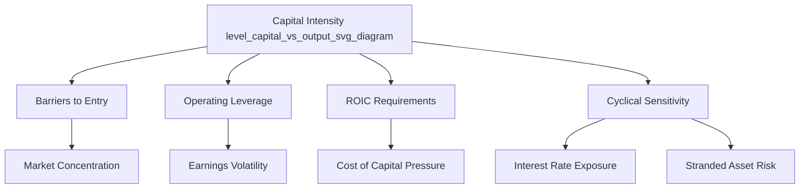

## Defining Capital Intensity and Its Economic Significance

### Definition and Conceptual Foundation

Capital intensity refers to the relative proportion of capital (fixed assets, plant, equipment, infrastructure) required to generate a given level of output or revenue, as opposed to labor or other variable inputs. A business or industry is described as "capital intensive" when it requires large upfront and ongoing investments in physical or financial assets relative to its output, revenue, or workforce size.

Formally, capital intensity is often expressed as the ratio of capital employed (or fixed assets) to output:

$$\text{Capital Intensity} = \frac{\text{Total Capital Employed (or Fixed Assets)}}{\text{Revenue or Output}}$$

An inverse formulation, the **capital productivity** or **asset turnover ratio**, is also common:

$$\text{Asset Turnover} = \frac{\text{Revenue}}{\text{Total Assets}}$$

A low asset turnover ratio (or high capital-to-revenue ratio) signals high capital intensity; a high turnover ratio signals a capital-light business model.

### Key Metrics Used to Measure Capital Intensity

**Key Points**

- **Capital-to-Labor Ratio**: $K/L$, where $K$ is capital stock and $L$ is labor input (hours or headcount). Rising ratios indicate a shift toward mechanization or automation.
- **Capital-to-Output Ratio (Capital Coefficient)**: $K/Y$, where $Y$ is output (often GDP at the macro level, or revenue at the firm level).
- **Fixed Asset Intensity**: Property, Plant & Equipment (PP&E) divided by total revenue.
- **Capex-to-Revenue Ratio**: Annual capital expenditure divided by annual revenue, used to gauge ongoing reinvestment intensity.
- **Capex-to-Depreciation Ratio**: Compares new investment to the depreciation of existing assets, indicating whether the asset base is expanding, stable, or shrinking in real terms.
- **Incremental Capital-Output Ratio (ICOR)**: Used at the macroeconomic level to measure how much additional capital investment is required to generate one additional unit of output.

$$\text{ICOR} = \frac{\Delta K}{\Delta Y}$$

### Economic Significance

**Key Points**

1. **Barriers to Entry and Market Structure**

   Capital-intensive industries (semiconductors, telecommunications, utilities, airlines, oil and gas, steel) typically exhibit high barriers to entry because new entrants must commit large sums of capital before generating any revenue. This tends to produce oligopolistic or monopolistic market structures, higher industry concentration, and reduced competitive pressure relative to labor-intensive industries.
2. **Operating Leverage and Earnings Volatility**

   High capital intensity generally correlates with high fixed costs (depreciation, maintenance, debt service on financed assets). This creates **operating leverage**, where a given percentage change in revenue produces a larger percentage change in operating income. Capital-intensive firms therefore tend to show more volatile earnings across the business cycle.

   $$\text{Degree of Operating Leverage (DOL)} = \frac{\%\ \Delta \text{Operating Income}}{\%\ \Delta \text{Revenue}}$$
3. **Return on Invested Capital (ROIC) Dynamics**

   Because capital-intensive firms carry a large invested capital base, they must generate proportionally larger absolute profits to achieve the same ROIC as capital-light firms. This affects valuation multiples, cost of capital requirements, and investor return expectations.

   $$\text{ROIC} = \frac{\text{NOPAT}}{\text{Invested Capital}}$$
4. **Macroeconomic Growth Implications**

   At the national level, capital intensity affects productivity growth. Economies or sectors that substitute capital for labor (automation, mechanization) can achieve higher labor productivity, but this substitution has implications for employment levels, wage growth, and income distribution between capital owners and labor.
5. **Cyclicality and Economic Sensitivity**

   Capital-intensive sectors are disproportionately sensitive to interest rate changes (financing costs for capex), economic downturns (excess capacity, idle assets), and technological obsolescence risk (stranded assets), since capital commitments are typically long-lived and difficult to reverse.
6. **Strategic Flexibility Trade-offs**

   High capital intensity reduces strategic flexibility. Once capital is sunk into specific assets, exit costs rise, and firms face pressure to keep utilizing assets even at low marginal returns, a phenomenon connected to **sunk cost economics** and **asset specificity** in transaction cost theory.

### Capital Intensity Across Industries (Illustrative Spectrum)

| Industry Category | Typical Capex/Revenue | Capital Intensity Level |
| --- | --- | --- |
| Software/SaaS | 2%–5% | Low |
| Retail/Consumer Services | 3%–7% | Low–Moderate |
| Manufacturing (general) | 5%–10% | Moderate |
| Telecommunications | 15%–20% | High |
| Oil & Gas (upstream) | 20%–35% | Very High |
| Utilities | 20%–30% | Very High |
| Semiconductor Fabrication | 25%–40%+ | Very High |

**[Inference]** These ranges represent broad industry patterns observed in financial analysis literature and vary significantly by company, geography, and business cycle phase; actual figures should be verified against current company filings and industry reports.

### Visual: Capital Intensity Relationship Map

### Worked Example

Consider two firms in different industries, each generating $1,000M in annual revenue:

**Firm A (Software company)**

- Total Assets: $300M
- PP&E: $50M
- Capex: $40M
- Asset Turnover: $1000/300 = 3.33x$
- Capex/Revenue: $40/1000 = 4\%$

**Firm B (Telecom operator)**

- Total Assets: $4,500M
- PP&E: $3,800M
- Capex: $180M
- Asset Turnover: $1000/4500 = 0.22x$
- Capex/Revenue: $180/1000 = 18\%$

**Interpretation**: Firm B is far more capital intensive. It requires roughly 15x more assets to generate the same revenue as Firm A, meaning it must sustain much higher absolute profit levels to match Firm A's ROIC, and its earnings will be more sensitive to demand fluctuations due to high fixed asset-related costs (depreciation, network maintenance).

### Illustration: Capital Intensity vs. Asset Turnover Trade-off

<svg xmlns="http://www.w3.org/2000/svg" viewBox="0 0 640 400">
<text x="320" y="25" text-anchor="middle" font-size="16" font-weight="bold" fill="#1a1a1a">Capital Intensity vs. Asset Turnover (svg_diagram)</text>
<line x1="80" y1="340" x2="580" y2="340" stroke="#333" stroke-width="2" />
<line x1="80" y1="340" x2="80" y2="50" stroke="#333" stroke-width="2" />
<text x="330" y="375" text-anchor="middle" font-size="13" fill="#333">Capital Employed (relative)</text>
<text x="30" y="200" text-anchor="middle" font-size="13" fill="#333" transform="rotate(-90 30 200)">Revenue Generated (relative)</text>
<path d="M100,320 Q300,280 560,80" stroke="#2563eb" stroke-width="2.5" fill="none" />
<text x="420" y="120" font-size="12" fill="#2563eb">Efficient Frontier</text>
<circle cx="140" cy="300" r="7" fill="#16a34a" />
<text x="150" y="298" font-size="12" fill="#16a34a">Software Firm (low capital intensity)</text>
<circle cx="480" cy="110" r="7" fill="#dc2626" />
<text x="330" y="150" font-size="12" fill="#dc2626">Telecom Firm (high capital intensity)</text>
<circle cx="400" cy="260" r="7" fill="#ca8a04" />
<text x="410" y="255" font-size="12" fill="#ca8a04">Underperforming Capital-Heavy Firm</text>
</svg>

### Common Pitfalls in Interpreting Capital Intensity

- **Comparing across industries without normalization**: Capital intensity ratios are only meaningful within comparable industry peer groups; comparing a utility's capex/revenue ratio to a software firm's is not informative.
- **Ignoring asset age and depreciation policy**: Firms with older, more depreciated asset bases can show artificially low capital intensity ratios (based on net book value) despite requiring large near-term replacement capex.
- **Conflating capital intensity with capital efficiency**: A firm can be capital intensive but still capital efficient if it earns high returns on that capital base; the two concepts are related but distinct.
- **Treating capex as uniformly negative**: Capital intensity is not inherently unfavorable; capital-intensive businesses often benefit from high barriers to entry, long-duration cash flow visibility, and defensible market positions once assets are built.

**Conclusion**

Capital intensity is a foundational concept for understanding how firms and industries allocate resources between capital and labor, and it has wide-ranging implications for market structure, earnings volatility, valuation, and macroeconomic productivity. Its economic significance lies in shaping competitive dynamics, cost of capital requirements, and the sensitivity of firms to cyclical and structural economic changes.

**Next Steps / Related Topics**

- Capex vs. Opex: accounting and tax treatment distinctions
- Depreciation methods and their effect on reported capital intensity
- Operating leverage and its relationship to financial leverage
- ROIC, WACC, and value creation in capital-intensive industries
- Asset turnover and DuPont analysis decomposition
- Capital budgeting techniques (NPV, IRR, payback period)
- Sunk cost economics and asset specificity theory
- Industry lifecycle effects on capital intensity trends
- Stranded asset risk in energy transition contexts
- Capital intensity trends driven by automation and digitization