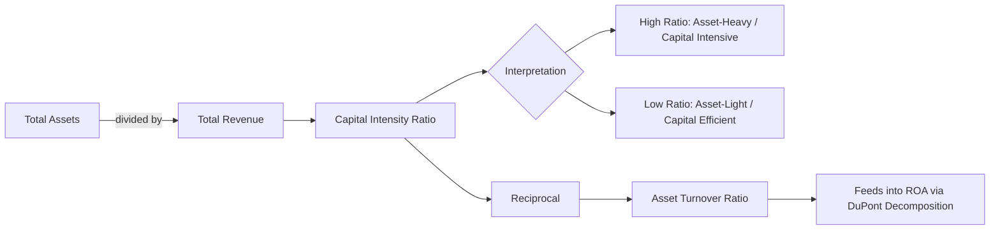

## Capital Intensity Ratio: Formula and Interpretation

### Definition

The capital intensity ratio measures how much capital (total assets or fixed assets) a company requires to generate one unit of revenue. It is one of the most direct quantitative measures of how asset-heavy a business model is, and it is the inverse of the asset turnover ratio.

### Core Formula

$$\text{Capital Intensity Ratio} = \frac{\text{Total Assets}}{\text{Total Revenue (Sales)}}$$

An alternative, narrower version uses fixed assets (PP&E) only, which isolates the physical/productive capital base from current assets like cash, receivables, and inventory:

$$\text{Fixed Capital Intensity Ratio} = \frac{\text{Net PP\&E}}{\text{Total Revenue}}$$

The relationship to asset turnover is a simple reciprocal:

$$\text{Capital Intensity Ratio} = \frac{1}{\text{Asset Turnover Ratio}}$$

$$\text{Asset Turnover Ratio} = \frac{\text{Total Revenue}}{\text{Total Assets}}$$

### Interpretation

**Key Points**

- A **higher** capital intensity ratio means more dollars of assets are required to generate each dollar of revenue — the business is more capital intensive.
- A **lower** capital intensity ratio means the firm generates more revenue per dollar of assets — the business is more capital-light or asset-efficient.
- The ratio is expressed either as a decimal (e.g., $1.5$) or as a percentage-style multiple (e.g., "$1.50 of assets per $1.00 of revenue").
- The ratio must be interpreted **within an industry context**; there is no universal "good" or "bad" value. A capital intensity ratio of $3.0$ might be normal for a utility but alarming for a retailer.
- Because it uses total or fixed assets (stock, balance-sheet measure) against revenue (flow, income-statement measure), the ratio reflects **structural** capital requirements rather than year-to-year spending decisions — it complements, but differs from, the capex-to-revenue ratio, which captures the pace of ongoing reinvestment.

### Step-by-Step Calculation Example

**Example**

Company XYZ Manufacturing reports the following for Fiscal Year 2025:

- Total Assets: $850M
- Net PP&E: $620M
- Total Revenue: $425M

**Step 1 — Total Asset-Based Capital Intensity Ratio**

$$\frac{850}{425} = 2.00$$

Interpretation: The company holds $2.00 in total assets for every $1.00 of revenue generated.

**Step 2 — Fixed Asset-Based Capital Intensity Ratio**

$$\frac{620}{425} = 1.46$$

Interpretation: $1.46 of net PP&E is deployed for every $1.00 of revenue — indicating that fixed productive assets, not working capital items, are the dominant driver of the company's capital base.

**Step 3 — Cross-check via Asset Turnover**

$$\frac{425}{850} = 0.50\text{x}$$

Confirms the reciprocal relationship: $1 / 0.50 = 2.00$, consistent with Step 1.

### Trend Analysis: Why the Ratio Alone Is Insufficient

**Key Points**

- A rising capital intensity ratio over time can signal either (a) inefficient capital deployment / declining productivity of assets, or (b) a deliberate strategic buildout phase (e.g., new plant construction) that has not yet translated into proportional revenue.
- A falling capital intensity ratio can signal either (a) improving efficiency and better asset utilization, or (b) underinvestment and asset base erosion (aging plant not being replaced), which may harm long-term competitiveness.
- Analysts typically pair the capital intensity ratio with **capex/revenue**, **depreciation/capex**, and **revenue growth rate** trends to distinguish these scenarios. A rising ratio alongside rising capex and flat near-term revenue often indicates an investment/ramp-up phase; a rising ratio alongside falling capex often indicates deteriorating asset efficiency.

### Comparative Table: Capital Intensity Ratio by Sector (Illustrative)

| Sector | Typical Capital Intensity Ratio (Total Assets/Revenue) | Interpretation |
| --- | --- | --- |
| Software/SaaS | 0.5x–1.0x | Capital-light |
| Retail | 0.7x–1.2x | Low-moderate |
| Industrial Manufacturing | 1.0x–2.0x | Moderate |
| Telecommunications | 2.0x–3.5x | High |
| Utilities | 3.0x–5.0x | Very high |
| Airlines | 1.5x–2.5x | High |
| Oil & Gas (integrated) | 1.5x–3.0x | High |

**[Inference]** These figures are approximate, industry-typical ranges drawn from general financial analysis patterns; precise values fluctuate by company maturity, geography, and reporting period, and should be verified against current filings for any specific analysis.

### Relationship to Other Financial Metrics

The capital intensity ratio feeds directly into DuPont-style decomposition of Return on Assets (ROA):

$$\text{ROA} = \text{Net Profit Margin} \times \text{Asset Turnover} = \frac{\text{Net Income}}{\text{Revenue}} \times \frac{\text{Revenue}}{\text{Total Assets}}$$

Since capital intensity ratio is the inverse of asset turnover, a firm can be rewritten as:

$$\text{ROA} = \frac{\text{Net Profit Margin}}{\text{Capital Intensity Ratio}}$$

This shows explicitly that, holding margin constant, a **higher capital intensity ratio mechanically depresses ROA** — meaning capital-intensive firms must earn structurally higher profit margins to achieve comparable returns to capital-light peers.

### Visual: Capital Intensity Ratio Decomposition

### Illustration: Capital Intensity Ratio Spectrum Across Industries

<svg xmlns="http://www.w3.org/2000/svg" viewBox="0 0 640 320">
<text x="320" y="25" text-anchor="middle" font-size="16" font-weight="bold" fill="#1a1a1a">Capital Intensity Ratio Spectrum (svg_diagram)</text>
<line x1="90" y1="270" x2="590" y2="270" stroke="#333" stroke-width="2" />
<text x="340" y="300" text-anchor="middle" font-size="13" fill="#333">Capital Intensity Ratio (Total Assets / Revenue)</text>
<rect x="100" y="240" width="60" height="20" fill="#16a34a" />
<text x="130" y="235" text-anchor="middle" font-size="11" fill="#333">0.6x</text>
<text x="130" y="285" text-anchor="middle" font-size="10" fill="#333">Software</text>
<rect x="200" y="220" width="60" height="40" fill="#65a30d" />
<text x="230" y="215" text-anchor="middle" font-size="11" fill="#333">1.0x</text>
<text x="230" y="285" text-anchor="middle" font-size="10" fill="#333">Retail</text>
<rect x="300" y="190" width="60" height="70" fill="#ca8a04" />
<text x="330" y="185" text-anchor="middle" font-size="11" fill="#333">1.6x</text>
<text x="330" y="285" text-anchor="middle" font-size="10" fill="#333">Manufacturing</text>
<rect x="400" y="140" width="60" height="120" fill="#ea580c" />
<text x="430" y="135" text-anchor="middle" font-size="11" fill="#333">2.8x</text>
<text x="430" y="285" text-anchor="middle" font-size="10" fill="#333">Telecom</text>
<rect x="500" y="90" width="60" height="170" fill="#dc2626" />
<text x="530" y="85" text-anchor="middle" font-size="11" fill="#333">4.0x</text>
<text x="530" y="285" text-anchor="middle" font-size="10" fill="#333">Utilities</text>
</svg>

### Practical Application: Investment and Credit Analysis

**Key Points**

- **Equity investors** use the ratio to gauge whether a business can scale revenue without proportional new capital, which is a strong determinant of free cash flow generation and valuation multiples.
- **Credit analysts** use the ratio to assess collateral value and the fixed-cost burden a borrower carries; capital-intensive firms often require larger, longer-tenor debt facilities and are evaluated with an emphasis on asset coverage ratios.
- **Corporate strategists and management teams** use the ratio when evaluating expansion decisions, outsourcing versus in-house production, or shifts toward asset-light models (e.g., leasing vs. owning, franchising, or capacity-sharing arrangements).

**[Inference]** The precise behavioral impact of a capital intensity ratio on financing terms or valuation multiples depends heavily on company-specific and market conditions; this describes general analytical tendencies rather than fixed rules.

**Related Topics**

- Asset turnover ratio and DuPont analysis
- Fixed asset turnover vs. total asset turnover
- Capex-to-revenue ratio and its relationship to the capital intensity ratio
- Return on Invested Capital (ROIC) vs. Return on Assets (ROA)
- Operating leverage and fixed cost structures
- Asset-light business model transformation strategies
- Industry benchmarking methodologies for capital ratios
- Depreciation policy effects on reported asset intensity
- Working capital intensity vs. fixed capital intensity
- Capital intensity in emerging technology and automation-driven industries