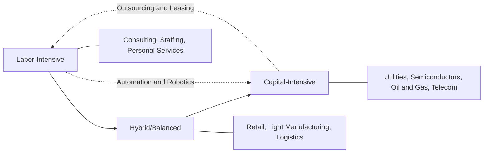

## Capital-Intensive versus Labor-Intensive Business Models

### Definitional Overview

A business model's position on the capital-labor spectrum describes the relative weight of fixed capital investment versus human labor in producing goods or services. Capital-intensive models rely primarily on machinery, infrastructure, and technology to generate output; labor-intensive models rely primarily on human effort, skill, and headcount.

This distinction can be formalized through the **capital-to-labor ratio**:

$$\frac{K}{L}$$

where $K$ represents the capital stock (measured in monetary value or productive units) and $L$ represents labor input (measured in headcount or labor-hours). A high $K/L$ ratio signals a capital-intensive model; a low $K/L$ ratio signals a labor-intensive model.

### Core Distinguishing Characteristics

**Key Points**

| Dimension | Capital-Intensive Model | Labor-Intensive Model |
| --- | --- | --- |
| Primary cost driver | Depreciation, maintenance, financing costs | Wages, benefits, training |
| Cost structure | High fixed costs, low variable costs | Low fixed costs, high variable costs |
| Scalability | Scales with additional capex; step-function capacity | Scales more linearly with hiring |
| Operating leverage | High | Low |
| Barriers to entry | High (large upfront investment) | Low-moderate (lower startup capital) |
| Sensitivity to demand shocks | High volatility in profitability | More stable margins, but sensitive to labor markets |
| Geographic flexibility | Low (fixed asset locations) | High (labor can relocate/outsource) |
| Automation potential | Already embedded | High potential for future transformation |

### Cost Structure and Operating Leverage Implications

Capital-intensive firms typically exhibit high **operating leverage**, since fixed costs (depreciation, debt service, facility maintenance) dominate the cost base regardless of production volume:

$$\text{Degree of Operating Leverage (DOL)} = \frac{\%\ \Delta \text{Operating Income}}{\%\ \Delta \text{Revenue}}$$

A firm with high fixed costs and low variable costs (capital-intensive) will show a DOL significantly greater than 1, meaning profits swing more dramatically than revenue in either direction. Labor-intensive firms, by contrast, typically show a DOL closer to 1, since labor costs (even semi-fixed ones like salaried staff) can be adjusted more flexibly than physical capital through hiring, overtime, or workforce reduction.

**Example**

Consider two firms each with $100M revenue:

**Capital-Intensive Firm (e.g., a chemical plant)**

- Fixed costs: $60M (depreciation, maintenance, debt service)
- Variable costs: $20M
- Operating income: $20M
- If revenue falls 10% to $90M, variable costs fall to $18M, but fixed costs remain $60M → operating income = $90M − $60M − $18M = $12M (a 40% decline in profit from a 10% revenue decline)

**Labor-Intensive Firm (e.g., a consulting firm)**

- Fixed costs: $15M
- Variable costs (largely labor, semi-adjustable): $65M
- Operating income: $20M
- If revenue falls 10% to $90M and labor costs are trimmed proportionally to $58.5M → operating income = $90M − $15M − $58.5M = $16.5M (a 17.5% decline in profit from a 10% revenue decline)

This illustrates why capital-intensive models experience amplified earnings volatility relative to revenue swings.

### Strategic and Financial Trade-offs

**Key Points**

- **Barriers to entry**: Capital-intensive industries create natural competitive moats because new entrants must commit substantial upfront capital before earning any revenue, discouraging entry and often producing more concentrated market structures.
- **Flexibility versus commitment**: Labor-intensive models offer more flexibility to scale up or down with demand, while capital-intensive models involve long-lived, often irreversible commitments (sunk costs), reducing strategic agility.
- **Return requirements**: Capital-intensive firms must generate sufficient absolute returns to justify a large invested capital base, which drives greater emphasis on ROIC and cost-of-capital discipline in capital allocation decisions.
- **Exposure to different risk factors**: Capital-intensive firms are more exposed to interest rate risk (financing costs), technological obsolescence, and asset utilization risk. Labor-intensive firms are more exposed to labor market tightness, wage inflation, and regulatory/labor law changes.
- **Margin structure**: Capital-intensive businesses, once built and scaled, can often achieve high incremental margins because additional output uses existing capacity at low marginal cost. Labor-intensive businesses face more persistent marginal costs since additional output typically requires proportional additional labor.

### Hybrid and Transitional Models

Many modern businesses exist on a spectrum rather than at either extreme, and firms actively manage their position on this spectrum as a strategic lever:

- **Asset-light transformation**: Firms in traditionally capital-intensive sectors (e.g., hotels, telecom towers, airlines) increasingly adopt leasing, franchising, outsourcing, or sale-leaseback structures to shift capital intensity off their own balance sheets while retaining operational or brand control.
- **Automation-driven shift**: Historically labor-intensive sectors (manufacturing, logistics, customer service) are shifting toward capital intensity through robotics, warehouse automation, and AI-driven process automation, converting variable labor costs into fixed capital costs over time.
- **Platform and marketplace models**: Some digital businesses minimize both capital and direct labor intensity by facilitating transactions between third parties (e.g., marketplace platforms), representing a distinct third category sometimes termed "asset-light, labor-light" models.

### Visual: Capital-Labor Spectrum

### Illustration: Cost Structure Comparison

<svg xmlns="http://www.w3.org/2000/svg" viewBox="0 0 640 380">
<text x="320" y="25" text-anchor="middle" font-size="16" font-weight="bold" fill="#1a1a1a">Cost Structure Comparison (svg_diagram)</text>

<text x="150" y="55" text-anchor="middle" font-size="13" font-weight="bold" fill="#333">Capital-Intensive Firm</text>

<rect x="70" y="70" width="160" height="180" fill="`#dc2626`" opacity="0.8" />

<text x="150" y="165" text-anchor="middle" font-size="12" fill="#fff">Fixed Costs 60%</text>

<rect x="70" y="250" width="160" height="60" fill="`#f87171`" />

<text x="150" y="285" text-anchor="middle" font-size="12" fill="#333">Variable Costs 20%</text>

<rect x="70" y="310" width="160" height="60" fill="`#fecaca`" />

<text x="150" y="345" text-anchor="middle" font-size="12" fill="#333">Operating Income 20%</text>

<text x="480" y="55" text-anchor="middle" font-size="13" font-weight="bold" fill="#333">Labor-Intensive Firm</text>

<rect x="400" y="70" width="160" height="45" fill="`#2563eb`" opacity="0.8" />

<text x="480" y="97" text-anchor="middle" font-size="12" fill="#fff">Fixed Costs 15%</text>

<rect x="400" y="115" width="160" height="195" fill="`#60a5fa`" />

<text x="480" y="215" text-anchor="middle" font-size="12" fill="#333">Variable/Labor Costs 65%</text>

<rect x="400" y="310" width="160" height="60" fill="`#bfdbfe`" />

<text x="480" y="345" text-anchor="middle" font-size="12" fill="#333">Operating Income 20%</text>

</svg>

### Sector Examples Along the Spectrum

**Example**

- **Highly capital-intensive**: Semiconductor fabrication (fabs cost billions and require continuous reinvestment), utilities (grid and generation infrastructure), oil and gas extraction (drilling and pipeline infrastructure), airlines (aircraft fleets), telecommunications (network infrastructure).
- **Highly labor-intensive**: Management consulting, staffing agencies, hospitality and food service, home healthcare, professional services (law, accounting), agriculture in developing economies without mechanization.
- **Balanced/hybrid**: Retail (store buildout plus staffing), general manufacturing (equipment plus skilled labor), logistics and distribution (warehouses/fleets plus workforce).

### Macroeconomic and Policy Dimensions

**Key Points**

- Economies transitioning from labor-intensive to capital-intensive production structures (a pattern often associated with industrialization and later automation waves) typically see labor productivity increases, but this transition raises distributional questions about wage growth versus capital returns.
- Capital-intensive industries are often more sensitive to monetary policy (interest rate changes affect financing costs for capex-heavy projects), while labor-intensive industries are more sensitive to labor market policy (minimum wage laws, payroll taxes, labor regulations).
- **[Inference]** The precise magnitude of these sensitivities varies by country, industry maturity, and specific policy design, and should not be treated as a fixed quantitative relationship without empirical verification for the specific context in question.

**Next Steps / Related Topics**

- Operating leverage and degree of operating leverage (DOL) calculations
- Fixed versus variable cost structures in financial modeling
- Automation and robotics investment as a capital-labor substitution strategy
- Asset-light business model case studies (franchising, leasing, outsourcing)
- ROIC and cost of capital in capital-intensive versus labor-intensive sectors
- Labor productivity and capital deepening in macroeconomic growth theory
- Break-even analysis under different cost structures
- Industry lifecycle and shifting capital intensity over time
- Sale-leaseback transactions and off-balance-sheet capital strategies
- Workforce planning and human capital management in labor-intensive models