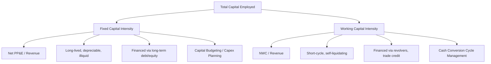

## Distinguishing Fixed Capital Intensity from Working Capital Intensity

### Definitional Overview

Total capital intensity can be decomposed into two structurally distinct components: **fixed capital intensity**, which reflects the long-lived, depreciable productive assets (plant, property, equipment, infrastructure) required to support operations, and **working capital intensity**, which reflects the short-term, cyclically renewing capital tied up in day-to-day operating activities (inventory, receivables, less payables). Both contribute to a firm's overall capital requirements, but they behave differently over time, respond to different management levers, and carry different risk profiles.

$$\text{Total Capital Employed} = \text{Fixed Capital} + \text{Net Working Capital}$$

### Fixed Capital Intensity

**Key Points**

- Represents capital tied up in long-duration, depreciable assets: property, plant, equipment (PP&E), infrastructure, machinery, and intangible productive assets in some frameworks.
- Measured typically as:

$$\text{Fixed Capital Intensity} = \frac{\text{Net PP\&E}}{\text{Revenue}}$$

- Fixed capital is **sunk and illiquid** once deployed; it cannot be easily converted back to cash without significant loss of value or operational disruption.
- Fixed capital intensity changes slowly and in discrete steps (a new plant, a major equipment purchase), rather than continuously, producing "lumpy" capital expenditure patterns rather than smooth, revenue-proportional spending.
- Fixed capital is subject to **depreciation** over its useful life, meaning its book value declines predictably even without further investment, requiring ongoing "maintenance capex" simply to sustain existing capacity.

### Working Capital Intensity

**Key Points**

- Represents capital tied up in the short-term operating cycle: inventory, accounts receivable, and prepaid expenses, net of accounts payable and accrued liabilities.
- Measured typically as:

$$\text{Net Working Capital (NWC)} = \text{Inventory} + \text{Accounts Receivable} - \text{Accounts Payable}$$

$$\text{Working Capital Intensity} = \frac{\text{Net Working Capital}}{\text{Revenue}}$$

- Working capital is **cyclical and self-liquidating**: inventory converts to receivables, receivables convert to cash, within a relatively short operating cycle (days to months).
- Working capital intensity scales roughly proportionally with revenue in the short run, since higher sales volumes generally require proportionally more inventory and generate proportionally more receivables.
- Working capital requirements can be actively managed through operational levers such as inventory turnover improvements, receivables collection policies (days sales outstanding), and payables terms (days payable outstanding), without requiring long-term capital commitments.

### Comparative Framework

| Dimension | Fixed Capital Intensity | Working Capital Intensity |
| --- | --- | --- |
| Asset duration | Long-lived (years to decades) | Short-lived (days to months, cyclical) |
| Liquidity | Low; illiquid, specialized | Higher; converts to cash within operating cycle |
| Depreciation/amortization | Yes, systematic | No (not depreciated; turns over) |
| Financing approach | Typically long-term debt or equity | Typically short-term credit lines, revolvers |
| Scalability with revenue | Lumpy, step-function | Roughly proportional, continuous |
| Reversibility | Low (sunk cost characteristics) | High (can be reduced via operational changes) |
| Primary management lever | Capital budgeting, capex planning | Cash conversion cycle management |
| Key ratio | Fixed Asset Turnover | Working Capital Turnover |

### The Cash Conversion Cycle and Working Capital Intensity

Working capital intensity is closely tied to the **Cash Conversion Cycle (CCC)**, which measures how long cash is tied up in operations before being converted back to cash from sales:

$$\text{CCC} = \text{DIO} + \text{DSO} - \text{DPO}$$

Where:

- $\text{DIO}$ = Days Inventory Outstanding
- $\text{DSO}$ = Days Sales Outstanding
- $\text{DPO}$ = Days Payable Outstanding

A longer CCC indicates higher working capital intensity (more cash tied up for longer periods), while a shorter or negative CCC (common in some retail and subscription models where payables terms exceed the inventory-to-cash cycle) indicates working capital that actually **generates** cash as the business grows, rather than consuming it.

### Worked Example

**Example**

Company DEF Industrial reports the following for Fiscal Year 2025 ($ millions):

- Revenue: $500M
- Net PP&E: $300M
- Inventory: $60M
- Accounts Receivable: $70M
- Accounts Payable: $40M

**Fixed Capital Intensity**

$$\frac{300}{500} = 0.60$$

**Net Working Capital**

$$60 + 70 - 40 = 90$$

**Working Capital Intensity**

$$\frac{90}{500} = 0.18$$

**Total Capital Intensity**

$$0.60 + 0.18 = 0.78 \quad \left(\frac{390}{500}\right)$$

**Interpretation**: Fixed capital represents roughly 77% ($300/390$) of the company's total capital base, while working capital represents about 23% ($90/390$). This indicates a business where long-term asset investment dominates overall capital requirements, though working capital remains a meaningful secondary driver of total capital deployed.

### Why the Distinction Matters for Capex Management

**Key Points**

- **Different planning horizons**: Fixed capital decisions require multi-year capital budgeting processes (NPV/IRR analysis, strategic capacity planning), while working capital is typically managed through rolling short-term forecasts and treasury/cash management processes.
- **Different financing structures**: Fixed capital is typically financed with long-term debt, equity, or project financing matched to asset life; working capital is typically financed through revolving credit facilities, trade credit, or short-term borrowing matched to the operating cycle.
- **Different risk exposures**: Fixed capital carries obsolescence risk, stranded asset risk, and utilization risk over long horizons. Working capital carries credit risk (receivables collection), inventory obsolescence/write-down risk, and liquidity risk over short horizons.
- **Growth funding implications**: A business with high working capital intensity requires proportionally more cash to fund each incremental dollar of revenue growth, even without new fixed asset investment — this is a frequently underestimated cash drain in rapidly growing companies.
- **Free cash flow calculation**: Both components subtract from operating cash flow to arrive at free cash flow, but through different mechanisms:

$$\text{FCF} = \text{Operating Cash Flow} - \text{Capex} - \Delta \text{Net Working Capital}$$

Fixed capital intensity affects FCF through the **capex** line; working capital intensity affects FCF through the **change in net working capital** line, and these should be modeled and forecast separately in financial models due to their differing behavior over time.

### Visual: Total Capital Decomposition

### Illustration: Fixed vs. Working Capital as Share of Total Capital

<svg xmlns="http://www.w3.org/2000/svg" viewBox="0 0 640 340">
<text x="320" y="25" text-anchor="middle" font-size="16" font-weight="bold" fill="#1a1a1a">Fixed vs. Working Capital Composition (svg_diagram)</text>

<text x="160" y="55" text-anchor="middle" font-size="13" font-weight="bold" fill="#333">Capital-Intensive Manufacturer</text>

<rect x="80" y="70" width="160" height="180" fill="`#1d4ed8`" />

<text x="160" y="165" text-anchor="middle" font-size="12" fill="#fff">Fixed Capital 77%</text>

<rect x="80" y="250" width="160" height="55" fill="`#93c5fd`" />

<text x="160" y="282" text-anchor="middle" font-size="12" fill="#333">Working Capital 23%</text>

<text x="480" y="55" text-anchor="middle" font-size="13" font-weight="bold" fill="#333">Working-Capital-Heavy Distributor</text>

<rect x="400" y="70" width="160" height="80" fill="`#1d4ed8`" />

<text x="480" y="115" text-anchor="middle" font-size="12" fill="#fff">Fixed Capital 34%</text>

<rect x="400" y="150" width="160" height="155" fill="`#93c5fd`" />

<text x="480" y="230" text-anchor="middle" font-size="12" fill="#333">Working Capital 66%</text>

</svg>

### Industry Patterns

**Example**

- **Fixed-capital-dominant sectors**: Utilities, telecommunications, oil and gas extraction, airlines, semiconductor fabrication — these hold large depreciable asset bases relative to comparatively modest inventory/receivables needs.
- **Working-capital-dominant sectors**: Wholesale distribution, apparel retail, heavy equipment dealers, construction contractors — these often carry substantial inventory and receivables relative to a lighter fixed asset base (especially where facilities are leased rather than owned).
- **Low intensity in both dimensions**: Software/SaaS, digital services, asset-light platform businesses — minimal fixed assets and often negative working capital (subscription revenue collected before service delivery costs are incurred).

**[Inference]** These sectoral characterizations reflect general, commonly observed patterns in financial analysis and may not hold uniformly for every company within a sector; individual company balance sheet structures should be verified directly rather than assumed from sector classification alone.

**Related Topics**

- Cash conversion cycle (CCC) calculation and optimization
- Net working capital forecasting in financial models
- Maintenance capex versus growth capex distinction
- Free cash flow build and the role of working capital changes
- Days Sales Outstanding, Days Inventory Outstanding, Days Payable Outstanding management
- Fixed asset turnover ratio analysis
- Negative working capital business models (subscription, retail prepayment)
- Capital budgeting and long-term asset investment appraisal (NPV, IRR)
- Short-term financing instruments for working capital (revolvers, trade credit, factoring)
- Sale-leaseback and asset-light strategies to reduce fixed capital intensity