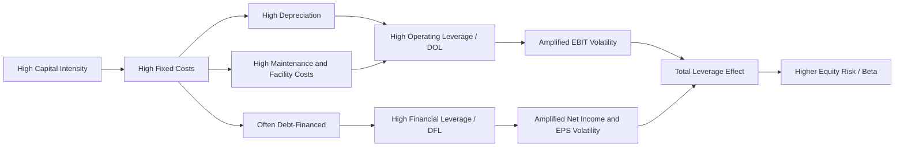

## Capital Intensity's Relationship to Operating Leverage and Fixed Costs

### Conceptual Foundation

Capital intensity and operating leverage are structurally linked: the more capital-intensive a business is, the higher the proportion of its total costs that tend to be fixed rather than variable. This is because large investments in fixed assets (plant, equipment, infrastructure) generate ongoing fixed costs — depreciation, maintenance, insurance, property taxes, and debt service — that must be incurred regardless of production or sales volume. This linkage means capital intensity is one of the primary structural drivers of a firm's operating leverage.

### Defining Operating Leverage

Operating leverage measures the sensitivity of operating income (EBIT) to changes in revenue, arising from the mix of fixed versus variable costs in a firm's cost structure.

$$\text{Degree of Operating Leverage (DOL)} = \frac{\%\ \Delta \text{EBIT}}{\%\ \Delta \text{Revenue}}$$

An equivalent, more commonly used computational formula is:

$$\text{DOL} = \frac{\text{Contribution Margin}}{\text{EBIT}} = \frac{\text{Revenue} - \text{Variable Costs}}{\text{Revenue} - \text{Variable Costs} - \text{Fixed Costs}}$$

A DOL of $2.0$ means that a 1% change in revenue produces approximately a 2% change in operating income, in the same direction.

### How Capital Intensity Drives Fixed Costs

**Key Points**

- **Depreciation**: Capital-intensive firms carry large fixed asset bases, generating substantial non-cash depreciation expense that is recognized regardless of production volume, directly inflating the fixed cost base.
- **Maintenance and upkeep**: Physical assets require scheduled maintenance, inspections, and repairs that are largely independent of utilization levels (or only loosely correlated with them), adding to fixed operating costs.
- **Debt service**: Capital-intensive investments are frequently financed with long-term debt, creating fixed interest and principal repayment obligations that persist regardless of revenue performance (this affects **financial leverage** specifically, compounding with operating leverage — see Total Leverage below).
- **Facility and insurance costs**: Property taxes, facility insurance, and security costs scale with the physical asset base rather than with output volume.
- **Minimum staffing for capital assets**: Operating complex physical infrastructure (plants, networks, pipelines) often requires a baseline skilled workforce regardless of throughput, converting what might otherwise be variable labor cost into a quasi-fixed cost.

By contrast, labor-intensive or asset-light businesses can scale variable costs (materials, hourly labor, commissions) up and down more closely in proportion to revenue, keeping fixed costs — and therefore operating leverage — comparatively lower.

### Break-Even Analysis and the Capital Intensity Link

The break-even point, the revenue level at which fixed costs are fully covered by contribution margin, rises directly with fixed cost levels:

$$\text{Break-Even Revenue} = \frac{\text{Fixed Costs}}{\text{Contribution Margin \%}}$$

Because capital-intensive firms carry higher fixed costs, they require a higher minimum revenue (or utilization level) simply to reach profitability, and they generate outsized profit growth once revenue exceeds that threshold — a pattern often called the "operating leverage effect."

### Worked Example

**Example**

Two firms each generate $200M in revenue with a 40% contribution margin ($80M contribution):

**Firm A — Capital-Intensive (e.g., a chemical processing plant)**

- Fixed costs: $60M
- EBIT: $80M - 60M = 20M$
- DOL: $80/20 = 4.0$

**Firm B — Labor-Intensive (e.g., a staffing agency)**

- Fixed costs: $15M
- EBIT: $80M - 15M = 65M$
- DOL: $80/65 \approx 1.23$

**Scenario: Revenue rises 10%**

- Firm A: EBIT rises approximately $10\% \times 4.0 = 40\%$, from $20M to roughly $28M
- Firm B: EBIT rises approximately $10\% \times 1.23 = 12.3\%$, from $65M to roughly $73M

**Scenario: Revenue falls 10%**

- Firm A: EBIT falls approximately 40%, from $20M to roughly $12M
- Firm B: EBIT falls approximately 12.3%, from $65M to roughly $57M

**Interpretation**: Firm A's capital-intensive cost structure produces dramatically amplified earnings swings in both directions relative to revenue changes, while Firm B's labor-intensive structure produces much more muted earnings sensitivity. This is the direct mechanical consequence of capital intensity translating into fixed cost weight.

### Total Leverage: Combining Operating and Financial Leverage

Because capital-intensive investments are frequently debt-financed, capital intensity often compounds operating leverage with **financial leverage**, producing **total leverage**, a measure of how sensitive net income (or EPS) is to revenue changes:

$$\text{Degree of Total Leverage (DTL)} = \text{DOL} \times \text{DFL} = \frac{\%\ \Delta \text{EPS or Net Income}}{\%\ \Delta \text{Revenue}}$$

Where:

$$\text{DFL} = \frac{\text{EBIT}}{\text{EBIT} - \text{Interest Expense}}$$

**Key Points**

- Highly capital-intensive firms that finance capex with substantial debt face compounded volatility: operating leverage amplifies EBIT swings from revenue changes, and financial leverage further amplifies the resulting net income/EPS swings from those EBIT changes.
- This compounding effect is a central reason capital-intensive industries (utilities, airlines, oil and gas, telecom) tend to exhibit higher equity volatility (beta) and are more sensitive to economic cycles and interest rate environments than labor-intensive, lightly-levered peers.

### Visual: Capital Intensity to Earnings Volatility Chain

### Illustration: EBIT Sensitivity Comparison

<svg xmlns="http://www.w3.org/2000/svg" viewBox="0 0 640 380">
<text x="320" y="25" text-anchor="middle" font-size="16" font-weight="bold" fill="#1a1a1a">EBIT Sensitivity to Revenue Change (svg_diagram)</text>
<line x1="90" y1="330" x2="590" y2="330" stroke="#333" stroke-width="2" />
<line x1="90" y1="330" x2="90" y2="50" stroke="#333" stroke-width="2" />
<line x1="90" y1="190" x2="590" y2="190" stroke="#999" stroke-width="1" stroke-dasharray="4" />
<text x="340" y="360" text-anchor="middle" font-size="13" fill="#333">Revenue Change (%)</text>
<text x="35" y="190" text-anchor="middle" font-size="13" fill="#333" transform="rotate(-90 35 190)">EBIT Change (%)</text>
<line x1="90" y1="290" x2="590" y2="90" stroke="#dc2626" stroke-width="3" />
<text x="480" y="105" font-size="12" fill="#dc2626">Capital-Intensive (DOL = 4.0)</text>
<line x1="90" y1="220" x2="590" y2="160" stroke="#2563eb" stroke-width="3" />
<text x="480" y="200" font-size="12" fill="#2563eb">Labor-Intensive (DOL = 1.23)</text>

<text x="90" y="345" font-size="11" fill="#333">-10%</text>

<text x="580" y="345" font-size="11" fill="#333">+10%</text>

</svg>

### Strategic and Risk Management Implications

**Key Points**

- **Cyclical vulnerability**: Highly capital-intensive, high-DOL businesses are structurally more vulnerable during economic downturns because fixed costs persist even as revenue contracts, compressing margins faster than in labor-intensive peers.
- **Capacity utilization focus**: Because fixed costs are largely sunk once capital is deployed, capital-intensive firm management places heavy strategic emphasis on maximizing asset utilization rates to spread fixed costs over the largest possible output base.
- **Financing discipline**: Given the compounding effect of operating and financial leverage, capital-intensive firms often need to be more conservative with debt financing (lower leverage ratios, longer debt maturities matched to asset life) to avoid excessive total leverage and financial distress risk during downturns.
- **Hedging and flexibility strategies**: Some capital-intensive firms mitigate operating leverage risk through variabilizing portions of their cost structure (e.g., outsourcing maintenance, using variable-rate supply contracts, or employing flexible/contract labor for non-core functions) to reduce the fixed cost burden without sacrificing core capital investment.
- **Valuation implications**: Equity markets typically apply higher discount rates or demand higher risk premiums for capital-intensive, high-DOL businesses due to their greater earnings volatility, all else being equal.

**[Inference]** The specific DOL values, discount rate premiums, and financing thresholds referenced here are illustrative and directionally representative of common analytical patterns; actual figures vary substantially by company, industry maturity, and prevailing capital market conditions, and should be independently verified for any specific analysis.

**Next Steps / Related Topics**

- Degree of Financial Leverage (DFL) and total leverage calculations
- Break-even analysis and contribution margin modeling
- Capital structure decisions in capital-intensive industries
- Beta and equity risk premium differences across capital intensity levels
- Capacity utilization metrics and their effect on fixed cost absorption
- Variabilizing fixed costs through outsourcing and flexible contracts
- Debt maturity matching and asset-liability management for capital-intensive firms
- Scenario and sensitivity analysis in capital-intensive financial modeling
- Economic cycle sensitivity and capital-intensive sector performance
- Cost structure benchmarking across industries