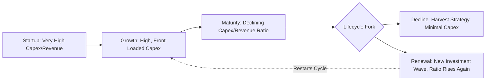

## Capital Intensity Across the Business Lifecycle

### Conceptual Overview

Capital intensity is not static across a firm's life; it typically follows a recognizable pattern as a business moves through startup, growth, maturity, and decline (or renewal) phases. Understanding how capital intensity evolves across this lifecycle is essential for capex planning, financing strategy, and performance benchmarking, since comparing capital intensity ratios across firms at different lifecycle stages — even within the same industry — can produce misleading conclusions if the lifecycle context is ignored.

### The Business Lifecycle Framework

**Key Points**

| Lifecycle Stage | Typical Capital Intensity Pattern | Primary Capex Focus | Financing Characteristics |
| --- | --- | --- | --- |
| Startup/Formation | Often rising sharply from a low base | Initial infrastructure, core asset buildout | Equity-heavy, limited debt access |
| Growth | High and rising, front-loaded capex | Capacity expansion, market buildout | Mix of equity, growth debt, reinvested cash |
| Maturity | Stabilizing, often declining as % of revenue | Maintenance capex, selective upgrades | Debt-capable, stable cash flow-funded capex |
| Decline/Renewal | Falling or bifurcating (harvest vs. reinvest) | Minimal maintenance, or transformational reinvestment | Cash-funded, deleveraging, or restructuring |

### Startup/Formation Stage

**Key Points**

- Early-stage capital-intensive businesses (manufacturing startups, infrastructure ventures, biotech with physical labs, hardware companies) often exhibit **extremely high capital intensity relative to revenue**, since substantial asset investment (facilities, equipment, initial infrastructure) must precede any meaningful revenue generation.
- The capex-to-revenue ratio can be mathematically extreme or undefined in this stage (revenue near zero, capex substantial), making traditional capital intensity ratios less meaningful; analysts often instead track **absolute capex**, **capital raised**, and **burn rate relative to capital deployed**.
- Financing is typically equity-heavy (venture capital, private equity, founder capital) because early-stage capital-intensive ventures lack the cash flow stability and collateral track record needed for conventional debt financing.
- **Key risk**: Capital-intensive startups face heightened execution risk, since large capital commitments are made before product-market fit or operational efficiency is proven, making stranded or underutilized asset risk especially acute at this stage.

### Growth Stage

**Key Points**

- As revenue begins scaling, capital-intensive firms typically continue **front-loaded, high capex** to build out capacity ahead of demand, aiming to avoid capacity constraints that would limit growth.
- Capital intensity ratios (capex/revenue, assets/revenue) often remain elevated during this phase, even as absolute revenue grows, because incremental capacity is frequently added in large, discrete increments (new plants, facilities, network buildouts) rather than smoothly.
- Firms in this stage increasingly gain access to debt financing as they establish revenue predictability and asset bases suitable as collateral, shifting the financing mix from pure equity toward a blend of debt and equity.
- **Growth capex** (capacity-expanding investment) dominates over **maintenance capex** (sustaining existing capacity) during this phase — a distinction critical to capex management and free cash flow forecasting.

$$\text{Total Capex} = \text{Growth Capex} + \text{Maintenance Capex}$$

### Maturity Stage

**Key Points**

- As firms reach maturity, revenue growth slows, and the emphasis shifts from capacity expansion to **efficiency, replacement, and selective modernization**.
- Capital intensity ratios (as a percentage of revenue) often **decline or stabilize** during maturity, since the asset base is largely built out and incremental capex is primarily maintenance-oriented rather than growth-oriented.
- Free cash flow generation typically improves markedly in this stage, since capex requirements moderate while revenue and margins remain stable or grow modestly — this is often the stage where capital-intensive firms become attractive for dividend distributions or share buybacks.
- Capital allocation discipline becomes paramount: mature capital-intensive firms must balance ongoing maintenance capex, selective growth opportunities, and returning capital to shareholders, all evaluated against ROIC and cost-of-capital hurdles.

### Decline or Renewal Stage

**Key Points**

- In decline, firms may adopt a **"harvest" strategy**: minimizing capex to essential maintenance only, maximizing near-term cash extraction from a depreciating asset base, and allowing capital intensity ratios to fall as assets are not replaced at the pace of depreciation.
- Alternatively, firms may pursue **strategic renewal**: a new wave of transformational capital investment (e.g., technology modernization, pivoting to new product lines or business models) that temporarily spikes capital intensity again, effectively restarting elements of the growth-stage pattern within a mature or declining core business.
- **Stranded asset risk** is most acute in this stage, particularly in industries facing structural or technological disruption, where previously productive capital assets may need to be written down or decommissioned before the end of their originally intended useful life.
- Financing in decline is typically constrained to internally generated cash flow, with reduced access to new debt or equity capital unless a credible renewal strategy is in place.

### Worked Example: Capital Intensity Trajectory

**Example**

A telecommunications infrastructure company's capex-to-revenue ratio across its lifecycle (illustrative):

- **Year 1–3 (Startup)**: Revenue $10M, Capex $150M → Capex/Revenue ratio far exceeds 100% (network buildout precedes revenue)
- **Year 4–8 (Growth)**: Revenue grows from $80M to $400M, Capex averages $120M/year → Capex/Revenue ratio approximately 30–40%, funding network expansion into new markets
- **Year 9–15 (Maturity)**: Revenue stabilizes around $600M, Capex falls to approximately $90M/year → Capex/Revenue ratio approximately 15%, reflecting maintenance and selective upgrade spending
- **Year 16+ (Renewal)**: Facing a new technology transition (e.g., network technology upgrade cycle), Capex rises again to $150M/year against $620M revenue → Capex/Revenue ratio rises to approximately 24%, reflecting a renewal investment wave

**Interpretation**: The capital intensity ratio is not a fixed structural characteristic of the firm but evolves substantially across its lifecycle, and a snapshot ratio taken at any single point must be interpreted with reference to which lifecycle stage the firm currently occupies.

### Visual: Capital Intensity Trajectory Across the Lifecycle

### Illustration: Capital Intensity Ratio Over the Lifecycle Curve

<svg xmlns="http://www.w3.org/2000/svg" viewBox="0 0 640 360">
<text x="320" y="25" text-anchor="middle" font-size="16" font-weight="bold" fill="#1a1a1a">Capital Intensity Ratio Across the Lifecycle (svg_diagram)</text>
<line x1="80" y1="310" x2="590" y2="310" stroke="#333" stroke-width="2" />
<line x1="80" y1="310" x2="80" y2="50" stroke="#333" stroke-width="2" />
<text x="335" y="340" text-anchor="middle" font-size="13" fill="#333">Business Lifecycle Stage</text>
<text x="30" y="180" text-anchor="middle" font-size="13" fill="#333" transform="rotate(-90 30 180)">Capex / Revenue Ratio</text>
<path d="M100,290 C150,80 200,90 260,150 S 350,230 420,240 S 480,260 520,180 L 560,120" stroke="#7c3aed" stroke-width="3" fill="none" />

<text x="100" y="305" font-size="11" fill="#333">Startup</text>

<text x="230" y="305" font-size="11" fill="#333">Growth</text>

<text x="400" y="305" font-size="11" fill="#333">Maturity</text>

<text x="500" y="305" font-size="11" fill="#333">Renewal</text>

<circle cx="130" cy="120" r="5" fill="#7c3aed" />
<circle cx="260" cy="150" r="5" fill="#7c3aed" />
<circle cx="420" cy="240" r="5" fill="#7c3aed" />
<circle cx="560" cy="120" r="5" fill="#7c3aed" />
</svg>

### Implications for Capex Management and Financial Analysis

**Key Points**

- **Benchmarking caution**: Comparing capital intensity ratios across firms without adjusting for lifecycle stage can produce misleading conclusions — a young, high-growth capital-intensive firm will naturally show a higher ratio than a mature peer in the same industry, without this necessarily indicating inefficiency.
- **Forecasting implications**: Financial models projecting capex should explicitly incorporate lifecycle-stage assumptions, since applying a static capex-to-revenue percentage across a multi-year forecast can materially misstate free cash flow if the company is transitioning between lifecycle stages.
- **Investment implications**: Investors and lenders evaluating capital-intensive businesses should assess where a company sits on this lifecycle curve, since this materially affects near-term free cash flow generation, appropriate capital structure, and the interpretation of return metrics such as ROIC (which may be temporarily depressed during heavy investment phases even for fundamentally sound businesses).
- **Portfolio and sector rotation implications**: Capital allocators (private equity, corporate strategists) often deliberately target specific lifecycle stages of capital-intensive businesses (e.g., growth-stage infrastructure assets) based on their return objectives and risk tolerance for capex-driven cash flow volatility.

**[Inference]** The specific durations, magnitudes, and shapes of lifecycle-stage capital intensity patterns described here represent generalized, commonly observed tendencies in capital-intensive industries; actual trajectories vary considerably by sector, competitive dynamics, technological change, and company-specific strategic decisions, and should not be treated as a universal or precisely predictable pattern.

**Next Steps / Related Topics**

- Growth capex versus maintenance capex classification and forecasting
- Capital budgeting and multi-year capex planning frameworks
- ROIC trends across the business lifecycle
- Stranded asset risk and technology transition cycles
- Free cash flow modeling with lifecycle-stage capex assumptions
- Capital structure evolution from equity-heavy to debt-capable financing
- Harvest versus renewal strategies in declining capital-intensive businesses
- Industry lifecycle theory and its application to capital allocation
- Capacity planning and demand forecasting for infrastructure buildout
- Case studies of capital-intensive industry renewal cycles (e.g., telecom network generational upgrades)