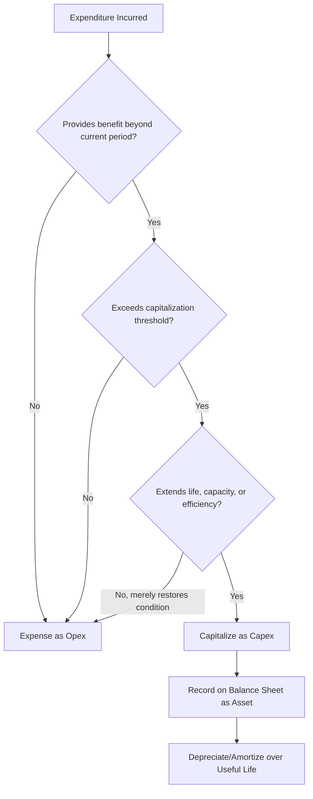

## Definition and Scope of Capital Expenditures

### Definition

Capital expenditure (capex) refers to funds a business spends to acquire, upgrade, or maintain long-lived physical or intangible assets used in operations, with benefits expected to extend beyond the current accounting period (typically beyond one year). Unlike operating expenditures (opex), which are consumed within the period they are incurred and expensed immediately against revenue, capex is **capitalized** on the balance sheet as an asset and then systematically expensed over its useful life through depreciation or amortization.

$$\text{Capex} \rightarrow \text{Balance Sheet Asset} \rightarrow \text{Depreciation/Amortization Expense (over time)}$$

versus

$$\text{Opex} \rightarrow \text{Income Statement Expense (immediately)}$$

### Accounting Basis for the Capex/Opex Distinction

**Key Points**

Under standard accounting frameworks (U.S. GAAP and IFRS), an expenditure generally qualifies for capitalization as capex when it meets criteria such as:

- **Future economic benefit**: The expenditure is expected to generate economic benefits (revenue, cost savings, or productive capacity) over multiple future periods, not just the current period.
- **Control and ownership**: The entity has control over the asset and the benefits it will generate, whether through ownership or, under lease accounting standards (ASC 842 / IFRS 16), through right-of-use arrangements.
- **Measurable cost**: The cost of the expenditure can be reliably measured.
- **Materiality threshold**: Most organizations apply an internal capitalization policy threshold (a minimum dollar amount) below which expenditures are expensed as opex even if they technically extend asset life, for practical and administrative efficiency.
- **Extension of useful life or capacity**: Expenditures that extend an asset's useful life, increase its capacity, or improve its efficiency beyond the original specification are typically capitalized; expenditures that merely restore an asset to its original operating condition (routine repairs) are typically expensed.

**[Inference]** Exact capitalization thresholds and specific interpretive judgments vary by company accounting policy, auditor guidance, and jurisdiction; the general principles above reflect standard GAAP/IFRS treatment, but specific line-item classification decisions should be verified against the applicable accounting standard and the entity's documented capitalization policy.

### Scope: What Is Included in Capital Expenditures

**Key Points**

- **Tangible fixed assets**: Land, buildings, machinery, equipment, vehicles, furniture and fixtures, leasehold improvements, computer hardware and IT infrastructure.
- **Intangible assets** (in many capex frameworks, though sometimes tracked separately): Capitalized software development costs, patents, licenses, and other intangible assets with multi-period benefit.
- **Construction in progress**: Costs incurred for assets under construction or development, capitalized progressively until the asset is placed into service.
- **Major renovations and upgrades**: Expenditures that materially extend useful life, expand capacity, or improve the functional performance of an existing asset.
- **Capitalized interest**: Under certain accounting standards, interest expense incurred during the construction period of a qualifying asset may itself be capitalized as part of the asset's cost basis.
- **Right-of-use assets under finance/capital leases**: Leased assets that meet finance lease criteria are capitalized on the balance sheet, with lease payments split between interest expense and amortization of the right-of-use asset.

### Scope: What Is Typically Excluded from Capital Expenditures

**Key Points**

- **Routine repairs and maintenance**: Expenditures that merely restore an asset to normal operating condition without extending its useful life or improving its capacity (e.g., replacing a worn part, routine servicing) are expensed as opex.
- **Consumable supplies**: Items consumed in normal operations within the current period (raw materials, office supplies) are expensed, not capitalized.
- **Below-threshold purchases**: Small-dollar asset purchases below a company's capitalization policy threshold are expensed for administrative simplicity, even if technically long-lived.
- **Research costs (in most frameworks)**: Under most accounting standards, research costs are expensed as incurred; only certain development costs meeting specific technical and commercial feasibility criteria may be capitalized (treatment differs meaningfully between U.S. GAAP, which is generally stricter, and IFRS, which permits capitalization of qualifying development costs).
- **Advertising and marketing expenditures**: Even when intended to build long-term brand value, these are generally expensed as incurred under standard accounting treatment.

### Categories of Capital Expenditure by Purpose

| Category | Description | Example |
| --- | --- | --- |
| Maintenance/Sustaining Capex | Replaces or sustains existing productive capacity | Replacing worn machinery with equivalent equipment |
| Growth/Expansion Capex | Adds new productive capacity beyond current levels | Building a new manufacturing facility |
| Efficiency/Productivity Capex | Improves output per unit of input without necessarily adding capacity | Automating a production line |
| Regulatory/Compliance Capex | Required to meet legal, safety, or environmental regulations | Installing emissions control equipment |
| Strategic/Transformational Capex | Repositions the business for new markets or capabilities | Building new digital infrastructure for a business model shift |

### Capex on Financial Statements

**Key Points**

- **Cash Flow Statement**: Capex appears in the **investing activities** section, typically as "purchases of property, plant, and equipment" or "capital expenditures," representing a cash outflow.
- **Balance Sheet**: Capitalized expenditures increase the gross value of PP&E (or intangible assets); accumulated depreciation is tracked separately and net PP&E reflects gross cost less accumulated depreciation.
- **Income Statement**: Capex itself does not appear directly on the income statement; instead, its cost is recognized gradually through **depreciation expense** (for tangible assets) or **amortization expense** (for intangible assets) over the asset's estimated useful life.

$$\text{Net PP\&E}_{t} = \text{Net PP\&E}_{t-1} + \text{Capex}_{t} - \text{Depreciation}_{t} - \text{Disposals}_{t}$$

### Worked Example

**Example**

A manufacturing company undertakes the following expenditures in a fiscal year:

| Expenditure | Amount | Treatment |
| --- | --- | --- |
| New production line equipment | $5,000,000 | Capitalized (capex) — extends capacity, multi-year benefit |
| Routine machine servicing | $150,000 | Expensed (opex) — restores normal condition, no capacity extension |
| Office supplies | $40,000 | Expensed (opex) — consumed within the period |
| Warehouse expansion construction | $8,200,000 | Capitalized (capex) — new long-lived asset |
| Software license (capitalized development costs meeting criteria) | $900,000 | Capitalized (capex) — multi-period benefit, meets capitalization criteria |
| Marketing campaign for new product | $500,000 | Expensed (opex) — standard treatment despite long-term brand benefit |

**Total Capex for the period**: $5,000,000 + 8,200,000 + 900,000 = \$14,100,000$

This amount would be reported as a cash outflow under investing activities and would begin generating depreciation/amortization expense on the income statement once the assets are placed into service.

### Visual: Capex Classification Decision Flow

### Illustration: Capex Flow Through Financial Statements

<svg viewBox="0 0 640 320" xmlns="http://www.w3.org/2000/svg">
<text x="320" y="25" text-anchor="middle" font-size="16" font-weight="bold" fill="#1a1a1a">Capex Flow Through Financial Statements (svg_diagram)</text>
<rect x="40" y="70" width="160" height="70" fill="#1d4ed8" rx="6"/>
<text x="120" y="100" text-anchor="middle" font-size="12" fill="#fff">Cash Flow Statement</text>
<text x="120" y="120" text-anchor="middle" font-size="11" fill="#fff">Investing Activities: -Capex</text>
<rect x="240" y="70" width="160" height="70" fill="#7c3aed" rx="6"/>
<text x="320" y="100" text-anchor="middle" font-size="12" fill="#fff">Balance Sheet</text>
<text x="320" y="120" text-anchor="middle" font-size="11" fill="#fff">+PP&amp;E (Gross Asset)</text>
<rect x="440" y="70" width="160" height="70" fill="#dc2626" rx="6"/>
<text x="520" y="100" text-anchor="middle" font-size="12" fill="#fff">Income Statement</text>
<text x="520" y="120" text-anchor="middle" font-size="11" fill="#fff">Depreciation Expense (over time)</text>
<path d="M200,105 L240,105" stroke="#333" stroke-width="2" marker-end="url(#arrow)"/>
<path d="M400,105 L440,105" stroke="#333" stroke-width="2" marker-end="url(#arrow)"/>
<defs>
<marker id="arrow" markerWidth="10" markerHeight="10" refX="8" refY="3" orient="auto">
<path d="M0,0 L8,3 L0,6 Z" fill="#333"/>
</marker>
</defs>

<text x="320" y="200" text-anchor="middle" font-size="12" fill="#333">Depreciation reduces PP&E on the balance sheet over the asset's useful life,</text>

<text x="320" y="220" text-anchor="middle" font-size="12" fill="#333">while the original cash outflow was recognized entirely at the time of purchase.</text>

</svg>

### Common Areas of Judgment and Complexity

**Key Points**

- **Repairs vs. improvements**: Distinguishing routine repairs (opex) from capacity-extending improvements (capex) often requires professional judgment and is a common area of accounting policy interpretation and audit scrutiny.
- **Software capitalization**: Costs for internally developed software are capitalized only once the project reaches the "application development" stage (post-feasibility, under U.S. GAAP ASC 350-40), while preliminary planning and post-implementation costs are expensed.
- **Capitalized interest**: Determining which borrowings qualify for interest capitalization during asset construction requires specific criteria under the applicable accounting standard (ASC 835-20 under U.S. GAAP, IAS 23 under IFRS).
- **Lease classification**: Since the adoption of ASC 842 and IFRS 16, most leases (not just finance leases) now appear on the balance sheet as right-of-use assets, which has expanded and complicated what is functionally treated similarly to capitalized capital investment, though operating lease right-of-use assets are typically tracked separately from traditional PP&E and capex reporting.

**[Inference]** Behavior of specific software, lease, and interest capitalization rules may vary by jurisdiction, applicable accounting standard version, and specific fact patterns; the descriptions above reflect standard, well-documented treatment but should be confirmed against current authoritative accounting guidance for any specific transaction.

**Next Steps / Related Topics**

- Maintenance capex versus growth capex classification
- Depreciation methods (straight-line, declining balance, units of production)
- Capitalized software development costs and ASC 350-40 criteria
- Lease accounting under ASC 842 / IFRS 16 and its relationship to capex
- Capital budgeting techniques (NPV, IRR, payback period)
- Capex forecasting methodologies in financial modeling
- Capitalized interest rules under ASC 835-20 / IAS 23
- Capex disclosure requirements and MD&A reporting practices
- Free cash flow calculation and the role of capex
- Capital allocation frameworks and capex approval governance