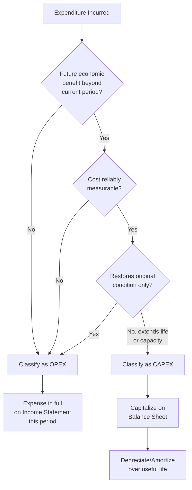

## Capex versus Operating Expenditure Distinction

### Definition and Core Distinction

**Capital Expenditure (Capex)** refers to funds a company spends to acquire, upgrade, or extend the useful life of long-term assets — property, plant, equipment, technology infrastructure, or intangible assets. Capex is capitalized on the balance sheet and expensed gradually over the asset's useful life through depreciation or amortization.

**Operating Expenditure (Opex)** refers to funds spent on the day-to-day operational needs of a business — costs required to keep current operations running. Opex is fully expensed in the period it is incurred, flowing directly through the income statement.

The core distinction rests on three tests:

| Test | Capex | Opex |
| --- | --- | --- |
| Time horizon of benefit | Extends beyond one accounting period (typically >1 year) | Consumed within the current accounting period |
| Balance sheet treatment | Capitalized as an asset | Not capitalized; expensed immediately |
| Income statement impact | Recognized gradually via depreciation/amortization | Recognized in full immediately |

### Accounting Treatment Mechanics

When a cost is classified as Capex:

1. The expenditure is recorded as an asset on the balance sheet (e.g., under Property, Plant & Equipment (PP&E), or Intangible Assets).
2. The asset's cost is systematically allocated to the income statement over its useful life via:
   - **Depreciation** — for tangible assets (buildings, machinery, vehicles, servers)
   - **Amortization** — for intangible assets (software licenses, patents, capitalized development costs)
3. The cash outflow appears in the **Investing Activities** section of the Cash Flow Statement.

When a cost is classified as Opex:

1. The expenditure is recorded directly as an expense in the period incurred.
2. It reduces net income immediately in full.
3. The cash outflow appears in the **Operating Activities** section of the Cash Flow Statement.

$$\text{Net Book Value}_t = \text{Original Cost} - \sum_{i=1}^{t} \text{Depreciation}_i$$

### Classification Criteria (Practical Tests)

Standard accounting frameworks (e.g., IAS 16 for Property, Plant & Equipment; IAS 38 for Intangible Assets; ASC 360 under US GAAP) generally require that for a cost to qualify as Capex:

- **[Confirmed]** It must be probable that future economic benefits associated with the item will flow to the entity.
- **[Confirmed]** The cost of the item must be reliably measurable.
- **[Confirmed]** The asset must have a useful life extending beyond the current reporting period (commonly >12 months).

If a cost fails any of these tests, it defaults to Opex treatment.

**Example — Common Classification Decisions:**

| Item | Classification | Rationale |
| --- | --- | --- |
| Purchase of a new server rack | Capex | Multi-year useful life, capacity expansion |
| Monthly cloud hosting fees | Opex | Recurring, consumed within the billing period |
| Building a new office wing | Capex | Long-term asset, extends physical capacity |
| Office rent | Opex | Recurring operational cost, no asset ownership |
| Major equipment overhaul extending useful life | Capex | Extends the asset's useful life beyond original estimate |
| Routine equipment maintenance/repair | Opex | Restores function; does not extend useful life or capacity |
| Software license (perpetual, capitalizable development) | Capex | Multi-year benefit, capitalizable under relevant standard |
| SaaS subscription fee | Opex | Typically expensed as incurred (subject to specific guidance, see below) |

### The Repair vs. Improvement Boundary

One of the most consequential judgment calls in Capex/Opex classification is distinguishing a **repair** (Opex) from a **betterment/improvement** (Capex). The standard test applied is whether the expenditure:

- **Restores** an asset to its original condition/capacity → **Opex** (repair and maintenance)
- **Extends** useful life, **increases** capacity, or **improves** efficiency/quality beyond original specification → **Capex** (betterment)

**[Inference]** In practice, this boundary is frequently contested in audits and tax filings because a single project (e.g., a factory floor renovation) can contain both repair and betterment components, requiring cost segregation to split treatment on a line-item basis.

### Cloud and SaaS Complication (Modern Capex/Opex Shift)

**[Confirmed]** A major structural shift in Capex/Opex classification has occurred with the move from on-premises infrastructure to cloud computing:

- **On-premises model**: Servers, storage, and networking hardware purchased outright → **Capex**, depreciated over 3–5 years typically.
- **Cloud/SaaS model**: Infrastructure-as-a-Service (IaaS) or Software-as-a-Service (SaaS) subscriptions paid periodically → generally **Opex**, expensed as incurred.

This shift is a deliberate strategic lever many organizations use — often described as moving "from Capex to Opex" — because it:

- Converts large upfront capital outlays into smaller, predictable recurring costs
- Avoids tying up capital in depreciating hardware
- Improves near-term free cash flow optics (though total cash outflow over time may be comparable or higher)

**[Confirmed]** Under ASC 350-40 (US GAAP) and equivalent guidance (IFRS), certain **implementation costs** for cloud computing arrangements (e.g., configuration, customization, testing during the application development stage) *can* be capitalized even though the underlying subscription itself is expensed as Opex — creating a hybrid treatment within a single cloud contract.

### Impact on Financial Statements and Ratios

**Income Statement:**

- Opex directly reduces operating income (EBIT) in the period incurred.
- Capex does not appear directly; only its periodic depreciation/amortization charge flows through as an expense.

**Cash Flow Statement:**

- Capex appears in Investing Activities (a cash outflow), separate from Operating Cash Flow (OCF).
- Opex is embedded in Operating Activities, reducing OCF.

**Key Metrics Affected:**

$$\text{Free Cash Flow (FCF)} = \text{Operating Cash Flow} - \text{Capex}$$

$$\text{Capital Intensity Ratio} = \frac{\text{Capex}}{\text{Revenue}}$$

$$\text{EBITDA} = \text{EBIT} + \text{Depreciation} + \text{Amortization}$$

**[Confirmed]** EBITDA is frequently used precisely because it strips out the depreciation/amortization effects of prior Capex decisions, allowing comparison of operating performance across companies with different capital structures or asset ages. **[Inference]** However, this can obscure genuine capital intensity differences between businesses, which is why analysts frequently examine Capex-to-Revenue or Capex-to-EBITDA alongside EBITDA-based multiples.

### Tax Treatment Divergence

**[Confirmed]** Capex and Opex are treated differently for tax purposes in most jurisdictions:

- Opex is typically fully deductible in the year incurred, reducing taxable income immediately.
- Capex is generally not immediately deductible; instead, the asset's cost is recovered over time through tax depreciation schedules (e.g., MACRS in the US), though many jurisdictions offer accelerated depreciation or immediate expensing incentives (e.g., Section 179 expensing, bonus depreciation) for qualifying assets.

**[Unverified]** Specific depreciation schedules, capitalization thresholds, and accelerated-expensing eligibility vary significantly by jurisdiction and asset class; local tax code should always be confirmed for a specific filing.

### Visual Summary (svg_diagram)

<svg xmlns="http://www.w3.org/2000/svg" viewBox="0 0 760 380">
<text x="380" y="28" font-size="18" font-weight="bold" text-anchor="middle" fill="#1a1a1a">Capex vs Opex Classification Flow (svg_diagram)</text>
<rect x="300" y="50" width="160" height="50" rx="8" fill="#e8eef7" stroke="#3b5998" stroke-width="1.5" />
<text x="380" y="80" font-size="13" text-anchor="middle" fill="#1a1a1a">Expenditure Incurred</text>
<line x1="380" y1="100" x2="380" y2="130" stroke="#555" stroke-width="1.5" marker-end="url(#arrow)" />
<rect x="270" y="130" width="220" height="60" rx="8" fill="#fff4e0" stroke="#c98a1c" stroke-width="1.5" />
<text x="380" y="155" font-size="12" text-anchor="middle" fill="#1a1a1a">Benefit extends beyond</text>
<text x="380" y="172" font-size="12" text-anchor="middle" fill="#1a1a1a">current period (&gt;1 yr)?</text>
<line x1="300" y1="190" x2="150" y2="230" stroke="#555" stroke-width="1.5" marker-end="url(#arrow)" />
<text x="200" y="215" font-size="12" fill="#333">No</text>
<line x1="460" y1="190" x2="610" y2="230" stroke="#555" stroke-width="1.5" marker-end="url(#arrow)" />
<text x="560" y="215" font-size="12" fill="#333">Yes</text>
<rect x="60" y="230" width="180" height="55" rx="8" fill="#fde8e8" stroke="#b33a3a" stroke-width="1.5" />
<text x="150" y="255" font-size="13" font-weight="bold" text-anchor="middle" fill="#1a1a1a">OPEX</text>
<text x="150" y="272" font-size="11" text-anchor="middle" fill="#1a1a1a">Expense immediately</text>
<rect x="530" y="230" width="180" height="55" rx="8" fill="#e3f5e6" stroke="#2f8f4e" stroke-width="1.5" />
<text x="620" y="255" font-size="13" font-weight="bold" text-anchor="middle" fill="#1a1a1a">CAPEX</text>
<text x="620" y="272" font-size="11" text-anchor="middle" fill="#1a1a1a">Capitalize on balance sheet</text>
<line x1="150" y1="285" x2="150" y2="310" stroke="#555" stroke-width="1.5" marker-end="url(#arrow)" />
<text x="150" y="330" font-size="11" text-anchor="middle" fill="#333">Income Statement</text>
<text x="150" y="345" font-size="11" text-anchor="middle" fill="#333">(full expense, period)</text>
<line x1="620" y1="285" x2="620" y2="310" stroke="#555" stroke-width="1.5" marker-end="url(#arrow)" />
<text x="620" y="330" font-size="11" text-anchor="middle" fill="#333">Depreciation / Amortization</text>
<text x="620" y="345" font-size="11" text-anchor="middle" fill="#333">(spread over useful life)</text>
</svg>

### Decision Process (Mermaid Flowchart)

### Common Misclassification Risks

- **[Inference]** Companies under earnings pressure may face incentive to misclassify Opex as Capex to inflate short-term reported net income (a historically documented fraud pattern, e.g., WorldCom's improper capitalization of line costs).
- **[Confirmed]** Auditors specifically scrutinize the Capex/Opex boundary during financial statement audits because of its direct impact on both the balance sheet and reported earnings.
- **[Unverified]** The materiality threshold above which a cost must be evaluated for capitalization varies by company capitalization policy (commonly set internally, e.g., $1,000 or $5,000 minimum), and is not itself dictated by a single universal accounting standard.

### Strategic Implications for Capex Management

- **Capital budgeting discipline**: Because Capex ties up capital and affects long-term ratios (ROIC, asset turnover), it typically requires formal approval processes (capital appropriation requests, hurdle-rate/NPV analysis) that Opex does not.
- **Capital intensity signaling**: A high Capex-to-Revenue ratio signals an asset-heavy business model (e.g., telecom, utilities, manufacturing); a low ratio signals an asset-light model (e.g., software, services).
- **Flexibility trade-off**: Opex-heavy cost structures (e.g., via leasing or cloud subscriptions instead of ownership) provide greater flexibility to scale costs down during downturns, whereas Capex-heavy structures carry fixed depreciation charges regardless of utilization.

**Related Topics**

- Capitalization thresholds and materiality policy design
- Depreciation methods (straight-line, declining balance, units-of-production) and their Capex implications
- Lease accounting (ASC 842 / IFRS 16) and the on-balance-sheet treatment of operating vs. finance leases
- Cloud computing arrangement cost capitalization (ASC 350-40 / IFRS equivalent)
- Capital budgeting techniques: NPV, IRR, payback period for Capex approval
- Maintenance Capex vs. Growth Capex distinction
- Capex-to-EBITDA and Capex-to-Revenue as capital intensity benchmarks