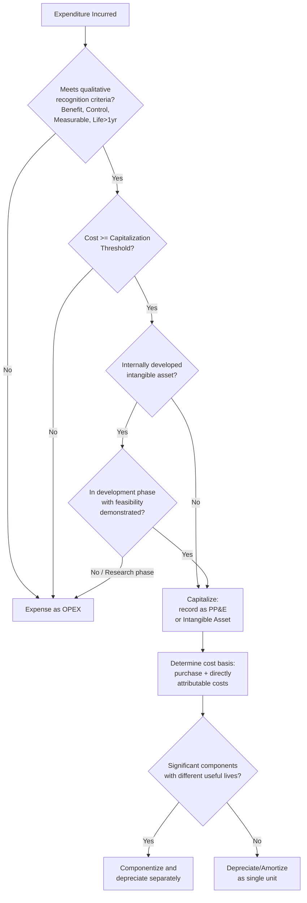

## Accounting Capitalization Criteria and Thresholds

### Definition

**Capitalization criteria** are the recognition tests an expenditure must satisfy for it to be recorded as an asset on the balance sheet rather than expensed immediately. **Capitalization thresholds** are the monetary minimums a company sets, internally or by regulation, below which an otherwise-qualifying expenditure is expensed regardless of meeting the qualitative criteria, for practical and materiality reasons.

These two concepts work together: an expenditure must pass **qualitative recognition tests** (does it behave like an asset?) and clear a **quantitative threshold** (is it large enough to matter?) before capitalization occurs.

### Core Recognition Criteria (Qualitative Tests)

Under both IFRS (IAS 16 for Property, Plant & Equipment; IAS 38 for Intangible Assets) and US GAAP (ASC 360, ASC 350), an item is capitalized when it satisfies all of the following:

1. **[Confirmed]** **Probable future economic benefit** — it is probable that the item will generate cash flows or provide service potential to the entity beyond the current period.
2. **[Confirmed]** **Reliable measurement** — the cost of the item can be measured reliably (i.e., the transaction has a verifiable cost basis, such as an invoice, contract, or allocated internal cost).
3. **[Confirmed]** **Control** — the entity controls the resource, meaning it can obtain the future economic benefits and restrict others' access to them (ownership is not strictly required for control, e.g., certain finance leases).
4. **[Confirmed]** **Useful life beyond one reporting period** — the asset provides benefit for more than one accounting period (commonly interpreted as >12 months).

If any one of these fails, the expenditure defaults to an operating expense in the period incurred.

### Quantitative Thresholds (Capitalization Policy)

**[Confirmed]** Accounting standards do not mandate a specific dollar threshold for capitalization — that decision is left to each entity's internal accounting policy, subject to the constraint of materiality. This is a deliberate design choice: applying strict capitalization rules to every $20 stapler would create disproportionate administrative burden relative to any decision-usefulness benefit.

**Typical threshold-setting practice:**

| Entity Type | Common Threshold Range | Basis |
| --- | --- | --- |
| Small business / startup | $500 – $2,500 | Simplicity, IRS de minimis safe harbor alignment |
| Mid-size company | $2,500 – $5,000 | Balance of administrative cost vs. tracking value |
| Large enterprise | $5,000 – $25,000+ | High transaction volume; low-value items immaterial in aggregate |
| Government / public sector entities | Often fixed by statute or accounting manual (e.g., $15,000 in various LGU/COA-aligned frameworks) | Regulatory/audit compliance, standardized public asset registries |

**[Unverified]** Exact threshold figures vary significantly by jurisdiction, industry, and internal policy; a specific entity's threshold should always be confirmed against its documented accounting policy manual rather than assumed from general practice.

**[Confirmed]** In the US, the IRS provides a **de minimis safe harbor election** under Treas. Reg. §1.263(a)-1(f): taxpayers with an Applicable Financial Statement (AFS) may expense items up to $5,000 per invoice/item for tax purposes; taxpayers without an AFS may expense up to $2,500 per invoice/item. This is a *tax* election and does not automatically dictate GAAP book treatment, though many companies align book and tax thresholds for simplicity.

### Threshold Application Mechanics

Capitalization thresholds are typically applied per **unit of property** or per **invoice line item**, not in aggregate across a bulk purchase — though policy can specify aggregation rules for componentized purchases (e.g., 50 identical laptops purchased together may be evaluated individually against the threshold, or aggregated, depending on policy wording).

$$\text{Capitalize if: } \quad \text{Cost} \geq \text{Threshold} \quad \text{AND} \quad \text{Useful Life} > 1 \text{ year} \quad \text{AND} \quad \text{Control exists}$$

**Example — Threshold Decision Table (assume $5,000 policy threshold):**

| Item | Cost | Useful Life | Decision | Rationale |
| --- | --- | --- | --- | --- |
| Laptop | $1,200 | 3 years | Opex (expensed) | Below threshold despite multi-year life |
| Server | $8,500 | 5 years | Capex | Clears threshold, multi-year benefit |
| Software license (perpetual) | $12,000 | 4 years | Capex | Clears threshold, control + benefit period |
| Office chair | $300 | 7 years | Opex (expensed) | Below threshold |
| Fleet of 20 desktop PCs @ $900 each ($18,000 total) | $900/unit | 3 years | Depends on policy: per-unit (Opex) vs. aggregated (Capex) | Aggregation rule determines outcome |

### Costs Included in Capitalized Value (Cost Basis Determination)

**[Confirmed]** Once an item is determined to be capitalizable, the capitalized cost basis includes not just the purchase price but all costs necessary to bring the asset to the location and condition necessary for its intended use:

- Purchase price (net of trade discounts/rebates)
- Import duties and non-refundable purchase taxes
- Freight and delivery costs
- Installation and assembly costs
- Professional fees directly attributable (e.g., architects, engineers)
- Testing costs (net of proceeds from selling any items produced during testing)
- **Excludes**: general administrative overhead, costs of introducing a new product (advertising), staff training costs, and costs incurred after the asset is capable of operating as intended but before it is actually brought into use for reasons unrelated to bringing it to working condition.

### Componentization (Component Accounting)

**[Confirmed]** Under IFRS (IAS 16) and increasingly under US GAAP practice, significant components of an asset with materially different useful lives must be capitalized and depreciated **separately**, even if acquired as a single unit.

**Example**: An aircraft purchase may be split into:

- Airframe (20-year useful life)
- Engines (10-year useful life, replaced mid-cycle)
- Interior fittings (5-year useful life)

**[Inference]** This componentization requirement increases the complexity of capitalization policy design, since a single physical asset may generate multiple capitalized line items with different depreciation schedules rather than one blended rate.

### Subsequent Expenditure: Capitalize or Expense?

After initial recognition, further spending on an existing asset must be evaluated against the same criteria:

| Subsequent Expenditure Type | Treatment | Rationale |
| --- | --- | --- |
| Routine repair/maintenance | Opex | Restores function; no incremental future benefit beyond original expectation |
| Replacement of a major component | Capitalize the new component; derecognize remaining carrying value of replaced component | New component provides its own future economic benefit |
| Upgrade that extends useful life or increases capacity | Capex | Meets the "extends benefit beyond original" test |
| Inspection/overhaul costs (major periodic inspections, e.g., aircraft) | Capitalize as a separate component if it meets recognition criteria | Treated as replacing a "cost of inspection" component |

### Internally Developed Assets (Special Capitalization Rules)

**[Confirmed]** For internally generated intangible assets (notably software and R&D), most frameworks impose a stricter **stage-based test**:

- **Research phase** costs: always expensed (too uncertain to demonstrate probable future benefit).
- **Development phase** costs: capitalized only if the entity can demonstrate all of:
  1. Technical feasibility of completing the asset
  2. Intent to complete and use/sell the asset
  3. Ability to use/sell the asset
  4. How the asset will generate probable future economic benefits
  5. Availability of adequate technical, financial, and other resources to complete development
  6. Ability to reliably measure the expenditure attributable to the asset during development

**[Confirmed]** For internally developed software specifically (ASC 350-40 for internal-use software, ASC 985-20 for software to be sold/leased/marketed), capitalization typically begins once the **application development stage** is reached (post-preliminary-project design, when technological feasibility is established) and ends when the software is substantially complete and ready for its intended use.

**Software Development Cost Capitalization Stages (US GAAP internal-use software):**

| Stage | Treatment |
| --- | --- |
| Preliminary project stage (conceptual formulation, evaluation of alternatives) | Expensed |
| Application development stage (design, coding, testing, installation) | Capitalized |
| Post-implementation/operation stage (training, maintenance, minor upgrades) | Expensed |

### Decision Flow (Mermaid)

### Threshold and Criteria Interaction (svg_diagram)

<svg xmlns="http://www.w3.org/2000/svg" viewBox="0 0 760 320">
<text x="380" y="26" font-size="17" font-weight="bold" text-anchor="middle" fill="#1a1a1a">Capitalization Criteria vs Threshold Matrix (svg_diagram)</text>
<line x1="120" y1="270" x2="700" y2="270" stroke="#333" stroke-width="1.5" />
<line x1="120" y1="270" x2="120" y2="60" stroke="#333" stroke-width="1.5" />
<text x="410" y="300" font-size="12" text-anchor="middle" fill="#333">Meets Qualitative Criteria (benefit, control, life &gt; 1yr)</text>
<text x="40" y="165" font-size="12" text-anchor="middle" fill="#333" transform="rotate(-90 40 165)">Clears $ Threshold</text>

<text x="150" y="285" font-size="11" fill="#333">No</text>

<text x="670" y="285" font-size="11" fill="#333">Yes</text>

<text x="100" y="255" font-size="11" text-anchor="end" fill="#333">No</text>

<text x="100" y="80" font-size="11" text-anchor="end" fill="#333">Yes</text>

<rect x="140" y="180" width="240" height="80" fill="#fde8e8" stroke="#b33a3a" stroke-width="1.5" />
<text x="260" y="215" font-size="13" font-weight="bold" text-anchor="middle" fill="#1a1a1a">OPEX</text>
<text x="260" y="232" font-size="10" text-anchor="middle" fill="#333">Fails criteria, below threshold</text>
<rect x="440" y="180" width="240" height="80" fill="#fde8e8" stroke="#b33a3a" stroke-width="1.5" />
<text x="560" y="215" font-size="13" font-weight="bold" text-anchor="middle" fill="#1a1a1a">OPEX</text>
<text x="560" y="232" font-size="10" text-anchor="middle" fill="#333">Below threshold despite</text>
<text x="560" y="246" font-size="10" text-anchor="middle" fill="#333">meeting criteria (e.g., \$1,200 laptop)</text>
<rect x="140" y="70" width="240" height="80" fill="#fde8e8" stroke="#b33a3a" stroke-width="1.5" />
<text x="260" y="105" font-size="13" font-weight="bold" text-anchor="middle" fill="#1a1a1a">OPEX</text>
<text x="260" y="122" font-size="10" text-anchor="middle" fill="#333">Large cost but fails</text>
<text x="260" y="136" font-size="10" text-anchor="middle" fill="#333">recognition test (e.g., repair)</text>
<rect x="440" y="70" width="240" height="80" fill="#e3f5e6" stroke="#2f8f4e" stroke-width="1.5" />
<text x="560" y="105" font-size="13" font-weight="bold" text-anchor="middle" fill="#1a1a1a">CAPEX</text>
<text x="560" y="122" font-size="10" text-anchor="middle" fill="#333">Meets criteria AND</text>
<text x="560" y="136" font-size="10" text-anchor="middle" fill="#333">clears threshold</text>
</svg>

### Governance and Audit Considerations

- **[Confirmed]** Capitalization policy (including threshold amounts) is typically formalized in a written accounting policy manual, disclosed in the notes to financial statements under "Significant Accounting Policies," and applied **consistently** period-over-period per the accounting consistency principle.
- **[Confirmed]** A change in capitalization threshold constitutes a change in accounting estimate or policy and generally requires disclosure, and in some cases retrospective or prospective adjustment depending on the nature of the change.
- **[Inference]** External auditors typically test a sample of both capitalized items (to confirm they meet criteria and aren't disguised repairs) and expensed items near the threshold boundary (to confirm nothing was improperly kept off the balance sheet) — the threshold boundary is a common area of audit sampling emphasis due to its history as a manipulation point.

### Public Sector / Government Context

**[Unverified — jurisdiction-specific]** Government and local government unit (LGU) accounting frameworks often impose **fixed, externally mandated capitalization thresholds** rather than leaving them to internal policy discretion, as part of standardized public asset registries and audit frameworks (e.g., Commission on Audit-aligned frameworks in the Philippines, or GASB-based capital asset policies in the US public sector). These fixed thresholds exist specifically to ensure comparability and auditability of public asset registers across many reporting entities, unlike private-sector policy which each company sets independently. Exact figures should be verified against the specific governing manual or circular in force.

**Related Topics**

- Depreciation and amortization methods following initial capitalization
- Componentization accounting under IAS 16 in practice
- ASC 350-40 / IFRS internal-use and cloud computing software capitalization
- De minimis safe harbor election and book-tax capitalization alignment
- Impairment testing of capitalized assets
- Maintenance Capex vs. Growth Capex thresholds in capital budgeting
- Fixed asset register design and asset tagging for threshold compliance tracking