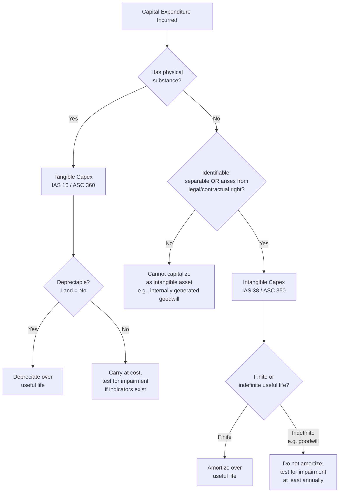

## Tangible versus Intangible Capital Expenditures

### Definition and Core Distinction

**Tangible capital expenditures** are outlays used to acquire, construct, or improve **physical assets** — items with physical substance that can be seen and touched (land, buildings, machinery, vehicles, equipment). They are governed primarily by **IAS 16 (Property, Plant and Equipment)** under IFRS and **ASC 360** under US GAAP.

**Intangible capital expenditures** are outlays used to acquire or internally develop **non-physical assets** that lack physical substance but provide identifiable future economic benefit (patents, trademarks, software, licenses, goodwill, capitalized development costs). They are governed primarily by **IAS 38 (Intangible Assets)** under IFRS and **ASC 350** under US GAAP.

| Dimension | Tangible Capex | Intangible Capex |
| --- | --- | --- |
| Physical form | Has physical substance | No physical substance |
| Governing standard (IFRS) | IAS 16 | IAS 38 |
| Governing standard (US GAAP) | ASC 360 | ASC 350 |
| Value expiration method | Depreciation | Amortization |
| Residual/salvage value | Commonly estimated and nonzero | Commonly assumed zero unless active market exists |
| Physical verification (audit) | Physical inspection/count possible | Verified via contracts, registrations, documentation only |
| Impairment testing frequency | When indicators of impairment exist | Annually for indefinite-life intangibles (e.g., goodwill); otherwise when indicators exist |
| Market for resale | Often exists (secondary equipment markets) | Often thin or nonexistent |

### Recognition Criteria — Shared Foundation

Both categories share the same baseline recognition tests before capitalization: probable future economic benefit, reliable cost measurement, and control by the entity. Intangible assets carry one **additional** test not required for tangible assets:

**[Confirmed]** Under IAS 38, an intangible asset must also be **identifiable** — meaning it is either:

- **Separable** (capable of being separated/divided from the entity and sold, transferred, licensed, rented, or exchanged), or
- Arises from **contractual or other legal rights**, regardless of whether those rights are transferable or separable.

This identifiability test is why internally generated goodwill can never be capitalized — it is not separable and does not arise from legal/contractual rights, even though it clearly contributes to future economic benefit.

### Tangible Capex — Common Categories

| Category | Examples |
| --- | --- |
| Land | Purchase of land for facilities (non-depreciable) |
| Buildings/structures | Offices, factories, warehouses |
| Machinery and equipment | Production lines, industrial equipment |
| Vehicles | Company fleet, delivery trucks |
| IT hardware | Servers, networking equipment, data center infrastructure |
| Leasehold improvements | Renovations to leased premises |
| Furniture and fixtures | Desks, shelving, built-in fittings |

**[Confirmed]** Land is a notable exception within tangible Capex: it is capitalized but **not depreciated**, since it is generally considered to have an indefinite useful life (unless subject to depletion, e.g., quarries, mines — which use depletion accounting instead).

### Intangible Capex — Common Categories

| Category | Examples | Typical Amortization Treatment |
| --- | --- | --- |
| Purchased software licenses (perpetual) | ERP systems, specialized enterprise software | Amortized over useful/license life |
| Internally developed software | Application development stage costs (per ASC 350-40) | Amortized over estimated useful life once placed in service |
| Patents | Registered patent rights | Amortized over legal life or useful life, whichever is shorter |
| Trademarks | Registered trademarks with finite renewal | Amortized if finite-life; not amortized if indefinite-life (tested for impairment instead) |
| Customer relationships / customer lists (acquired) | Recognized in business combinations | Amortized over estimated relationship life |
| Licenses and franchises | Broadcasting licenses, franchise agreements | Amortized over license term |
| Capitalized development costs | Product/technology development meeting IAS 38 criteria | Amortized over useful life of resulting product/technology |
| Goodwill (acquired only) | Arising from business combinations | Not amortized under current US GAAP/IFRS; tested annually for impairment |

**[Confirmed]** Internally generated brands, mastheads, publishing titles, customer lists, and similar items are **explicitly prohibited from capitalization** under IAS 38, because they cannot be distinguished from the cost of developing the business as a whole — this is a specific, named exclusion in the standard, not a general judgment call.

### Depreciation vs. Amortization Mechanics

Both processes systematically allocate capitalized cost over the useful life, but differ in nuance:

$$\text{Depreciation Expense (Straight-Line)} = \frac{\text{Cost} - \text{Residual Value}}{\text{Useful Life}}$$

$$\text{Amortization Expense (Straight-Line)} = \frac{\text{Cost}}{\text{Useful Life}} \quad \text{(residual value typically assumed \$0)}$$

**Key mechanical differences:**

- **[Confirmed]** Tangible assets frequently use accelerated depreciation methods (declining balance, units-of-production) to match wear patterns; intangible assets predominantly use straight-line amortization unless a pattern of consumption of economic benefit can be reliably determined otherwise.
- **[Confirmed]** Intangible assets are split into **finite-life** (amortized) and **indefinite-life** (not amortized, tested annually for impairment) categories — a distinction with no direct tangible-asset equivalent, since essentially all tangible assets (except land) have finite useful lives.

### Impairment Testing Divergence

**[Confirmed]** Impairment testing frequency differs meaningfully between the two categories:

- **Tangible assets**: Tested for impairment only **when indicators of impairment exist** (e.g., physical damage, obsolescence, adverse market conditions, decline in usage).
- **Indefinite-life intangibles and goodwill**: Tested for impairment **at least annually**, regardless of whether indicators exist, plus whenever indicators arise.
- **Finite-life intangibles**: Tested for impairment when indicators exist, similar to tangible assets.

**[Inference]** This more rigorous mandatory annual testing for indefinite-life intangibles reflects standard-setters' concern that intangible value is inherently harder to verify objectively than tangible physical condition, creating higher risk of overstated carrying values absent forced periodic re-evaluation.

### Valuation and Measurement Challenges

**Tangible assets:**

- **[Confirmed]** Generally measured reliably via observable transaction prices, market comparables for similar equipment, or replacement cost approaches.
- **[Confirmed]** Many jurisdictions/standards (notably IFRS) permit a **revaluation model** as an alternative to historical cost for tangible PP&E, allowing upward or downward restatement to fair value with subsequent depreciation based on the revalued amount.

**Intangible assets:**

- **[Inference]** Valuation is inherently more judgment-intensive due to the absence of active resale markets for most categories (patents, customer relationships, internally developed technology), commonly relying on income-approach valuation techniques (e.g., relief-from-royalty method, multi-period excess earnings method) rather than direct market comparables.
- **[Confirmed]** Under IFRS, the revaluation model is available for intangible assets only if an **active market** exists to establish fair value — a condition rarely met in practice, making cost-model measurement the dominant approach for intangibles.

### Cash Flow Statement and Capital Budgeting Implications

Both tangible and intangible Capex appear in the **Investing Activities** section of the cash flow statement, but capital budgeting practice often treats them differently:

- **[Inference]** Tangible Capex decisions (e.g., a new production line) are frequently evaluated using traditional NPV/IRR/payback frameworks with clearer replacement-cost benchmarks and depreciation schedules based on physical wear studies or industry standards.
- **[Inference]** Intangible Capex decisions (e.g., a multi-year software platform build) often carry higher estimation uncertainty around both the capitalizable cost boundary (per the development-phase test) and the resulting asset's useful life, since technology obsolescence timelines are less standardized than physical equipment wear curves.

### Composition Shift in Modern Capital Intensity Analysis

**[Confirmed]** A structural trend across many economies, particularly technology-driven sectors, has been a rising share of intangible Capex relative to tangible Capex in total corporate investment — driven by growth in software, R&D, data, brand, and platform-based business models relative to traditional physical-asset-heavy industries.

**[Inference]** This shift has implications for capital intensity analysis: metrics like $\text{Capex}/\text{Revenue}$ or asset turnover computed using only balance-sheet-recognized tangible assets can understate true capital intensity in intangible-heavy businesses, particularly where R&D is expensed rather than capitalized (as is common for expensed research-phase costs under both IFRS and US GAAP), since substantial "invisible Capex" never appears on the balance sheet at all.

### Decision Flow (Mermaid)

### Tangible vs Intangible Capex Comparison (svg_diagram)

<svg xmlns="http://www.w3.org/2000/svg" viewBox="0 0 760 340">
<text x="380" y="26" font-size="17" font-weight="bold" text-anchor="middle" fill="#1a1a1a">Tangible vs Intangible Capex Lifecycle (svg_diagram)</text>
<rect x="40" y="60" width="320" height="250" rx="10" fill="#eef3fb" stroke="#3b5998" stroke-width="1.5" />
<text x="200" y="90" font-size="14" font-weight="bold" text-anchor="middle" fill="#1a1a1a">TANGIBLE</text>
<text x="200" y="115" font-size="11" text-anchor="middle" fill="#333">Physical substance</text>
<line x1="70" y1="130" x2="330" y2="130" stroke="#3b5998" stroke-width="1" />
<text x="200" y="155" font-size="11" text-anchor="middle" fill="#333">Acquire / Construct</text>
<text x="200" y="180" font-size="11" text-anchor="middle" fill="#333">Capitalize at cost</text>
<text x="200" y="205" font-size="11" text-anchor="middle" fill="#333">Depreciate over useful life</text>
<text x="200" y="230" font-size="11" text-anchor="middle" fill="#333">(land excluded)</text>
<text x="200" y="255" font-size="11" text-anchor="middle" fill="#333">Impair when indicators exist</text>
<text x="200" y="280" font-size="11" text-anchor="middle" fill="#333">IAS 16 / ASC 360</text>
<rect x="400" y="60" width="320" height="250" rx="10" fill="#f6eefb" stroke="#7a3b98" stroke-width="1.5" />
<text x="560" y="90" font-size="14" font-weight="bold" text-anchor="middle" fill="#1a1a1a">INTANGIBLE</text>
<text x="560" y="115" font-size="11" text-anchor="middle" fill="#333">No physical substance</text>
<line x1="430" y1="130" x2="690" y2="130" stroke="#7a3b98" stroke-width="1" />
<text x="560" y="155" font-size="11" text-anchor="middle" fill="#333">Acquire / Develop</text>
<text x="560" y="180" font-size="11" text-anchor="middle" fill="#333">Must pass identifiability test</text>
<text x="560" y="205" font-size="11" text-anchor="middle" fill="#333">Amortize if finite life</text>
<text x="560" y="230" font-size="11" text-anchor="middle" fill="#333">Impair annually if indefinite</text>
<text x="560" y="255" font-size="11" text-anchor="middle" fill="#333">(e.g., goodwill)</text>
<text x="560" y="280" font-size="11" text-anchor="middle" fill="#333">IAS 38 / ASC 350</text>
</svg>

**Related Topics**

- Goodwill recognition and annual impairment testing (ASC 350 / IAS 36)
- Internally developed software capitalization stages (ASC 350-40)
- Business combination purchase price allocation and intangible asset identification
- IFRS revaluation model application to tangible vs. intangible assets
- Depletion accounting for natural resource assets
- R&D expensing vs. capitalization boundary under IAS 38
- Rising intangible investment share and its effect on capital intensity metrics