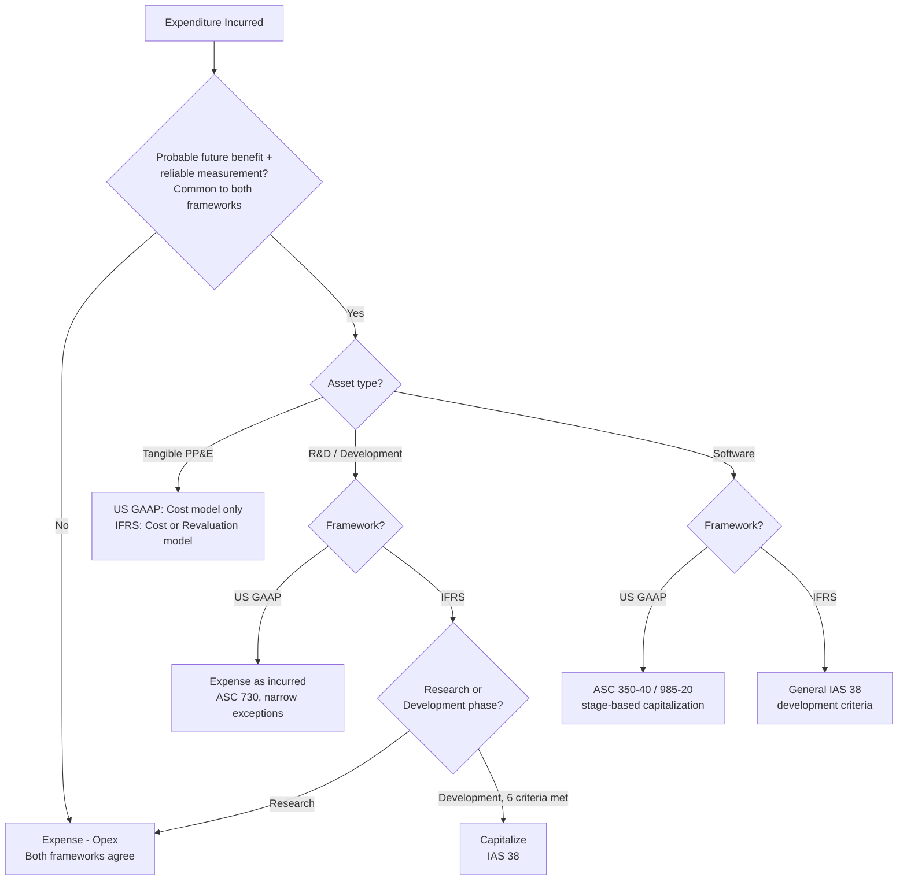

## Capex Recognition Under GAAP and IFRS

### Overview of the Two Frameworks

**US GAAP (Generally Accepted Accounting Principles)**, codified in the FASB Accounting Standards Codification (ASC), and **IFRS (International Financial Reporting Standards)**, issued by the IASB, are the two dominant global accounting frameworks governing capital expenditure recognition. While both frameworks share the same conceptual foundation — probable future economic benefit, reliable measurement, and control — they diverge in several specific mechanical and policy areas that materially affect how and when Capex is recognized, measured, and subsequently accounted for.

| Framework | Governing Body | Key Capex Standards |
| --- | --- | --- |
| US GAAP | FASB (Financial Accounting Standards Board) | ASC 360 (PP&E), ASC 350 (Intangibles), ASC 350-40 (Internal-use software), ASC 842 (Leases) |
| IFRS | IASB (International Accounting Standards Board) | IAS 16 (PP&E), IAS 38 (Intangible Assets), IFRS 16 (Leases) |

### Shared Recognition Criteria (Convergence Point)

**[Confirmed]** Both frameworks apply substantively the same baseline recognition test for capitalizing an asset:

1. It is probable that future economic benefits will flow to the entity.
2. The cost can be measured reliably.

**[Inference]** This convergence exists because IFRS and US GAAP underwent a formal convergence effort (the FASB–IASB Memorandum of Understanding, active roughly 2002–2014) that specifically targeted alignment of core recognition concepts, even though full convergence was never completed and several areas were deliberately left divergent or only partially aligned.

### Key Divergence 1 — Revaluation Model for PP&E

**[Confirmed]** This is one of the most significant and well-documented differences between the two frameworks:

- **IFRS (IAS 16)**: Permits a choice between the **cost model** (historical cost less accumulated depreciation/impairment) and the **revaluation model** (carrying amount at fair value at revaluation date, less subsequent depreciation/impairment), applied on a class-of-asset basis. If the revaluation model is elected, it must be applied consistently and kept up to date with sufficient regularity.
- **US GAAP**: Permits **only the cost model**. Upward revaluation of PP&E above historical cost is not permitted under any circumstance.

**[Inference]** This divergence means that two economically identical companies — one reporting under IFRS with elected revaluation, one under US GAAP — could show materially different PP&E carrying values and equity, purely due to accounting policy framework rather than underlying economic reality, which is a frequently cited comparability limitation when analyzing capital intensity across companies reporting under different standards.

### Key Divergence 2 — Componentization Requirements

**[Confirmed]** IAS 16 explicitly **mandates** componentization: significant parts of an asset with materially different useful lives must be depreciated separately (the "component approach").

**[Confirmed]** US GAAP does **not explicitly mandate** componentization in the same prescriptive manner; while composite/group depreciation methods are permitted and component-level depreciation is not prohibited, it is applied far less consistently in practice than under IFRS, where it is a required baseline approach.

**[Inference]** This produces divergent depreciation expense patterns for the same physical asset (e.g., an aircraft or manufacturing plant) depending on which framework is applied, since IFRS componentization typically results in some components being depreciated faster (shorter individual useful lives) than a blended single-asset rate under US GAAP practice.

### Key Divergence 3 — Development Cost Capitalization (R&D)

This is arguably the single largest Capex-recognition divergence between the two frameworks:

- **IFRS (IAS 38)**: Requires a **mandatory bifurcation** between the research phase (always expensed) and the development phase (capitalized if all six specific criteria are met — technical feasibility, intent to complete, ability to use/sell, how it will generate benefits, resource availability, reliable cost measurement).
- **US GAAP (ASC 730)**: Generally requires **all R&D costs to be expensed as incurred**, with narrow, specifically defined exceptions (e.g., certain software development costs under ASC 985-20 or ASC 350-40, and R&D assets acquired in a business combination, which are capitalized).

**[Confirmed]** This means an identical development project — e.g., a pharmaceutical company's late-stage drug development, or a technology company's platform R&D — can be **capitalized under IFRS** (once the six development-phase criteria are met) while the **same costs are fully expensed under US GAAP**, absent a specific software-related exception.

$$\text{IFRS: } \text{Capex}_{\text{dev}} = \sum \text{Development costs meeting all 6 criteria}$$

$$\text{US GAAP: } \text{Capex}_{\text{dev}} \approx 0 \text{ (except narrow software/acquired-R\&D exceptions)}$$

**[Inference]** This divergence has substantial capital intensity analysis implications: an R&D-heavy company reporting under IFRS may show meaningfully higher reported Capex, PP&E/intangible asset balances, and lower current-period operating expense than an economically similar US GAAP filer, purely due to the accounting framework rather than differing investment behavior — a critical caveat when comparing Capex-to-Revenue ratios cross-border.

### Key Divergence 4 — Software Development Costs

Both frameworks carve out software from general R&D treatment, but via different mechanisms:

| Aspect | US GAAP | IFRS |
| --- | --- | --- |
| Internal-use software | ASC 350-40: capitalize costs incurred during the "application development stage" | IAS 38: apply general development-phase criteria (no software-specific standard) |
| Software to be sold/leased/marketed | ASC 985-20: capitalize costs after "technological feasibility" is established | IAS 38: apply general development-phase criteria |
| Cloud computing arrangement (SaaS) implementation costs | ASC 350-40 (as amended 2018): certain implementation costs capitalizable even though hosting fee itself is Opex | IFRS IC agenda decision (2021): similar conclusion reached via interpretation, but less codified as a standalone rule |

**[Confirmed]** US GAAP's software guidance is more prescriptive and rule-based (specific stage triggers like "technological feasibility"), whereas IFRS relies on the same general six-criteria development test used for all intangibles — no software-specific bright-line standard exists under IAS 38 itself.

### Key Divergence 5 — Borrowing Costs (Capitalized Interest)

**[Confirmed]** Both frameworks require capitalization of borrowing costs directly attributable to the acquisition, construction, or production of a **qualifying asset** (one that necessarily takes a substantial period to get ready for its intended use) — this is a point of substantive convergence (IAS 23 vs. ASC 835-20).

**[Unverified]** Detailed mechanical differences exist in areas such as the specific formula for calculating the capitalization rate on general borrowings and the treatment of income earned on temporarily invested borrowed funds, which should be confirmed against the current text of each standard for precise application.

### Key Divergence 6 — Government Grants Related to Assets

**[Confirmed]** Treatment of government grants received to fund capital assets differs:

- **IFRS (IAS 20)**: Permits either (a) presenting the grant as deferred income recognized systematically over the asset's useful life, or (b) deducting the grant from the asset's carrying amount (reducing the depreciable base).
- **US GAAP**: Has no single comprehensive standard for government grants to for-profit entities; practice varies, though grants are commonly recognized as a reduction of the related expense/asset cost or as other income, often by analogy to other guidance (e.g., ASC 958 principles or IAS 20 by analogy, in the absence of specific authoritative US GAAP guidance for for-profit entities).

**[Inference]** This is a notably underdeveloped area of US GAAP relative to IFRS, creating more diversity in practice for US filers receiving capital-asset-related government grants or subsidies.

### Key Divergence 7 — Impairment Reversal

**[Confirmed]** Once an asset's carrying value is written down for impairment:

- **IFRS (IAS 36)**: Permits **reversal** of an impairment loss (except for goodwill) in a later period if circumstances indicating the impairment have changed, up to the asset's depreciated historical cost had no impairment occurred.
- **US GAAP (ASC 360)**: **Prohibits reversal** of impairment losses for held-and-used long-lived assets once recognized — the write-down is permanent even if the asset's fair value subsequently recovers.

**[Inference]** This divergence means IFRS filers can show a partial "recovery" of previously impaired Capex value in subsequent periods, while US GAAP filers carry the impaired basis forward permanently regardless of later recovery — a meaningful difference when analyzing multi-year Capex/asset-base trend data.

### Convergence and Comparability Summary Table

| Recognition Area | US GAAP | IFRS | Convergence Status |
| --- | --- | --- | --- |
| Baseline recognition criteria | Probable benefit + reliable measurement | Probable benefit + reliable measurement | Converged |
| Measurement model (PP&E) | Cost model only | Cost or revaluation model | Diverged |
| Componentization | Permitted, not mandated | Mandated | Diverged |
| R&D capitalization | Expensed (narrow exceptions) | Bifurcated research/development | Materially diverged |
| Internal-use software | Specific stage-based rules (ASC 350-40) | General development criteria applied | Diverged in mechanics |
| Borrowing cost capitalization | Required for qualifying assets | Required for qualifying assets | Substantively converged |
| Government grants (capital assets) | No comprehensive standard | IAS 20 comprehensive guidance | Diverged (gap in US GAAP) |
| Impairment reversal | Prohibited | Permitted (except goodwill) | Diverged |

### Practical Implication for Cross-Framework Capex Analysis

**[Inference]** Analysts and preparers comparing Capex or capital intensity metrics across companies reporting under different frameworks should specifically adjust for or flag: (1) whether R&D/development costs are capitalized (IFRS) or expensed (US GAAP), since this alone can shift both the Capex figure and reported EBIT substantially; (2) whether PP&E is carried at revalued amounts (IFRS option) versus strict historical cost (US GAAP); and (3) differing componentization practice affecting depreciation expense trajectories. Failure to normalize for these differences can lead to materially misleading cross-border Capex or capital-intensity benchmarking.

### Recognition Comparison Flow (Mermaid)

### GAAP vs IFRS Divergence Map (svg_diagram)

<svg viewBox="0 0 760 300" xmlns="http://www.w3.org/2000/svg">
<text x="380" y="26" font-size="17" font-weight="bold" text-anchor="middle" fill="#1a1a1a">Capex Recognition: GAAP vs IFRS Divergence (svg_diagram)</text>
<rect x="40" y="55" width="320" height="220" rx="10" fill="#eef3fb" stroke="#3b5998" stroke-width="1.5"/>
<text x="200" y="80" font-size="14" font-weight="bold" text-anchor="middle" fill="#1a1a1a">US GAAP</text>
<text x="200" y="105" font-size="11" text-anchor="middle" fill="#333">Cost model only (PP&E)</text>
<text x="200" y="128" font-size="11" text-anchor="middle" fill="#333">R&amp;D expensed (ASC 730)</text>
<text x="200" y="151" font-size="11" text-anchor="middle" fill="#333">Componentization: optional</text>
<text x="200" y="174" font-size="11" text-anchor="middle" fill="#333">Impairment reversal: prohibited</text>
<text x="200" y="197" font-size="11" text-anchor="middle" fill="#333">Software: rule-based stages</text>
<text x="200" y="220" font-size="11" text-anchor="middle" fill="#333">Gov't grants: no comprehensive std</text>
<rect x="400" y="55" width="320" height="220" rx="10" fill="#f6eefb" stroke="#7a3b98" stroke-width="1.5"/>
<text x="560" y="80" font-size="14" font-weight="bold" text-anchor="middle" fill="#1a1a1a">IFRS</text>
<text x="560" y="105" font-size="11" text-anchor="middle" fill="#333">Cost OR revaluation model</text>
<text x="560" y="128" font-size="11" text-anchor="middle" fill="#333">Development phase capitalized</text>
<text x="560" y="151" font-size="11" text-anchor="middle" fill="#333">Componentization: mandated</text>
<text x="560" y="174" font-size="11" text-anchor="middle" fill="#333">Impairment reversal: permitted</text>
<text x="560" y="197" font-size="11" text-anchor="middle" fill="#333">Software: general criteria (IAS 38)</text>
<text x="560" y="220" font-size="11" text-anchor="middle" fill="#333">Gov't grants: IAS 20 comprehensive</text>
<line x1="360" y1="165" x2="400" y2="165" stroke="#888" stroke-width="2" stroke-dasharray="4,3"/>
</svg>

**Related Topics**

- IFRS–US GAAP convergence project history and remaining reconciliation items
- Capitalized interest / borrowing cost calculation mechanics (IAS 23 vs. ASC 835-20)
- Cross-border capital intensity ratio normalization techniques
- Impairment testing methodology differences (IAS 36 vs. ASC 360/350)
- SEC Form 20-F reconciliation requirements for foreign private issuers
- IAS 38 development-phase criteria applied to pharmaceutical R&D
- Government grant accounting for capital assets (IAS 20 mechanics)