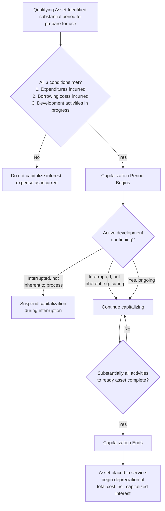

## Capitalized Interest and Borrowing Costs

### Definition

**Capitalized interest** (also called **capitalized borrowing costs**) refers to interest expense that, instead of being recognized immediately in the income statement, is added to the cost basis of a **qualifying asset** during its construction or development period. This treatment reflects the principle that interest incurred to finance the creation of an asset is part of the cost necessary to bring that asset to its intended condition and location for use — analogous to including installation or freight costs in an asset's capitalized basis.

The governing standards are **IAS 23 (Borrowing Costs)** under IFRS and **ASC 835-20 (Capitalization of Interest)** under US GAAP.

### The Qualifying Asset Concept

**[Confirmed]** Interest capitalization only applies to a **qualifying asset** — defined (under both frameworks, in substantively similar terms) as an asset that **necessarily takes a substantial period of time to get ready for its intended use or sale**.

**Examples of qualifying assets:**

| Qualifying (interest capitalizable) | Not Qualifying (interest expensed) |
| --- | --- |
| Buildings under construction | Assets ready for use when acquired |
| Manufacturing plants during build-out | Inventory routinely manufactured in large quantities on a repetitive basis |
| Power generation facilities | Assets measured at fair value (e.g., biological assets, some investment property) |
| Ships or aircraft under long-term construction | Assets already in use/production |
| Internally developed software during application development stage | Land held for undetermined future use (not actively being developed) |
| Real estate development projects | Financial assets |

**[Confirmed]** Assets that are already ready for their intended use at acquisition, or that are routinely produced in large quantities on a repetitive basis over a short period (e.g., standard inventory), are specifically excluded from qualifying asset treatment even if some incidental time passes before use.

### Three Conditions for Capitalization to Begin

**[Confirmed]** Under both IAS 23 and ASC 835-20, capitalization of borrowing costs begins only when **all three** of the following conditions are met simultaneously:

1. **Expenditures for the asset are being incurred** (i.e., cash has actually been spent or a liability incurred on the asset).
2. **Borrowing costs are being incurred** (i.e., the entity has drawn debt financing, or has other borrowings outstanding, associated with financing the asset).
3. **Activities necessary to prepare the asset for its intended use are in progress** — this includes not only physical construction but also administrative and technical work prior to construction (e.g., obtaining permits), but excludes periods of pure asset holding with no development activity.

$$\text{Capitalization Period Begins} = \max(\text{Expenditure Start}, \text{Borrowing Start}, \text{Activity Start})$$

**[Confirmed]** Capitalization **ceases** when substantially all the activities necessary to prepare the qualifying asset for its intended use or sale are complete — even if minor finishing work remains (e.g., minor decorating touches on a building that is otherwise substantially complete and usable).

**[Confirmed]** Capitalization is also **suspended** during extended periods in which active development is interrupted, unless the interruption is a necessary part of the process (e.g., a required curing period for concrete, or normal delays inherent to the asset's development, are not treated as suspension-triggering interruptions).

### Determining the Capitalization Rate

Two scenarios exist depending on whether borrowings are **specific** to the asset or **general** corporate borrowings:

**Scenario 1 — Specific Borrowings:**

**[Confirmed]** When funds are borrowed specifically for the purpose of obtaining a qualifying asset, the capitalizable borrowing cost for a period is the **actual interest incurred on that specific borrowing**, reduced by any investment income earned on the temporary investment of those borrowed funds before they are spent on the asset.

$$\text{Capitalized Interest (specific)} = \text{Interest on Specific Debt} - \text{Investment Income on Unspent Proceeds}$$

**Scenario 2 — General Borrowings (Weighted Average Method):**

**[Confirmed]** When general corporate borrowings (not raised specifically for the asset) fund the qualifying asset expenditures, a **weighted-average capitalization rate** is applied to the weighted-average accumulated expenditures on the asset during the period, applied to the general borrowings outstanding during the period.

$$\text{Weighted-Average Interest Rate} = \frac{\sum (\text{Interest Expense on General Borrowings})}{\sum (\text{Principal of General Borrowings Outstanding})}$$

$$\text{Capitalized Interest} = \text{Weighted-Average Accumulated Expenditures} \times \text{Weighted-Average Interest Rate}$$

**[Confirmed]** A key constraint applies under both frameworks: the amount of borrowing costs capitalized during a period **cannot exceed** the total actual borrowing costs incurred by the entity during that period.

### Worked Example — Weighted-Average Method

Assume a company is constructing a facility with the following expenditures, funded from general borrowings:

| Date | Expenditure | Months Outstanding (to year-end) | Weighted Expenditure |
| --- | --- | --- | --- |
| Jan 1 | $1,200,000 | 12 | $1,200,000 |
| Apr 1 | $600,000 | 9 | $450,000 |
| Oct 1 | $300,000 | 3 | $75,000 |
| **Total** | **$2,100,000** |  | **$1,725,000** |

Assume the company's general borrowings carry a weighted-average interest rate of **6%**.

$$\text{Capitalized Interest} = \$1{,}725{,}000 \times 6\% = \$103{,}500$$

**Example — Journal Entry Effect:**

- Debit: Building (Asset) — $103,500
- Credit: Interest Expense — $103,500

**[Inference]** This entry has a dual effect: it increases the capitalized cost basis of the building (which will subsequently be depreciated over the building's useful life) while simultaneously reducing current-period interest expense on the income statement — meaning capitalized interest defers, rather than eliminates, the interest cost's impact on net income.

### Rationale for Capitalization

**[Confirmed]** The conceptual justification (per both standards) is the **matching principle**: interest cost incurred during construction is considered a necessary cost of preparing the asset for use, no different in principle from labor, materials, or installation costs. Expensing it immediately would mismatch the cost against the period in which the asset actually generates revenue (i.e., after construction is complete and the asset is placed in service).

### Effect on Financial Statements

| Statement | Effect of Capitalizing Interest (vs. expensing) |
| --- | --- |
| Income Statement | Lower interest expense in the construction period; higher depreciation expense in future periods (as the capitalized interest amortizes through depreciation) |
| Balance Sheet | Higher asset carrying value (PP&E) during and after construction |
| Cash Flow Statement | Cash paid for capitalized interest is typically classified within Investing Activities (as part of the asset's cost), while interest expensed as incurred is typically classified within Operating Activities — this reclassification is a specific point of attention in cash flow analysis |
| EBITDA | Not directly affected by the interest capitalization decision, since interest capitalized doesn't reduce EBIT via interest expense, but subsequent higher depreciation reduces EBIT/lower EBITDA-to-EBIT bridge in future periods |

**[Inference]** Because capitalized interest reduces reported interest expense during the construction phase and instead flows through the income statement more slowly via depreciation, analysts evaluating a company's true financing cost and current profitability should specifically identify capitalized interest amounts (typically disclosed in notes to financial statements) to normalize interest coverage ratios and true economic interest burden.

### Disclosure Requirements

**[Confirmed]** Both frameworks require disclosure of:

- The amount of borrowing costs capitalized during the period.
- The capitalization rate used to determine the amount of borrowing costs eligible for capitalization (when the weighted-average general borrowings method is used).

**[Inference]** These disclosures are typically found in the notes to the financial statements under "Property, Plant and Equipment" or a dedicated "Borrowing Costs" note, and are a key data point analysts extract to reconstruct a company's "true" total interest cost (capitalized + expensed) for interest coverage ratio analysis.

### GAAP vs IFRS Nuances

While the core mechanics are substantively converged, minor differences exist:

**[Unverified]** The precise treatment of foreign-currency-denominated borrowings' exchange differences (to the extent regarded as an adjustment to interest costs) and some technical aspects of the specific-versus-general borrowings interaction have historically had subtle differences in application guidance between IAS 23 and ASC 835-20; the current text of each standard should be consulted for precise cross-border comparative work.

**[Confirmed]** Both standards converge on the core requirement (mandatory capitalization for qualifying assets) — this is one of the more substantively harmonized areas between IFRS and US GAAP relative to other Capex recognition topics (e.g., R&D capitalization, which diverges much more significantly).

### Capitalization Period Timeline (Mermaid)

### Specific vs General Borrowings Decision (svg_diagram)

<svg xmlns="http://www.w3.org/2000/svg" viewBox="0 0 760 320">
<text x="380" y="26" font-size="17" font-weight="bold" text-anchor="middle" fill="#1a1a1a">Interest Capitalization Method Selection (svg_diagram)</text>
<rect x="300" y="50" width="160" height="50" rx="8" fill="#e8eef7" stroke="#3b5998" stroke-width="1.5" />
<text x="380" y="80" font-size="12" text-anchor="middle" fill="#1a1a1a">Qualifying Asset Funded</text>
<line x1="380" y1="100" x2="380" y2="130" stroke="#555" stroke-width="1.5" marker-end="url(#arrow2)" />
<rect x="260" y="130" width="240" height="55" rx="8" fill="#fff4e0" stroke="#c98a1c" stroke-width="1.5" />
<text x="380" y="153" font-size="12" text-anchor="middle" fill="#1a1a1a">Borrowed specifically</text>
<text x="380" y="170" font-size="12" text-anchor="middle" fill="#1a1a1a">for this asset?</text>
<line x1="300" y1="185" x2="150" y2="220" stroke="#555" stroke-width="1.5" marker-end="url(#arrow2)" />
<text x="200" y="205" font-size="11" fill="#333">Yes</text>
<line x1="460" y1="185" x2="610" y2="220" stroke="#555" stroke-width="1.5" marker-end="url(#arrow2)" />
<text x="560" y="205" font-size="11" fill="#333">No</text>
<rect x="50" y="220" width="200" height="80" rx="8" fill="#e3f5e6" stroke="#2f8f4e" stroke-width="1.5" />
<text x="150" y="245" font-size="12" font-weight="bold" text-anchor="middle" fill="#1a1a1a">Specific Borrowing Method</text>
<text x="150" y="265" font-size="10" text-anchor="middle" fill="#333">Actual interest incurred</text>
<text x="150" y="280" font-size="10" text-anchor="middle" fill="#333">minus investment income</text>
<text x="150" y="295" font-size="10" text-anchor="middle" fill="#333">on unspent proceeds</text>
<rect x="510" y="220" width="220" height="80" rx="8" fill="#f6eefb" stroke="#7a3b98" stroke-width="1.5" />
<text x="620" y="245" font-size="12" font-weight="bold" text-anchor="middle" fill="#1a1a1a">Weighted-Average Method</text>
<text x="620" y="265" font-size="10" text-anchor="middle" fill="#333">Weighted-avg expenditures ×</text>
<text x="620" y="280" font-size="10" text-anchor="middle" fill="#333">weighted-avg rate on</text>
<text x="620" y="295" font-size="10" text-anchor="middle" fill="#333">general borrowings</text>
</svg>

### Analytical Considerations for Capital Intensity Assessment

- **[Inference]** Companies undertaking large, long-duration Capex projects (e.g., utilities, real estate developers, infrastructure builders) tend to show more material capitalized interest balances; analysts assessing true capital intensity or debt-financed investment burden should examine the capitalized interest note explicitly rather than relying solely on the income statement's interest expense line.
- **[Inference]** A rising trend in capitalized interest as a percentage of total borrowing cost may indicate an expanding pipeline of qualifying long-duration capital projects, which can be a useful supplementary signal alongside headline Capex figures when assessing forward capital intensity trajectory.

**Related Topics**

- Qualifying asset identification edge cases (inventory vs. long-duration construction)
- Weighted-average accumulated expenditures calculation methodology
- Interest coverage ratio adjustments for capitalized interest
- IAS 23 vs. ASC 835-20 detailed textual comparison
- Depreciation of assets with capitalized interest components
- Debt-financed Capex and capital structure decisions
- Real estate and infrastructure project financing structures