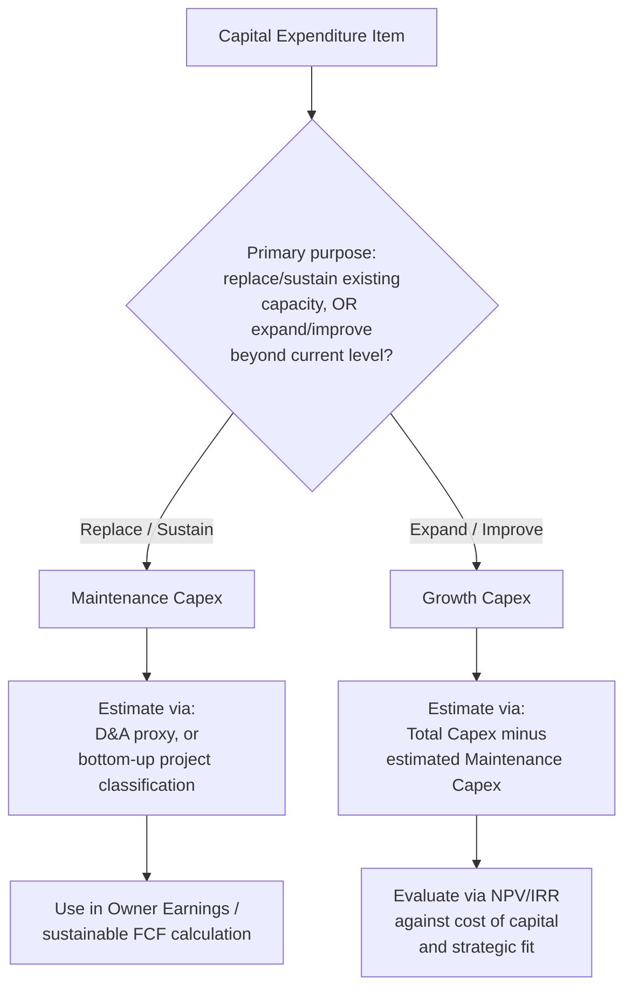

## Maintenance Capex versus Growth Capex

### Definition and Core Distinction

**Maintenance Capex** (also called **sustaining Capex** or **replacement Capex**) refers to capital expenditure required to **sustain existing operations at their current level** — replacing worn-out assets, performing major overhauls, and keeping existing capacity and productivity intact. It does not expand output, add new revenue streams, or improve the business's competitive position beyond restoring the status quo.

**Growth Capex** (also called **expansionary Capex** or **discretionary Capex**) refers to capital expenditure aimed at **expanding capacity, entering new markets, launching new products, or improving efficiency/competitive position** beyond current operating levels. It is discretionary in the sense that management chooses to make it in pursuit of future growth, rather than being forced by asset wear-out.

**[Confirmed]** This distinction is a **managerial and analytical construct**, not a formal accounting classification — no accounting standard (IFRS or US GAAP) requires or defines this split on the face of financial statements. It is primarily used in financial analysis, corporate finance, valuation, and internal capital budgeting rather than statutory reporting.

| Dimension | Maintenance Capex | Growth Capex |
| --- | --- | --- |
| Purpose | Sustain existing capacity/output | Expand capacity/output or capability |
| Discretion level | Largely non-discretionary (asset wear-out driven) | Discretionary (strategic choice) |
| Typical trigger | Asset end-of-life, regulatory requirement, breakdown risk | Market opportunity, demand growth, new product line |
| Impact on future revenue | Neutral (prevents decline, doesn't add) | Additive (intended to increase future revenue/earnings) |
| Disclosure requirement | Not formally required to be split out | Not formally required to be split out |
| Valuation treatment (DCF) | Always deducted from FCF projections | Often modeled separately, tied to growth assumptions |

### Why the Distinction Matters

**[Confirmed]** The maintenance/growth split matters primarily for three analytical purposes:

1. **Free cash flow quality assessment** — a company generating strong reported FCF that is nonetheless underinvesting in maintenance Capex may be borrowing against future asset productivity (deferred maintenance), making current FCF unsustainable.
2. **Growth investment evaluation** — separating growth Capex allows analysts and management to assess return on incremental invested capital specifically tied to expansion decisions, rather than blending it with unavoidable replacement spending.
3. **Valuation modeling (DCF)** — in discounted cash flow models, maintenance Capex is typically treated as a near-certain, non-discretionary cash outflow (often modeled as roughly equal to depreciation in steady-state / terminal value assumptions), while growth Capex is modeled explicitly tied to projected growth rates and expected returns.

$$\text{Total Capex} = \text{Maintenance Capex} + \text{Growth Capex}$$

$$\text{Owner Earnings (Buffett-style)} \approx \text{Net Income} + D\&A - \text{Maintenance Capex}$$

**[Inference]** The "owner earnings" concept, popularized by Warren Buffett, explicitly relies on isolating maintenance Capex (rather than total Capex) as the true recurring cash cost of sustaining the business, treating growth Capex as an optional, return-generating investment decision rather than a cost of doing business.

### Estimation Methodologies (The Core Practical Challenge)

**[Confirmed]** Unlike total Capex (a directly observable cash flow statement line item), the maintenance/growth split is **not directly disclosed** in most companies' financial statements, forcing analysts to estimate it using proxy methodologies. No single method is universally accepted as definitively accurate.

**Method 1 — Depreciation Proxy (Simplest, Most Common)**

$$\text{Maintenance Capex} \approx \text{Depreciation \& Amortization Expense}$$

**[Inference]** This method assumes that, in a mature, steady-state business, spending roughly equal to the depreciation charge is required to replace assets as they wear out at the same rate they are being depreciated. This is a widely used approximation but has known limitations: it breaks down for companies with rapidly inflating replacement costs, changing asset mix, or significant technological change.

**Method 2 — Old-PP&E-to-Sales Ratio Method (Bruce Greenwald Method)**

**[Inference]** This method, associated with analyst Bruce Greenwald, estimates maintenance Capex by:

1. Calculating the historical ratio of gross PP&E to sales in a base (stable) year.
2. Applying that ratio to the current year's incremental sales growth to estimate the growth-Capex-attributable portion.
3. Treating the remainder of total Capex as maintenance Capex.

$$\text{Growth Capex} \approx \frac{\text{Gross PP\&E}_{\text{base year}}}{\text{Sales}_{\text{base year}}} \times (\text{Sales}_{t} - \text{Sales}_{t-1})$$

$$\text{Maintenance Capex} = \text{Total Capex} - \text{Growth Capex}$$

**[Inference]** This method is generally regarded as more analytically rigorous than the simple D&A proxy because it explicitly ties growth Capex to actual revenue growth, but it requires a stable "base year" free of major structural shifts to be reliable, and can produce distorted or negative results in periods of declining sales or major asset base changes.

**Method 3 — Management Disclosure / Guidance-Based**

**[Confirmed]** Some companies, particularly capital-intensive ones (telecoms, utilities, airlines, oil & gas), voluntarily disclose a maintenance/growth Capex split in earnings calls, investor presentations, or MD&A sections — though this is **not a required disclosure** under either IFRS or US GAAP, and the categorization is entirely at management's discretion, without independent audit verification of the split methodology itself.

**[Inference]** When available, management's own disclosed split is often the most practically useful figure for analysts (since it reflects internal capital allocation intent), but it should be treated with appropriate skepticism given the lack of standardized definition and potential incentive to characterize spending favorably (e.g., framing more spending as "growth" to appear more strategically positioned, or as "maintenance" to justify spending as unavoidable).

**Method 4 — Asset-by-Asset Bottom-Up Classification**

**[Inference]** For internal corporate finance/FP&A purposes (rather than external analyst estimation), companies with detailed capital project tracking can classify each individual capital project or purchase order as maintenance or growth at the point of budget approval, based on the stated business purpose (replacement vs. expansion) — this bottom-up approach is more precise than top-down statistical proxies but requires internal project-level data unavailable to external analysts.

### Worked Example — Depreciation Proxy Method

| Line Item | Value |
| --- | --- |
| Total Capex (from Cash Flow Statement) | $50,000,000 |
| Depreciation & Amortization Expense | $32,000,000 |
| Estimated Maintenance Capex (≈ D&A) | $32,000,000 |
| Implied Growth Capex (Total − Maintenance) | $18,000,000 |
| Growth Capex as % of Total | 36% |

**[Inference]** In this simplified example, roughly a third of total Capex would be characterized as growth-oriented investment under the depreciation-proxy method, which an analyst might then further scrutinize for expected return on that incremental $18,000,000 relative to the company's cost of capital.

### Industry Variation in Maintenance/Growth Mix

| Industry | Typical Maintenance Capex Intensity | Notes |
| --- | --- | --- |
| Utilities | High | Regulated asset base, mandated infrastructure upkeep |
| Airlines | High | Fleet maintenance, regulatory airworthiness requirements |
| Telecom (mature markets) | High, with periodic growth spikes (network upgrades e.g., 5G rollout) | Network refresh cycles create lumpy growth Capex |
| Retail (mature) | Moderate-to-high (store refresh cycles) | New store openings represent growth Capex |
| Software/SaaS | Low overall Capex; maintenance largely limited to infrastructure/data centers | Most "growth investment" appears as opex (R&D, S&M) rather than Capex |
| Oil & Gas (upstream) | High, cyclical | Maintenance of existing wells vs. new field development (growth) |
| Early-stage / high-growth companies | Low maintenance (little existing asset base to sustain) | Nearly all Capex may be growth-oriented |

**[Inference]** This industry variation means that comparing raw total-Capex-to-revenue ratios across industries (or across companies at different lifecycle stages within the same industry) without accounting for the maintenance/growth mix can produce misleading capital intensity comparisons — a mature utility and a high-growth telecom entrant may show similar total Capex ratios for very different underlying reasons.

### Common Analytical Pitfalls

- **[Inference]** Using total Capex instead of maintenance Capex in FCF-based valuation models can understate a mature company's sustainable free cash flow during periods of active growth investment, since growth Capex is (in theory) value-accretive and shouldn't be treated as a permanent drag on steady-state cash generation.
- **[Inference]** Conversely, assuming all Capex is "growth" and excluding maintenance Capex from FCF projections overstates sustainable cash flow and can lead to overvaluation, since asset replacement needs don't disappear even during expansion phases.
- **[Confirmed]** Because no standardized definition exists, cross-company or cross-analyst comparisons of "maintenance Capex" figures should be treated cautiously unless the underlying estimation methodology is disclosed and consistent.

### Relationship to Capital Budgeting Decision Rules

**[Inference]** In practice, maintenance Capex decisions are often subject to lighter capital approval scrutiny (framed as "must-do" to avoid operational failure, with less rigorous NPV/IRR hurdle-rate testing), while growth Capex is typically subject to full capital budgeting evaluation (NPV, IRR, payback period, strategic fit assessment) since it represents a discretionary, return-seeking investment choice competing against alternative uses of capital.

### Classification Decision Flow (Mermaid)

### Maintenance vs Growth Capex Split (svg_diagram)

<svg xmlns="http://www.w3.org/2000/svg" viewBox="0 0 760 320">
<text x="380" y="26" font-size="17" font-weight="bold" text-anchor="middle" fill="#1a1a1a">Total Capex Decomposition (svg_diagram)</text>
<rect x="280" y="50" width="200" height="45" rx="6" fill="#e8eef7" stroke="#3b5998" stroke-width="1.5" />
<text x="380" y="78" font-size="13" text-anchor="middle" fill="#1a1a1a">Total Capex</text>
<line x1="330" y1="95" x2="200" y2="140" stroke="#555" stroke-width="1.5" />
<line x1="430" y1="95" x2="560" y2="140" stroke="#555" stroke-width="1.5" />
<rect x="80" y="140" width="240" height="150" rx="8" fill="#e3f5e6" stroke="#2f8f4e" stroke-width="1.5" />
<text x="200" y="168" font-size="13" font-weight="bold" text-anchor="middle" fill="#1a1a1a">Maintenance Capex</text>
<text x="200" y="190" font-size="10" text-anchor="middle" fill="#333">Replace worn assets</text>
<text x="200" y="208" font-size="10" text-anchor="middle" fill="#333">Sustain current output</text>
<text x="200" y="226" font-size="10" text-anchor="middle" fill="#333">Non-discretionary</text>
<text x="200" y="244" font-size="10" text-anchor="middle" fill="#333">Proxy: ≈ D&amp;A expense</text>
<text x="200" y="266" font-size="10" text-anchor="middle" fill="#333">Used in Owner Earnings calc</text>
<rect x="440" y="140" width="240" height="150" rx="8" fill="#f6eefb" stroke="#7a3b98" stroke-width="1.5" />
<text x="560" y="168" font-size="13" font-weight="bold" text-anchor="middle" fill="#1a1a1a">Growth Capex</text>
<text x="560" y="190" font-size="10" text-anchor="middle" fill="#333">Expand capacity/markets</text>
<text x="560" y="208" font-size="10" text-anchor="middle" fill="#333">Increase future revenue</text>
<text x="560" y="226" font-size="10" text-anchor="middle" fill="#333">Discretionary, strategic</text>
<text x="560" y="244" font-size="10" text-anchor="middle" fill="#333">Evaluated via NPV/IRR</text>
<text x="560" y="266" font-size="10" text-anchor="middle" fill="#333">Tied to growth assumptions</text>
</svg>

**Related Topics**

- Owner earnings and Buffett-style sustainable free cash flow calculation
- Bruce Greenwald's old-PP&E-to-sales estimation methodology in depth
- Deferred maintenance risk and asset base deterioration analysis
- Capital budgeting hurdle rates and NPV/IRR evaluation for growth projects
- Industry-specific capital intensity benchmarking (utilities, telecom, airlines)
- Free cash flow quality assessment in equity valuation
- Terminal value assumptions and steady-state Capex-to-D&A ratios in DCF models