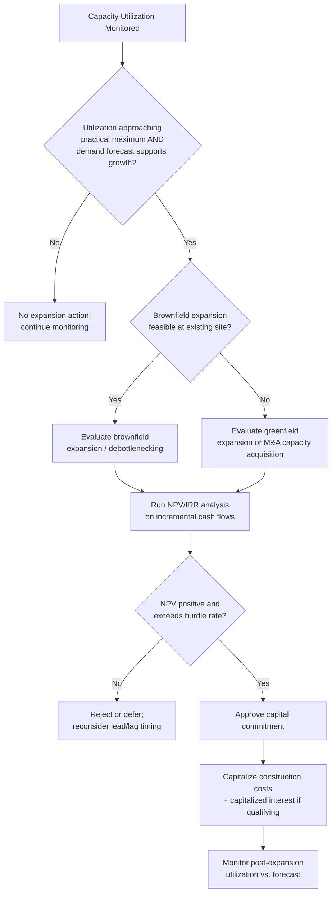

## Expansion Capex and Capacity Addition

### Definition

**Expansion Capex** refers to capital expenditure specifically directed at increasing an organization's productive **capacity** — the maximum volume of output, throughput, or service delivery it can sustain — beyond current levels. It is a subset of the broader "growth Capex" category, distinguished specifically by its focus on scaling existing capabilities (more of the same type of output) rather than diversification into wholly new products, markets, or business lines.

**[Confirmed]** This is an analytical/managerial classification rather than a formal accounting category — no accounting standard requires expansion Capex to be separately disclosed or labeled on financial statements.

| Related Term | Distinguishing Focus |
| --- | --- |
| Growth Capex (broad) | Any Capex intended to increase future revenue or competitive position |
| Expansion Capex (this topic) | Specifically increasing capacity/throughput of existing operations |
| Diversification Capex | New products, markets, or business lines outside current capacity scaling |
| Maintenance Capex | Sustaining current capacity, not increasing it |

### Forms of Capacity Addition

Expansion Capex typically takes one of several structural forms:

| Form | Description | Example |
| --- | --- | --- |
| Brownfield expansion | Adding capacity to an existing facility/site | New production line at an existing factory |
| Greenfield expansion | Building an entirely new facility/site | New plant in a new geographic location |
| Debottlenecking | Removing a specific constraint limiting output of an otherwise underutilized asset base | Upgrading a single bottleneck machine to raise overall line throughput |
| Capacity acquisition (M&A route) | Acquiring existing capacity from another entity rather than building it | Purchasing a competitor's plant |
| Network/infrastructure densification | Adding nodes/capacity within an existing network | New cell towers, additional data center racks |

**[Inference]** Brownfield expansion is generally lower-risk and lower-cost per unit of capacity added than greenfield expansion, since it leverages existing site infrastructure, permits, utility connections, and workforce, whereas greenfield projects carry full site development risk (permitting delays, new infrastructure buildout, community/regulatory engagement) but may be necessary when existing sites are physically or geographically capacity-constrained.

### Capacity Planning Framework

**Capacity utilization** is the standard metric used to determine whether and when expansion Capex is warranted:

$$\text{Capacity Utilization} = \frac{\text{Actual Output}}{\text{Maximum Practical Capacity}} \times 100\%$$

**[Inference]** Organizations commonly use utilization thresholds (often informally in the 80–85%+ range, though this varies significantly by industry and asset type) as a trigger point to initiate capacity expansion planning, since operating too close to theoretical maximum capacity typically degrades efficiency, increases unplanned downtime risk, and limits ability to absorb demand volatility or urgent orders.

**Key capacity planning inputs:**

1. **Demand forecast** — projected future demand growth driving the capacity need
2. **Lead time for capacity addition** — the time between capital commitment and the new capacity becoming operational (critical since expansion decisions must be made well ahead of the demand materializing)
3. **Economies of scale** — whether adding capacity in larger increments reduces cost per unit of capacity
4. **Modularity/granularity** — whether capacity can be added in small increments (flexible, lower risk) or only in large discrete jumps (lumpy, higher risk of over/under-building)

$$\text{Lead-Time-Adjusted Trigger Point: Initiate expansion when } \quad t_{\text{demand exceeds capacity}} - t_{\text{lead time}} \leq t_{\text{now}}$$

### Capacity Expansion Strategy Types

**[Confirmed]** Corporate finance and operations literature commonly identify distinct strategic postures toward the timing of capacity additions relative to demand growth:

| Strategy | Description | Risk Profile |
| --- | --- | --- |
| Lead strategy | Add capacity ahead of anticipated demand | Higher risk of underutilized capacity if demand forecast is wrong, but captures market share and avoids stockouts |
| Lag strategy | Add capacity after demand has already materialized and been sustained | Lower risk of overbuilding, but risks lost sales/market share during the capacity gap |
| Match strategy | Add capacity in smaller increments closely tracking realized demand | Balances risk but requires modular/flexible capacity options and closer monitoring |

**[Inference]** The choice among these strategies is heavily influenced by the lumpiness of available capacity increments (a strategy of small incremental matching is only feasible if capacity truly can be added in small units) and the competitive dynamics of the industry (a lead strategy is more common in industries where being capacity-constrained risks permanent customer loss to a competitor).

### Financial Evaluation of Expansion Capex

Because expansion Capex is discretionary and return-seeking, it is typically subjected to full capital budgeting analysis:

$$NPV = \sum_{t=0}^{n} \frac{CF_t}{(1+r)^t} - \text{Initial Investment}$$

$$IRR: \quad 0 = \sum_{t=0}^{n} \frac{CF_t}{(1+IRR)^t} - \text{Initial Investment}$$

**Key evaluation considerations specific to expansion Capex:**

- **[Inference]** Incremental cash flows should reflect only the *additional* revenue/cost attributable to the new capacity, not total facility economics — avoiding the common analytical error of allocating existing fixed overhead to the expansion decision when that overhead would be incurred regardless.
- **[Inference]** Demand risk is a first-order consideration unique to expansion Capex (as distinct from maintenance Capex, where the "demand" for the asset's output is already proven by current operations) — sensitivity analysis on demand forecast assumptions is typically a core part of expansion Capex evaluation.
- **[Confirmed]** Real options theory is frequently applied to phased expansion decisions, valuing the option to expand further (or abandon/delay) based on how initial demand materializes, rather than treating the full expansion as a single all-or-nothing commitment.

### Capacity Addition and Operating Leverage

**[Confirmed]** Expansion Capex typically increases an organization's **fixed cost base** (depreciation on new assets, potentially additional fixed labor/overhead), which raises **operating leverage** — the sensitivity of operating income to changes in revenue.

$$\text{Degree of Operating Leverage (DOL)} = \frac{\% \Delta \text{EBIT}}{\% \Delta \text{Revenue}}$$

**[Inference]** This means expansion Capex decisions carry a structural trade-off: successful capacity utilization post-expansion amplifies profitability upside (operating leverage working favorably), but failure to fill the new capacity with demand amplifies profitability downside — fixed depreciation and overhead costs continue regardless of utilization, which is why demand forecast accuracy is disproportionately important for expansion Capex relative to maintenance Capex.

### Underutilization and Overcapacity Risk

**[Inference]** The central risk in expansion Capex decisions is a mismatch between actual and forecasted demand growth, manifesting as either:

- **Overcapacity** — capacity added exceeds realized demand, resulting in low utilization, excess depreciation burden relative to revenue generated, and potential impairment risk if the shortfall is severe or expected to persist.
- **Capacity shortfall** — demand growth outpaces the expansion pace, resulting in lost sales, customer attrition to competitors, and pressure for further (potentially rushed, less optimally planned) expansion.

**Example — Capacity Utilization Impact on Unit Economics:**

| Scenario | Capacity | Actual Output | Utilization | Fixed Cost per Unit (illustrative, $500,000 fixed cost) |
| --- | --- | --- | --- | --- |
| Pre-expansion | 100,000 units | 92,000 units | 92% | $5.43 |
| Post-expansion (demand as forecast) | 150,000 units | 135,000 units | 90% | $3.70 |
| Post-expansion (demand shortfall) | 150,000 units | 100,000 units | 67% | $5.00 |

**[Inference]** This example illustrates why expansion Capex decisions require careful demand validation: successful expansion (demand materializes as forecast) improves fixed-cost absorption and unit economics, while a demand shortfall can leave the organization with materially worse fixed-cost absorption per unit than before the expansion despite higher absolute output.

### Financing Considerations

**[Inference]** Because expansion Capex projects are often large, discrete, and tied to long-duration assets, they frequently interact with the **capitalized interest** rules discussed elsewhere in this material (borrowing costs incurred during the construction/build-out period of a qualifying expansion asset are capitalized rather than expensed), and are commonly financed through a mix of retained earnings, project-specific debt, or general corporate borrowing depending on project scale and the organization's capital structure strategy.

### Decision Framework (Mermaid)

### Lead vs Lag vs Match Capacity Strategy (svg_diagram)

<svg xmlns="http://www.w3.org/2000/svg" viewBox="0 0 760 340">
<text x="380" y="26" font-size="17" font-weight="bold" text-anchor="middle" fill="#1a1a1a">Capacity Expansion Timing Strategies (svg_diagram)</text>
<line x1="80" y1="300" x2="720" y2="300" stroke="#333" stroke-width="1.5" />
<line x1="80" y1="300" x2="80" y2="60" stroke="#333" stroke-width="1.5" />
<text x="400" y="325" font-size="12" text-anchor="middle" fill="#333">Time</text>
<text x="35" y="180" font-size="12" text-anchor="middle" fill="#333" transform="rotate(-90 35 180)">Capacity / Demand</text>
<path d="M100,270 Q400,180 700,90" fill="none" stroke="#2f8f4e" stroke-width="2" />
<text x="620" y="80" font-size="11" fill="#2f8f4e">Demand curve</text>
<path d="M100,250 L300,250 L300,150 L500,150 L500,100 L700,100" fill="none" stroke="#3b5998" stroke-width="2" stroke-dasharray="6,3" />
<text x="560" y="120" font-size="11" fill="#3b5998">Lead (ahead of demand)</text>
<path d="M100,270 L350,270 L350,200 L600,200 L600,130 L700,130" fill="none" stroke="#c98a1c" stroke-width="2" stroke-dasharray="2,2" />
<text x="500" y="215" font-size="11" fill="#c98a1c">Lag (behind demand)</text>
<path d="M100,260 Q400,195 700,105" fill="none" stroke="#7a3b98" stroke-width="2" stroke-dasharray="1,4" />
<text x="230" y="230" font-size="11" fill="#7a3b98">Match (tracks demand)</text>
</svg>

**Related Topics**

- Real options valuation applied to phased capacity expansion
- Brownfield vs. greenfield project risk and cost comparison frameworks
- Operating leverage and its interaction with fixed-cost-heavy expansion investment
- Capitalized interest during expansion project construction periods
- Demand forecasting methodologies for capital-intensive capacity planning
- Debottlenecking analysis and constraint theory in operations
- M&A as an alternative route to capacity acquisition versus organic buildout