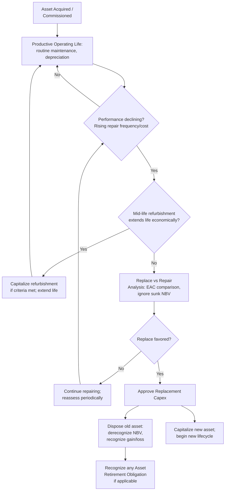

## Replacement Capex and Asset Lifecycle

### Definition

**Replacement Capex** is capital expenditure incurred to substitute an existing asset that has reached the end of its useful economic life, become obsolete, or is no longer capable of performing its function reliably, with a new asset that restores the organization's capacity and functionality to its prior level. It is the most common and direct form of **maintenance Capex**, distinguished from broader maintenance Capex by its specific trigger: an asset reaching functional or economic end-of-life, rather than general periodic upkeep spending.

**[Confirmed]** Replacement Capex is closely tied to the concept of the **asset lifecycle** — the full progression an asset moves through from acquisition to disposal — and understanding lifecycle stages is foundational to forecasting when and how much replacement Capex will be required.

### The Asset Lifecycle Framework

**[Confirmed]** A physical asset typically progresses through the following lifecycle stages:

| Stage | Description | Financial/Operational Characteristics |
| --- | --- | --- |
| Acquisition/Commissioning | Asset purchased, installed, and placed into service | Capitalized at cost; depreciation begins |
| Productive/Operating Life | Asset performs its intended function | Depreciation expense recognized; routine maintenance (Opex) performed |
| Mid-life Refurbishment (optional) | Major overhaul extending useful life or restoring performance | May be capitalized if it meets recognition criteria (extends life/capacity) |
| Declining Performance | Increasing maintenance frequency/cost, declining reliability or efficiency | Rising Opex maintenance cost; potential early indicators of impairment |
| End-of-Life | Asset reaches the end of its useful economic life | Triggers replacement Capex decision |
| Disposal/Decommissioning | Asset retired, sold, scrapped, or decommissioned | Derecognition of remaining carrying value; gain/loss on disposal recognized |

**[Inference]** The point at which an asset transitions from "declining performance" to warranting replacement (rather than continued repair) is typically an economic decision rather than a purely technical one — it occurs when the net present value of continuing to repair and operate the existing asset falls below the net present value of replacing it, even if the existing asset remains technically operable.

### Useful Life Determination

**[Confirmed]** Useful life (for depreciation purposes) is an accounting estimate, distinct from an asset's absolute physical lifespan. Both IAS 16 and ASC 360 require useful life estimates to be reviewed periodically and adjusted prospectively if expectations change materially.

**Factors influencing useful life estimation:**

- Expected physical wear and tear from usage intensity
- Technical or commercial obsolescence risk
- Legal or contractual limits on asset use (e.g., lease term, license period)
- Maintenance policy and quality of upkeep
- Expected usage pattern (e.g., machine hours, units produced, shifts per day)

$$\text{Straight-Line Depreciation} = \frac{\text{Cost} - \text{Residual Value}}{\text{Useful Life (years)}}$$

**[Inference]** A gap frequently exists between an asset's *accounting* useful life (used for depreciation scheduling) and its *actual* replacement timing in practice — assets are commonly kept in productive use beyond their fully depreciated accounting life (continuing to generate output at zero net book value), while others may require replacement before their accounting useful life expires due to unanticipated obsolescence or failure.

### Replace vs. Repair Decision Framework

**[Confirmed]** The core financial decision at end-of-life (or during declining performance) is whether to continue repairing the existing asset or replace it. This is typically evaluated using an **incremental/differential cash flow analysis**, often structured as an **Equivalent Annual Cost (EAC)** comparison when the two options have different remaining useful lives:

$$EAC = \frac{NPV \times r}{1 - (1+r)^{-n}}$$

Where $NPV$ is the net present value of total costs (initial outlay + operating/maintenance costs, net of any salvage value) over the option's life $n$, and $r$ is the discount rate.

**[Inference]** The Equivalent Annual Cost method is specifically useful for replace-vs-repair decisions because it allows fair comparison between options with unequal time horizons (e.g., "repair now and replace in 3 years" vs. "replace now for a 10-year asset life") by converting each option's total cost profile into a comparable annualized figure.

**Key inputs to the replace-vs-repair decision:**

| Factor | Favors Repair/Continue | Favors Replace |
| --- | --- | --- |
| Remaining repair cost | Low relative to replacement cost | High, approaching or exceeding replacement cost |
| Downtime/reliability risk | Low, asset still dependable | High, frequent unplanned failures |
| Technology improvement available | Minimal efficiency gain from newer models | Significant efficiency/capacity gain available |
| Salvage value of existing asset | High, worth retaining longer to capture value later | Low, little value lost by early replacement |
| Regulatory/compliance requirements | No new requirements affecting the existing asset | New standards make existing asset non-compliant |
| Cost of capital / financing availability | High cost of capital favors delaying large outlays | Low cost of capital favors timely replacement |

### Sunk Cost Consideration

**[Confirmed]** A critical principle in replace-vs-repair analysis is that the **net book value of the existing asset is a sunk cost** and should not influence the forward-looking replacement decision — only the incremental future cash flows of each option (repair vs. replace) are relevant.

**[Inference]** This is a commonly cited practical pitfall: decision-makers sometimes resist replacing an asset that still carries a large undepreciated book value ("it hasn't been fully depreciated yet, so replacing it now would mean writing off a loss"), even when the economically rational forward-looking decision favors replacement — the historical cost and remaining book value are irrelevant to the go-forward economic comparison, though the disposal will trigger recognition of any remaining loss on the income statement, which can create a real (though non-economic) earnings-timing concern for management.

### Asset Retirement and Disposal Accounting

**[Confirmed]** When a replaced asset is disposed of, derecognition accounting applies:

$$\text{Gain/(Loss) on Disposal} = \text{Net Disposal Proceeds} - \text{Net Book Value at Disposal}$$

**[Confirmed]** Both IFRS (IAS 16) and US GAAP (ASC 360) require derecognition of an asset's carrying amount upon disposal, with any resulting gain or loss recognized in profit or loss (gains are not classified as revenue under IFRS).

**[Confirmed]** Where legal or constructive obligations exist to dismantle, remove, or restore a site upon asset retirement (e.g., decommissioning obligations for industrial facilities, mines, or oil rigs), an **asset retirement obligation (ARO)** must be recognized under ASC 410-20 (US GAAP) or as a component of the asset's cost under IAS 37/IAS 16 (IFRS), with the estimated present value of future decommissioning costs added to the asset's initial capitalized cost and a corresponding liability recognized.

### Replacement Capex Forecasting Approaches

Because replacement Capex is a recurring, somewhat predictable cash outflow (unlike growth Capex, which depends on discretionary strategic decisions), several forecasting approaches are commonly used:

| Approach | Method | Best Suited For |
| --- | --- | --- |
| Age-based / actuarial method | Track asset age against expected useful life distribution; forecast replacement waves as cohorts reach end-of-life | Large, homogeneous asset fleets (e.g., utility poles, vehicle fleets) |
| Depreciation-proxy method | Assume replacement Capex ≈ annual depreciation expense in steady state | Quick approximation, mature stable businesses |
| Condition-based / predictive maintenance | Use sensor/monitoring data on actual asset condition to trigger replacement forecasts | Capital-intensive industrial assets with IoT/condition monitoring capability |
| Fixed asset register cohort analysis | Analyze the existing asset register by acquisition date and expected life to project a rolling replacement schedule | Organizations with detailed asset registers (common in utilities, government/LGU asset management, real estate) |

$$\text{Expected Annual Replacement Wave} = \sum_{\text{cohort } i} \frac{\text{Units in Cohort}_i}{\text{Useful Life}_i} \quad \text{(simplified actuarial approximation)}$$

### Asset Lifecycle and Replacement Timeline (Mermaid)

### Asset Lifecycle Cost Curve (svg_diagram)

<svg xmlns="http://www.w3.org/2000/svg" viewBox="0 0 760 340">
<text x="380" y="26" font-size="17" font-weight="bold" text-anchor="middle" fill="#1a1a1a">Asset Lifecycle: Maintenance Cost vs Time (svg_diagram)</text>
<line x1="80" y1="290" x2="720" y2="290" stroke="#333" stroke-width="1.5" />
<line x1="80" y1="290" x2="80" y2="50" stroke="#333" stroke-width="1.5" />
<text x="400" y="315" font-size="12" text-anchor="middle" fill="#333">Asset Age</text>
<text x="35" y="170" font-size="12" text-anchor="middle" fill="#333" transform="rotate(-90 35 170)">Annual Maintenance Cost</text>
<path d="M100,260 Q250,270 350,230 Q500,150 650,70" fill="none" stroke="#b33a3a" stroke-width="2.5" />
<line x1="620" y1="290" x2="620" y2="50" stroke="#888" stroke-width="1.5" stroke-dasharray="5,4" />
<text x="620" y="45" font-size="11" text-anchor="middle" fill="#333">Replace threshold</text>
<rect x="100" y="240" width="180" height="30" fill="#e3f5e6" stroke="#2f8f4e" stroke-width="1" opacity="0.7" />
<text x="190" y="260" font-size="10" text-anchor="middle" fill="#1a1a1a">Stable operating life</text>
<rect x="350" y="180" width="200" height="30" fill="#fff4e0" stroke="#c98a1c" stroke-width="1" opacity="0.7" />
<text x="450" y="200" font-size="10" text-anchor="middle" fill="#1a1a1a">Declining performance</text>
<rect x="620" y="55" width="90" height="30" fill="#fde8e8" stroke="#b33a3a" stroke-width="1" opacity="0.7" />
<text x="665" y="75" font-size="10" text-anchor="middle" fill="#1a1a1a">Replace zone</text>
</svg>

### Governance Considerations

**[Inference]** Organizations managing large, aging asset bases (utilities, government infrastructure, manufacturing plants) commonly maintain formal **capital replacement plans** or **asset management plans** that project future replacement Capex needs across multi-year horizons based on asset age cohorts, condition assessments, and useful life estimates — this is particularly emphasized in public-sector and regulated-utility contexts where predictable, well-governed replacement spending is subject to external oversight (rate regulators, audit bodies, or public asset management frameworks).

**[Confirmed]** Deferred replacement Capex — postponing necessary asset replacement to preserve near-term reported free cash flow or earnings — is a recognized risk pattern in financial analysis, since it can create a growing backlog of underlying asset deterioration ("deferred maintenance liability") not directly visible on the balance sheet, which may manifest later as a spike in required replacement spending, unplanned downtime, or safety/regulatory compliance issues.

**Related Topics**

- Equivalent Annual Cost (EAC) methodology in capital replacement decisions
- Asset retirement obligations (ARO) recognition and measurement (ASC 410 / IAS 37)
- Fixed asset register design for cohort-based replacement forecasting
- Deferred maintenance risk disclosure and analysis
- Useful life estimate revisions and their depreciation impact
- Condition-based/predictive maintenance and IoT asset monitoring
- Public infrastructure asset management planning frameworks