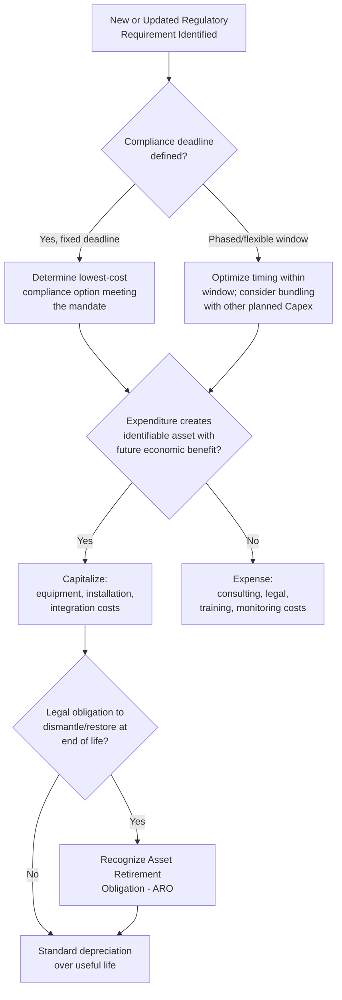

## Regulatory and Compliance-Driven Capex

### Definition

**Regulatory and compliance-driven Capex** refers to capital expenditure an organization is legally, contractually, or regulatorily obligated to incur — spending required to meet environmental, safety, health, licensing, or industry-specific regulatory standards, rather than spending chosen freely to sustain or grow operations. It is functionally distinct from both maintenance Capex (driven by asset wear-out) and growth Capex (driven by discretionary strategic opportunity), because the *trigger* is an external legal or regulatory mandate rather than an internal operational or strategic decision.

**[Confirmed]** This is an analytical/managerial classification, not a formal accounting category — no accounting standard separately labels regulatory Capex on the face of financial statements, though the *accounting treatment* of the resulting asset (capitalize vs. expense) still follows the same general recognition criteria (probable future benefit, reliable measurement, control) as any other capital expenditure.

| Dimension | Regulatory/Compliance Capex | Discretionary Capex (Growth/Maintenance) |
| --- | --- | --- |
| Trigger | External legal/regulatory mandate | Internal operational or strategic decision |
| Timing flexibility | Low — often has a mandated compliance deadline | Higher — timing can generally be optimized by management |
| Expected direct ROI | Often low or zero (compliance is the "return") | Expected to generate measurable financial return |
| Consequence of non-compliance | Fines, shutdown orders, license revocation, criminal liability | Missed growth opportunity, competitive disadvantage |
| Capital budgeting evaluation | Often evaluated as "must-do" (cost-minimization) rather than NPV-positive investment | Standard NPV/IRR hurdle-rate evaluation |

### Common Categories of Regulatory-Driven Capex

| Category | Examples |
| --- | --- |
| Environmental compliance | Emissions control systems (scrubbers, filters), wastewater treatment upgrades, contamination remediation infrastructure |
| Workplace safety | Fire suppression systems, structural reinforcement, ventilation upgrades, machine guarding retrofits |
| Health and sanitation | Food safety infrastructure upgrades, healthcare facility sterilization/isolation infrastructure |
| Building and structural codes | Seismic retrofitting, accessibility (disability access) modifications, fire code compliance |
| Industry-specific licensing requirements | Financial services data security infrastructure, pharmaceutical manufacturing (GMP) facility upgrades, telecom spectrum/network compliance |
| Data protection and cybersecurity mandates | Infrastructure upgrades to meet data residency, encryption, or breach-notification regulatory requirements |
| Utility/infrastructure regulatory standards | Grid resilience upgrades, water quality treatment infrastructure mandated by regulators |

### Distinguishing Feature: Non-Discretionary Timing

**[Confirmed]** The defining operational characteristic of regulatory Capex is that its **timing is largely dictated externally** — typically by a statutory compliance deadline, a regulator's enforcement order, or an industry standard's effective date — rather than by internal capital planning discretion.

**[Inference]** This creates a distinct capital budgeting dynamic: rather than asking "should we make this investment and does it clear our hurdle rate," management typically asks "what is the lowest-cost way to achieve compliance by the mandated deadline," since non-compliance carries consequences (fines, operational shutdown, license loss, or legal liability) that are usually far more costly than the capital outlay itself. This reframes the evaluation from a return-maximization exercise to a cost-minimization and risk-mitigation exercise.

### Evaluation Framework for Regulatory Capex

While traditional NPV/IRR analysis is less central to the *decision to invest* (since the investment itself is not optional once a mandate is triggered), financial evaluation still plays a role in:

1. **Cost-minimization across compliance options** — where multiple technical approaches can achieve the same regulatory outcome, NPV/total-cost-of-ownership comparison across options remains relevant.
2. **Timing optimization within the compliance window** — if a deadline allows some flexibility (e.g., a 3-year phase-in period), the organization may still optimize *when* within that window to spend, balancing cash flow timing, financing costs, and combining the mandate with other planned capital work at the same facility.
3. **Bundling with other Capex** — combining regulatory-driven upgrades with planned maintenance or expansion Capex at the same site to reduce disruption and total project cost (e.g., performing an emissions retrofit during a already-planned plant shutdown for maintenance).
4. **Cost-of-non-compliance quantification** — explicitly modeling expected fines, shutdown risk, reputational damage, and legal liability as the "counterfactual cost" against which the compliance investment is implicitly justified.

$$\text{Effective Decision Rule: Invest if } \quad \text{Cost}_{\text{compliance investment}} < \text{Expected Value}(\text{Cost}_{\text{non-compliance}})$$

**[Inference]** In practice, because the expected cost of non-compliance for serious safety, environmental, or licensing violations is often severe (potential facility shutdown, criminal liability for executives, catastrophic reputational damage), this comparison rarely favors non-compliance even when the raw capital outlay is substantial — which is why regulatory Capex is typically treated as effectively mandatory rather than subject to standard discretionary hurdle-rate screening.

### Accounting Treatment

**[Confirmed]** The accounting treatment of regulatory Capex follows the same general capitalization criteria as any other Capex — the *reason* for the expenditure (regulatory mandate) does not itself change whether it is capitalized or expensed. The standard capitalize-vs-expense tests still apply:

- If the expenditure creates or improves an asset with future economic benefit beyond the current period and meets recognition criteria → **capitalize**.
- If the expenditure is a repair, routine compliance testing, or consulting/legal cost with no future economic benefit → **expense**.

**Example — Mixed Treatment Within a Single Compliance Project:**

| Component of a Regulatory Retrofit Project | Treatment | Rationale |
| --- | --- | --- |
| New emissions scrubber equipment installed | Capitalize | New long-lived asset with future benefit |
| Installation and integration labor | Capitalize | Directly attributable cost of bringing asset to working condition |
| Regulatory compliance consulting/legal fees | Expense | No separable asset created; advisory service consumed immediately |
| Employee safety training on new equipment | Expense | No asset created; benefit does not meet capitalization criteria |
| Ongoing compliance monitoring/testing costs post-installation | Expense | Recurring operational cost, not an asset |

**[Confirmed]** Where a regulatory mandate creates a **legal obligation to dismantle, remove, or restore** an asset or site at the end of its life (common in environmental and mining/extraction contexts), this triggers **asset retirement obligation (ARO)** accounting under ASC 410-20 (US GAAP) or the equivalent treatment under IAS 37/IAS 16 (IFRS) — the present value of the estimated future retirement cost is capitalized as part of the related asset's cost, with a corresponding liability recognized.

### Industry Concentration and Examples

**[Inference]** Regulatory-driven Capex tends to be disproportionately concentrated in heavily regulated, capital-intensive sectors:

| Industry | Typical Regulatory Capex Drivers |
| --- | --- |
| Utilities (power, water) | Environmental emissions standards, grid reliability/resilience mandates, water quality standards |
| Oil & gas / mining | Environmental remediation, safety equipment mandates, decommissioning obligations |
| Banking / financial services | Data security and cybersecurity infrastructure, anti-money-laundering system requirements |
| Healthcare / pharmaceuticals | Good Manufacturing Practice (GMP) facility standards, patient safety and sterilization infrastructure |
| Telecommunications | Network security standards, emergency service compliance (e.g., E911-type infrastructure), spectrum-related infrastructure requirements |
| Manufacturing (general) | Workplace safety (OSHA-type) equipment, environmental discharge controls |
| Government / local government units | Building code compliance for public facilities, accessibility retrofits, disaster-resilience infrastructure standards |

**[Unverified]** Specific regulatory thresholds, deadlines, and mandated standards vary significantly by jurisdiction and are subject to legislative and regulatory change; current local regulatory text should always be confirmed for a specific compliance planning exercise rather than relied upon from general industry patterns.

### Interaction with Capital Intensity Analysis

**[Inference]** Regulatory Capex is a particularly important factor to isolate in capital intensity trend analysis because:

- A spike in Capex-to-Revenue ratio driven by a one-time regulatory mandate (e.g., a new emissions standard taking effect) should generally be treated as **non-recurring** for forward capital intensity projections, distinct from an underlying secular increase in maintenance or growth Capex needs.
- Regulatory Capex often generates **little to no incremental revenue or cost savings**, meaning traditional return-on-invested-capital (ROIC) metrics computed inclusive of regulatory Capex in the denominator can appear to decline even though the underlying discretionary investment productivity of the business is unchanged — analysts sometimes separately track "regulatory-adjusted" ROIC or capital intensity to avoid this distortion.
- Forward-looking regulatory Capex requirements (known future mandates with defined compliance deadlines) represent a **quantifiable, largely non-discretionary future cash outflow** that should be explicitly incorporated into multi-year capital planning and free cash flow forecasts, distinct from more uncertain discretionary growth Capex assumptions.

### Risk Management Considerations

**[Inference]** Because regulatory requirements can change with limited lead time (new legislation, updated regulatory standards, court rulings affecting industry practice), organizations in heavily regulated sectors often maintain **regulatory horizon scanning** processes to anticipate upcoming compliance-driven Capex needs well before mandates take effect, allowing for more orderly capital planning, financing arrangement, and potential bundling with other planned capital work, rather than reactive, rushed, and typically more expensive last-minute compliance spending.

### Regulatory Capex Decision Flow (Mermaid)

### Regulatory vs Discretionary Capex Evaluation (svg_diagram)

<svg xmlns="http://www.w3.org/2000/svg" viewBox="0 0 760 300">
<text x="380" y="26" font-size="17" font-weight="bold" text-anchor="middle" fill="#1a1a1a">Regulatory Capex vs Discretionary Capex Logic (svg_diagram)</text>
<rect x="40" y="55" width="320" height="210" rx="10" fill="#fde8e8" stroke="#b33a3a" stroke-width="1.5" />
<text x="200" y="80" font-size="14" font-weight="bold" text-anchor="middle" fill="#1a1a1a">Regulatory/Compliance Capex</text>
<text x="200" y="105" font-size="11" text-anchor="middle" fill="#333">Trigger: external mandate</text>
<text x="200" y="128" font-size="11" text-anchor="middle" fill="#333">Question: lowest-cost path</text>
<text x="200" y="145" font-size="11" text-anchor="middle" fill="#333">to compliance by deadline</text>
<text x="200" y="170" font-size="11" text-anchor="middle" fill="#333">Evaluation: cost-minimization</text>
<text x="200" y="193" font-size="11" text-anchor="middle" fill="#333">vs. non-compliance cost</text>
<text x="200" y="216" font-size="11" text-anchor="middle" fill="#333">Timing: largely fixed</text>
<text x="200" y="239" font-size="11" text-anchor="middle" fill="#333">by regulator</text>
<rect x="400" y="55" width="320" height="210" rx="10" fill="#e3f5e6" stroke="#2f8f4e" stroke-width="1.5" />
<text x="560" y="80" font-size="14" font-weight="bold" text-anchor="middle" fill="#1a1a1a">Discretionary Capex</text>
<text x="560" y="105" font-size="11" text-anchor="middle" fill="#333">Trigger: internal strategy</text>
<text x="560" y="128" font-size="11" text-anchor="middle" fill="#333">Question: does this clear</text>
<text x="560" y="145" font-size="11" text-anchor="middle" fill="#333">our return hurdle rate?</text>
<text x="560" y="170" font-size="11" text-anchor="middle" fill="#333">Evaluation: NPV/IRR</text>
<text x="560" y="193" font-size="11" text-anchor="middle" fill="#333">return maximization</text>
<text x="560" y="216" font-size="11" text-anchor="middle" fill="#333">Timing: management</text>
<text x="560" y="239" font-size="11" text-anchor="middle" fill="#333">discretion</text>
</svg>

**Related Topics**

- Asset retirement obligation (ARO) recognition and measurement mechanics
- Cost-of-non-compliance quantification and risk-adjusted capital planning
- Regulatory-adjusted ROIC and capital intensity normalization techniques
- Environmental remediation liability accounting (IAS 37 provisions)
- Regulatory horizon scanning and multi-year compliance capital planning
- Bundling compliance Capex with planned maintenance shutdowns
- Sector-specific regulatory capital frameworks (utilities, banking, pharmaceuticals)