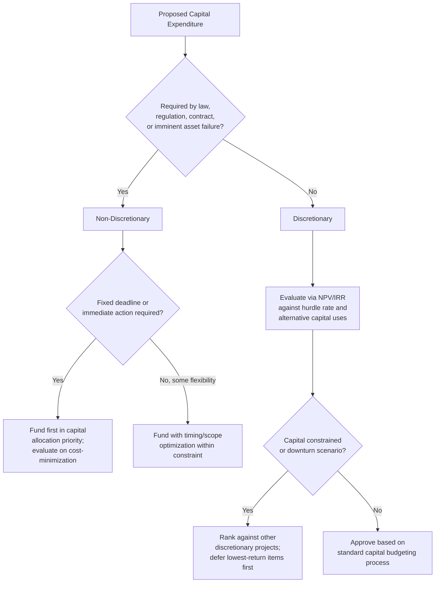

## Discretionary versus Non-Discretionary Capex

### Definition and Core Distinction

**Discretionary Capex** is capital expenditure that management has genuine latitude to accept, reject, defer, or resize based on its own judgment of strategic value and expected return — the organization could choose not to spend without facing an immediate external mandate or unavoidable operational failure. **Non-discretionary Capex** is capital expenditure the organization is compelled to make — by physical necessity (asset failure), external legal/regulatory mandate, or contractual obligation — where meaningful choice is limited to *how* and *when* to spend, not *whether*.

**[Confirmed]** This is the broadest and most encompassing classification framework in Capex analysis — it functions as an **umbrella distinction** that subsumes and reorganizes the other classification schemes covered elsewhere in this material (maintenance vs. growth, expansion, replacement, and regulatory Capex) along a single dimension: **degree of managerial choice**.

| Classification (from other topics) | Where it typically falls |
| --- | --- |
| Growth/Expansion Capex | Discretionary |
| Maintenance Capex (general upkeep) | Largely non-discretionary, but with some discretion over timing/scope |
| Replacement Capex (asset end-of-life) | Non-discretionary once failure/end-of-life is reached; some discretion over timing before that point |
| Regulatory/Compliance Capex | Non-discretionary regarding *whether*; some discretion over *how* and *when* within a compliance window |

### The Discretion Spectrum (Not a Binary)

**[Inference]** In practice, "discretionary" and "non-discretionary" are better understood as **endpoints of a spectrum** rather than a strict binary classification, since most real Capex decisions carry some mixture of forced and optional elements.

| Position on Spectrum | Description | Example |
| --- | --- | --- |
| Fully non-discretionary | No meaningful choice on whether or timing; immediate action required | Emergency replacement of a failed critical safety system |
| Mostly non-discretionary | Must occur, but some flexibility on timing/scope/method | Regulatory compliance investment with a multi-year phase-in window |
| Mixed | Combines a forced baseline with an optional enhancement | Replacing a failed machine with a materially higher-capacity model instead of an identical replacement |
| Mostly discretionary | Strong strategic rationale but genuinely deferrable without immediate harm | Entering a new but non-critical product line |
| Fully discretionary | No external or operational pressure at all; purely opportunity-driven | Optional capacity expansion based on an optimistic demand forecast |

### Why This Distinction Matters for Capital Allocation

**[Confirmed]** Distinguishing discretionary from non-discretionary Capex is central to effective capital allocation and capital budgeting governance for several reasons:

1. **Capital rationing priority** — when capital is constrained, non-discretionary spending is typically funded first (as a baseline requirement to keep the business legally operating and functionally intact), with discretionary spending competing for the remaining capital pool based on relative return.
2. **Evaluation methodology differs** — non-discretionary Capex is typically evaluated on a cost-minimization basis (find the lowest-cost way to meet the requirement), while discretionary Capex is evaluated on a return-maximization basis (NPV, IRR, strategic fit against alternative uses of capital).
3. **Forecasting reliability** — non-discretionary Capex needs (asset replacement schedules, known regulatory deadlines) are generally more predictable and stable across economic cycles, while discretionary Capex is the primary lever management pulls to adjust total capital spending in response to changing business conditions.
4. **Downturn resilience planning** — understanding what portion of a company's total Capex base is truly discretionary (deferrable without immediate operational or legal harm) is a key input to stress-testing free cash flow resilience in a downturn scenario.

### Capital Allocation Priority Framework

**[Inference]** A commonly used conceptual hierarchy for capital allocation prioritization, reflecting the discretion spectrum, is:

$$\text{Priority 1: Life/Safety-Critical Non-Discretionary} > \text{Priority 2: Legal/Regulatory Non-Discretionary}$$

$$

> \text{Priority 3: Operationally Necessary (near-term asset failure risk)} > \text{Priority 4: High-Return Discretionary Growth}
>
> $$$$
>
> \text{Priority 5: Lower-Return or Speculative Discretionary}
>
> $$

**[Inference]** Under capital constraints or during a deliberate spending reduction (e.g., in a downturn), organizations typically work down this hierarchy from the bottom, deferring or cancelling the lowest-priority discretionary items first while continuing to fund non-discretionary spending, since deferring safety, legal, or operationally critical spending carries risks (accidents, legal penalties, unplanned outages) that are usually far more costly than the near-term cash savings.

### Discretionary Capex as the Primary Cyclical Lever

**[Confirmed]** A well-documented pattern in corporate finance and macroeconomic capital spending analysis is that **discretionary Capex is disproportionately responsible for cyclicality** in total corporate capital spending — it expands aggressively during periods of strong demand/confidence and contracts sharply during downturns, while non-discretionary Capex (regulatory, safety-critical, unavoidable replacement) remains comparatively stable across the cycle.

**[Inference]** This has an important analytical implication: when analyzing a company's or an economy's aggregate Capex trend, a sharp decline in total Capex during a downturn is more informative about the discretionary (growth-oriented) component being cut than about a genuine reduction in the underlying non-discretionary capital requirements of the business, which tend to persist regardless of the broader economic cycle.

$$\text{Total Capex}_t = \text{Non-Discretionary Capex}_t + \text{Discretionary Capex}_t$$

**[Inference]** Since $\text{Non-Discretionary Capex}$ is relatively stable across $t$, most of the observed variance in $\text{Total Capex}_t$ across a business cycle is attributable to variance in $\text{Discretionary Capex}_t$ — a useful simplifying heuristic for scenario planning, though the actual split is rarely disclosed with precision and must typically be estimated.

### Illustrative Example — Capex Base Decomposition

| Capex Category | Annual Amount | Discretion Level | Deferrable in a Downturn? |
| --- | --- | --- | --- |
| Safety system upgrades (mandated) | $4,000,000 | Non-discretionary | No |
| Environmental compliance retrofit (deadline in 18 months) | $6,000,000 | Non-discretionary (timing has some flexibility) | Limited — deadline exists |
| Critical equipment replacement (imminent failure risk) | $8,000,000 | Non-discretionary | Minimal — risk of unplanned outage |
| Routine facility maintenance/upgrades | $5,000,000 | Mostly non-discretionary | Partially — some deferral possible short-term |
| New product line capacity expansion | $15,000,000 | Discretionary | Yes |
| Optional efficiency-improvement automation project | $7,000,000 | Discretionary | Yes |
| **Total Capex** | **$45,000,000** |  |  |

In this illustrative example, roughly $23,000,000 (approximately 51%) is discretionary and could realistically be deferred or cancelled under capital constraint, while approximately $22,000,000 (49%) represents a comparatively fixed near-term capital requirement.

**[Inference]** This kind of decomposition exercise — even when approximate — is commonly used internally by finance and treasury functions to stress-test minimum sustainable capital spending levels under adverse liquidity or demand scenarios, distinct from the "total Capex" figure alone.

### Relationship to Free Cash Flow Stress Testing

**[Inference]** In credit analysis and liquidity stress testing, analysts and lenders often specifically distinguish discretionary from non-discretionary Capex to determine a company's **minimum sustainable cash outflow floor** — the level of capital spending that cannot realistically be avoided even in a severe downturn — as distinct from total historical Capex, which includes growth spending the company could choose to cut to preserve liquidity.

$$\text{Stressed Minimum FCF} \approx \text{Stressed Operating Cash Flow} - \text{Non-Discretionary Capex}$$

**[Inference]** This distinction is particularly relevant in leveraged finance and covenant analysis, where lenders may want assurance that even under a full discretionary Capex freeze, the company's non-discretionary capital obligations (safety, regulatory, critical replacement) can still be met without jeopardizing debt service or operational continuity.

### Governance and Disclosure Practice

**[Confirmed]** Neither IFRS nor US GAAP require companies to disclose a discretionary/non-discretionary Capex split in financial statements — like the maintenance/growth distinction, this is purely a management and analyst tool.

**[Inference]** Some companies, particularly in capital-intensive regulated industries, voluntarily provide qualitative or quantitative color on this split in investor communications (e.g., characterizing a portion of guided Capex as "committed" or "sustaining" versus "growth" or "discretionary") to help investors assess the flexibility of the company's capital spending plan under adverse scenarios — though, as with the maintenance/growth split, such characterizations are management's own judgment and not independently audited against a standardized definition.

### Decision Framework (Mermaid)

### Discretion Spectrum Visualization (svg_diagram)

<svg xmlns="http://www.w3.org/2000/svg" viewBox="0 0 760 260">
<text x="380" y="26" font-size="17" font-weight="bold" text-anchor="middle" fill="#1a1a1a">The Capex Discretion Spectrum (svg_diagram)</text>
<line x1="60" y1="140" x2="700" y2="140" stroke="#333" stroke-width="2" />
<polygon points="700,140 690,134 690,146" fill="#333" />
<polygon points="60,140 70,134 70,146" fill="#333" />

<text x="60" y="170" font-size="11" text-anchor="middle" fill="#333">Fully</text>

<text x="60" y="184" font-size="11" text-anchor="middle" fill="#333">Non-Discretionary</text>

<text x="700" y="170" font-size="11" text-anchor="middle" fill="#333">Fully</text>

<text x="700" y="184" font-size="11" text-anchor="middle" fill="#333">Discretionary</text>

<circle cx="130" cy="140" r="7" fill="#b33a3a" />
<text x="130" y="115" font-size="10" text-anchor="middle" fill="#1a1a1a">Emergency safety</text>
<text x="130" y="128" font-size="10" text-anchor="middle" fill="#1a1a1a">replacement</text>
<circle cx="280" cy="140" r="7" fill="#c98a1c" />
<text x="280" y="115" font-size="10" text-anchor="middle" fill="#1a1a1a">Regulatory retrofit</text>
<text x="280" y="128" font-size="10" text-anchor="middle" fill="#1a1a1a">(phased deadline)</text>
<circle cx="430" cy="140" r="7" fill="#8a8a3a" />
<text x="430" y="115" font-size="10" text-anchor="middle" fill="#1a1a1a">Enhanced replacement</text>
<text x="430" y="128" font-size="10" text-anchor="middle" fill="#1a1a1a">(forced + upgrade)</text>
<circle cx="580" cy="140" r="7" fill="#3b8a5f" />
<text x="580" y="115" font-size="10" text-anchor="middle" fill="#1a1a1a">Capacity</text>
<text x="580" y="128" font-size="10" text-anchor="middle" fill="#1a1a1a">expansion</text>
<circle cx="670" cy="140" r="7" fill="#2f8f4e" />
<text x="670" y="165" font-size="10" text-anchor="middle" fill="#1a1a1a">Speculative</text>
<text x="670" y="178" font-size="10" text-anchor="middle" fill="#1a1a1a">new venture</text>
</svg>

**Related Topics**

- Capital rationing and project prioritization frameworks under constrained budgets
- Free cash flow stress testing and minimum sustainable Capex floor estimation
- Credit analysis treatment of discretionary vs. committed capital spending
- Cyclicality of corporate capital spending across economic cycles
- Management disclosure practices around "sustaining" vs. "growth" Capex guidance
- Covenant analysis and lender assessment of non-discretionary capital obligations
- Capital budgeting hurdle rates applied differently across discretion categories