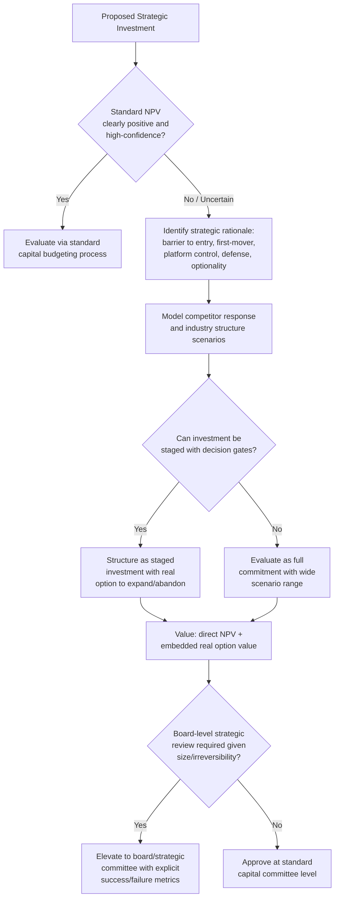

## Strategic Capex and Competitive Positioning

### Definition

**Strategic Capex** is capital expenditure undertaken primarily to build, defend, or reposition a company's **competitive advantage** — as distinct from Capex justified purely by direct, near-term, easily-quantifiable financial return. It is a subset of discretionary/growth Capex distinguished by its explicit link to long-horizon competitive strategy: market positioning, barriers to entry, platform control, or optionality against future industry shifts, rather than a straightforward expansion of existing, proven capacity.

**[Confirmed]** This is an analytical and strategic-management construct, not a formal accounting classification — no standard requires or defines a separate "strategic Capex" category on financial statements.

| Dimension | Strategic Capex | Standard Growth/Expansion Capex |
| --- | --- | --- |
| Primary justification | Competitive positioning, long-term optionality | Direct, quantifiable financial return |
| Time horizon of payoff | Long, often uncertain | Shorter, more predictable |
| Ease of NPV quantification | Difficult — benefits are partly qualitative/optionality-based | Comparatively straightforward |
| Typical driver | Industry structure shift, competitive threat/opportunity | Demand growth within existing model |
| Risk profile | Higher — may not pay off if strategic bet is wrong | Lower — closer to proven demand |

### Strategic Rationales for Capex

**[Confirmed]** Strategic management and corporate finance literature commonly identify several distinct competitive rationales that justify Capex beyond simple return-on-investment calculation:

| Rationale | Description | Example |
| --- | --- | --- |
| Barrier to entry / deterrence | Building capacity or capability that raises the cost or difficulty for competitors to enter or expand | Building excess capacity signaling willingness to compete on price if a rival enters |
| First-mover advantage | Establishing market position, brand presence, or infrastructure ahead of competitors in an emerging market/technology | Early investment in a new technology platform before demand is proven |
| Platform/ecosystem control | Investing in infrastructure that becomes a standard others must build around or through | Payment network infrastructure, proprietary technology platforms |
| Vertical integration | Acquiring/building capacity upstream or downstream to control supply chain, cost structure, or quality | Manufacturer investing in raw material production capacity |
| Defensive positioning | Investing to prevent erosion of existing market position from a competitive or technological threat | Legacy telecom investing in fiber to defend against cable/wireless substitution |
| Real options / strategic flexibility | Investing in a capability that creates the *option* to pursue future opportunities, even if the immediate NPV is marginal | Building modular infrastructure that can be scaled up quickly if a market opportunity materializes |

### Why Standard NPV Analysis Often Understates Strategic Capex Value

**[Confirmed]** A well-recognized limitation of pure discounted cash flow (DCF)/NPV analysis is that it struggles to capture the value of **strategic optionality** and **competitive interaction effects** — value components central to many strategic Capex decisions.

**[Confirmed]** This gap is the foundational motivation for **real options theory** applied to capital budgeting, which explicitly values the *option* embedded in a strategic investment (e.g., the option to expand further, abandon, switch use, or delay) using option-pricing techniques adapted from financial derivatives valuation (conceptually related to the Black-Scholes framework), rather than treating the investment as a single static cash flow projection.

$$\text{Strategic Investment Value} = NPV_{\text{direct cash flows}} + \text{Value of Embedded Real Options}$$

**[Inference]** Common real options embedded in strategic Capex include the **option to expand** (invest a modest amount now to preserve the ability to scale significantly later if demand materializes), the **option to abandon** (limit downside by structuring the investment to allow exit if the strategic bet fails), and the **option to switch** (build flexible capacity usable across multiple product lines or technologies rather than a single dedicated use) — each of these has calculable option value that a naive single-scenario NPV calculation would omit entirely.

### Competitive Dynamics: Capacity as a Strategic Signal

**[Inference]** In industrial organization economics, Capex decisions — particularly capacity investments — are frequently modeled as **strategic signals** in a competitive game, not purely as isolated financial decisions:

- **Preemptive capacity building** can deter competitor entry or expansion by credibly signaling that the incumbent will respond aggressively (e.g., via price competition) if challenged, since excess capacity lowers the incumbent's marginal cost of expanding output in response to a competitive threat.
- **Capacity races** can occur in industries with strong first-mover advantages or network effects, where multiple competitors invest heavily and simultaneously in capacity or infrastructure, partly out of genuine demand expectation and partly out of fear of ceding strategic position to a rival — a dynamic that can lead to industry-wide overcapacity if the underlying demand growth does not fully materialize for all participants.

**[Inference]** This game-theoretic dimension is a key reason strategic Capex decisions are often evaluated with heavier weight on competitor behavior and industry structure analysis (e.g., Porter's Five Forces-style frameworks) alongside, rather than instead of, standard financial return metrics.

### Evaluation Framework for Strategic Capex

Because pure NPV analysis is often insufficient, organizations commonly supplement financial evaluation of strategic Capex with additional frameworks:

1. **Scenario analysis and strategic sensitivity** — modeling multiple future industry-structure scenarios (e.g., "competitor enters," "competitor doesn't enter," "technology shift occurs") rather than a single base-case projection.
2. **Real options valuation** — explicitly pricing the option value of flexibility, staged investment, or abandonment rights embedded in the project structure.
3. **Competitive response modeling** — assessing how competitors are likely to react to the investment, and incorporating that reaction into the expected payoff (rather than assuming a static competitive environment).
4. **Strategic fit scoring** — qualitative frameworks scoring the investment against strategic criteria (market position, core competency alignment, platform/ecosystem value) alongside quantitative return metrics, often used in board-level capital allocation review for large strategic commitments.
5. **Staged/phased commitment structuring** — deliberately structuring the investment in stages with defined decision gates, allowing the organization to limit initial capital at risk while preserving the option to scale up if early results validate the strategic thesis.

### Illustrative Comparison — Standard vs. Strategic Capex Evaluation

| Evaluation Dimension | Standard Growth Capex | Strategic Capex |
| --- | --- | --- |
| Primary metric | NPV / IRR against hurdle rate | NPV + qualitative strategic fit + option value |
| Demand assumption | Reasonably well-validated | Often uncertain, forward-looking, or speculative |
| Competitor behavior | Generally assumed static/exogenous | Explicitly modeled as interactive/responsive |
| Investment structuring | Often single-stage commitment | Frequently staged with decision gates |
| Acceptable "failure mode" | Project underperforms return expectations | Strategic bet doesn't materialize, but option value + learning may still justify the initial outlay |
| Board/governance scrutiny | Standard capital committee approval | Often elevated to board-level strategic review given size/risk/irreversibility |

### Risks and Governance Concerns Specific to Strategic Capex

**[Inference]** Because strategic Capex is harder to evaluate with standard quantitative rigor, it carries specific governance risks that boards and capital allocation committees commonly scrutinize:

- **Empire-building risk** — management's incentive to pursue large strategic investments for reasons of organizational scale, prestige, or personal legacy rather than genuine shareholder value creation, particularly when the qualitative "strategic" justification can obscure a weak underlying financial case.
- **Escalation of commitment / sunk cost fallacy** — continuing to fund a strategic initiative well past the point where evidence suggests it is unlikely to succeed, because abandoning it would require acknowledging the initial decision was flawed.
- **Optimism bias in strategic narratives** — strategic rationales (competitive positioning, first-mover advantage, platform value) are inherently harder to falsify than a specific NPV calculation, which can make overly optimistic projects more difficult for governance bodies to challenge on quantitative grounds alone.

**[Inference]** These risks are a primary reason many well-governed organizations require large strategic Capex commitments to pass through more rigorous, board-level review — including explicit articulation of the competitive thesis, defined success/failure metrics, and staged decision gates — rather than relying solely on the standard capital budgeting approval process used for routine growth or maintenance Capex.

### Strategic Capex Decision Flow (Mermaid)

### Strategic Capex Value Components (svg_diagram)

<svg xmlns="http://www.w3.org/2000/svg" viewBox="0 0 760 300">
<text x="380" y="26" font-size="17" font-weight="bold" text-anchor="middle" fill="#1a1a1a">Total Strategic Investment Value (svg_diagram)</text>
<rect x="100" y="70" width="220" height="180" rx="8" fill="#e8eef7" stroke="#3b5998" stroke-width="1.5" />
<text x="210" y="100" font-size="13" font-weight="bold" text-anchor="middle" fill="#1a1a1a">Direct NPV</text>
<text x="210" y="125" font-size="10" text-anchor="middle" fill="#333">Projected cash flows</text>
<text x="210" y="145" font-size="10" text-anchor="middle" fill="#333">from base-case scenario</text>
<text x="210" y="165" font-size="10" text-anchor="middle" fill="#333">Discounted at cost</text>
<text x="210" y="185" font-size="10" text-anchor="middle" fill="#333">of capital</text>
<text x="210" y="210" font-size="10" text-anchor="middle" fill="#333">Captures known,</text>
<text x="210" y="228" font-size="10" text-anchor="middle" fill="#333">quantifiable returns</text>

<text x="365" y="165" font-size="24" font-weight="bold" text-anchor="middle" fill="#333">+</text>

<rect x="410" y="70" width="250" height="180" rx="8" fill="#f6eefb" stroke="#7a3b98" stroke-width="1.5" />
<text x="535" y="100" font-size="13" font-weight="bold" text-anchor="middle" fill="#1a1a1a">Strategic/Option Value</text>
<text x="535" y="125" font-size="10" text-anchor="middle" fill="#333">Option to expand,</text>
<text x="535" y="143" font-size="10" text-anchor="middle" fill="#333">abandon, or switch</text>
<text x="535" y="163" font-size="10" text-anchor="middle" fill="#333">Competitive deterrence /</text>
<text x="535" y="181" font-size="10" text-anchor="middle" fill="#333">first-mover value</text>
<text x="535" y="201" font-size="10" text-anchor="middle" fill="#333">Platform/ecosystem</text>
<text x="535" y="219" font-size="10" text-anchor="middle" fill="#333">positioning value</text>
<text x="535" y="239" font-size="10" text-anchor="middle" fill="#333">Often unquantified in DCF</text>
</svg>

**Related Topics**

- Real options valuation methodology applied to capital budgeting
- Porter's Five Forces and competitive strategy frameworks for Capex evaluation
- Capacity-based entry deterrence and industrial organization theory
- Staged investment structuring and decision-gate governance design
- Escalation of commitment and behavioral biases in capital allocation
- Platform economics and ecosystem-control investment strategy
- Board-level capital allocation governance for large strategic commitments