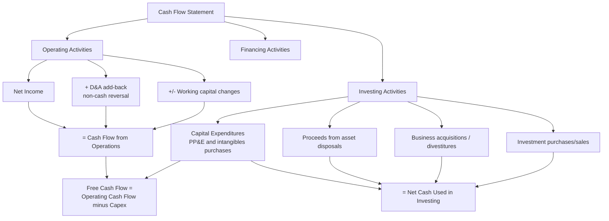

## Capex Treatment on the Cash Flow Statement


### Overview

The **Statement of Cash Flows** is the financial statement in which capital expenditure is most directly and transparently visible as a cash outflow. Unlike the income statement (which reflects Capex only indirectly, through periodic depreciation/amortization) or the balance sheet (which shows the resulting asset's carrying value at a point in time), the cash flow statement captures the actual cash paid to acquire, construct, or improve long-lived assets in the period it occurred.

**[Confirmed]** Both IFRS (IAS 7) and US GAAP (ASC 230) require cash flows to be classified into three categories: **Operating Activities**, **Investing Activities**, and **Financing Activities**. Capex is classified within **Investing Activities**.

### Where Capex Appears — Investing Activities Section

**[Confirmed]** Capital expenditure appears in the Investing Activities section, typically under line items such as:

- "Purchases of property, plant and equipment"
- "Capital expenditures"
- "Additions to property, plant and equipment"
- "Purchases of intangible assets" (for capitalized software, licenses, patents, etc., often shown separately from tangible PP&E purchases)

**Example — Typical Investing Activities Section:**



```
Cash Flows from Investing Activities:
  Purchases of property, plant and equipment          $(45,000,000)
  Purchases of intangible assets                        $(8,000,000)
  Proceeds from sale of property, plant and equipment     $2,500,000
  Business acquisitions, net of cash acquired            $(15,000,000)
  Purchases of investments                               $(10,000,000)
  Proceeds from maturities of investments                  $6,000,000
Net Cash Used in Investing Activities                   $(69,500,000)
```

**[Confirmed]** Capex is reported as a **negative** (cash outflow) figure within this section, since it represents cash leaving the business to acquire long-term productive assets — even though it is standard analytical convention to refer to "Capex" as a positive number when discussing it (e.g., "the company spent $45 million in Capex this year").

### Direct vs. Indirect Method — No Impact on Capex Presentation

**[Confirmed]** The cash flow statement can be prepared using either the **direct method** (listing actual cash receipts and payments for operating activities) or the **indirect method** (starting from net income and adjusting for non-cash items and working capital changes). This choice affects only the presentation of the **Operating Activities** section.

**[Confirmed]** The Investing Activities section — where Capex is reported — is presented identically regardless of whether the direct or indirect method is used for operating activities. Capex always appears as a direct cash outflow line item in Investing Activities under both methods.

**[Confirmed]** The indirect method is used by the substantial majority of companies in practice, though both direct and indirect are IFRS/US GAAP-permitted approaches for the operating section.

### The D&A Add-Back: Why Depreciation Appears in Operating, Not Investing

**[Confirmed]** A common point of confusion is the relationship between depreciation/amortization (D&A) and Capex on the cash flow statement. Under the indirect method, **D&A is added back to net income within Operating Activities** — this is *not* a Capex-related cash flow; it is a non-cash expense add-back, reversing the non-cash depreciation charge that reduced net income on the income statement but did not involve any actual cash outflow in the current period.

$$\text{Operating Cash Flow (indirect method)} = \text{Net Income} + D\&A + \text{Other Non-Cash Items} \pm \Delta \text{Working Capital}$$

**[Inference]** This structure means the cash flow statement effectively separates the *timing* of an asset's cash cost from the *recognition* of its expense: the actual cash payment for the asset appears once, in full, as Capex in Investing Activities in the period(s) it is paid; the subsequent depreciation of that asset appears, period after period, as a non-cash add-back in Operating Activities, since the depreciation charge reduced net income without any corresponding current-period cash movement.

### Free Cash Flow Derivation

**[Confirmed]** **Free Cash Flow (FCF)** — one of the most widely used valuation and financial health metrics — is derived directly from the cash flow statement by combining the Operating Activities and Investing Activities (specifically the Capex line):

$$\text{Free Cash Flow (FCF)} = \text{Cash Flow from Operations} - \text{Capital Expenditures}$$

**[Confirmed]** This is why Capex's placement in Investing Activities, and its precise identification as a distinct line item, is analytically critical — FCF is arguably the single most common purpose for which analysts extract the Capex figure directly from the cash flow statement, rather than relying on the balance sheet's PP&E roll-forward or the income statement's depreciation charge.

**Variant — Levered Free Cash Flow (also nets out debt service):**

$$\text{Levered FCF} = \text{Cash Flow from Operations} - \text{Capex} - \text{Mandatory Debt Repayments}$$

### Reconciling Capex Across Statements — The PP&E Roll-Forward

**[Confirmed]** The Capex figure reported on the cash flow statement should generally reconcile with the change in gross PP&E (and intangible assets) on the balance sheet, adjusted for non-cash items, via a roll-forward:

$$\text{Gross PP\&E}_{\text{end}} = \text{Gross PP\&E}_{\text{beginning}} + \text{Capex (cash)} + \text{Non-Cash Additions} - \text{Disposals (at gross cost)}$$

**[Inference]** Discrepancies between cash-flow-statement Capex and the implied change in gross PP&E from the balance sheet commonly arise from: (1) Capex incurred but not yet paid (accrued in accounts payable, creating a timing difference between accrual-based PP&E additions and actual cash paid); (2) non-cash additions such as assets acquired via finance lease capitalization, asset retirement obligation additions, or capitalized interest; (3) foreign currency translation effects on overseas asset balances; and (4) business combinations, where acquired PP&E is added to the balance sheet but does not appear as "Capex" on the cash flow statement — it instead appears within the separate "business acquisitions" investing line.

**Example — Non-Cash Capex Adjustment (Supplemental Disclosure):**

**[Confirmed]** Because certain Capex-related transactions do not involve cash (e.g., assets acquired via a finance lease, or Capex accrued in payables but unpaid at period-end), both IFRS and US GAAP require **supplemental non-cash disclosure** of significant investing and financing transactions that did not involve cash, typically presented as a note or supplemental schedule immediately following the cash flow statement itself.



```
Supplemental Disclosure of Non-Cash Investing Activities:
  Property acquired under finance lease                     $3,200,000
  Capital expenditures accrued but not yet paid              $1,800,000
```

**[Inference]** Analysts reconciling reported Capex against the PP&E roll-forward should specifically check this supplemental disclosure, since a material non-cash addition (e.g., a large finance-lease-acquired asset) would appear in the balance sheet's PP&E balance without any corresponding cash outflow in the current period's Investing Activities section.

### Capex vs. Total Investing Activities — Distinguishing from Other Investment Cash Flows

**[Confirmed]** Investing Activities encompasses more than just Capex — it also includes cash flows from acquisitions/divestitures of businesses, purchases/sales of financial investments (securities, equity stakes), and proceeds from asset disposals. Analysts must isolate the specific "Capex" line(s) rather than treating total net Investing Activities cash flow as equivalent to Capex.

| Investing Activity Line | Is it "Capex"? |
| --- | --- |
| Purchases of property, plant and equipment | Yes |
| Purchases/capitalization of intangible assets (software, patents) | Yes |
| Business acquisitions (M&A) | No — separate category, though it includes acquired PP&E |
| Proceeds from sale of PP&E | No — this is a disposal inflow, sometimes netted against Capex in simplified "net Capex" presentations, but should be distinguished for gross Capex analysis |
| Purchases/sales of marketable securities or investments | No — treasury/investment management activity, unrelated to operating asset base |

**[Inference]** A common analytical error is using "Net Cash Used in Investing Activities" as a proxy for Capex without adjustment — this total can be significantly distorted by large one-time M&A activity or investment portfolio transactions in a given period, materially overstating or understating the company's underlying capital spending on its operating asset base.

### Gross vs. Net Capex Presentation

**[Inference]** Analysts sometimes distinguish between:

- **Gross Capex** — total cash spent on acquiring/constructing assets, before netting any disposal proceeds (this is what typically appears as the standalone Capex line item).
- **Net Capex** — gross Capex minus proceeds from asset disposals, sometimes used as a rough proxy for the *net* investment the company is making in its asset base after accounting for assets being sold off.

$$\text{Net Capex} = \text{Gross Capex} - \text{Proceeds from Disposals of PP\&E}$$

**[Inference]** Gross Capex is generally the more standard and widely used figure in financial analysis and valuation (e.g., in FCF calculations), since it reflects the full scale of ongoing capital reinvestment, while net Capex can obscure the picture in periods with unusually large one-time asset sales unrelated to normal capital cycle activity.

### Cash Flow Statement Structure and Capex Flow (Mermaid)



### FCF Bridge from Cash Flow Statement (svg_diagram)

<svg viewBox="0 0 760 320" xmlns="http://www.w3.org/2000/svg">
<text x="380" y="26" font-size="17" font-weight="bold" text-anchor="middle" fill="#1a1a1a">Free Cash Flow Bridge (svg_diagram)</text>
<rect x="40" y="60" width="180" height="60" rx="8" fill="#e3f5e6" stroke="#2f8f4e" stroke-width="1.5"/>
<text x="130" y="85" font-size="12" font-weight="bold" text-anchor="middle" fill="#1a1a1a">Net Income</text>
<text x="130" y="103" font-size="10" text-anchor="middle" fill="#333">Income Statement</text>

<text x="235" y="98" font-size="20" font-weight="bold" text-anchor="middle" fill="#333">+</text>

<rect x="255" y="60" width="180" height="60" rx="8" fill="#eef3fb" stroke="#3b5998" stroke-width="1.5"/>
<text x="345" y="85" font-size="12" font-weight="bold" text-anchor="middle" fill="#1a1a1a">D&A + Δ Working Capital</text>
<text x="345" y="103" font-size="10" text-anchor="middle" fill="#333">Operating adjustments</text>

<text x="450" y="98" font-size="20" font-weight="bold" text-anchor="middle" fill="#333">=</text>

<rect x="470" y="60" width="220" height="60" rx="8" fill="#fff4e0" stroke="#c98a1c" stroke-width="1.5"/>
<text x="580" y="85" font-size="12" font-weight="bold" text-anchor="middle" fill="#1a1a1a">Operating Cash Flow</text>
<text x="580" y="103" font-size="10" text-anchor="middle" fill="#333">Cash Flow Statement</text>
<line x1="580" y1="120" x2="580" y2="160" stroke="#555" stroke-width="1.5" marker-end="url(#arrow3)"/>

<text x="340" y="185" font-size="20" font-weight="bold" text-anchor="middle" fill="#333">Operating Cash Flow − Capex</text>

<line x1="200" y1="200" x2="580" y2="200" stroke="#555" stroke-width="1.5" marker-end="url(#arrow3)"/>
<rect x="230" y="220" width="220" height="60" rx="8" fill="#fde8e8" stroke="#b33a3a" stroke-width="1.5"/>
<text x="340" y="245" font-size="12" font-weight="bold" text-anchor="middle" fill="#1a1a1a">Capital Expenditures</text>
<text x="340" y="263" font-size="10" text-anchor="middle" fill="#333">Investing Activities</text>
<rect x="480" y="220" width="220" height="60" rx="8" fill="#f6eefb" stroke="#7a3b98" stroke-width="1.5"/>
<text x="590" y="245" font-size="12" font-weight="bold" text-anchor="middle" fill="#1a1a1a">Free Cash Flow</text>
<text x="590" y="263" font-size="10" text-anchor="middle" fill="#333">Key valuation metric</text>
<defs>
<marker id="arrow3" markerWidth="8" markerHeight="8" refX="6" refY="4" orient="auto">
<path d="M0,0 L8,4 L0,8 Z" fill="#555"/>
</marker>
</defs>
</svg>

### Analytical Best Practices

- **[Inference]** Always source Capex figures directly from the standalone "Purchases of PP&E" (and intangibles, where separately disclosed) line items in Investing Activities, rather than from total Net Cash Used in Investing Activities, to avoid distortion from M&A, investment portfolio, or disposal activity.
- **[Inference]** Cross-check the cash-flow-statement Capex figure against the PP&E note/roll-forward and any supplemental non-cash disclosures to identify material non-cash additions (finance leases, ARO capitalization, capitalized interest) that would understate the *true* asset base growth if only cash Capex is considered.
- **[Confirmed]** When intangible asset purchases/capitalized development costs are reported as a separate line from tangible PP&E purchases, both should typically be included in a comprehensive "total Capex" figure for capital intensity and FCF analysis, since both represent capitalized investment in the long-term asset base.

**Related Topics**

- Free cash flow calculation variants (unlevered, levered, FCFE, FCFF)
- PP&E roll-forward reconciliation and non-cash addition analysis
- Direct vs. indirect method presentation differences (Operating Activities)
- Supplemental non-cash disclosure requirements (IAS 7 / ASC 230)
- Distinguishing organic Capex from M&A-related asset acquisition
- Capitalized interest presentation within Investing Activities
- Gross vs. net Capex analytical conventions in valuation models