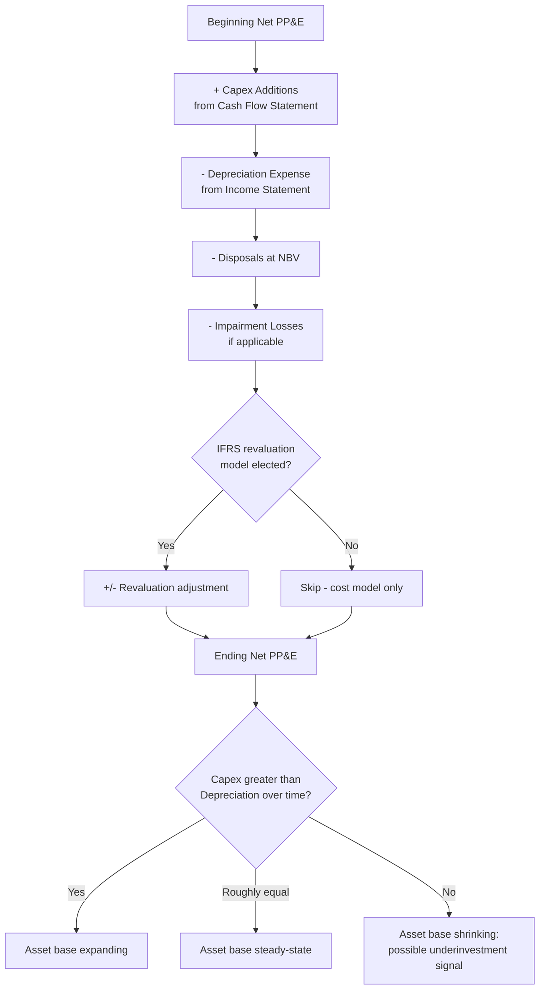

## Balance Sheet Effects: PP&E and Asset Base Growth

### Overview

Capital expenditure's most direct and persistent financial statement footprint is on the **balance sheet**, specifically within the **Property, Plant and Equipment (PP&E)** line (and, where applicable, intangible assets). Unlike the cash flow statement, which shows Capex as a single-period cash outflow, and the income statement, which shows only the periodic depreciation charge, the balance sheet reflects the **cumulative, ongoing effect** of capital investment decisions — the growing (or shrinking) stock of productive assets the entity has built up over time, net of the wear reflected through accumulated depreciation.

### The PP&E Balance Sheet Presentation

**[Confirmed]** PP&E is presented on the balance sheet, under both IFRS (IAS 16) and US GAAP (ASC 360), at **net book value (NBV)**, also called **carrying amount**:

$$\text{Net Book Value (NBV)} = \text{Gross PP\&E (Cost)} - \text{Accumulated Depreciation} - \text{Accumulated Impairment Losses}$$

**[Confirmed]** Companies typically disclose both the gross cost and accumulated depreciation figures (either on the face of the balance sheet or, more commonly, in the notes), allowing users to see the full historical investment base as well as how much of it has already been "used up" through depreciation.

**Example — Typical PP&E Note Disclosure:**

|  | Land | Buildings | Machinery & Equipment | Total |
| --- | --- | --- | --- | --- |
| Gross cost, beginning of year | $10,000,000 | $80,000,000 | $150,000,000 | $240,000,000 |
| Additions (Capex) | $0 | $5,000,000 | $22,000,000 | $27,000,000 |
| Disposals (at cost) | $0 | $0 | $(8,000,000) | $(8,000,000) |
| Gross cost, end of year | $10,000,000 | $85,000,000 | $164,000,000 | $259,000,000 |
| Accumulated depreciation, beginning | $0 | $(32,000,000) | $(70,000,000) | $(102,000,000) |
| Depreciation expense | $0 | $(3,400,000) | $(16,400,000) | $(19,800,000) |
| Disposals, accumulated depreciation removed | $0 | $0 | $6,000,000 | $6,000,000 |
| Accumulated depreciation, end | $0 | $(35,400,000) | $(80,400,000) | $(115,800,000) |
| **Net Book Value, end of year** | **$10,000,000** | **$49,600,000** | **$83,600,000** | **$143,200,000** |

**[Inference]** This roll-forward format — gross cost, additions, disposals, accumulated depreciation, and resulting net book value — is the standard structure for PP&E note disclosures across both frameworks and is the primary tool analysts use to reconcile reported Capex (from the cash flow statement) against the actual change in the balance sheet asset base.

### The Asset Base Growth Equation

**[Confirmed]** The net change in PP&E's carrying value across a period can be decomposed as:

$$\Delta \text{NBV} = \text{Capex (Additions)} - \text{Depreciation Expense} - \text{Disposals (at NBV)} - \text{Impairment Losses} \pm \text{FX Translation} \pm \text{Revaluation (IFRS only)}$$

**[Inference]** This decomposition is central to understanding whether a company's asset base is genuinely **growing, stable, or shrinking** in real terms: if Capex consistently exceeds depreciation expense, the net asset base expands over time (asset base growth); if Capex roughly equals depreciation, the asset base is being maintained in steady state; if Capex falls persistently below depreciation, the net asset base is shrinking, which may signal underinvestment, a deliberate strategic contraction, or a maturing/declining business.

$$\text{Asset Growth Indicator} = \frac{\text{Capex}}{\text{Depreciation Expense}}$$

| Ratio Value | Interpretation |
| --- | --- |
| Ratio > 1.0 | Net investment exceeds asset consumption — expanding asset base |
| Ratio ≈ 1.0 | Steady-state — replacing assets roughly as fast as they depreciate |
| Ratio < 1.0 | Net disinvestment — asset base shrinking, potential underinvestment signal |

**[Inference]** This Capex-to-Depreciation ratio is a commonly used quick-diagnostic heuristic in financial analysis precisely because both figures are readily available from the primary financial statements (Capex from the cash flow statement, depreciation from the income statement or cash flow statement add-back), making it a fast proxy for assessing capital intensity trajectory without requiring detailed asset-by-asset data.

### Impact on Balance Sheet Structure and Ratios

Growing the PP&E balance through Capex has cascading effects on several balance-sheet-derived financial ratios:

$$\text{Asset Turnover} = \frac{\text{Revenue}}{\text{Total Assets (or Average Total Assets)}}$$

$$\text{Fixed Asset Turnover} = \frac{\text{Revenue}}{\text{Net PP\&E}}$$

**[Inference]** All else equal, a rising net PP&E balance from sustained Capex investment will mechanically reduce fixed asset turnover ratios *unless* accompanied by proportionate revenue growth — meaning capital-intensity trend analysis should always evaluate Capex growth alongside revenue growth, not in isolation, to distinguish genuinely improving capital efficiency from simple asset base expansion without commensurate output growth.

$$\text{Return on Assets (ROA)} = \frac{\text{Net Income}}{\text{Average Total Assets}}$$

**[Inference]** A large Capex program that has not yet begun generating its expected incremental revenue/earnings (common during a multi-year construction or ramp-up phase) will typically depress ROA and similar asset-efficiency metrics in the near term, since the denominator (asset base) grows immediately upon capitalization while the numerator (earnings benefit) may lag by several periods — this timing mismatch is a common source of temporarily depressed return metrics for companies in an active capital investment cycle.

### Financing Side: How Asset Base Growth Is Funded

**[Confirmed]** Growth in the PP&E asset base on the balance sheet must, by the fundamental accounting identity, be matched by a corresponding change on the liabilities and equity side:

$$\text{Assets} = \text{Liabilities} + \text{Equity}$$

**Common funding sources reflected on the balance sheet as Capex accumulates:**

| Funding Source | Balance Sheet Effect |
| --- | --- |
| Retained earnings / internally generated cash | Reduces cash asset, increases PP&E asset (asset composition shift within equity-funded capacity) |
| New debt issuance | Increases both PP&E (asset) and long-term debt (liability) |
| Equity issuance | Increases both PP&E (asset, via invested cash) and contributed capital (equity) |
| Finance lease | Increases both right-of-use/leased asset and finance lease liability |
| Asset retirement obligation (where applicable) | Increases both asset cost basis (capitalized ARO) and a corresponding ARO liability |

**[Inference]** Analyzing how a company's asset base growth has been financed — via the resulting trend in leverage ratios (e.g., Debt-to-Equity, Debt-to-EBITDA) alongside PP&E growth — is a standard component of capital structure and capital intensity analysis, since debt-funded asset growth carries materially different risk characteristics (fixed interest and repayment obligations regardless of asset performance) than equity- or retained-earnings-funded growth.

### Impairment's Effect on the Asset Base

**[Confirmed]** Where an asset's carrying value is no longer supportable by its expected future economic benefit (e.g., due to declining performance, adverse market changes, or technological obsolescence), an **impairment loss** must be recognized, reducing the asset's net book value on the balance sheet with a corresponding expense on the income statement.

$$\text{Impairment Loss} = \text{Carrying Amount} - \text{Recoverable Amount}$$

**[Confirmed]** Under IAS 36 (IFRS), the recoverable amount is the higher of an asset's **fair value less costs of disposal** and its **value in use** (present value of expected future cash flows). Under US GAAP (ASC 360), a two-step approach is used for held-and-used assets: first testing whether the asset's carrying amount exceeds the sum of undiscounted future cash flows (a recoverability test), and only if that test fails, measuring the impairment loss as the excess of carrying amount over fair value.

**[Inference]** Impairment events represent a direct, often abrupt reduction in the asset base that stands in contrast to the gradual, systematic reduction from ordinary depreciation — a spike in impairment charges is frequently a signal of past Capex decisions (particularly growth or strategic Capex) that have not generated the expected economic benefit, making impairment trend analysis a useful complementary lens to Capex effectiveness assessment.

### Componentization and Balance Sheet Granularity

**[Confirmed]** As discussed in the tangible/intangible Capex material, IFRS mandates (and US GAAP permits) componentized depreciation for significant asset components with materially different useful lives. This affects balance sheet presentation by potentially requiring more granular PP&E disclosure (e.g., separately tracking a building's structure, roof, and major mechanical systems as distinct components with different remaining net book values) rather than a single blended asset balance.

### Capex and Asset Base Growth Over Time (Mermaid)

### PP&E Roll-Forward Visualization (svg_diagram)

<svg viewBox="0 0 760 300" xmlns="http://www.w3.org/2000/svg">
<text x="380" y="26" font-size="17" font-weight="bold" text-anchor="middle" fill="#1a1a1a">Net PP&E Roll-Forward (svg_diagram)</text>
<rect x="30" y="130" width="140" height="70" rx="8" fill="#e8eef7" stroke="#3b5998" stroke-width="1.5"/>
<text x="100" y="160" font-size="11" font-weight="bold" text-anchor="middle" fill="#1a1a1a">Beginning</text>
<text x="100" y="178" font-size="11" font-weight="bold" text-anchor="middle" fill="#1a1a1a">Net PP&E</text>

<text x="195" y="172" font-size="18" font-weight="bold" text-anchor="middle" fill="`#2f8f4e`">+</text>

<rect x="215" y="130" width="140" height="70" rx="8" fill="#e3f5e6" stroke="#2f8f4e" stroke-width="1.5"/>
<text x="285" y="160" font-size="11" font-weight="bold" text-anchor="middle" fill="#1a1a1a">Capex</text>
<text x="285" y="178" font-size="10" text-anchor="middle" fill="#333">(Additions)</text>

<text x="380" y="172" font-size="18" font-weight="bold" text-anchor="middle" fill="`#b33a3a`">−</text>

<rect x="400" y="130" width="140" height="70" rx="8" fill="#fde8e8" stroke="#b33a3a" stroke-width="1.5"/>
<text x="470" y="153" font-size="11" font-weight="bold" text-anchor="middle" fill="#1a1a1a">Depreciation</text>
<text x="470" y="170" font-size="11" font-weight="bold" text-anchor="middle" fill="#1a1a1a">+ Disposals</text>
<text x="470" y="187" font-size="11" font-weight="bold" text-anchor="middle" fill="#1a1a1a">+ Impairment</text>

<text x="565" y="172" font-size="18" font-weight="bold" text-anchor="middle" fill="#333">=</text>

<rect x="585" y="130" width="145" height="70" rx="8" fill="#fff4e0" stroke="#c98a1c" stroke-width="1.5"/>
<text x="657" y="160" font-size="11" font-weight="bold" text-anchor="middle" fill="#1a1a1a">Ending</text>
<text x="657" y="178" font-size="11" font-weight="bold" text-anchor="middle" fill="#1a1a1a">Net PP&E</text>
</svg>

### Analytical Applications

- **[Inference]** Tracking the multi-year trend in gross PP&E (rather than net PP&E alone) helps distinguish genuine asset base expansion from a scenario where net PP&E appears stable simply because ongoing Capex is offsetting accumulated depreciation on an aging, undersized asset base — gross PP&E growth combined with a rising accumulated-depreciation-to-gross-PP&E ratio can indicate an aging asset base even if net PP&E looks stable.
- **[Confirmed]** The ratio of accumulated depreciation to gross PP&E is sometimes used as a rough proxy for the **average age of the asset base** relative to its total useful life expectations, though this is only a broad approximation given differing useful lives across asset categories within a blended PP&E balance.

$$\text{Approximate Asset Age Ratio} = \frac{\text{Accumulated Depreciation}}{\text{Gross PP\&E}}$$

- **[Inference]** A rising asset age ratio over time, combined with Capex consistently below depreciation, is a commonly cited combined signal of a company potentially deferring necessary replacement Capex — a pattern analysts often flag as a forward risk to future free cash flow (since deferred replacement needs eventually require catch-up spending) or to operational reliability.

**Related Topics**

- Depreciation methods and their effect on net book value trajectories
- Impairment testing methodology under IAS 36 vs. ASC 360
- Fixed asset turnover and capital efficiency ratio analysis
- Debt-funded vs. equity-funded asset base growth and leverage implications
- Componentized depreciation and granular PP&E disclosure practices
- Asset age ratio and deferred maintenance risk signals
- IFRS revaluation model effects on PP&E carrying value trends