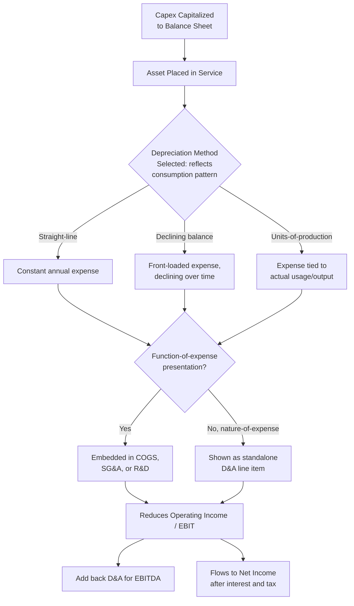

## Income Statement Effects Through Depreciation

### Overview

While capital expenditure itself does not appear directly on the income statement — the cash outflow is capitalized to the balance sheet rather than expensed — its effect flows through the income statement gradually and systematically via **depreciation expense** (for tangible assets) and **amortization expense** (for intangible assets). This is the core mechanism through which the **matching principle** operates for long-lived assets: the cost of an asset is recognized as an expense over the periods in which it generates revenue, rather than entirely in the period of purchase.

### Where Depreciation Appears on the Income Statement

**[Confirmed]** Depreciation expense is not always presented as a single standalone line item; its presentation depends on the income statement format used:

| Presentation Approach | Depreciation Treatment |
| --- | --- |
| Nature-of-expense method | Depreciation shown as its own distinct line item, aggregated across the entire business |
| Function-of-expense method (cost of sales method) | Depreciation is embedded within functional categories — Cost of Goods Sold (for production-related assets), Selling expenses, General & Administrative expenses, or R&D expenses — based on the asset's use |

**[Confirmed]** Under the function-of-expense method (common in the US and widely used internationally), a manufacturing company's factory equipment depreciation typically flows into **Cost of Goods Sold**, while depreciation on corporate office equipment or administrative buildings flows into **SG&A**, meaning total depreciation expense is often not directly visible as a single line and must be sourced from the cash flow statement (indirect method add-back) or the PP&E footnote disclosure instead.

**[Confirmed]** When the function-of-expense method is used, IFRS (IAS 1) requires supplemental disclosure of the **nature of expenses**, including total depreciation and amortization, in the notes to the financial statements — ensuring the aggregate D&A figure remains available even when it is not shown as a single line on the face of the income statement.

### Depreciation's Position in the Income Statement Hierarchy

**[Confirmed]** Depreciation is an operating expense and is reflected before arriving at **Operating Income (EBIT)**:



```
Revenue
  Less: Cost of Goods Sold (may include production-related depreciation)
= Gross Profit
  Less: Operating Expenses (SG&A, R&D — may include related depreciation)
= Operating Income (EBIT)
  Less: Interest Expense
  Plus: Interest Income
= Pre-Tax Income (EBT)
  Less: Income Tax Expense
= Net Income
```

$$\text{EBITDA} = \text{EBIT} + \text{Depreciation} + \text{Amortization}$$

**[Confirmed]** EBITDA is explicitly constructed by adding back D&A to EBIT precisely because D&A is a non-cash charge embedded within operating expenses — this reconstruction is a primary reason EBITDA is widely used as an approximation of operating cash-generating capacity before the effects of Capex-driven depreciation, financing structure, and tax jurisdiction.

### Depreciation Method Selection and Its Income Statement Impact

**[Confirmed]** Both IFRS (IAS 16) and US GAAP (ASC 360) require that the depreciation method used reflect the pattern in which the asset's future economic benefits are expected to be consumed by the entity — the method is not a free choice independent of the asset's actual usage/consumption pattern, though multiple methods are permitted depending on which best reflects that pattern.

**Common depreciation methods and their income statement expense patterns:**

| Method | Formula | Expense Pattern Over Time |
| --- | --- | --- |
| Straight-line | $\frac{\text{Cost} - \text{Residual Value}}{\text{Useful Life}}$ | Constant expense each period |
| Declining balance (accelerated) | $\text{NBV} \times \text{Depreciation Rate}$ | Higher expense in early years, declining thereafter |
| Sum-of-the-years'-digits | $\frac{\text{Remaining Life}}{\text{Sum of Years' Digits}} \times (\text{Cost} - \text{Residual})$ | Higher expense in early years, declining thereafter (less aggressive than declining balance) |
| Units-of-production | $\frac{\text{Cost} - \text{Residual Value}}{\text{Total Expected Units}} \times \text{Units Produced This Period}$ | Variable expense tied directly to actual usage/output |

**Worked Example — Comparing Straight-Line vs. Declining Balance:**

Asset cost: $100,000; residual value: $10,000; useful life: 5 years; declining balance rate: 40%.

| Year | Straight-Line Expense | Declining Balance Expense | Declining Balance NBV (end of year) |
| --- | --- | --- | --- |
| 1 | $18,000 | $40,000 | $60,000 |
| 2 | $18,000 | $24,000 | $36,000 |
| 3 | $18,000 | $14,400 | $21,600 |
| 4 | $18,000 | $8,640 | $12,960 |
| 5 | $18,000 | $2,960 (capped at residual value) | $10,000 |
| **Total** | **$90,000** | **$90,000** |  |

**[Confirmed]** Total depreciation expense over the full useful life is identical under both methods ($90,000, equal to cost minus residual value) — the choice of method affects only the **timing/pattern** of expense recognition across periods, not the total lifetime expense.

**[Inference]** This timing difference has meaningful implications for period-by-period reported profitability: accelerated methods front-load expense recognition, depressing earnings in early asset life and improving them in later years relative to straight-line, which can materially affect year-over-year earnings comparability for companies with large recent Capex programs depending on which method they apply.

### Useful Life and Residual Value Estimates — Sources of Judgment

**[Confirmed]** Both useful life and residual value are **accounting estimates**, not fixed facts, and both frameworks require periodic reassessment (at least annually) with prospective adjustment if expectations change materially — changes are accounted for as a **change in accounting estimate**, applied prospectively (not retrospectively restating prior periods).

$$\text{Revised Annual Depreciation} = \frac{\text{Remaining NBV} - \text{Revised Residual Value}}{\text{Revised Remaining Useful Life}}$$

**[Inference]** Because useful life and residual value are estimates rather than observable facts, they represent a meaningful area of managerial judgment that can affect reported earnings — extending an estimated useful life reduces annual depreciation expense (increasing reported earnings), while shortening it increases annual depreciation expense (decreasing reported earnings), even though the underlying economics of the asset itself has not changed. This is a commonly scrutinized area in earnings quality analysis.

### Depreciation and Tax Reporting Divergence (Book vs. Tax Depreciation)

**[Confirmed]** In most jurisdictions, the depreciation method and schedule used for **financial reporting** (book depreciation, per IFRS/US GAAP) commonly differs from the depreciation schedule permitted for **tax purposes** (tax depreciation, per local tax code — e.g., MACRS in the US), since tax authorities often prescribe specific, sometimes accelerated, depreciation schedules independent of the entity's own estimate of economic useful life.

**[Confirmed]** This book-tax divergence is the primary driver of **deferred tax liabilities/assets** related to fixed assets: when tax depreciation exceeds book depreciation in early years (common with accelerated tax depreciation schedules), taxable income is temporarily lower than book pre-tax income, creating a **deferred tax liability** that reverses in later years as the pattern inverts.

$$\text{Deferred Tax Liability (PP\&E-related)} = (\text{Tax Basis} - \text{Book Basis}) \times \text{Tax Rate} \quad \text{(when tax basis} < \text{book basis)}$$

**[Inference]** This divergence means reported net income (book) and taxable income (tax return) for a capital-intensive company can differ materially in any given year purely due to depreciation timing differences, even with zero difference in underlying economic performance — a key reason effective tax rate analysis must account for deferred tax movements rather than relying solely on the current-year cash tax rate.

### Impairment's One-Time Income Statement Impact

**[Confirmed]** Distinct from the systematic, gradual expense recognition of ordinary depreciation, an **impairment loss** is recognized as a discrete, often large, one-time charge to the income statement in the period the impairment is identified, immediately reducing the asset's carrying value to its recoverable amount.

**[Inference]** Because impairment charges are typically non-recurring and can be substantial relative to normal periodic depreciation, they are commonly presented separately (or at minimum separately disclosed) from routine D&A, and are frequently excluded from "adjusted" or "non-GAAP" earnings metrics that companies present to highlight underlying operating performance — though analysts should evaluate whether repeated "one-time" impairments across multiple periods actually reflect a persistent pattern of overinvestment or poor capital allocation rather than a genuinely isolated event.

### Effect on Key Profitability and Return Metrics

| Metric | Effect of Depreciation |
| --- | --- |
| Gross Margin | Reduced if production-related depreciation is embedded in COGS |
| Operating Margin (EBIT margin) | Directly reduced by full D&A embedded in operating expenses |
| EBITDA Margin | Unaffected by D&A (added back), often used specifically to strip out this effect |
| Net Margin | Reduced by full D&A (flows through to pre-tax and net income) |
| Return on Assets (ROA) | Numerator reduced by D&A's effect on net income; denominator reduced by accumulated depreciation's effect on asset base — net effect on the ratio depends on relative magnitudes |
| Interest Coverage Ratio | Unaffected directly (typically based on EBIT or EBITDA, not net income) but the EBIT vs. EBITDA basis choice materially changes the ratio for high-D&A companies |

**[Inference]** The divergence between EBITDA margin and Operating (EBIT) margin trends over time is itself an informative signal: a widening gap between the two (EBITDA margin holding steady while EBIT margin declines) often indicates rising depreciation intensity relative to revenue — frequently a direct consequence of a recent or ongoing elevated Capex cycle working its way through the depreciation schedule.

### Depreciation Flow Through the Income Statement (Mermaid)



### EBIT to EBITDA Bridge (svg_diagram)

<svg viewBox="0 0 760 260" xmlns="http://www.w3.org/2000/svg">
<text x="380" y="26" font-size="17" font-weight="bold" text-anchor="middle" fill="#1a1a1a">EBIT to EBITDA Bridge (svg_diagram)</text>
<rect x="40" y="90" width="180" height="70" rx="8" fill="#eef3fb" stroke="#3b5998" stroke-width="1.5"/>
<text x="130" y="120" font-size="12" font-weight="bold" text-anchor="middle" fill="#1a1a1a">Operating Income</text>
<text x="130" y="138" font-size="12" font-weight="bold" text-anchor="middle" fill="#1a1a1a">(EBIT)</text>

<text x="250" y="130" font-size="20" font-weight="bold" text-anchor="middle" fill="`#2f8f4e`">+</text>

<rect x="280" y="90" width="180" height="70" rx="8" fill="#fde8e8" stroke="#b33a3a" stroke-width="1.5"/>
<text x="370" y="120" font-size="12" font-weight="bold" text-anchor="middle" fill="#1a1a1a">Depreciation &</text>
<text x="370" y="138" font-size="12" font-weight="bold" text-anchor="middle" fill="#1a1a1a">Amortization</text>

<text x="490" y="130" font-size="20" font-weight="bold" text-anchor="middle" fill="#333">=</text>

<rect x="520" y="90" width="200" height="70" rx="8" fill="#e3f5e6" stroke="#2f8f4e" stroke-width="1.5"/>
<text x="620" y="130" font-size="13" font-weight="bold" text-anchor="middle" fill="#1a1a1a">EBITDA</text>

<text x="380" y="200" font-size="11" text-anchor="middle" fill="#333">Non-cash charge from prior Capex,</text>

<text x="380" y="216" font-size="11" text-anchor="middle" fill="#333">reversed to approximate cash-basis operating profitability</text>

</svg>

**Related Topics**

- Depreciation method selection and asset consumption pattern justification
- Deferred tax liability mechanics from book-tax depreciation divergence
- EBITDA as an operating performance proxy and its analytical limitations
- Impairment loss recognition and its distinction from routine depreciation
- Change in accounting estimate treatment for useful life/residual value revisions
- Earnings quality analysis and depreciation-related managerial judgment risk
- Function-of-expense vs. nature-of-expense income statement presentation