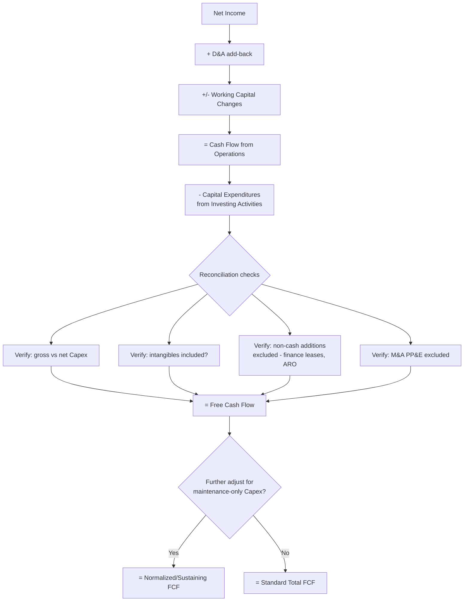

## Capex versus Free Cash Flow Reconciliation

### Definition

**Free Cash Flow (FCF)** reconciliation refers to the process of deriving free cash flow from reported financial statement figures, and understanding precisely how Capex interacts with, reduces, and is sometimes adjusted within that derivation. Because FCF is not itself a defined line item under either IFRS or US GAAP, its calculation methodology — and specifically how Capex is measured and applied — is an area with meaningful variation in practice, making the reconciliation process an essential analytical skill.

**[Confirmed]** FCF is a **non-GAAP/non-IFRS measure** in the sense that no accounting standard mandates its calculation or presentation, though most companies and analysts converge on broadly similar core formulas.

### The Base FCF Formula

$$\text{Free Cash Flow (FCF)} = \text{Cash Flow from Operations (CFO)} - \text{Capital Expenditures}$$

**[Confirmed]** This is the most widely used and simplest FCF formula, sourced entirely from the cash flow statement: CFO from the Operating Activities section, and Capex from the "Purchases of property, plant and equipment" (and often intangibles) line within Investing Activities.

**Worked Example — Basic FCF Reconciliation:**

| Line Item | Amount |
| --- | --- |
| Net Income | $40,000,000 |
| Add: Depreciation & Amortization | $18,000,000 |
| Add/(Less): Changes in Working Capital | $(3,000,000) |
| **Cash Flow from Operations (CFO)** | **$55,000,000** |
| Less: Capital Expenditures | $(22,000,000) |
| **Free Cash Flow (FCF)** | **$33,000,000** |

### Alternative FCF Formula Starting from Net Income

**[Confirmed]** An equivalent, algebraically consistent derivation starts directly from net income rather than CFO, making the role of D&A and Capex more explicit:

$$\text{FCF} = \text{Net Income} + D\&A - \text{Capex} - \Delta \text{Net Working Capital}$$

**[Inference]** This formulation highlights a key structural relationship in FCF analysis: D&A is added back (since it reduced net income without any current-period cash outflow), while Capex is subtracted (since it represents a current-period cash outflow that did *not* reduce net income, having instead been capitalized to the balance sheet) — Capex and D&A move through the FCF calculation in opposite directions specifically because of this timing mismatch between cash payment and expense recognition discussed in the earlier income statement material.

### Unlevered vs. Levered Free Cash Flow — Capex Treatment Is Identical

**[Confirmed]** Capex is subtracted identically in both major FCF variants used in valuation — the distinction between them lies in how financing costs are treated, not in Capex treatment:

$$\text{Unlevered FCF (FCFF)} = \text{EBIT} \times (1 - \text{Tax Rate}) + D\&A - \text{Capex} - \Delta \text{Net Working Capital}$$

$$\text{Levered FCF (FCFE)} = \text{Net Income} + D\&A - \text{Capex} - \Delta \text{Net Working Capital} + \text{Net Borrowing}$$

**[Confirmed]** FCFF (Free Cash Flow to Firm, also called Unlevered FCF) represents cash flow available to *all* capital providers (both debt and equity holders) before financing costs, and is the cash flow basis typically used in enterprise-value DCF models discounted at WACC. FCFE (Free Cash Flow to Equity, also called Levered FCF) represents cash flow available specifically to equity holders after debt service, and is discounted at the cost of equity in equity-value DCF models.

**[Inference]** In both formulas, Capex is deducted in full at the same point in the calculation — meaning the choice between levered and unlevered FCF does not change how much Capex reduces cash flow, only how the remaining financing-related cash flows (interest, debt principal) are subsequently layered in.

### Sources of Reconciliation Discrepancy

**[Inference]** When reconciling Capex figures across sources (cash flow statement vs. PP&E note vs. management-guided figures vs. third-party data providers), several common discrepancies arise that analysts should specifically check for:

| Discrepancy Source | Explanation |
| --- | --- |
| Gross vs. net Capex | Some data sources or company disclosures net Capex against disposal proceeds; others report gross spending only |
| Intangible asset inclusion | Some "Capex" figures include only tangible PP&E; others include capitalized intangibles (software, development costs) as well |
| Timing/accrual differences | Capex incurred but not yet paid in cash (accrued in payables) creates a difference between accrual-based additions and actual cash-basis Capex on the cash flow statement |
| Non-cash Capex (finance leases, ARO) | Assets acquired via finance lease or capitalized ARO additions appear in the PP&E balance sheet roll-forward but not as cash Capex on the cash flow statement |
| M&A-acquired PP&E | PP&E acquired through a business combination increases the balance sheet asset base but is excluded from the "organic" Capex line, appearing instead within the separate acquisitions investing cash flow |
| Segment-level vs. consolidated reporting | Segment-reported Capex figures (in notes) may not sum precisely to consolidated Capex due to intercompany eliminations or corporate/unallocated items |

**[Inference]** A rigorous FCF reconciliation exercise should specifically trace the reported Capex figure back to its source line item(s) on the cash flow statement, cross-check it against the PP&E roll-forward note (accounting for any non-cash additions disclosed supplementally), and confirm whether intangible asset capitalization is included or excluded — since analysts using inconsistent Capex definitions across peer companies can produce materially misleading FCF-based comparisons.

### FCF Yield and Valuation Application

$$\text{FCF Yield} = \frac{\text{Free Cash Flow}}{\text{Market Capitalization (or Enterprise Value)}}$$

$$\text{FCF Conversion Rate} = \frac{\text{Free Cash Flow}}{\text{EBITDA}}$$

**[Inference]** FCF conversion rate is a widely used capital-intensity-sensitive metric: a low FCF-to-EBITDA conversion rate for a given company often signals high capital intensity (a large share of EBITDA is being consumed by Capex before reaching free cash flow), while a high conversion rate suggests a comparatively asset-light or capital-efficient business model — making this ratio a useful cross-check on the capital intensity assessment developed via Capex-to-Revenue analysis.

$$\text{Capex Intensity within FCF} = \frac{\text{Capex}}{\text{EBITDA}} = 1 - \text{FCF Conversion Rate (approximation, ignoring working capital and tax effects)}$$

### The Maintenance Capex Adjustment in "Normalized" FCF

**[Confirmed]** As covered in the maintenance-vs-growth Capex material, analysts frequently construct an adjusted or "normalized" FCF measure specifically to isolate sustainable cash generation from discretionary growth investment:

$$\text{Normalized FCF (sustaining basis)} = \text{CFO} - \text{Maintenance Capex}$$

**[Inference]** This normalized measure is particularly relevant in credit analysis, dividend sustainability assessment, and mature-company valuation, where the analyst wants to understand cash generation capacity *before* accounting for discretionary growth spending the company could choose to defer — as distinct from the standard "total Capex" FCF formula, which nets out all capital spending regardless of its discretionary nature.

### Reconciling Reported "Capex Guidance" to Actual Cash Flow Statement Figures

**[Inference]** Companies frequently provide forward Capex guidance in investor communications (e.g., "we expect $X–Y million in Capex next year") that may be defined differently from the strict cash-flow-statement Capex figure — guidance figures sometimes reflect *committed* or *accrual-basis planned* spending rather than the cash actually expected to be paid, or may explicitly exclude/include specific categories (e.g., excluding M&A-related capital spending, or including finance-lease-funded additions that will not appear as cash Capex). Analysts reconciling actual results against prior guidance should specifically confirm the definitional basis management used.

### FCF Reconciliation Bridge (Mermaid)

### FCF Derivation Paths (svg_diagram)

<svg xmlns="http://www.w3.org/2000/svg" viewBox="0 0 760 300">
<text x="380" y="26" font-size="17" font-weight="bold" text-anchor="middle" fill="#1a1a1a">Two Equivalent Paths to FCF (svg_diagram)</text>
<rect x="40" y="55" width="320" height="200" rx="10" fill="#eef3fb" stroke="#3b5998" stroke-width="1.5" />
<text x="200" y="80" font-size="13" font-weight="bold" text-anchor="middle" fill="#1a1a1a">Path 1: From CFO</text>
<text x="200" y="110" font-size="11" text-anchor="middle" fill="#333">Cash Flow from Operations</text>
<text x="200" y="130" font-size="16" text-anchor="middle" fill="#b33a3a">− Capex</text>
<text x="200" y="155" font-size="12" font-weight="bold" text-anchor="middle" fill="#1a1a1a">= Free Cash Flow</text>
<text x="200" y="185" font-size="10" text-anchor="middle" fill="#333">Sourced directly from</text>
<text x="200" y="200" font-size="10" text-anchor="middle" fill="#333">cash flow statement</text>
<text x="200" y="220" font-size="10" text-anchor="middle" fill="#333">(most common approach)</text>
<rect x="400" y="55" width="320" height="200" rx="10" fill="#f6eefb" stroke="#7a3b98" stroke-width="1.5" />
<text x="560" y="80" font-size="13" font-weight="bold" text-anchor="middle" fill="#1a1a1a">Path 2: From Net Income</text>
<text x="560" y="108" font-size="11" text-anchor="middle" fill="#333">Net Income</text>
<text x="560" y="126" font-size="11" text-anchor="middle" fill="#2f8f4e">+ D&amp;A</text>
<text x="560" y="144" font-size="11" text-anchor="middle" fill="#333">± Δ Working Capital</text>
<text x="560" y="162" font-size="16" text-anchor="middle" fill="#b33a3a">− Capex</text>
<text x="560" y="187" font-size="12" font-weight="bold" text-anchor="middle" fill="#1a1a1a">= Free Cash Flow</text>
<text x="560" y="215" font-size="10" text-anchor="middle" fill="#333">Explicit, useful for</text>
<text x="560" y="230" font-size="10" text-anchor="middle" fill="#333">DCF model construction</text>
</svg>

### Common Analytical Pitfalls in FCF-Capex Reconciliation

- **[Inference]** Comparing FCF across companies without confirming Capex definitional consistency (gross vs. net, tangible-only vs. inclusive of intangibles) can produce misleading capital efficiency comparisons, particularly across industries with different intangible investment intensity.
- **[Inference]** Failing to account for non-cash Capex additions (finance leases in particular) can understate the true growth in a company's operating asset base even when cash-basis FCF appears strong, since lease-funded capacity expansion bypasses the cash Capex line entirely while still representing real economic investment.
- **[Confirmed]** Under IFRS 16 and ASC 842 (current lease accounting standards), most leases are now capitalized on the balance sheet as right-of-use assets with corresponding lease liabilities, meaning lease payments are split between a financing-like principal repayment and interest expense on the cash flow statement, rather than appearing as a straightforward Capex-style investing outflow — this is a specific point of attention when reconciling total capital deployment (including leased capacity) against the traditional cash-flow-statement Capex line alone.

**Related Topics**

- FCFF vs. FCFE construction and appropriate discount rate application (WACC vs. cost of equity)
- FCF yield and FCF conversion rate as valuation and capital intensity screens
- Maintenance Capex estimation methods for normalized FCF calculation
- IFRS 16 / ASC 842 lease capitalization effects on cash flow statement classification
- Working capital change analysis and its role in the FCF bridge
- Credit analysis application of sustaining FCF for debt service coverage assessment
- Cross-company Capex definitional consistency checks for peer benchmarking