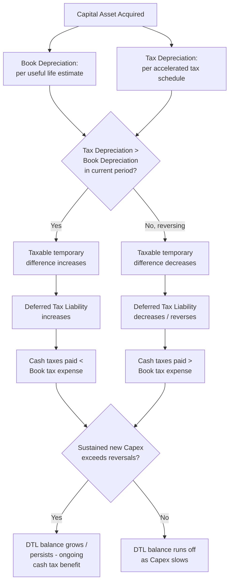

## Deferred Tax Effects of Capital Investment

### Definition

**Deferred tax effects of capital investment** refer to the balance sheet and income statement consequences of differences between the **tax basis** and **book (accounting) basis** of capital assets — differences that arise because tax law and financial accounting standards apply different rules to depreciation timing, capitalization thresholds, and asset recognition. These differences are temporary in nature (they reverse over the asset's life) and give rise to **deferred tax liabilities (DTLs)** or **deferred tax assets (DTAs)**, governed by **IAS 12 (Income Taxes)** under IFRS and **ASC 740 (Income Taxes)** under US GAAP.

### The Core Mechanism: Book-Tax Basis Divergence

**[Confirmed]** The fundamental driver of deferred tax on capital assets is that **tax depreciation schedules** (prescribed by tax law, e.g., MACRS in the US, or capital allowances regimes in other jurisdictions) frequently differ from **book depreciation** (determined per the entity's own useful life/method estimates under IFRS/US GAAP) — most commonly because tax law permits **accelerated depreciation** (front-loaded deductions) relative to the straight-line or other pattern used for book purposes.

$$\text{Temporary Difference} = \text{Book Carrying Amount} - \text{Tax Basis}$$

$$\text{Deferred Tax Liability} = \text{Temporary Difference} \times \text{Applicable Tax Rate} \quad \text{(when Book Basis} > \text{Tax Basis)}$$

**[Confirmed]** When tax depreciation exceeds book depreciation in early years (the typical pattern with accelerated tax depreciation), the asset's tax basis falls faster than its book basis, creating a taxable temporary difference — meaning **more tax will be owed in future periods** relative to book income as the pattern reverses (tax depreciation slows or stops while book depreciation continues), resulting in a **deferred tax liability**.

### Worked Example — Book-Tax Depreciation Divergence

Assume an asset costing $100,000, no residual value, with a 5-year book useful life (straight-line) and eligible for full first-year tax expensing (a common accelerated tax provision such as Section 179 or bonus depreciation in the US, or equivalent capital allowance regimes elsewhere). Assume a 25% tax rate.

| Year | Book Depreciation | Tax Depreciation | Book NBV | Tax Basis | Temporary Difference | Cumulative DTL |
| --- | --- | --- | --- | --- | --- | --- |
| 1 | $20,000 | $100,000 | $80,000 | $0 | $80,000 | $20,000 |
| 2 | $20,000 | $0 | $60,000 | $0 | $60,000 | $15,000 |
| 3 | $20,000 | $0 | $40,000 | $0 | $40,000 | $10,000 |
| 4 | $20,000 | $0 | $20,000 | $0 | $20,000 | $5,000 |
| 5 | $20,000 | $0 | $0 | $0 | $0 | $0 |

**[Inference]** This example illustrates the classic pattern: the deferred tax liability builds up rapidly in the early year(s) when tax depreciation outpaces book depreciation, then gradually unwinds ("reverses") over subsequent years as book depreciation continues while tax depreciation has already been fully utilized — by the end of the asset's life, the temporary difference and the associated DTL return to zero, since total depreciation (book and tax) must equal the same $100,000 over the full life.

### Why This Matters — Cash Tax vs. Book Tax Divergence

**[Confirmed]** The existence of deferred tax on capital assets means that a company's **cash taxes paid** in a given period can differ materially from its **book income tax expense** reported on the income statement:

$$\text{Total Income Tax Expense (book)} = \text{Current Tax Expense} + \text{Deferred Tax Expense (or Benefit)}$$

**[Inference]** In years when a company is making substantial new capital investments and benefiting from accelerated tax depreciation, **cash taxes paid tend to be lower than book tax expense** would suggest (since taxable income is temporarily reduced more than book pre-tax income), while book income tax expense includes an offsetting deferred tax expense component that "catches up" the accounting for the eventual reversal — meaning analysts assessing a capital-intensive company's true cash tax burden and free cash flow should examine the cash flow statement's actual cash taxes paid (or the current tax expense component) rather than relying solely on the reported book effective tax rate.

### Effective Tax Rate Distortion from Capital Investment Cycles

$$\text{Effective Tax Rate (ETR)} = \frac{\text{Total Income Tax Expense}}{\text{Pre-Tax Income}}$$

**[Inference]** A company undergoing a sustained, growing capital investment program (where new Capex consistently exceeds the reversal of prior years' temporary differences) will generally experience an ongoing **cash tax benefit** relative to its book tax expense — sometimes described as tax deferral acting similarly to an interest-free loan from the taxing authority, since the tax liability is postponed (not eliminated) to future periods. Conversely, a company whose Capex program is declining or maturing (where reversals of older temporary differences outpace new deferrals) will see this cash tax benefit shrink or reverse, pushing cash taxes paid closer to, or even above, book tax expense in a given period.

**[Confirmed]** This dynamic is a specifically recognized phenomenon in capital-intensive industries with large, ongoing capital expenditure programs, where the deferred tax liability related to PP&E can represent a substantial, persistent balance sheet item that effectively never fully reverses in aggregate as long as the company continues investing in new capital assets at a pace exceeding the rate of reversal from older assets — sometimes informally described as a "revolving" deferred tax balance.

### Balance Sheet Presentation

**[Confirmed]** Deferred tax liabilities and assets arising from capital investment are presented on the balance sheet, generally as **non-current** items (reflecting the typically long-term nature of PP&E-related temporary differences), and are subject to **jurisdictional netting rules**: under both IFRS and US GAAP, deferred tax assets and liabilities can generally only be offset/presented net when they relate to income taxes levied by the same taxing authority on the same taxable entity (or group filing jointly), and are otherwise presented gross by jurisdiction.

**[Unverified]** Precise netting and presentation mechanics (e.g., current vs. non-current classification rules, which were simplified in recent years under US GAAP to require all deferred tax to be classified as non-current) can vary by jurisdiction and have been subject to standard-setting changes over time; the current applicable text of IAS 12 or ASC 740 (and local tax law) should be confirmed for precise application.

### Recognition of Deferred Tax Assets — The Valuation Allowance / Recoverability Test

**[Confirmed]** While most PP&E-related temporary differences from accelerated tax depreciation create deferred tax *liabilities*, deferred tax *assets* related to capital assets can arise in certain circumstances — for example, when book depreciation temporarily exceeds tax depreciation (less common but possible depending on the specific tax regime), or when an asset has been impaired for book purposes (reducing book carrying value) without a corresponding tax deduction having yet been recognized.

**[Confirmed]** Both frameworks require that a deferred tax asset be recognized only to the extent it is **probable** (IFRS) or **more likely than not** (US GAAP) that sufficient future taxable profit will be available against which the deductible temporary difference can be utilized. Under US GAAP, if this recoverability threshold is not met, a **valuation allowance** is recorded against the DTA; IFRS achieves a broadly similar economic outcome by simply not recognizing the DTA (or recognizing only the recoverable portion) rather than using a separate contra-asset valuation allowance mechanism.

### Effect of a Change in Tax Rates

**[Confirmed]** Because deferred tax balances are measured using the tax rate expected to apply when the temporary difference reverses, a change in enacted tax law (a change in the statutory tax rate) requires **remeasurement of existing deferred tax balances** at the new rate, with the resulting adjustment recognized immediately in the income statement (or, in certain cases, directly in equity/other comprehensive income if the original item was recognized there) in the period the rate change is enacted — not spread prospectively over the remaining life of the underlying asset.

$$\text{Remeasured DTL} = \text{Existing Temporary Difference} \times \text{New Enacted Tax Rate}$$

**[Inference]** For capital-intensive companies with large accumulated PP&E-related deferred tax liabilities, a change in the statutory corporate tax rate (whether an increase or decrease) can produce a material, one-time, non-cash income statement impact in the period of enactment purely from this remeasurement, unrelated to the company's actual current-period operating performance — a commonly flagged "one-time" or "non-recurring" item in earnings analysis following major tax legislation changes.

### Interaction with Capital Intensity Analysis

**[Inference]** For capital-intensive businesses (utilities, manufacturing, telecom, oil & gas), the PP&E-related deferred tax liability is often one of the largest single line items on the balance sheet's liability side, and its trajectory is directly tied to the pace of ongoing Capex: sustained high Capex growth tends to sustain or grow the DTL balance (continued acceleration benefit), while a slowdown or plateau in Capex allows the DTL to gradually "run off" as older temporary differences reverse faster than new ones are created.

**[Inference]** Analysts modeling long-term free cash flow for capital-intensive companies often explicitly forecast the **cash tax rate** (reflecting the ongoing benefit or reversal of accelerated tax depreciation) separately from the **book effective tax rate**, since assuming the book ETR applies directly to cash tax obligations can materially misstate near- and medium-term free cash flow for companies with significant, ongoing capital investment programs.

### Deferred Tax Buildup and Reversal (Mermaid)

### Book vs Tax Depreciation Divergence (svg_diagram)

<svg xmlns="http://www.w3.org/2000/svg" viewBox="0 0 760 320">
<text x="380" y="26" font-size="17" font-weight="bold" text-anchor="middle" fill="#1a1a1a">Book vs Tax Depreciation Over Asset Life (svg_diagram)</text>
<line x1="80" y1="280" x2="700" y2="280" stroke="#333" stroke-width="1.5" />
<line x1="80" y1="280" x2="80" y2="50" stroke="#333" stroke-width="1.5" />
<text x="390" y="305" font-size="12" text-anchor="middle" fill="#333">Asset Life (Years)</text>
<text x="35" y="165" font-size="12" text-anchor="middle" fill="#333" transform="rotate(-90 35 165)">Depreciation Expense</text>
<path d="M100,120 L640,120" stroke="#3b5998" stroke-width="2.5" />
<text x="660" y="115" font-size="11" fill="#3b5998">Book (straight-line)</text>
<path d="M100,70 L220,70 L220,270 L640,270" stroke="#c98a1c" stroke-width="2.5" />
<text x="660" y="65" font-size="11" fill="#c98a1c">Tax (accelerated)</text>
<rect x="100" y="70" width="120" height="50" fill="#fff4e0" opacity="0.5" />
<text x="160" y="55" font-size="10" text-anchor="middle" fill="#333">DTL builds</text>
<rect x="220" y="120" width="420" height="150" fill="#eef3fb" opacity="0.4" />
<text x="430" y="140" font-size="10" text-anchor="middle" fill="#333">DTL reverses (unwinds)</text>
</svg>

**Related Topics**

- Accelerated tax depreciation schedules and jurisdiction-specific capital allowance regimes
- Effective tax rate reconciliation and cash tax rate forecasting for capital-intensive firms
- Valuation allowance assessment and deferred tax asset recoverability testing
- Tax rate change remeasurement effects on deferred tax balances
- Deferred tax netting and balance sheet classification rules (IAS 12 / ASC 740)
- Cash flow statement reconciliation of book tax expense to cash taxes paid
- Long-term free cash flow modeling incorporating deferred tax reversal patterns