## Capex Disclosure Requirements and Footnotes

### Overview

Capital expenditure disclosure requirements govern how companies communicate the nature, magnitude, and financial implications of their capex programs to investors, creditors, and regulators. These disclosures live across several parts of a financial report: the face of the primary statements (balance sheet, income statement, cash flow statement), the footnotes (notes to the financial statements), and supplementary narrative sections like Management's Discussion and Analysis (MD&A). Disclosure requirements are shaped primarily by two accounting frameworks — US GAAP (via the FASB Accounting Standards Codification, principally ASC 360, *Property, Plant, and Equipment*) and IFRS (principally IAS 16, *Property, Plant and Equipment*) — with additional requirements layered in by securities regulators such as the SEC (Regulation S-K) and stock exchange listing rules.

The purpose of capex disclosure is to let a financial statement user answer questions that the primary statements alone cannot answer: What is the composition of PP&E? How much was capitalized this period versus expensed? What depreciation method and useful lives are assumed? Are there impairments, disposals, or held-for-sale assets? What are the company's committed and planned future capital commitments?

### Regulatory and Standard-Setting Framework

**US GAAP (FASB ASC 360 — Property, Plant, and Equipment)**

ASC 360 governs recognition, measurement, and disclosure of PP&E. It does not prescribe a single required note format but establishes the disclosure objective: enable users to understand the nature and financial effects of capex-related transactions.

**IFRS (IAS 16 — Property, Plant and Equipment)**

IAS 16 is more prescriptive than ASC 360 in its disclosure checklist, explicitly enumerating required items (see below). IFRS also intersects with IAS 36 (*Impairment of Assets*), IAS 23 (*Borrowing Costs*), and IFRS 16 (*Leases*) for related capex disclosures.

**SEC Regulation S-K (US public companies)**

Item 303 (MD&A) requires discussion of material capital expenditures, known trends, and commitments affecting liquidity and capital resources. Item 601 requires exhibits (e.g., material contracts) that may include capex commitments. The SEC's plain-English and non-GAAP measure rules (Regulation G) also govern how companies discuss capex-adjusted metrics like free cash flow.

**Other frameworks**

Sector-specific regulators impose additional capex disclosure (e.g., utility rate-base filings, oil & gas full-cost/successful-efforts disclosures under ASC 932, telecom network buildout disclosures).

### Required Footnote Disclosures Under US GAAP (ASC 360)

**Key Points**

- **Balance composition**: Major classes of depreciable assets (e.g., land, buildings, machinery, leasehold improvements, construction in progress), each stated at gross carrying amount.
- **Accumulated depreciation**: Total accumulated depreciation, either by class or in aggregate.
- **Depreciation method(s)**: A general description of the method(s) used to compute depreciation with respect to major classes of depreciable assets (straight-line, units-of-production, declining balance, etc.).
- **Depreciation expense**: Total depreciation expense for the period, disclosed even if not separately presented on the income statement.
- **Useful lives / depreciation rates**: Either the range of estimated useful lives by asset class or the rates used.
- **Capitalized interest**: Under ASC 835-20, the amount of interest cost capitalized during the period, and total interest cost incurred.
- **Impairments**: Under ASC 360-10-35, disclosure of impairment losses recognized, the facts and circumstances leading to impairment, the method used to determine fair value, and the caption in the income statement.
- **Assets held for sale**: Description, expected disposal timing, and any related impairment.
- **Construction in progress (CIP)**: Often broken out separately since it is non-depreciating until placed in service; disclosure of major projects underway is common practice though not always mandated.

### Required Footnote Disclosures Under IFRS (IAS 16)

IAS 16 paragraph 73 requires, for each class of PP&E:

- The measurement basis used (cost model or revaluation model).
- Depreciation methods used.
- Useful lives or depreciation rates used.
- Gross carrying amount and accumulated depreciation (aggregated with accumulated impairment losses) at the beginning and end of the period.
- A **reconciliation of the carrying amount** at the beginning and end of the period, showing: additions; disposals; acquisitions through business combinations; increases/decreases from revaluations; impairment losses recognized/reversed (per IAS 36); depreciation; net foreign exchange differences; other movements.

IAS 16 paragraph 74 additionally encourages (but does not always mandate) disclosure of:

- Carrying amount of temporarily idle PP&E.
- Gross carrying amount of any fully depreciated PP&E still in use.
- Carrying amount of assets retired from active use and held for disposal.
- If the cost model is used, the fair value of PP&E when materially different from carrying amount.

If a **revaluation model** is used (permitted under IFRS, not under US GAAP), IAS 16 paragraph 77 requires disclosure of the effective date of revaluation, whether an independent valuer was involved, methods and assumptions in estimating fair values, and the revaluation surplus.

### The PP&E Rollforward (Reconciliation Table)

The centerpiece of most capex footnotes — mandatory under IFRS, common practice under US GAAP — is the rollforward schedule reconciling gross cost and accumulated depreciation from the opening to closing balance.

**Example** (illustrative, in $ millions):

| Asset Class | Land | Buildings | Machinery & Equipment | Construction in Progress | Total |
| --- | --- | --- | --- | --- | --- |
| **Gross cost, beginning of year** | 120 | 450 | 980 | 60 | 1,610 |
| Additions (capex) | 5 | 20 | 140 | 90 | 255 |
| Transfers from CIP | — | 15 | 40 | (55) | — |
| Disposals | (2) | (8) | (30) | — | (40) |
| Foreign currency translation | 1 | 3 | (5) | — | (1) |
| **Gross cost, end of year** | 124 | 480 | 1,125 | 95 | 1,824 |
| **Accumulated depreciation, beginning** | — | (180) | (520) | — | (700) |
| Depreciation expense | — | (18) | (95) | — | (113) |
| Disposals | — | 6 | 28 | — | 34 |
| **Accumulated depreciation, end** | — | (192) | (587) | — | (779) |
| **Net book value, end of year** | 124 | 288 | 538 | 95 | 1,045 |

This table simultaneously satisfies IAS 16's reconciliation requirement and answers the analyst's core question: how much of net capex (additions minus disposals) actually flowed through, and how does gross capex ($255M) compare to depreciation expense ($113M) — a useful proxy for whether the asset base is expanding, maintaining, or shrinking in real terms.

### Capital Commitments and Contractual Obligations

Both frameworks require disclosure of capital commitments — contracted but not yet incurred capex.

- **US GAAP**: ASC 440 (*Commitments*) requires disclosure of unconditional purchase obligations and significant capital commitments, including amounts and expected timing, even though these are typically off-balance-sheet.
- **IFRS**: IAS 16 paragraph 74(c) explicitly requires disclosure of "the amount of contractual commitments for the acquisition of property, plant and equipment."
- **SEC MD&A**: Registrants must discuss known material capital commitments and how they will be funded, often summarized in a **contractual obligations table** (historically required as a distinct table under old Item 303(a)(5); now integrated narratively following 2020 S-K amendments, but many issuers retain the table voluntarily for clarity).

**Example** capital commitments footnote language:

"As of December 31, 2025, the Company had contractual commitments of approximately $340 million for the purchase of property, plant, and equipment, primarily related to the expansion of its manufacturing facility in [location], expected to be substantially completed by fiscal year 2027."

### Capitalized Interest Disclosure

Under ASC 835-20 (US GAAP) and IAS 23 (IFRS), when a qualifying asset under construction incurs borrowing costs, interest must be capitalized as part of the asset's cost rather than expensed. Disclosure requirements include:

- Total interest cost incurred during the period.
- Amount capitalized (reducing the interest expense line and increasing the asset's carrying value).

$$\text{Interest Expensed} = \text{Total Interest Incurred} - \text{Interest Capitalized}$$

**Example** disclosure: "Total interest costs incurred during 2025 were $42 million, of which $11 million was capitalized as part of the cost of qualifying construction projects."

This matters for capex analysis because capitalized interest inflates both PP&E and reported capex figures relative to a pure cash-operating view, and analysts sometimes strip it out to compare "maintenance" versus "growth" capex more cleanly.

### Impairment Disclosures

**Key Points**

- **Trigger event description**: What circumstances (declining cash flows, technological obsolescence, restructuring, regulatory change) led to testing for impairment.
- **Impairment loss amount**: By asset or asset group, and the income statement line where recognized (often within operating expenses or a separate "impairment charges" line).
- **Fair value measurement inputs**: Under ASC 820 / IFRS 13, disclosure of the fair value hierarchy level (Level 1, 2, or 3) and valuation technique used (discounted cash flow, market comparables, replacement cost).
- **Reversal (IFRS only)**: IAS 36 permits impairment reversals for assets other than goodwill if circumstances change; US GAAP (ASC 360) prohibits reversal of impairment losses on held-and-used long-lived assets — a key GAAP/IFRS divergence relevant to capex-heavy industries like energy and telecom.

### Depreciation Method and Useful Life Disclosures

Companies must disclose enough information for users to understand how the gross capex balance converts into periodic expense.

**Example** disclosure table:

| Asset Class | Depreciation Method | Useful Life (years) |
| --- | --- | --- |
| Buildings | Straight-line | 20–40 |
| Machinery and equipment | Straight-line | 5–15 |
| Computer equipment and software | Straight-line | 3–5 |
| Leasehold improvements | Straight-line, lesser of lease term or useful life | Varies |
| Vehicles | Straight-line | 4–8 |

Changes in useful life estimates or depreciation method are treated as changes in accounting estimate (ASC 250 / IAS 8), applied prospectively, and require disclosure of the nature and, if practicable, the current-period and expected future effect.

### Segment-Level Capex Disclosure

**US GAAP (ASC 280)** and **IFRS (IFRS 8)** — both converged on the management approach — require disclosure of capex by reportable operating segment, since capex is a standard segment measure used by the chief operating decision maker (CODM). This typically appears in the segment footnote, not the PP&E footnote.

**Example** segment capex table:

| Segment | 2024 Capex | 2025 Capex |
| --- | --- | --- |
| North America | 210 | 245 |
| EMEA | 95 | 110 |
| Asia-Pacific | 60 | 75 |
| Corporate/Unallocated | 8 | 10 |
| **Total** | **373** | **440** |

### Cash Flow Statement Presentation Nuances

Capex appears in the **investing activities** section of the cash flow statement, typically as "purchases of property, plant and equipment" or "capital expenditures." Disclosure nuances include:

- Distinguishing cash capex from accrued/unpaid capex (a common reconciling item between the cash flow statement and the PP&E rollforward, since capex additions in the rollforward reflect accrual, not cash).
- Separate line items for capitalized software development costs (ASC 350-40) versus tangible PP&E.
- Proceeds from asset disposals shown gross, separate from capex outflows (not netted), per ASC 230.

[Inference] Many companies voluntarily disclose a reconciliation between accrual-based capex additions (from the PP&E note) and cash paid for capex (from the cash flow statement) in an MD&A liquidity discussion, though this reconciliation itself is not universally mandated by GAAP or IFRS.

### MD&A Narrative Disclosure Requirements (SEC)

Beyond the footnotes, SEC-registered companies must address capex qualitatively and quantitatively in MD&A:

- **Liquidity and capital resources**: Historical and expected capex levels, sources of funding (operating cash flow, debt, equity).
- **Known trends or uncertainties**: E.g., anticipated increases in capex due to expansion, regulatory compliance, or technology upgrades.
- **Off-balance-sheet arrangements**: Any capex-related financing structures not on the balance sheet (less common since ASC 842/IFRS 16 brought most leases on-balance-sheet).

**Example** MD&A language: "We expect capital expenditures for fiscal 2026 to be in the range of $450 million to $500 million, primarily directed toward capacity expansion and data center infrastructure, funded through a combination of operating cash flow and our existing revolving credit facility."

### Non-GAAP Measures Involving Capex

Many companies present **free cash flow (FCF)** as a non-GAAP measure, defined as operating cash flow less capex. SEC Regulation G and Item 10(e) of Regulation S-K require:

- Equal or greater prominence of the most comparable GAAP measure.
- A clear reconciliation from GAAP operating cash flow to FCF.
- An explanation of why management believes the measure is useful.

$$\text{FCF} = \text{Cash Flow from Operations} - \text{Capital Expenditures}$$

Some companies further distinguish "maintenance capex" from "growth capex" as a non-GAAP breakdown — this split is **not standardized or audited** and disclosure practices vary significantly by company and industry. [Speculation] Because there is no authoritative definition, cross-company comparison of maintenance versus growth capex should be treated cautiously.

### Diagram: Where Capex Disclosures Live in a Financial Report

```mermaid
flowchart TD
    A[Annual Report / 10-K / 20-F] --> B[Primary Financial Statements]
    A --> C[Notes to Financial Statements]
    A --> D[MD&A - Item 303]
    A --> E[Exhibits]

    B --> B1[Balance Sheet: Net PP&E]
    B --> B2[Cash Flow Statement: Capex in Investing Activities]
    B --> B3[Income Statement: Depreciation Expense]

    C --> C1[PP&E Rollforward: Gross Cost, Accum. Depreciation]
    C --> C2[Depreciation Methods and Useful Lives]
    C --> C3[Capitalized Interest - ASC 835-20 / IAS 23]
    C --> C4[Impairment Disclosures - ASC 360 / IAS 36]
    C --> C5[Capital Commitments - ASC 440 / IAS 16.74c]
    C --> C6[Segment Capex - ASC 280 / IFRS 8]

    D --> D1[Historical Capex Trends]
    D --> D2[Forward Capex Guidance]
    D --> D3[Liquidity and Funding Sources]
    D --> D4[Non-GAAP: Free Cash Flow Reconciliation]

    E --> E1[Material Construction Contracts]
```

### Common Disclosure Deficiencies (Regulatory Focus Areas)

**Key Points**

- Vague or boilerplate impairment triggers that fail to explain company-specific facts and circumstances.
- Inconsistent segment capex figures between the segment footnote and MD&A narrative.
- Capitalized software costs commingled with PP&E without separate disclosure, obscuring the split between tangible and intangible capex.
- Non-GAAP FCF measures presented with more prominence than the GAAP reconciling measure (a direct Regulation G violation).
- Failure to update useful life or depreciation method disclosures after a change in estimate.

[Inference] These are recurring themes in SEC comment letters on PP&E and non-GAAP disclosures, based on well-documented patterns in SEC Division of Corporation Finance comment letter practice, though the frequency and emphasis shift over time with SEC enforcement priorities.

### Illustrative Diagram: Capex Disclosure Decision Flow (SVG)

<svg viewBox="0 0 760 340" xmlns="http://www.w3.org/2000/svg" font-family="Arial, sans-serif" font-size="13">
<text x="380" y="22" text-anchor="middle" font-size="15" font-weight="bold">Capex Disclosure Decision Flow (svg_diagram)</text>
<rect x="30" y="50" width="180" height="50" rx="6" fill="#dbeafe" stroke="#1e40af"/>
<text x="120" y="70" text-anchor="middle">Capex Transaction</text>
<text x="120" y="88" text-anchor="middle">Occurs</text>
<rect x="290" y="50" width="200" height="50" rx="6" fill="#fef3c7" stroke="#92400e"/>
<text x="390" y="70" text-anchor="middle">Capitalize or Expense?</text>
<text x="390" y="88" text-anchor="middle">(ASC 360 / IAS 16 criteria)</text>
<rect x="560" y="50" width="170" height="50" rx="6" fill="#dcfce7" stroke="#166534"/>
<text x="645" y="70" text-anchor="middle">Recognize as PP&E</text>
<text x="645" y="88" text-anchor="middle">on Balance Sheet</text>
<line x1="210" y1="75" x2="290" y2="75" stroke="#333" stroke-width="1.5" marker-end="url(#arrow)"/>
<line x1="490" y1="75" x2="560" y2="75" stroke="#333" stroke-width="1.5" marker-end="url(#arrow)"/>
<rect x="560" y="140" width="170" height="50" rx="6" fill="#fee2e2" stroke="#991b1b"/>
<text x="645" y="160" text-anchor="middle">Expense in Period</text>
<text x="645" y="178" text-anchor="middle">Incurred</text>
<line x1="390" y1="100" x2="645" y2="140" stroke="#333" stroke-width="1.5" marker-end="url(#arrow)"/>
<rect x="30" y="220" width="700" height="100" rx="6" fill="#f3f4f6" stroke="#374151"/>
<text x="380" y="242" text-anchor="middle" font-weight="bold">Resulting Footnote Disclosures</text>
<text x="60" y="265">- PP&E rollforward (gross cost, accum. depreciation, net book value)</text>
<text x="60" y="284">- Depreciation method and useful life table</text>
<text x="60" y="303">- Capitalized interest, impairment, and capital commitment notes</text>
<line x1="645" y1="100" x2="645" y2="140" stroke="#333" stroke-width="1.5" marker-end="url(#arrow)"/>
<line x1="500" y1="190" x2="450" y2="220" stroke="#333" stroke-width="1.5" marker-end="url(#arrow)"/>
<line x1="645" y1="190" x2="500" y2="220" stroke="#333" stroke-width="1.5" marker-end="url(#arrow)"/>
<defs>
<marker id="arrow" markerWidth="10" markerHeight="10" refX="8" refY="3" orient="auto" markerUnits="strokeWidth">
<path d="M0,0 L8,3 L0,6 Z" fill="#333"/>
</marker>
</defs>
</svg>

### Conclusion

Capex disclosure requirements exist to bridge the gap between a single net PP&E number on the balance sheet and the underlying economic reality of a company's capital investment program. The PP&E rollforward, depreciation policy tables, capitalized interest disclosures, impairment notes, capital commitment disclosures, and segment capex breakdowns collectively let analysts reconstruct gross investment activity, assess asset aging, and forecast future capital needs. IFRS imposes a more codified, checklist-style reconciliation requirement (IAS 16.73–74), while US GAAP relies more on the general disclosure objective under ASC 360 supplemented by SEC MD&A rules — a structural difference analysts should account for when comparing capex disclosures across GAAP and IFRS filers.

**Related Topics**

- Capitalization vs. expensing criteria (ASC 360-10-25 / IAS 16.7)
- Componentization and component depreciation under IFRS
- Impairment testing methodology (asset groups, recoverability tests, discount rate selection)
- Capitalized software costs (ASC 350-40) versus PP&E disclosure boundaries
- Lease capex and right-of-use asset disclosures (ASC 842 / IFRS 16)
- Maintenance capex vs. growth capex classification frameworks
- Segment reporting under the management approach (ASC 280 / IFRS 8)
- Free cash flow reconciliation and Regulation G compliance
- Asset retirement obligations (ASC 410) and their capex interaction
- Cross-border GAAP/IFRS convergence issues in PP&E disclosure