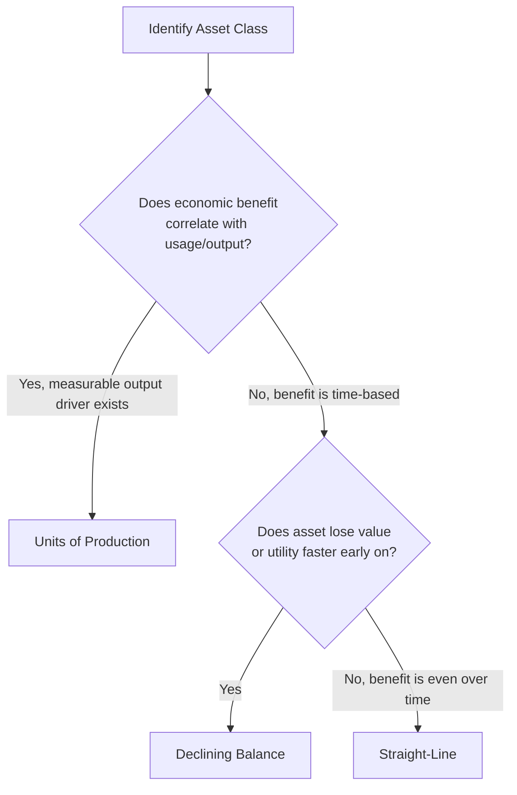

## Depreciation Methods: Straight-Line, Declining Balance, Units of Production

### Overview

Depreciation is the systematic allocation of a depreciable asset's cost, less any estimated residual (salvage) value, over its estimated useful life. It reflects the consumption of economic benefit embedded in a long-lived asset rather than an attempt to track fair market value period by period. Both US GAAP (ASC 360) and IFRS (IAS 16) require that the depreciation method reflect the pattern in which the asset's future economic benefits are expected to be consumed by the entity, and both permit multiple methods provided the choice is applied consistently and reviewed periodically. The three canonical methods — straight-line, declining balance (an accelerated method), and units of production (an activity-based method) — represent three different assumptions about how benefit is consumed over time.

### Core Inputs Common to All Methods

**Key Points**

- **Cost basis**: The fully capitalized cost of the asset, including purchase price, freight, installation, testing, and capitalized interest (ASC 835-20 / IAS 23) where applicable.
- **Residual (salvage) value**: The estimated amount recoverable at the end of the useful life, net of disposal costs. Under IFRS, residual value must be reviewed at least annually (IAS 16.51); US GAAP does not mandate annual review but requires reassessment when circumstances indicate a change.
- **Useful life**: Estimated in years (straight-line, declining balance) or in units of activity (units of production) — e.g., machine hours, units produced, miles driven.
- **Depreciable base**: Cost minus residual value. This is the amount actually allocated across the asset's life under straight-line and units of production. Declining balance methods, notably, do NOT use depreciable base as their computational input (see below) — this is a frequent point of confusion.

$$\text{Depreciable Base} = \text{Cost} - \text{Residual Value}$$

### Method 1: Straight-Line Depreciation

**Key Points**

Straight-line allocates an equal amount of depreciation expense to each period of the asset's useful life. It assumes the asset generates economic benefit evenly over time, making it the most common method for assets like buildings, office equipment, and leasehold improvements where usage-based wear is not the dominant factor.

$$\text{Annual Depreciation Expense} = \frac{\text{Cost} - \text{Residual Value}}{\text{Useful Life (years)}}$$

**Example**

An asset costs $100,000, has an estimated residual value of $10,000, and a useful life of 9 years.

$$\text{Annual Depreciation} = \frac{100{,}000 - 10{,}000}{9} = \$10{,}000 \text{ per year}$$

| Year | Beginning NBV | Depreciation Expense | Accumulated Depreciation | Ending NBV |
| --- | --- | --- | --- | --- |
| 1 | 100,000 | 10,000 | 10,000 | 90,000 |
| 2 | 90,000 | 10,000 | 20,000 | 80,000 |
| 3 | 80,000 | 10,000 | 30,000 | 70,000 |
| ... | ... | ... | ... | ... |
| 9 | 20,000 | 10,000 | 90,000 | 10,000 |

Note that the ending NBV in year 9 equals the residual value ($10,000), never depreciating below it.

**Advantages**: Simple to compute and forecast; predictable expense pattern aids budgeting; widely used and easily comparable across companies.

**Limitations**: Does not reflect assets that lose economic value or productive capacity faster in early years (e.g., vehicles, technology equipment); can understate expense (and overstate net income) in early years relative to actual economic consumption for such assets.

### Method 2: Declining Balance (Accelerated Depreciation)

**Key Points**

Declining balance methods apply a constant percentage rate to the asset's **declining net book value** (not the depreciable base), producing higher depreciation charges in early years and progressively smaller charges later. This reflects an assumption that the asset provides greater economic benefit, or experiences greater obsolescence risk, earlier in its life. The most common variant is **double-declining balance (DDB)**, which uses twice the straight-line rate.

$$\text{Straight-Line Rate} = \frac{1}{\text{Useful Life}}$$

$$\text{DDB Rate} = 2 \times \text{Straight-Line Rate}$$

$$\text{Depreciation Expense}_t = \text{Beginning NBV}_t \times \text{DDB Rate}$$

Critically, **residual value is excluded from the formula itself** but acts as a floor: depreciation stops once NBV reaches residual value, and the final year's expense is typically "plugged" to bring NBV down exactly to residual value (never below).

**Example**

Same asset: cost $100,000, residual value $10,000, useful life 5 years (shortened for illustration).

Straight-line rate = 1/5 = 20%. DDB rate = 40%.

| Year | Beginning NBV | DDB Rate | Depreciation Expense | Ending NBV |
| --- | --- | --- | --- | --- |
| 1 | 100,000 | 40% | 40,000 | 60,000 |
| 2 | 60,000 | 40% | 24,000 | 36,000 |
| 3 | 36,000 | 40% | 14,400 | 21,600 |
| 4 | 21,600 | 40% | 8,640 | 12,960 |
| 5 | 12,960 | 40% | 2,960* | 10,000 |

*Year 5 expense is plugged at $2,960 (rather than the formulaic $5,184) because unconstrained DDB would drive NBV below the $10,000 residual value floor. This plug/floor mechanic is a standard feature of DDB application, not an exception.

**Switching to straight-line**: A common practical refinement is to switch from DDB to straight-line in whichever year straight-line depreciation on the remaining depreciable base would produce a larger or equal expense than continuing DDB — this ensures the asset is fully depreciated to residual value by the end of its useful life without an awkward final-year plug, and is a widely used convention in both US tax and financial reporting practice. [Inference] The specific year of switchover depends on the useful life and rate chosen, and the exact optimal switch point should be recalculated per asset rather than assumed from this generic example.

**Advantages**: Better matches expense to assets whose utility or output declines with age (vehicles, machinery, tech hardware); front-loaded expense can align with front-loaded revenue generation or reduce near-term tax liability where accelerated methods are also permitted for tax purposes (jurisdiction-dependent).

**Limitations**: More complex to compute and forecast; produces declining income in early years relative to straight-line, which can be viewed unfavorably by some earnings-focused stakeholders; the choice of accelerator (150% vs 200% declining balance) is somewhat arbitrary and not tied to a specific economic measurement.

**150% Declining Balance**: A less aggressive variant used mainly in specific US tax contexts (MACRS), calculated identically but using 1.5× rather than 2× the straight-line rate.

### Method 3: Units of Production (Activity-Based Depreciation)

**Key Points**

Units of production ties depreciation expense directly to actual usage or output rather than the passage of time. It is the most economically precise method when an asset's wear correlates strongly with a measurable activity driver — machine hours, units manufactured, miles driven, tons extracted. It is common in manufacturing equipment, natural resource extraction (depletion, a related concept under ASC 930/932), and vehicle fleets.

$$\text{Depreciation Rate per Unit} = \frac{\text{Cost} - \text{Residual Value}}{\text{Total Estimated Units of Production over Useful Life}}$$

$$\text{Depreciation Expense}_t = \text{Depreciation Rate per Unit} \times \text{Units Produced in Period } t$$

**Example**

A manufacturing machine costs $500,000, has a residual value of $50,000, and is expected to produce 900,000 units over its life.

$$\text{Rate per Unit} = \frac{500{,}000 - 50{,}000}{900{,}000} = \$0.50 \text{ per unit}$$

| Year | Units Produced | Depreciation Expense | Accumulated Depreciation | Ending NBV |
| --- | --- | --- | --- | --- |
| 1 | 220,000 | 110,000 | 110,000 | 390,000 |
| 2 | 180,000 | 90,000 | 200,000 | 300,000 |
| 3 | 250,000 | 125,000 | 325,000 | 175,000 |
| 4 | 150,000 | 75,000 | 400,000 | 100,000 |
| 5 | 100,000 | 50,000 | 450,000 | 50,000 |

Note that expense fluctuates with actual production volume rather than following a fixed schedule — years with higher output (Year 3) carry proportionally higher depreciation charges.

**Advantages**: Closely matches expense recognition to the economic consumption pattern for usage-driven assets; expense naturally scales down during periods of low utilization (e.g., idle capacity), which some view as a more faithful representation of asset consumption.

**Limitations**: Requires reliable estimation of total lifetime production capacity, which is inherently uncertain and subject to revision (a change in estimate under ASC 250 / IAS 8); not suitable for assets like buildings or office furniture where usage isn't the primary driver of value consumption; if the asset produces nothing in a period (e.g., idle plant), no depreciation is recorded, which some analysts view as understating the economic cost of asset idleness. [Inference] Practice varies on how companies treat depreciation during planned versus unplanned idle time, so the specific accounting policy should be checked per company footnote.

### Comparative Summary Table

| Attribute | Straight-Line | Declining Balance | Units of Production |
| --- | --- | --- | --- |
| Expense pattern | Constant | Decreasing over time | Variable, tied to output |
| Basis of calculation | Depreciable base ÷ life | NBV × fixed rate | Depreciable base ÷ total units |
| Best fit for | Buildings, furniture, leasehold improvements | Vehicles, tech equipment, machinery with early obsolescence | Manufacturing equipment, mining/extraction, high-mileage fleets |
| Complexity | Low | Moderate | Moderate to high (requires output estimates) |
| Sensitivity to estimate revisions | Useful life change only | Useful life and rate change | Total lifetime unit estimate change |
| Early-year expense vs. straight-line | Baseline | Higher | Depends on usage pattern |

### Graphical Comparison of Expense Patterns

```mermaid
xychart-beta
    title "Depreciation Expense by Method Over 5 Years"
    x-axis [Year1, Year2, Year3, Year4, Year5]
    y-axis "Depreciation Expense ($)" 0 --> 130000
    bar "Straight-Line" [18000, 18000, 18000, 18000, 18000]
    bar "Declining Balance" [40000, 24000, 14400, 8640, 2960]
    bar "Units of Production" [110000, 90000, 125000, 75000, 50000]
```

### Decision Framework: Selecting a Depreciation Method

### Accounting and Reporting Considerations

**Consistency requirement**: Both GAAP and IFRS require the chosen method to be applied consistently period to period unless a change is justified by a change in the expected pattern of benefit consumption — a change in depreciation method is accounted for as a change in accounting estimate (ASC 250 / IAS 8), applied prospectively, not retrospectively.

**Component depreciation (IFRS-specific emphasis)**: IAS 16.43-47 requires that significant components of an asset with materially different useful lives or consumption patterns be depreciated separately (e.g., an aircraft's engines depreciated separately from its fuselage). US GAAP permits but does not mandate componentization to the same degree, though it is common practice for major asset classes like buildings (roof, HVAC, structure).

**Tax versus book depreciation divergence**: In many jurisdictions (notably the US via MACRS), the depreciation method used for tax purposes differs from the method used for financial reporting, creating temporary differences that generate deferred tax assets or liabilities under ASC 740 / IAS 12. [Inference] The magnitude and direction of this divergence depends on the specific tax regime and asset class, and should not be assumed uniform across jurisdictions.

**Impact on financial ratios**: Method choice affects reported net income, EBITDA add-back consistency, return on assets, and asset turnover ratios in the short and medium term, though total lifetime depreciation expense is identical across methods (all converge to depreciable base once residual value is reached) — only the *timing* differs.

### Conclusion

Straight-line, declining balance, and units of production represent three distinct philosophies for matching depreciation expense to the economic consumption of a long-lived asset: even allocation over time, front-loaded allocation reflecting early obsolescence or utility, and output-driven allocation reflecting actual usage. The selection of method should be grounded in the asset's expected consumption pattern rather than convenience, since it materially affects reported earnings trajectory, tax timing, and key financial ratios, even though the cumulative depreciation recognized over an asset's full life is the same regardless of method chosen.

**Related Topics**

- Component depreciation under IAS 16
- Sum-of-the-years'-digits method (a less common accelerated alternative)
- Depletion accounting for natural resource assets (ASC 930/932)
- Changes in accounting estimates (ASC 250 / IAS 8) applied to useful life and residual value revisions
- MACRS and tax depreciation systems versus book depreciation
- Impairment testing interaction with depreciation schedules
- Componentized depreciation for real estate and infrastructure assets
- Deferred tax effects of book-tax depreciation differences