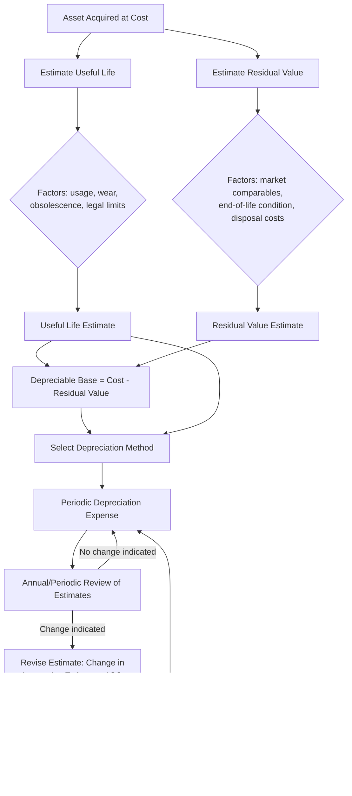

## Useful Life Estimation and Residual Value Assumptions

### Overview

Useful life and residual value are the two estimation inputs that, together with the depreciation method, determine the periodic depreciation expense recognized against a long-lived asset. Unlike the depreciation method itself — which is a policy choice — useful life and residual value are **accounting estimates**, meaning they are inherently judgmental, based on available information at the time, and subject to revision as circumstances change. Both US GAAP (ASC 360) and IFRS (IAS 16) require these estimates to be reviewed periodically, though IFRS is more explicit in mandating an annual review. Because these inputs directly drive the depreciable base and the expense schedule, errors or overly aggressive assumptions here are a recurring source of financial statement restatement risk and a common focus area in audit and regulatory review.

### Useful Life: Definition and Determinants

**Key Points**

Useful life is the period over which an asset is expected to be available for use by the entity, or the number of production or similar units expected to be obtained from the asset. Critically, useful life is an **entity-specific** concept, not necessarily the asset's total physical or economic life. A company may retire or replace an asset well before its physical life ends due to its own usage patterns, replacement policy, or technology cycle — meaning two companies holding the identical asset could legitimately assign different useful lives.

Factors influencing useful life estimation under IAS 16.56 (and consistent with US GAAP practice) include:

- **Expected usage**: Measured by reference to the asset's expected capacity or physical output.
- **Expected physical wear and tear**: Dependent on operational factors such as the number of shifts the asset is used, repair and maintenance programs, and care and maintenance while idle.
- **Technical or commercial obsolescence**: Arising from changes in production methods, improvements in technology, or changes in market demand for the product/service output.
- **Legal or similar limits**: Such as the expiry date of related leases, licenses, or permits.

### Common Useful Life Ranges by Asset Class

**Example** (illustrative ranges, not prescriptive; actual useful lives are entity-specific and must reflect the entity's own usage pattern):

| Asset Class | Typical Useful Life Range |
| --- | --- |
| Land | Indefinite (not depreciated) |
| Buildings (owned) | 20–50 years |
| Leasehold improvements | Lesser of useful life or remaining lease term |
| Machinery and equipment | 5–20 years |
| Computer hardware | 3–5 years |
| Software (internal-use, capitalized) | 3–7 years |
| Vehicles | 4–10 years |
| Furniture and fixtures | 5–15 years |
| Aircraft (major components) | 20–30 years (engines often componentized separately) |

[Inference] These ranges reflect commonly observed industry practice rather than a mandated standard; actual useful lives vary by company policy, usage intensity, maintenance regime, and jurisdiction, and should never be applied mechanically without company-specific judgment.

### Residual (Salvage) Value: Definition and Estimation Approach

**Key Points**

Residual value is the estimated amount an entity would currently obtain from disposal of the asset, after deducting estimated disposal costs, **if the asset were already of the age and in the condition expected at the end of its useful life**. This is a subtle but important point: residual value is not estimated based on today's condition of the asset, but based on the *hypothetical* condition and market at the *end* of the useful life, assessed using current prices for similar aged/worn assets.

$$\text{Residual Value} = \text{Estimated Disposal Proceeds (at end-of-life condition)} - \text{Estimated Disposal Costs}$$

**Estimation approaches commonly used in practice**:

- **Market comparables**: Observing resale prices for similar assets of similar age and condition (common for vehicles, aircraft, heavy equipment with active secondary markets).
- **Percentage-of-cost convention**: Applying a policy-based percentage (e.g., 10% of original cost) — common for equipment lacking a robust secondary market, though this is a simplification rather than a market-derived estimate.
- **Zero residual value**: Common and often appropriate for assets with no meaningful secondary market or that are expected to be used until physically worn out (e.g., specialized leasehold improvements, certain manufacturing tooling).
- **Contractual or guaranteed residual value**: Relevant in lease accounting (ASC 842 / IFRS 16) where a guaranteed residual value may be contractually fixed.

**Example**: A company purchases a fleet vehicle for $45,000 with an expected useful life of 5 years. Based on used-vehicle market data for 5-year-old vehicles of the same make/model/mileage profile, management estimates a resale value of $9,000, less estimated $500 in disposal/auction costs.

$$\text{Residual Value} = 9{,}000 - 500 = \$8{,}500$$

$$\text{Depreciable Base} = 45{,}000 - 8{,}500 = \$36{,}500$$

### Materiality Threshold for Residual Value

A common practical simplification: IAS 16 does not set a bright-line materiality threshold, but in practice, if the estimated residual value is insignificant relative to the depreciable base (e.g., under 5-10% of cost), many companies default to zero residual value to avoid the administrative cost of tracking small, uncertain resale estimates. [Inference] This is a widely observed practical convention rather than an explicit requirement of either standard, and companies should disclose their policy if it is material to understanding the depreciation charge.

### Interaction Between Useful Life, Residual Value, and Depreciation Method

The three depreciation methods use these estimates differently, which affects how sensitive each method is to estimation error:

| Method | Uses Useful Life | Uses Residual Value Directly in Formula | Sensitivity to Residual Value Error |
| --- | --- | --- | --- |
| Straight-line | Yes (denominator) | Yes (numerator) | High — directly changes annual expense |
| Declining balance | Yes (rate derivation) | No (acts only as a floor) | Lower — affects only the final period's plug, not the ongoing rate |
| Units of production | Yes (implicitly, via total unit estimate) | Yes (numerator) | High — directly changes rate per unit |

This is an important technical nuance: because declining balance methods compute expense as a percentage of *declining net book value* rather than of depreciable base, an error in the residual value assumption under DDB primarily affects only when depreciation stops (i.e., the final-year plug), not the rate applied in earlier years. Under straight-line and units of production, by contrast, residual value directly scales the periodic expense throughout the asset's entire life.

### Diagram: How Useful Life and Residual Value Estimates Flow Into Depreciation Expense

### Review and Revision of Estimates

**Key Points**

- **IFRS (IAS 16.51)**: Requires the residual value and the useful life of an asset to be reviewed **at least at each financial year-end**. If expectations differ from previous estimates, the change is accounted for as a change in accounting estimate under IAS 8.
- **US GAAP (ASC 360-10-35-4)**: Does not mandate an annual review cadence explicitly, but requires that useful life and salvage value be reviewed when events or changes in circumstances indicate that the previous estimates are no longer appropriate (e.g., a decision to retire an asset earlier than planned, or evidence of continued use well beyond the original estimated life).
- **Change in accounting estimate treatment**: Both frameworks treat revisions as prospective adjustments (ASC 250 / IAS 8) — the remaining carrying amount (net book value) is depreciated over the *revised* remaining useful life, with no restatement of prior periods.

**Example** of a prospective revision:

An asset with original cost $120,000, no residual value, and a 10-year useful life has been depreciated straight-line for 4 years ($12,000/year), leaving a net book value of $72,000 at the start of Year 5. Management now determines, based on updated usage patterns, that the total useful life should be revised to 12 years (i.e., 8 years remaining, not the original 6).

$$\text{Revised Annual Depreciation} = \frac{\text{Remaining NBV}}{\text{Revised Remaining Useful Life}} = \frac{72{,}000}{8} = \$9{,}000 \text{ per year}$$

No adjustment is made to the $12,000/year already recognized in Years 1–4; only future periods reflect the new $9,000/year rate.

### Common Triggers for Reassessing Useful Life or Residual Value

- Technological change rendering equipment obsolete faster than originally anticipated (common in IT hardware, telecom infrastructure).
- A change in the entity's usage pattern (e.g., moving from single-shift to multi-shift operations, accelerating physical wear).
- Change in maintenance policy or capital reinvestment program.
- Evidence from actual disposals of similar assets suggesting resale proceeds differ materially from prior estimates.
- Regulatory or environmental changes affecting an asset's permitted operating life (e.g., emissions standards affecting industrial equipment).
- Impairment indicators that prompt a broader review of the asset's recoverability and remaining life (interacts with, but is analytically distinct from, a routine useful life reassessment).

### Disclosure Implications

Because useful life and residual value are judgmental inputs with direct income statement impact, both frameworks require disclosure sufficient for users to understand the basis for depreciation:

- Depreciation methods used by asset class.
- The useful lives or depreciation rates used (as a range or specific figures).
- Under IAS 16, if a change in estimate has a material effect on the current or expected future periods, the nature and effect of the change should be disclosed per IAS 8.

**Example** disclosure language illustrating a change in estimate: "During fiscal 2025, the Company revised the estimated useful lives of certain manufacturing equipment from 8 years to 12 years based on updated assessments of physical condition and expected usage patterns. This change reduced depreciation expense for fiscal 2025 by approximately $3.2 million and is expected to reduce depreciation expense by a similar amount in future periods until the assets are fully depreciated or retired."

### Judgment Risk and Governance Considerations

**Key Points**

- **Earnings management risk**: Because extending useful life or increasing residual value both reduce periodic depreciation expense (thereby increasing reported net income), these estimates are an area of heightened audit scrutiny and a historically recurring focus of SEC enforcement actions involving improper income smoothing.
- **Consistency with operational reality**: Auditors and analysts typically corroborate useful life assumptions against actual asset retirement patterns, maintenance capex trends, and industry benchmarks to assess reasonableness.
- **Interaction with impairment testing**: An asset carried with an overly long useful life or overly high residual value may mask an underlying impairment; conversely, impairment testing (ASC 360-10 / IAS 36) may itself trigger a reassessment of remaining useful life.

[Inference] The degree of scrutiny applied to these estimates in practice varies by industry (capital-intensive sectors such as airlines, telecom, and utilities tend to attract more analyst and auditor attention to useful life assumptions given their outsized earnings impact), though this is a general pattern rather than a formal rule.

### Conclusion

Useful life and residual value are judgmental, entity-specific estimates — not fixed facts — that together define the depreciable base and time horizon over which an asset's cost is allocated to expense. Their entity-specific nature means identical assets can be legitimately depreciated differently across companies based on distinct usage patterns and disposal expectations. Because both estimates directly and materially affect reported earnings, both IFRS and US GAAP require periodic reassessment, treat revisions as prospective changes in accounting estimate, and require disclosure sufficient for users to evaluate the basis and reasonableness of the assumptions used.

**Related Topics**

- Change in accounting estimate versus change in accounting policy (ASC 250 / IAS 8)
- Componentized useful lives under IAS 16 component depreciation
- Impairment indicators and their interaction with useful life reassessment
- Residual value guarantees in lease accounting (ASC 842 / IFRS 16)
- Depreciation method selection (straight-line, declining balance, units of production)
- Asset retirement obligations (ASC 410) and end-of-life cost estimation
- Benchmarking useful life assumptions against industry capex and replacement cycles
- SEC comment letter trends on depreciation estimate disclosures