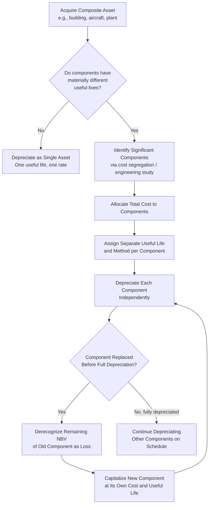

## Componentization of Fixed Assets

### Overview

Componentization is the accounting practice of separating a single physical fixed asset into multiple distinct components for depreciation purposes when those components have significantly different useful lives or consumption patterns. Rather than depreciating an entire asset — such as a building or an aircraft — as one undifferentiated unit over a single useful life, componentization recognizes that certain parts wear out, become obsolete, or require replacement at materially different rates than the asset as a whole. IAS 16 (*Property, Plant and Equipment*) makes componentization a mandatory requirement under IFRS, while US GAAP (ASC 360) permits but does not mandate the practice, though it is common in specific industries and increasingly encouraged by auditors for material asset classes.

### Conceptual Basis

**Key Points**

The rationale for componentization follows directly from the core depreciation objective: expense should be recognized in a pattern that reflects the consumption of economic benefit. When a single asset is composed of parts with materially different useful lives, applying one blended useful life to the whole asset produces a depreciation charge that misrepresents the consumption pattern of at least some of its parts. Componentization corrects this by:

- Depreciating each significant component separately over its own useful life and using its own appropriate depreciation method.
- Allowing replacement of a component to be accounted for as a disposal of the old component (deriving and derecognizing its remaining carrying amount) and a separate capitalization of the new component's cost.
- Avoiding the mismatch that would otherwise occur if replacement costs were simply added to an asset still carrying the original, unreplaced component's cost embedded within it.

### IFRS Requirement (IAS 16.43–47)

**Key Points**

IAS 16.43 states that each part of an item of PP&E with a cost that is significant in relation to the total cost of the item **shall be depreciated separately**. This is a mandatory requirement, not merely a permitted policy choice, when the significance threshold is met.

IAS 16.44 clarifies that an entity **may also depreciate separately the parts of an item that do not have a cost that is significant in relation to the total cost**, by grouping them.

IAS 16.45 specifically illustrates the point using an aircraft example: it may be appropriate to depreciate separately the airframe and engines of an aircraft, whether owned or held under a finance lease, because they typically have materially different useful lives and consumption patterns (engines requiring overhaul or replacement well before the airframe).

### US GAAP Treatment (ASC 360)

**Key Points**

US GAAP does not have an explicit, codified componentization mandate analogous to IAS 16.43. ASC 360 permits componentized (or "component") depreciation as an acceptable method but does not require it as a default policy. In practice:

- Componentization under US GAAP is most common for real estate (e.g., separating a building's structure, roof, HVAC system, and elevators) and for capital-intensive, regulated industries (airlines, utilities, railroads) where component replacement cycles are well understood and economically significant.
- The **composite depreciation method** — a related but distinct US GAAP practice — groups multiple similar or dissimilar assets under one blended depreciation rate rather than tracking components separately; this is, in a sense, the conceptual opposite of componentization and remains common under GAAP for assets like utility poles, rail assets, and fleets of similar equipment.
- [Inference] The general trend, particularly among audit firms applying heightened scrutiny to capital-intensive industries, has been to encourage more granular componentization even under GAAP, since it improves precision without violating any specific standard; however, this remains a matter of accounting policy choice under GAAP rather than an explicit rule.

### Illustrative Example: Componentizing a Commercial Building

**Example**

A company acquires a commercial office building for $20,000,000. Rather than depreciating the entire cost over a single 40-year useful life, the company componentizes the asset based on an engineering/cost-segregation study identifying the relative value and useful life of major systems:

| Component | Allocated Cost | Useful Life | Depreciation Method | Annual Depreciation |
| --- | --- | --- | --- | --- |
| Structure/shell | 12,000,000 | 40 years | Straight-line | 300,000 |
| Roof | 1,200,000 | 20 years | Straight-line | 60,000 |
| HVAC system | 2,400,000 | 15 years | Straight-line | 160,000 |
| Elevators | 1,600,000 | 25 years | Straight-line | 64,000 |
| Electrical/plumbing systems | 1,800,000 | 20 years | Straight-line | 90,000 |
| Interior finishes | 1,000,000 | 10 years | Straight-line | 100,000 |
| **Total** | **20,000,000** | — | — | **774,000** |

Compare this to a non-componentized approach that applies a single blended 40-year life to the entire $20,000,000:

$$\text{Non-Componentized Annual Depreciation} = \frac{20{,}000{,}000}{40} = \$500{,}000$$

The componentized approach produces a materially higher annual depreciation charge ($774,000 versus $500,000) in early years, more accurately reflecting that the roof, HVAC, and interior finishes will need replacement well before the building's structural shell does.

### Accounting for Component Replacement

**Key Points**

A key practical benefit of componentization emerges when a component is replaced. Under both IAS 16.13-14 and standard US GAAP practice for componentized assets, the replacement is accounted for as follows:

1. **Derecognize** the remaining carrying amount of the replaced component (if it still has a nonzero net book value at the time of replacement) — this derecognition is recognized as a loss (or, in some presentations, as an additional depreciation charge) in profit or loss.
2. **Capitalize** the cost of the new component as a new asset, to be depreciated over its own new useful life.

**Example**: Continuing the building example, suppose the HVAC system (original cost $2,400,000, useful life 15 years) is fully replaced after 10 years of use for a new cost of $3,000,000.

$$\text{Accumulated Depreciation on Old HVAC} = 160{,}000 \times 10 = 1{,}600{,}000$$

$$\text{Remaining NBV of Old HVAC at Replacement} = 2{,}400{,}000 - 1{,}600{,}000 = 800{,}000$$

At replacement:

- Derecognize the old HVAC's remaining $800,000 NBV as a loss on disposal (or written off against accumulated depreciation and cost, depending on presentation).
- Capitalize the new HVAC system at $3,000,000, to be depreciated over its own new estimated useful life (e.g., 15 years going forward).

Without componentization, this replacement cost might otherwise simply be capitalized on top of the building's existing (uncomponentized) carrying amount, without any offsetting derecognition — overstating the asset's carrying value by continuing to carry the replaced, no-longer-existing HVAC system's cost embedded in the blended building balance.

### Diagram: Componentization Decision and Accounting Flow

### Industries Where Componentization Is Particularly Significant

**Key Points**

- **Real estate**: Structure, roof, HVAC, elevators, parking structures, and interior finishes typically have widely varying useful lives (10–50 years), making componentization highly material to reported depreciation.
- **Aviation**: Airframes (20–30 year lives) versus engines (often removed, overhauled, and reinstalled on a cycle measured in flight hours rather than calendar years) are a textbook componentization case explicitly cited in IAS 16.
- **Utilities and energy infrastructure**: Power generation assets often componentize turbines, boilers, and structural elements separately, given differing replacement cycles and regulatory rate-base implications.
- **Shipping**: Vessel hulls versus engines/propulsion systems, given differing maintenance and replacement cycles.
- **Oil and gas**: Processing facilities often componentize major equipment (compressors, separators) separately from structural/pipeline infrastructure.
- **Rail**: Rolling stock components (engines, bogies/trucks) versus car bodies.

### Componentization and Capex Classification

Componentization has direct implications for how capital expenditure is classified and analyzed:

- **Maintenance versus growth capex distinction**: Component replacement capex (e.g., replacing a roof or an aircraft engine) is more naturally identified as *maintenance* or *sustaining* capex, since it restores existing capacity/function rather than expanding it — componentized asset registers make this classification more traceable at the point of capex analysis.
- **Capex forecasting**: A componentized fixed asset register allows more precise forecasting of *when* major replacement capex will be needed (e.g., knowing the roof component has 5 years of remaining useful life enables budget planning for its eventual replacement), which is valuable input to capital planning and capex budgeting processes.
- **Repairs and maintenance versus capitalization judgment**: Componentization interacts with, but is distinct from, the broader capitalize-versus-expense decision (ASC 360-10-25 / IAS 16.7) — routine repairs that do not replace a distinct, previously recognized component are generally expensed, while replacement of a recognized component is capitalized and its predecessor derecognized.

### Practical Implementation Considerations

**Key Points**

- **Cost segregation studies**: Companies (particularly in real estate) commonly engage third-party engineering or cost segregation specialists to allocate a lump-sum acquisition cost across components at initial recognition, since the necessary component-level cost breakdown is rarely available directly from a single purchase price.
- **Materiality threshold judgment**: Determining what constitutes a component with a cost "significant in relation to the total cost" under IAS 16.43 requires judgment; there is no bright-line percentage threshold in the standard itself. [Inference] Common practice often uses informal thresholds (e.g., components representing 10% or more of total asset cost) as a starting point for materiality assessment, though this is a practical convention rather than a codified rule.
- **System and register complexity**: Componentization increases the complexity of the fixed asset subledger, since each component must be separately tracked for cost, accumulated depreciation, useful life, and disposal/replacement history — a materially heavier administrative burden than tracking a single composite asset.
- **Business combination purchase price allocation**: When an entity acquires a business, the acquired PP&E must be recognized at fair value (ASC 805 / IFRS 3), and componentization is frequently applied at that point as part of the fair value allocation exercise, since acquired assets often require fresh useful-life and component analysis distinct from the seller's historical depreciation schedule.

### Conclusion

Componentization refines depreciation accounting by recognizing that a single physical asset frequently comprises parts with meaningfully different useful lives and consumption patterns. IFRS mandates this treatment for significant components (IAS 16.43), while US GAAP permits it as a policy choice without an equivalent explicit mandate, though it remains common practice in capital-intensive industries such as real estate, aviation, utilities, and shipping. Beyond improving the accuracy of periodic depreciation expense, componentization materially improves the precision of asset replacement accounting, sharpens the classification of maintenance versus growth capex, and supports more granular long-term capital expenditure forecasting.

**Related Topics**

- Depreciation methods: straight-line, declining balance, units of production
- Useful life estimation and residual value assumptions
- Maintenance capex versus growth capex classification
- Capitalize versus expense criteria for subsequent expenditures (ASC 360-10-25 / IAS 16.7)
- Purchase price allocation in business combinations (ASC 805 / IFRS 3)
- Composite depreciation method under US GAAP
- Asset disposal and derecognition accounting
- Capex forecasting and long-term capital planning using componentized asset registers