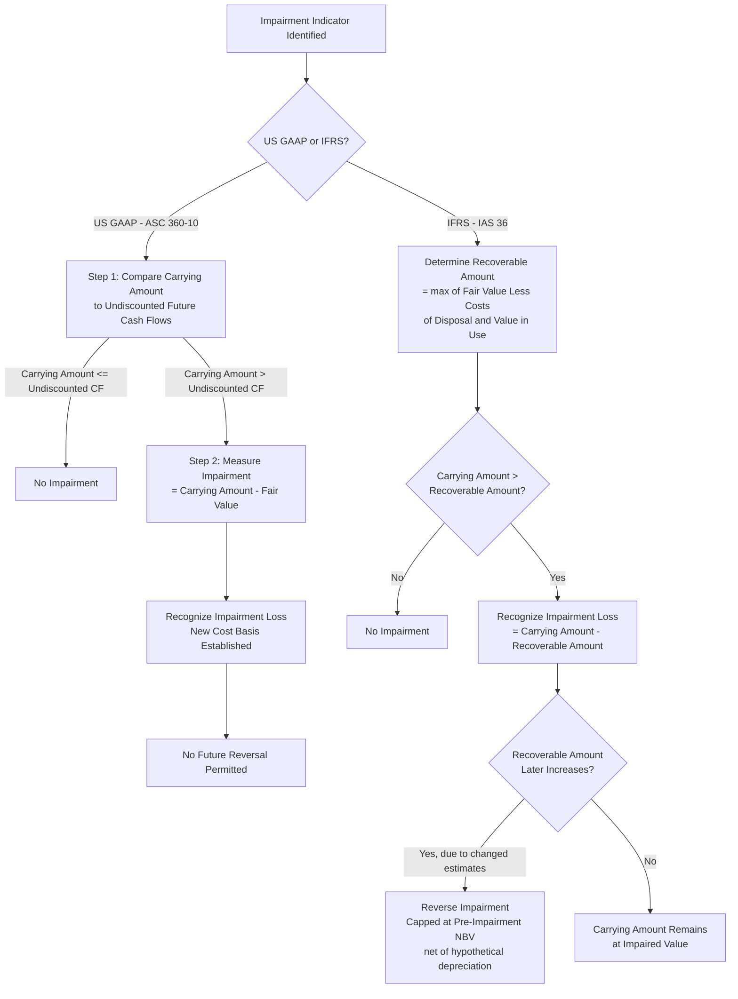

## Impairment Testing and Asset Write-Downs

### Overview

Impairment testing is the process by which an entity assesses whether the carrying amount of a long-lived asset (or group of assets) exceeds its recoverable amount, and if so, recognizes a write-down (impairment loss) to bring the asset's carrying amount into line with its recoverable economic value. Impairment is fundamentally distinct from depreciation: depreciation is the *planned, systematic* allocation of cost over useful life, whereas impairment is an *unplanned, event-driven* recognition that an asset's carrying value is no longer supportable by expected future economic benefits. US GAAP (ASC 360-10, and ASC 350 for goodwill/indefinite-lived intangibles) and IFRS (IAS 36, *Impairment of Assets*) both require impairment testing but differ meaningfully in methodology, trigger frequency, and — critically — in whether impairment losses can subsequently be reversed.

### Conceptual Basis

**Key Points**

An asset is impaired when its carrying amount exceeds the amount recoverable through use or sale. Both frameworks share the core objective: financial statements should not report assets at more than their recoverable value. However, the two frameworks diverge on the precise recoverability test:

- **US GAAP (ASC 360-10)** uses a **two-step model**: first, a recoverability test comparing the asset's (or asset group's) carrying amount to the sum of *undiscounted* future cash flows; only if the carrying amount exceeds undiscounted cash flows does the entity proceed to measure and recognize an impairment loss equal to the excess of carrying amount over *fair value*.
- **IFRS (IAS 36)** uses a **single-step model**: an entity compares the carrying amount directly to the recoverable amount (the higher of fair value less costs of disposal and value in use, where value in use is a *discounted* cash flow calculation), and recognizes an impairment loss immediately if carrying amount exceeds recoverable amount.

This structural difference — GAAP's undiscounted screening step versus IFRS's direct discounted comparison — means IFRS can trigger impairment recognition in circumstances where GAAP's initial screen would not, since discounting future cash flows produces a lower recoverable amount than the undiscounted total used in GAAP's first step.

### Triggering Events (Impairment Indicators)

**Key Points**

Neither framework requires continuous impairment testing of long-lived assets (unlike goodwill, which under ASC 350 / IAS 36 requires at least annual testing regardless of indicators). Instead, testing for finite-lived tangible and intangible assets is triggered by indicators suggesting the carrying amount may not be recoverable. Common indicators under both ASC 360-10-35-21 and IAS 36.12 include:

- A significant decrease in the market price of the asset.
- A significant adverse change in the manner in which the asset is used, or in its physical condition (e.g., damage, planned early retirement).
- A significant adverse change in legal factors or the business climate that could affect the asset's value, including an adverse action or assessment by a regulator.
- An accumulation of costs significantly in excess of the amount originally expected for acquisition or construction of the asset.
- A current-period operating or cash flow loss combined with a history of losses, or a projection/forecast demonstrating continuing losses associated with the asset.
- A more-likely-than-not expectation that the asset will be sold or disposed of significantly before the end of its previously estimated useful life.
- External indicators such as adverse changes in the technological, market, economic, or legal environment; increases in market interest rates affecting the discount rate used in value-in-use calculations (IFRS-specific emphasis).

### US GAAP Two-Step Process (ASC 360-10)

**Step 1 — Recoverability Test**

Compare the carrying amount of the asset (or asset group) to the sum of the **undiscounted** estimated future cash flows expected to result from its use and eventual disposal.

$$\text{Carrying Amount} \; ? \; \sum \text{Undiscounted Future Cash Flows}$$

- If carrying amount is **less than or equal to** undiscounted future cash flows → asset is **not impaired**; no further action.
- If carrying amount **exceeds** undiscounted future cash flows → proceed to Step 2.

**Step 2 — Measurement of the Impairment Loss**

If Step 1 indicates the asset may be impaired, measure the impairment loss as the excess of carrying amount over **fair value**.

$$\text{Impairment Loss} = \text{Carrying Amount} - \text{Fair Value}$$

Fair value is measured consistent with ASC 820, typically using a discounted cash flow approach, market comparables, or replacement cost, depending on the nature of the asset and available data.

**Asset grouping**: Under ASC 360-10-35-23, the recoverability test is performed at the lowest level for which identifiable cash flows are largely independent of the cash flows of other assets and liabilities — the "asset group" — not necessarily at the individual asset level. This grouping decision is often one of the most judgmental aspects of the analysis.

**Example**: A manufacturing plant has a carrying amount of $50 million. Management projects undiscounted future cash flows of $42 million over the asset's remaining life plus disposal proceeds. Since $50 million (carrying amount) exceeds $42 million (undiscounted cash flows), Step 1 indicates potential impairment. A discounted cash flow valuation determines the asset's fair value to be $36 million.

$$\text{Impairment Loss} = 50{,}000{,}000 - 36{,}000{,}000 = \$14{,}000{,}000$$

### IFRS Single-Step Process (IAS 36)

**Recoverable Amount**

$$\text{Recoverable Amount} = \max(\text{Fair Value Less Costs of Disposal}, \; \text{Value in Use})$$

Where **value in use** is the present value of the future cash flows expected to be derived from the asset or cash-generating unit (CGU), discounted using a pre-tax discount rate reflecting current market assessments of the time value of money and asset-specific risks.

$$\text{Value in Use} = \sum_{t=1}^{n} \frac{CF_t}{(1+r)^t}$$

**Impairment loss** is recognized immediately whenever carrying amount exceeds recoverable amount:

$$\text{Impairment Loss} = \text{Carrying Amount} - \text{Recoverable Amount}$$

**Cash-generating units (CGUs)**: IAS 36.6 defines a CGU as the smallest identifiable group of assets that generates cash inflows that are largely independent of the cash inflows from other assets or groups of assets — conceptually analogous to the US GAAP "asset group" but with its own specific IFRS guidance on identification and goodwill allocation across CGUs.

**Example**: Using the same plant (carrying amount $50 million), under IFRS the entity calculates value in use directly by discounting expected future cash flows at, say, a 9% discount rate, arriving at a value in use of $38 million. Fair value less costs of disposal is estimated at $36 million.

$$\text{Recoverable Amount} = \max(36{,}000{,}000, \; 38{,}000{,}000) = \$38{,}000{,}000$$

$$\text{Impairment Loss} = 50{,}000{,}000 - 38{,}000{,}000 = \$12{,}000{,}000$$

Note that IFRS reaches an impairment conclusion directly from the discounted comparison, without an intermediate undiscounted screening step — this is the key structural divergence from US GAAP.

### Key GAAP versus IFRS Divergence: Impairment Reversal

**Key Points**

This is one of the most consequential and frequently tested differences between the two frameworks:

- **US GAAP (ASC 360-10-35-20)**: Once an impairment loss is recognized for a long-lived asset held and used, it **cannot be reversed** even if the asset's fair value or recoverable cash flows subsequently recover. The written-down carrying amount becomes the new cost basis for future depreciation.
- **IFRS (IAS 36.114–116)**: Impairment losses (other than for goodwill, which can never be reversed under either framework) **can be reversed** in a later period if there has been a change in the estimates used to determine the recoverable amount since the last impairment loss was recognized. The reversal is limited to the carrying amount that would have existed (net of depreciation) had no impairment loss been recognized in prior periods.

**Example** of an IFRS reversal: An asset was written down 2 years ago from $10 million to $6 million. Since then, $1 million of depreciation would have been charged on the *original* $10 million carrying amount, versus $0.6 million actually charged on the impaired $6 million base (assuming proportional depreciation). If the recoverable amount has now increased to $9 million, the reversal is capped: the carrying amount cannot be restored above what it would have been (net of depreciation) had the original impairment never occurred — i.e., capped at $9 million (original $10 million less $1 million hypothetical depreciation), assuming that figure is below the newly assessed $9 million recoverable amount, or capped at the lower of the two if recoverable amount is lower than the hypothetical un-impaired NBV.

### Diagram: Impairment Testing Decision Flow (Comparative)

### Fair Value Measurement and the Valuation Hierarchy

**Key Points**

Both frameworks require fair value measurements used in impairment testing to be consistent with the broader fair value framework (ASC 820 / IFRS 13), which establishes a three-level hierarchy:

- **Level 1**: Quoted prices in active markets for identical assets (rare for specialized PP&E).
- **Level 2**: Observable inputs other than quoted prices (e.g., market prices for similar assets, comparable transactions).
- **Level 3**: Unobservable inputs, typically involving discounted cash flow models, management's own projections, and asset-specific assumptions — the most common level for impairment testing of specialized or unique long-lived assets, and consequently the level receiving the most auditor and regulator scrutiny.

Disclosure requirements under both frameworks include identifying which fair value hierarchy level was used and describing the valuation technique and significant unobservable inputs when Level 3 is used.

### Goodwill and Indefinite-Lived Intangible Assets (Contrast with Tangible PP&E)

**Key Points**

While this topic centers on tangible fixed asset impairment, it is useful to note the contrast with goodwill:

- Goodwill and indefinite-lived intangible assets are tested for impairment **at least annually**, regardless of whether indicators are present (ASC 350 / IAS 36), unlike finite-lived tangible PP&E, which is tested only upon indicator identification.
- Goodwill impairment, once recognized, **can never be reversed** under either US GAAP or IFRS — this is the one point of convergence between the two frameworks on the reversal question, even though they diverge on reversal for other long-lived assets.
- US GAAP permits a qualitative assessment ("Step 0") to determine whether a quantitative goodwill impairment test is even necessary, a simplification not available for tangible asset impairment testing under ASC 360.

### Presentation and Disclosure Requirements

**Key Points**

- **Income statement placement**: Impairment losses are typically presented as a separate line item within operating expenses, or disclosed separately if included within another caption, so users can identify the non-recurring nature of the charge.
- **Required disclosures** under both ASC 360-10-50 and IAS 36.126-137 generally include:
  - The events and circumstances leading to the impairment (or reversal).
  - The amount of the loss (or reversal) and the caption in the income statement where it is included.
  - The method(s) used to determine fair value or recoverable amount (e.g., market approach, income approach).
  - For asset groups/CGUs, a description of the grouping and the level at which impairment was assessed.
  - Key assumptions used in cash flow projections (growth rates, discount rates) when value in use / discounted cash flow methods are used — particularly emphasized under IAS 36.134 for CGUs containing goodwill or indefinite-lived intangibles.

**Example** disclosure language: "During the third quarter of fiscal 2025, the Company recognized a $14.0 million impairment charge related to its [Location] manufacturing facility, reflecting a sustained decline in customer demand and management's decision to reduce production capacity at that site. The impairment was measured as the excess of the asset group's carrying amount over its estimated fair value, determined using a discounted cash flow model (Level 3 inputs) incorporating a discount rate of 10.5% and revised revenue projections."

### Impairment's Relationship to Capex and Asset Accounting

**Key Points**

- **Distinct from, but interacts with, depreciation**: Impairment write-downs reduce the carrying amount, which reduces the depreciable base for future periods — future depreciation expense is calculated on the *post-impairment* carrying amount, often necessitating a reassessment of remaining useful life at the same time.
- **Signal for capex discipline**: A pattern of recurring impairments in a particular asset class or business segment is often read by analysts as a signal of poor capital allocation discipline or an overextended capex program relative to realized returns.
- **Held-for-sale reclassification**: Assets meeting held-for-sale criteria (ASC 360-10-45 / IFRS 5) are measured at the lower of carrying amount or fair value less costs to sell, and depreciation ceases upon reclassification — a related but procedurally distinct write-down mechanism from the impairment tests described above.

### Conclusion

Impairment testing serves as the corrective mechanism ensuring that long-lived assets are not carried on the balance sheet above their recoverable economic value, complementing the routine, planned expense recognition achieved through depreciation. The US GAAP two-step undiscounted screen followed by a discounted fair value measurement, contrasted with IFRS's direct single-step discounted recoverable amount test, represents one of the more consequential GAAP/IFRS divergences in asset accounting — compounded further by the fact that IFRS permits impairment reversal (subject to a strict cap) while US GAAP prohibits it outright for assets held and used. Both frameworks converge, however, on the principle that goodwill impairment, once recognized, is never reversed.

**Related Topics**

- Depreciation methods: straight-line, declining balance, units of production
- Useful life estimation and residual value assumptions post-impairment
- Held-for-sale asset classification (ASC 360-10-45 / IFRS 5)
- Fair value measurement hierarchy (ASC 820 / IFRS 13)
- Goodwill impairment testing (ASC 350) and reporting unit / CGU identification
- Cash-generating unit (CGU) determination under IAS 36
- Discount rate selection for value-in-use calculations
- Capex discipline and capital allocation signals from impairment patterns