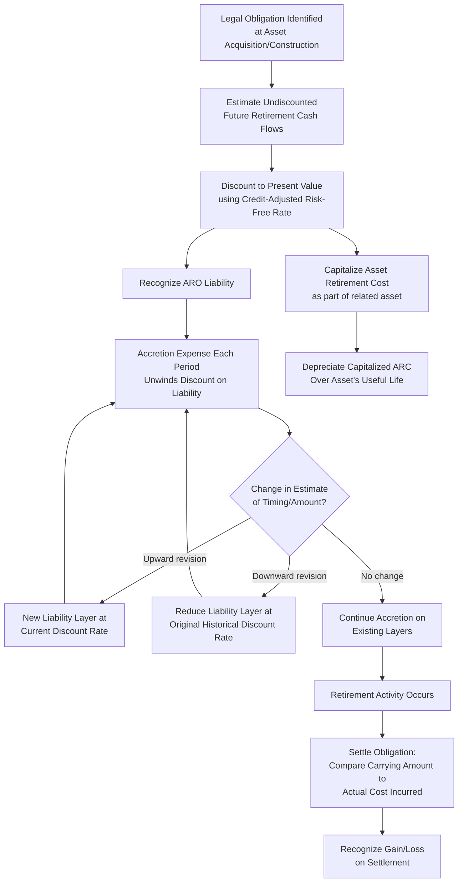

## Asset Retirement Obligations

### Overview

An asset retirement obligation (ARO) is a legal obligation associated with the retirement of a tangible long-lived asset, arising from the asset's acquisition, construction, development, or normal operation. Common examples include the legal requirement to decommission a nuclear power plant, plug and abandon an oil well, remove leasehold improvements at the end of a lease, or remediate a mining site. ARO accounting is distinctive because it requires an entity to recognize a liability — and a corresponding increase to the related asset's carrying amount — for a future retirement cost that will often not be paid for decades, based on a discounted present value estimate that is itself subject to ongoing remeasurement. US GAAP addresses this under ASC 410-20 (*Asset Retirement Obligations*), while IFRS addresses the topic through the general provisions standard, IAS 37 (*Provisions, Contingent Liabilities and Contingent Assets*), read together with IAS 16 for the capitalization of the associated asset cost.

### Conceptual Basis and Scope

**Key Points**

An ARO arises specifically from a **legal obligation** — which includes not only obligations arising from contract, statute, or common law, but also obligations arising under the doctrine of promissory estoppel where an entity's own past actions or public statements create a valid expectation of performance. This is an important scope boundary: a purely voluntary, discretionary decision to dismantle or remove an asset with no legal compulsion generally does **not** meet the definition of an ARO under ASC 410-20, though the analysis of "legal obligation" can be nuanced in practice (e.g., an obligation might be conditional on a future event, such as a decision to cease operating a facility, yet still meet the definition once that triggering event's probability is considered — this is the essence of a "conditional asset retirement obligation," discussed below).

Typical fact patterns giving rise to AROs:

- **Decommissioning obligations**: Nuclear power plants, chemical processing facilities.
- **Plugging and abandonment obligations**: Oil and gas wells (ASC 932 industry guidance intersects here).
- **Mine reclamation obligations**: Restoring land disturbed by mining operations.
- **Leasehold restoration obligations**: Contractual requirements to remove leasehold improvements and restore leased premises to original condition at lease-end.
- **Landfill closure and post-closure obligations**: Environmental remediation and monitoring requirements.
- **Asset removal costs embedded in environmental permits**: E.g., removal of underground storage tanks.

### Initial Recognition and Measurement (ASC 410-20)

**Key Points**

Under ASC 410-20, an ARO liability is recognized when incurred (typically at the time the asset is installed or the obligating event occurs) if the fair value of the liability can be reasonably estimated. The initial measurement approach:

1. Estimate the **undiscounted future cash flows** required to settle the obligation.
2. Discount those cash flows to present value using a **credit-adjusted risk-free rate** — a rate that reflects the time value of money and the entity's own credit standing, since the obligation itself is not traded and lacks an observable market discount rate.
3. Recognize the resulting present value as a liability (the ARO) and **simultaneously capitalize an equal amount as part of the carrying amount of the related long-lived asset** (the "asset retirement cost," or ARC).

$$\text{Initial ARO Liability} = \text{PV of Estimated Undiscounted Future Retirement Cash Flows}$$

$$\text{Journal Entry at Recognition:} \quad \text{Dr. Asset Retirement Cost (capitalized)} \; \; / \; \; \text{Cr. Asset Retirement Obligation (liability)}$$

**Example**: A company installs a piece of specialized equipment with a legal obligation to dismantle and remove it at the end of its 10-year useful life. Management estimates the undiscounted retirement cost at $500,000 (in future dollars, reflecting expected inflation to the settlement date). The credit-adjusted risk-free rate is 6%.

$$\text{ARO Liability (Present Value)} = \frac{500{,}000}{(1.06)^{10}} = \$279{,}197 \; \text{(approximately)}$$

At initial recognition:

- ARO liability recognized: $279,197
- Asset retirement cost capitalized (added to the equipment's carrying amount): $279,197

### Subsequent Measurement: Accretion and Depreciation

**Key Points**

Once recognized, the ARO liability is subsequently measured using two parallel mechanisms:

**Accretion expense**: Because the liability was initially recorded at present value, it must be increased each period to reflect the passage of time as the settlement date approaches — this is analogous to the unwinding of a discount, and is recognized as **accretion expense**, typically classified as an operating expense (not interest expense, since it does not represent borrowing).

$$\text{Accretion Expense}_t = \text{Beginning ARO Liability}_t \times \text{Credit-Adjusted Risk-Free Rate}$$

**Depreciation of the capitalized asset retirement cost**: The capitalized ARC is depreciated over the same useful life as the underlying asset, using the entity's normal depreciation method and policy for that asset class.

**Example continued**: Using the $279,197 initial ARO liability and 6% credit-adjusted risk-free rate:

| Year | Beginning ARO Liability | Accretion Expense (6%) | Ending ARO Liability |
| --- | --- | --- | --- |
| 1 | 279,197 | 16,752 | 295,949 |
| 2 | 295,949 | 17,757 | 313,706 |
| 3 | 313,706 | 18,822 | 332,528 |
| ... | ... | ... | ... |
| 10 | 471,698 | 28,302* | 500,000 |

*Final year accretion is plugged to bring the liability exactly to the $500,000 undiscounted settlement amount by the settlement date.

Simultaneously, the $279,197 capitalized asset retirement cost is depreciated over the 10-year useful life (e.g., $27,920/year under straight-line, assuming no residual value on the ARC component), adding to the total depreciation expense already being recognized on the underlying asset's own cost.

### Settlement of the Obligation

**Key Points**

When the retirement activity is actually performed and the obligation settled, the entity compares the actual cost incurred to the carrying amount of the ARO liability at that date, recognizing a **gain or loss on settlement** for any difference (reflecting the fact that actual costs almost always differ from the original estimate due to changed circumstances, inflation variance, or estimation error).

$$\text{Gain / (Loss) on Settlement} = \text{Carrying Amount of ARO Liability} - \text{Actual Retirement Cost Incurred}$$

**Example**: At the end of Year 10, the ARO liability has accreted to $500,000. The company actually incurs $540,000 to dismantle and remove the equipment.

$$\text{Loss on Settlement} = 500{,}000 - 540{,}000 = -\$40{,}000$$

### Conditional Asset Retirement Obligations

**Key Points**

A particularly important — and sometimes overlooked — aspect of ASC 410-20 is the treatment of **conditional AROs**: obligations where the timing and/or method of settlement is conditional on a future event that may or may not be within the entity's control (e.g., an obligation to remove asbestos only if and when a building undergoes renovation or demolition). The FASB has clarified (via FIN 47, now codified within ASC 410-20) that the existence of uncertainty about the timing or method of settlement does **not** defer recognition of the liability — if the fair value of the obligation can be reasonably estimated (incorporating that uncertainty into the fair value estimate itself, e.g., through probability weighting or an expected present value technique), the liability must be recognized currently, even though the actual retirement activity may occur far in the future or may never occur with certainty.

This has been historically significant for companies holding older buildings with known asbestos-containing materials, or nuclear/chemical facilities with recognized but not-yet-triggered decommissioning requirements — recognition is required once fair value is estimable, not deferred until the triggering event occurs.

### IFRS Treatment: IAS 37 and IAS 16 Interaction

**Key Points**

IFRS does not have an ARO-specific standard analogous to ASC 410-20; instead, retirement obligations are accounted for under the general **provisions** framework of IAS 37, with the associated asset cost capitalized under IAS 16.16(c), which explicitly includes within the cost of an item of PP&E "the initial estimate of the costs of dismantling and removing the item and restoring the site on which it is located."

Key differences from US GAAP:

- **Discount rate**: IAS 37.47 requires discounting using a **pre-tax rate that reflects current market assessments of the time value of money and the risks specific to the liability**, which is conceptually similar to, but not identically defined as, the US GAAP credit-adjusted risk-free rate; IFRS practice often uses a risk-free rate adjusted for risks already reflected in the cash flow estimates, rather than adjusting explicitly for the entity's own credit standing.
- **Remeasurement approach**: IAS 37 requires the provision to be reviewed and adjusted at each reporting date to reflect the current best estimate, with changes in the estimated cash flows or discount rate generally adjusted against the related asset's cost (mirroring the US GAAP approach for changes in estimate, discussed below), consistent with IFRIC 1 (*Changes in Existing Decommissioning, Restoration and Similar Liabilities*).
- **Probability threshold**: IAS 37.14 requires recognition of a provision when it is **probable** that an outflow of resources will be required (interpreted under IFRS as "more likely than not"), a threshold that operates somewhat differently from the fair-value-estimability trigger under ASC 410-20, though in practice both frameworks tend to converge on recognizing well-understood legal retirement obligations once they are identifiable and estimable.

### Changes in Estimate: Upward and Downward Revisions

**Key Points**

Because the timing, amount, and discount rate underlying an ARO estimate are all subject to significant judgment and can change with new information (revised cost estimates, regulatory changes, revised timing assumptions), both frameworks require periodic reassessment.

Under ASC 410-20-35, when there is a **change in the timing or amount of estimated cash flows**:

- **Upward revisions** are discounted using the **current** credit-adjusted risk-free rate at the time of the revision (a new "layer" is created).
- **Downward revisions** are discounted using the **historical** (weighted-average) credit-adjusted risk-free rate that applied when the corresponding liability layer was originally recognized.

This "layering" approach means a single ARO liability may, over time, be composed of multiple discrete layers, each carrying its own original discount rate — a distinctive and often operationally complex feature of ARO accounting relative to most other liability remeasurement processes.

**Example**: Three years after initial recognition, an environmental regulation change increases the estimated undiscounted retirement cost by $150,000 (in future dollars). This upward layer is discounted at the *current* credit-adjusted risk-free rate applicable at the time of the revision (which may differ from the original 6% rate used at initial recognition), and both the ARO liability and the capitalized asset retirement cost are increased by the resulting present value of this new layer.

### Diagram: ARO Lifecycle

### Disclosure Requirements

**Key Points**

Both ASC 410-20-50 and IAS 37 require disclosures enabling users to understand the nature, timing, and uncertainty of retirement obligations:

- A description of the retirement obligations and the associated long-lived assets.
- A reconciliation of the beginning and ending aggregate carrying amount of the ARO liability, showing: liabilities incurred during the period, liabilities settled during the period, accretion expense, and revisions to estimated cash flows.
- If the fair value of an ARO cannot be reasonably estimated, disclosure of that fact and the reasons why (a narrow but real exception under ASC 410-20).
- Under IAS 37, disclosure of the expected timing of any resulting outflows, an indication of uncertainties about the amount or timing, and the major assumptions made concerning future events.

**Example** disclosure language: "The Company's asset retirement obligations relate primarily to the legal requirement to decommission its processing facilities at the end of their operating lives. The following table presents a reconciliation of the Company's aggregate ARO liability: Balance at beginning of period $18.4 million; Liabilities incurred $2.1 million; Accretion expense $1.3 million; Liabilities settled $(0.9) million; Revisions in estimated cash flows $3.6 million; Balance at end of period $24.5 million."

### Interaction with Capex Analysis

**Key Points**

- **Non-cash capex inflation**: The initial capitalization of an asset retirement cost increases the reported carrying amount of PP&E and, through depreciation, increases reported capex-related expense, without any corresponding *cash* capex outflow at recognition — analysts should be aware that a portion of PP&E gross additions in a heavily regulated or extraction-intensive industry may reflect non-cash ARO capitalization rather than actual cash spent on productive capacity.
- **Deferred cash outflow timing**: The actual cash cost of retirement is deferred, often for decades, meaning the ARO liability represents a known future cash outflow that is not reflected in near-term capex budgets or free cash flow calculations, but which should be considered in long-term capital planning and balance sheet leverage analysis.
- **Industry concentration**: AROs are disproportionately significant in capital-intensive, asset-heavy industries with environmental or regulatory decommissioning requirements — oil and gas, nuclear power, mining, utilities, and chemicals — making this topic particularly relevant to capex-heavy sector analysis.
- **Revisions can meaningfully affect asset carrying values**: Because upward or downward revisions to ARO estimates flow through both the liability and the capitalized asset cost, large revisions (often triggered by regulatory or environmental policy changes) can produce material, non-operational swings in reported PP&E balances that are unrelated to actual capital investment activity in the period.

### Conclusion

Asset retirement obligations require an entity to recognize, at the time a qualifying legal obligation arises, a discounted liability for the estimated future cost of retiring a long-lived asset, together with a matching capitalized addition to that asset's carrying amount. The subsequent accounting — accretion of the liability, depreciation of the capitalized cost, layered treatment of revised estimates, and eventual gain/loss recognition on settlement — creates a distinctive multi-period accounting trail that differs from most other liabilities. While US GAAP's ASC 410-20 and IFRS's IAS 37/IAS 16 framework share the same conceptual foundation, they diverge in discount rate methodology and recognition threshold language, and both require careful ongoing judgment given the long time horizons, regulatory uncertainty, and estimation complexity inherent in these obligations.

**Related Topics**

- Depreciation of capitalized asset retirement costs alongside underlying asset depreciation
- Provisions and contingent liabilities under IAS 37
- Environmental remediation liabilities and regulatory disclosure requirements
- Componentization of fixed assets (interaction with ARO capitalization at the component level)
- Capex classification: cash versus non-cash additions to PP&E
- Discount rate selection: credit-adjusted risk-free rate versus IFRS pre-tax discount rate
- Held-for-sale and disposal group accounting interaction with retirement obligations
- Sector-specific applications: oil and gas plugging and abandonment, nuclear decommissioning, mine reclamation