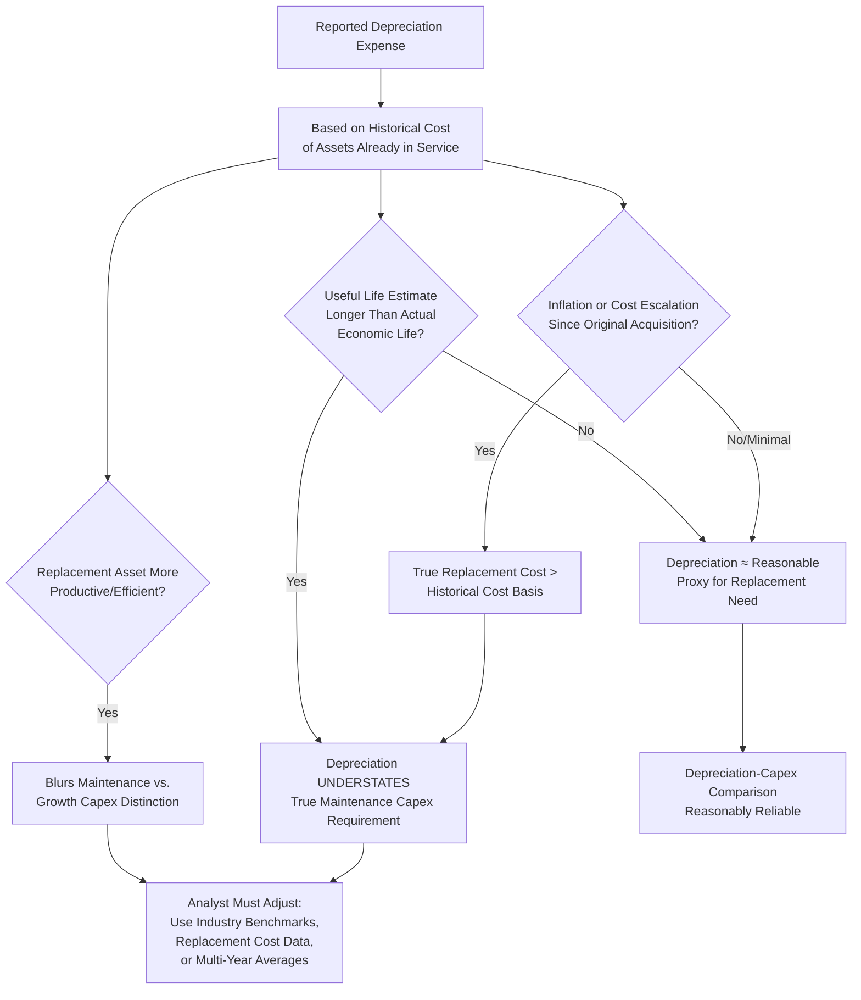

## Depreciation as a Proxy for Maintenance Capex

### Overview

A recurring analytical shortcut in corporate finance and equity research is to use reported depreciation expense as a proxy for maintenance capital expenditure — the portion of total capex required merely to sustain a company's existing productive capacity, as distinct from growth capex directed at expanding capacity or entering new markets. The logic is intuitive: depreciation represents the accounting allocation of the cost of assets consumed during the period, so if a company reinvests roughly that same amount, it should, in theory, replace the capacity being used up and hold its asset base steady in real terms. This heuristic is widely used because maintenance versus growth capex is rarely disclosed directly by companies, but the proxy carries significant limitations that any careful analyst must understand before relying on it.

### Conceptual Basis for the Proxy

**Key Points**

Depreciation is calculated based on the **historical cost** of assets already in service, allocated over their estimated useful lives (see straight-line, declining balance, and units of production methods). The proxy reasoning follows this chain:

1. Depreciation reflects the systematic "using up" of previously capitalized assets over time.
2. If a company spends capex equal to depreciation, it is, in principle, replacing consumed capacity at a rate matching consumption.
3. Capex *above* depreciation therefore represents net expansion of the asset base (growth capex); capex *below* depreciation represents a shrinking asset base (potential underinvestment or harvesting).

$$\text{Approximate Growth Capex} \approx \text{Total Capex} - \text{Depreciation Expense}$$

$$\text{Net PP\&E Growth Rate} \approx \frac{\text{Capex} - \text{Depreciation}}{\text{Beginning Net PP\&E}}$$

**Example**: A company reports $400 million of total capex and $310 million of depreciation expense in a given fiscal year.

$$\text{Implied Growth Capex} = 400 - 310 = \$90 \text{ million}$$

Under this framework, an analyst would interpret roughly $310 million as sustaining existing capacity and $90 million as net capacity expansion.

### Why the Proxy Is Widely Used Despite Its Flaws

**Key Points**

- **Universal availability**: Depreciation is disclosed in every set of financial statements (income statement or cash flow statement reconciliation), whereas a true maintenance/growth capex split is almost never disclosed directly by management — making depreciation the only consistently available data point for this purpose across a broad universe of companies.
- **Simplicity in modeling**: In discounted cash flow (DCF) models, analysts frequently assume that in a company's terminal or steady-state period, capex will converge toward depreciation, since a mature, non-growing business should theoretically only need to replace consumed capacity.
- **Cross-company comparability appeal**: Because it is derived from standardized GAAP/IFRS figures, the depreciation-to-capex ratio offers a superficially comparable metric across companies and sectors, even though the underlying comparability is often weaker than it appears (see limitations below).

### Fundamental Limitations of the Proxy

**Key Points**

**Historical cost versus replacement cost mismatch**: This is the single most significant conceptual flaw. Depreciation is based on the *original, historical* cost of an asset, while actual replacement of that asset's productive capacity occurs at *current* replacement cost. In an inflationary environment, or in industries experiencing rapid cost escalation (construction materials, specialized equipment, semiconductor fabrication equipment), the cost to replace an asset can be materially higher than its original cost — meaning capex exactly equal to depreciation may actually represent a *real decline* in productive capacity, not steady-state maintenance.

$$\text{Real Maintenance Capex Needed} \approx \text{Depreciation} \times \frac{\text{Current Replacement Cost Index}}{\text{Original Acquisition Cost Index}}$$

[Inference] The magnitude of this distortion varies significantly by asset type and inflationary environment and cannot be reliably estimated without asset-specific replacement cost data, which is rarely disclosed.

**Useful life estimation errors compound the mismatch**: If a company's assigned useful lives are longer than the assets' actual economic lives (whether due to aggressive accounting assumptions or genuine uncertainty), reported depreciation will understate the true rate of economic consumption, making the depreciation proxy systematically too low as an estimate of required reinvestment.

**Technology and productivity improvements**: A replacement asset is frequently *more* productive, efficient, or capable than the asset it replaces (e.g., replacing an old manufacturing line with a more automated one). In this case, "maintenance" capex spent to replace an aging asset may simultaneously deliver a productivity improvement that resembles growth capex in its economic effect, blurring the maintenance/growth distinction inherent in the depreciation-based split.

**Lumpy, non-linear capex timing versus smooth depreciation**: Depreciation is recognized smoothly and predictably over an asset's useful life, but actual capex — particularly for large, discrete replacement projects (a blast furnace relining, a fleet replacement cycle, a major IT system overhaul) — tends to occur in large, infrequent, lumpy tranches. Comparing capex to depreciation in any single year can therefore be highly misleading; the comparison is more meaningful when averaged over a full replacement cycle or multiple years.

**Componentization effects**: Where componentized assets are in use (see componentization of fixed assets), different components depreciate and get replaced on different schedules, meaning aggregate depreciation in any given year reflects a blend of components at different points in their respective lifecycles — further weakening the reliability of a single-year depreciation-to-capex comparison.

**Capitalized interest and non-cash additions distort the capex side**: Capex figures used in the comparison may include capitalized interest (ASC 835-20 / IAS 23) or non-cash additions such as capitalized asset retirement costs (see asset retirement obligations), neither of which represents cash-funded expansion or replacement of productive capacity in the way an analyst typically intends when discussing "growth" versus "maintenance" spending.

**Depreciation is not a cash flow**: Depreciation is a non-cash accounting allocation; capex is a cash (or accrued) outflow. Using a non-cash accounting construct as a benchmark for a cash investment decision embeds a category mismatch that, while broadly accepted in practice as a useful approximation, is conceptually imperfect.

### Diagram: Why Depreciation Diverges from True Maintenance Capex Need

### Practical Refinements Analysts Use

**Key Points**

Given the limitations above, more careful analysts typically refine the raw depreciation-versus-capex comparison using one or more of the following approaches:

- **Multi-year averaging**: Comparing average capex to average depreciation over a full capex/replacement cycle (e.g., 5-10 years) rather than any single year, smoothing out lumpiness.
- **Management disclosure of maintenance vs. growth capex**: Where companies voluntarily disclose this split (common in capital-intensive sectors like telecom, utilities, airlines, and oil & gas), analysts should prioritize the disclosed split over the depreciation proxy, while remaining aware that this split is **not standardized, not audited**, and management has some latitude in classification judgment.
- **Sector-specific capital intensity benchmarks**: Using industry-specific replacement cost indices or engineering-based estimates (common in utility rate-base regulatory filings, where "used and useful" and replacement cost studies are a formal regulatory requirement) rather than relying solely on GAAP/IFRS depreciation.
- **Free cash flow adjustments**: Some models use a "normalized" or "sustaining" capex figure — often derived from a blend of depreciation, management guidance, and historical capex-to-revenue or capex-to-EBITDA ratios — rather than depreciation alone, when estimating owner earnings or normalized free cash flow (a concept popularized in value-investing frameworks, notably associated with Warren Buffett's use of "owner earnings").
- **Age-of-asset analysis**: Examining the ratio of accumulated depreciation to gross PP&E (a rough "percent used up" metric) alongside the depreciation-capex comparison to assess whether the asset base is aging faster than it is being replenished.

$$\text{Asset Age Ratio} = \frac{\text{Accumulated Depreciation}}{\text{Gross PP\&E}}$$

A rising asset age ratio over time, combined with capex persistently below depreciation, is often read as a warning sign of underinvestment — though [Inference] the appropriate benchmark ratio varies substantially by industry and asset mix, and no universal threshold indicates "too aged" without sector-specific context.

### Illustrative Example: Interpreting the Capex-to-Depreciation Ratio Over Time

**Example**

| Year | Capex | Depreciation | Capex / Depreciation | Interpretation |
| --- | --- | --- | --- | --- |
| 1 | 280 | 300 | 0.93x | Possible underinvestment; asset base may be shrinking in real terms |
| 2 | 310 | 305 | 1.02x | Roughly steady-state; capex approximately matching consumption |
| 3 | 450 | 310 | 1.45x | Likely growth phase; capex materially exceeds replacement needs |
| 4 | 320 | 340 | 0.94x | Reversion toward maintenance-level spending after growth phase |

[Inference] A single year's ratio in isolation (e.g., Year 3's 1.45x) is not sufficient to conclude a company is in active expansion — it should be corroborated with other evidence such as management commentary, segment-level capex disclosure, revenue/capacity growth trends, and the multi-year pattern shown here, since a one-time large replacement project (not necessarily growth-related) could also produce a temporarily elevated ratio.

### Sector Variation in Proxy Reliability

**Key Points**

The reliability of depreciation as a maintenance capex proxy varies meaningfully by industry:

- **Relatively reliable**: Industries with stable technology, modest inflation exposure, and long, well-understood asset lives (e.g., certain real estate, some regulated utilities with cost-based rate recovery) tend to show closer alignment between depreciation and actual replacement need.
- **Less reliable**: Technology-intensive and rapidly evolving sectors (semiconductors, telecom infrastructure, data centers) where equipment costs and specifications change quickly, making historical-cost-based depreciation a poor proxy for the cost of maintaining *competitive* (not just physical) capacity.
- **Structurally distorted**: Extractive industries (oil & gas, mining) where depletion and reserve-based accounting introduce additional complexity beyond standard depreciation, and where maintenance capex must also account for natural production decline curves, not just asset replacement.

### Use in Valuation and Credit Analysis

**Key Points**

- **DCF terminal value assumptions**: A common (and analytically debated) simplification in terminal value calculations assumes capex converges to depreciation in the terminal period, on the theory that a company in steady-state, no-growth conditions should only need to sustain, not expand, its asset base. [Inference] This assumption is a modeling convenience widely used in practice, but its accuracy depends heavily on whether the historical-cost/replacement-cost gap discussed above is material for the specific company and industry being modeled.
- **Credit analysis**: Lenders and credit rating agencies often examine the capex-to-depreciation ratio (alongside other leverage and cash flow coverage metrics) as one input into assessing whether a company is adequately reinvesting to sustain its asset base and competitive position, which in turn affects long-term debt service capacity.
- **Free cash flow quality assessment**: Analysts sometimes flag a company whose free cash flow (operating cash flow minus total capex) looks strong partly because total capex is running persistently below depreciation, as this may indicate free cash flow is being flattered by deferred or underinvested maintenance spending rather than genuine operating efficiency — a pattern sometimes associated with private equity-owned or activist-pressured companies prioritizing near-term cash generation.

### Conclusion

Depreciation is a widely used, readily available, but conceptually imperfect proxy for maintenance capex. Its core weakness is the historical-cost basis of depreciation calculations, which can diverge materially from the current replacement cost of maintaining productive capacity, particularly in inflationary or technologically dynamic environments. While the raw depreciation-to-capex comparison remains a useful first-pass heuristic — especially in the near-total absence of standardized maintenance/growth capex disclosure — careful analysts supplement it with multi-year averaging, sector-specific replacement cost context, disclosed management splits where available, and asset-age indicators such as the accumulated-depreciation-to-gross-PP&E ratio, rather than relying on a single year's depreciation figure as a precise measure of required reinvestment.

**Related Topics**

- Depreciation methods: straight-line, declining balance, units of production
- Useful life estimation and residual value assumptions
- Maintenance capex versus growth capex classification frameworks
- Free cash flow definition and Regulation G reconciliation requirements
- Owner earnings and normalized free cash flow concepts in valuation
- Componentization of fixed assets and its effect on depreciation timing
- Asset age ratio and capital intensity benchmarking by industry
- Capex disclosure requirements and footnotes