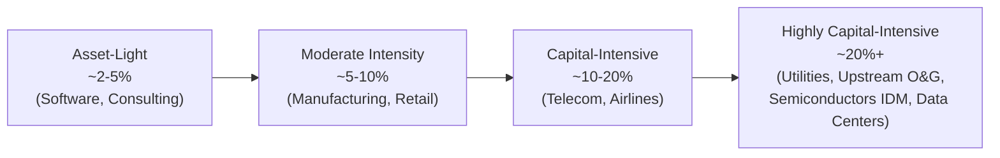
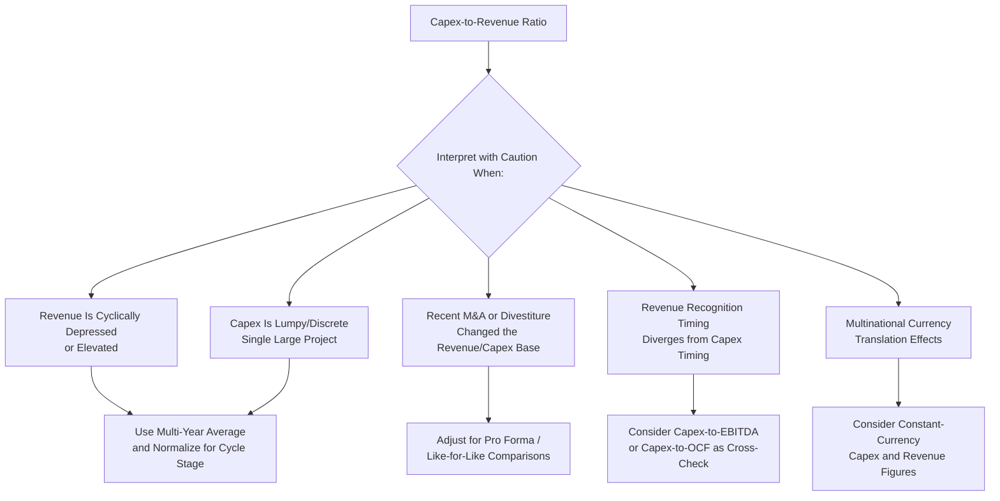

## Capex to Revenue Ratio

### Overview

The capex-to-revenue ratio is one of the most widely used measures of capital intensity, expressing capital expenditure as a percentage of total revenue generated over the same period. It provides a normalized view of how much of a company's top line is being reinvested into long-lived productive assets, allowing comparison across companies of different absolute size and across time periods for the same company. Because it uses revenue — a readily available, non-discretionary, top-of-income-statement figure — as its denominator, this ratio is one of the simplest and most frequently cited capital intensity metrics in equity research, credit analysis, and corporate financial planning.

### Formula and Basic Calculation

$$\text{Capex-to-Revenue Ratio} = \frac{\text{Capital Expenditures}}{\text{Total Revenue}} \times 100$$

Capital expenditures are typically sourced from the investing activities section of the cash flow statement (commonly labeled "purchases of property, plant and equipment" or "capital expenditures"), while revenue is taken from the income statement for the same reporting period.

**Example**

A company reports $180 million in capital expenditures and $1,200 million in total revenue for the fiscal year.

$$\text{Capex-to-Revenue Ratio} = \frac{180}{1{,}200} \times 100 = 15.0\%$$

This means the company reinvested 15 cents of every revenue dollar into capital assets during the period.

### Interpreting the Ratio

**Key Points**

- **Higher ratio** generally indicates a more capital-intensive business model — common in industries such as telecommunications, utilities, semiconductor manufacturing, oil and gas, airlines, and heavy industrials, where substantial fixed infrastructure is required to generate revenue.
- **Lower ratio** generally indicates a less capital-intensive, often more asset-light business model — common in software, consulting, media/publishing, and many consumer services businesses, where revenue generation depends more on human capital, intellectual property, or brand than on owned physical infrastructure.
- **Trend over time** matters as much as the absolute level: a rising ratio may indicate an expansion phase (new capacity, market entry, technology upgrade cycle), while a declining ratio may indicate a maturing business harvesting cash flow, a shift toward asset-light strategies (e.g., outsourcing manufacturing, sale-leaseback transactions), or, in a less favorable interpretation, underinvestment in the asset base.

### Typical Ratio Ranges by Industry

**Example** (illustrative ranges based on general industry patterns; actual company-level ratios vary significantly and should always be verified against current company filings):

| Industry | Typical Capex-to-Revenue Range |
| --- | --- |
| Software / SaaS | 2–6% |
| Consumer retail | 2–5% |
| Consumer packaged goods | 3–6% |
| Industrials / manufacturing | 4–8% |
| Semiconductors (fabless) | 2–5% |
| Semiconductors (integrated device manufacturers) | 15–30% |
| Airlines | 8–15% |
| Oil and gas (upstream) | 15–35% |
| Telecommunications | 12–20% |
| Electric utilities | 15–25% |
| Railroads | 15–20% |
| Data center / cloud infrastructure | 20–40%+ |

[Inference] These ranges reflect broadly observed industry patterns rather than fixed benchmarks; actual ratios fluctuate with the business cycle, individual company strategy, technology investment cycles, and macroeconomic conditions, and should be checked against current data for any specific analysis.

### Diagram: Capital Intensity Spectrum by Capex-to-Revenue Ratio

### Decomposing the Ratio: Maintenance vs. Growth Components

**Key Points**

A single-period capex-to-revenue ratio blends both maintenance capex (sustaining existing capacity) and growth capex (expanding capacity or entering new markets), which limits its interpretive precision unless decomposed further:

$$\text{Capex-to-Revenue Ratio} = \frac{\text{Maintenance Capex}}{\text{Revenue}} + \frac{\text{Growth Capex}}{\text{Revenue}}$$

Since companies rarely disclose this split directly (see depreciation as a proxy for maintenance capex), analysts often approximate the maintenance component using depreciation-to-revenue as a rough floor, with the excess of capex-to-revenue over depreciation-to-revenue interpreted as an approximate growth component — subject to all the limitations discussed in that proxy's own analysis (historical versus replacement cost mismatch, useful life estimation error, and lumpy capex timing).

### Relationship to Other Capital Intensity Metrics

**Key Points**

The capex-to-revenue ratio is one of several related capital intensity measures, each offering a different lens:

| Metric | Formula | What It Emphasizes |
| --- | --- | --- |
| Capex-to-revenue | Capex / Revenue | Capital intensity relative to sales generation |
| Capex-to-EBITDA | Capex / EBITDA | Capital intensity relative to cash operating profitability |
| Capex-to-depreciation | Capex / Depreciation | Reinvestment rate relative to asset consumption |
| Asset turnover | Revenue / Total Assets | Revenue efficiency per dollar of asset base (inverse-flavored capital intensity view) |
| Capex-to-operating cash flow | Capex / OCF | Proportion of operating cash flow consumed by reinvestment (relates directly to free cash flow) |

Capex-to-revenue and capex-to-EBITDA often move together but can diverge meaningfully when margins change: a company with rising revenue but compressing margins could show a stable or declining capex-to-revenue ratio while its capex-to-EBITDA ratio rises sharply, since EBITDA is shrinking relative to revenue.

### Use in Free Cash Flow and Valuation Analysis

**Key Points**

The capex-to-revenue ratio is a standard input in financial modeling and valuation, particularly for forecasting future capital expenditure when explicit management guidance is unavailable or when building out multi-year projection models:

$$\text{Forecast Capex}_t = \text{Forecast Revenue}_t \times \text{Assumed Capex-to-Revenue Ratio}$$

This approach assumes a relatively stable relationship between revenue growth and capital investment needs — a reasonable assumption for many mature, steady-state businesses, but potentially misleading for companies undergoing structural transitions (e.g., a company moving from an owned-infrastructure model to a leased or outsourced model, or a company in the midst of a multi-year capacity expansion program whose capex needs are front-loaded ahead of the revenue they are intended to generate).

[Inference] Applying a constant historical capex-to-revenue ratio into a forecast period implicitly assumes the company's capital intensity profile remains stable; this assumption should be explicitly tested against known capex guidance, industry capacity cycles, and company-specific strategic plans rather than applied mechanically.

### Example: Multi-Year Trend Analysis

**Example**

| Year | Revenue | Capex | Capex-to-Revenue Ratio |
| --- | --- | --- | --- |
| 2022 | 950 | 95 | 10.0% |
| 2023 | 1,020 | 112 | 11.0% |
| 2024 | 1,150 | 172 | 15.0% |
| 2025 | 1,240 | 149 | 12.0% |

**Interpretation**: The ratio's rise from 10.0% (2022) to 15.0% (2024) followed by a partial reversion to 12.0% (2025) is a pattern often associated with a discrete capacity expansion or major technology upgrade cycle that peaked in 2024, followed by a return toward a more normalized reinvestment rate as the expansion project completed. As with the depreciation proxy discussion, this single ratio's movement should be corroborated with segment disclosures, management commentary on capacity plans, and multi-year averaging before drawing firm conclusions about whether the business is entering a sustained higher-capital-intensity phase or merely completing a one-time project.

### Limitations of the Ratio

**Key Points**

- **Revenue volatility distorts the ratio independent of capex changes**: A cyclical revenue decline (e.g., during a recession or commodity price downturn) can mechanically inflate the capex-to-revenue ratio even if absolute capex spending is flat or declining, since the denominator shrinks — this is a common source of misinterpretation, particularly in cyclical industries like oil and gas, mining, and airlines.
- **Lumpy capex creates single-year distortions**: As with the depreciation proxy, large discrete capex projects (a new plant, a major fleet order, a data center buildout) can cause the ratio to spike in the investment year and fall in surrounding years, even though the underlying capital intensity of the business has not fundamentally changed — multi-year averaging is generally more informative than any single year's ratio.
- **Revenue recognition timing versus cash capex timing mismatch**: Revenue is recognized under accrual accounting rules (ASC 606 / IFRS 15) that may not align temporally with when related capex is incurred — for example, a company may spend heavily on capex to build capacity well before the associated revenue is recognized, temporarily inflating the ratio during the build-out phase.
- **M&A and divestiture distortions**: Acquired or divested businesses change both the revenue base and the capex base, sometimes at different paces (e.g., an acquired business consolidated for only a partial year distorts the ratio relative to a full-year comparison), requiring analysts to adjust for portfolio changes when comparing ratios across periods.
- **Does not distinguish organic versus inorganic capacity growth**: Capex funds organic capacity growth, but a company could also expand capacity through acquisition (which appears in investing activities as a separate line, not within capex) — comparing capex-to-revenue ratios across companies that grow organically versus through M&A can therefore be misleading without adjusting for the acquisition component of growth.
- **Currency translation effects for multinational companies**: For companies reporting in a currency different from where capex is actually spent, currency fluctuations between the capex-incurring subsidiary's local currency and the reporting currency can distort period-over-period ratio comparisons independent of underlying capital spending decisions.

### Diagram: Factors Distorting the Capex-to-Revenue Ratio

### Application in Comparative and Peer Analysis

**Key Points**

The capex-to-revenue ratio is frequently used in peer benchmarking to assess whether a company is over- or under-investing relative to industry norms:

- A company with a capex-to-revenue ratio persistently *below* peer average may be generating stronger near-term free cash flow, but could also be signaling underinvestment risk relative to competitors who may be building superior long-term capacity or technological positioning.
- A company with a ratio persistently *above* peer average may be investing for future growth or market share gains, or may be operating with less capital discipline than peers — distinguishing between these two interpretations generally requires examining accompanying revenue growth, margin trends, and return on invested capital (ROIC) trends alongside the ratio itself, rather than relying on the ratio in isolation.

[Inference] Peer comparisons using this ratio are most meaningful when peers share similar business models, geographic footprints, and growth-stage characteristics; comparing a mature, ex-growth utility to an early-stage, expansion-phase competitor using the same ratio without adjusting for growth-stage differences can produce misleading conclusions.

### Conclusion

The capex-to-revenue ratio offers a simple, widely available, and broadly comparable measure of how capital-intensive a business is relative to the revenue it generates, making it a foundational metric in both equity research and financial modeling. Its simplicity is also its principal limitation: the ratio blends maintenance and growth capex into a single figure, is sensitive to revenue cyclicality and capex lumpiness, and can be distorted by M&A activity, currency translation, and misaligned revenue-recognition timing. Used thoughtfully — ideally alongside multi-year averaging, peer benchmarking adjusted for growth stage, and complementary metrics like capex-to-EBITDA and capex-to-depreciation — it remains one of the most useful starting points for assessing a company's capital intensity profile.

**Related Topics**

- Capex-to-EBITDA ratio
- Capex-to-depreciation ratio and reinvestment rate analysis
- Depreciation as a proxy for maintenance capex
- Free cash flow calculation and Regulation G reconciliation
- Asset turnover and capital efficiency metrics
- Capital intensity benchmarking across industries
- Return on invested capital (ROIC) and its relationship to capital intensity
- Forecasting capex in financial models using historical ratio relationships