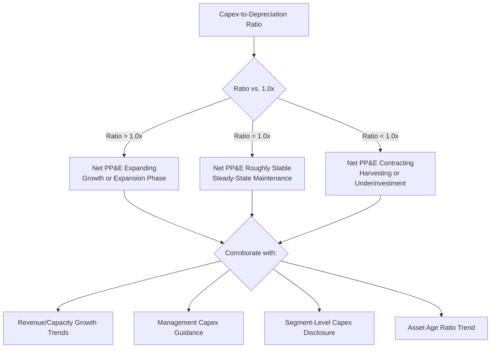

## Capex to Depreciation Ratio

### Overview

The capex-to-depreciation ratio compares capital expenditure incurred during a period to the depreciation expense recognized over the same period, offering a direct read on whether a company is expanding, maintaining, or allowing its capital asset base to shrink in nominal terms. Because both figures are readily available in standard financial statements — capex from the investing activities section of the cash flow statement, and depreciation from the income statement or its footnote disclosure — this ratio is one of the most commonly cited "reinvestment rate" indicators in capital-intensity analysis, credit assessment, and long-term financial modeling.

### Formula and Basic Calculation

$$\text{Capex-to-Depreciation Ratio} = \frac{\text{Capital Expenditures}}{\text{Depreciation Expense}}$$

The ratio is typically expressed as a multiple (e.g., "1.2x") rather than a percentage, distinguishing it from ratios like capex-to-revenue that are conventionally expressed as percentages.

**Example**

A company reports $276 million in capital expenditures and $230 million in depreciation expense for the fiscal year.

$$\text{Capex-to-Depreciation Ratio} = \frac{276}{230} = 1.20x$$

This indicates the company invested $1.20 for every $1.00 of depreciation recognized — nominally, capex exceeded the accounting measure of asset consumption by 20%.

### Interpreting the Ratio

**Key Points**

- **Ratio > 1.0x**: Capex exceeds depreciation, generally interpreted as the company expanding its net asset base (net PP&E growing), consistent with a growth or expansion phase, or at minimum offsetting the historical-cost-versus-replacement-cost gap discussed under depreciation as a proxy for maintenance capex.
- **Ratio = 1.0x**: Capex approximately equals depreciation, often interpreted as a "steady-state" or maintenance-level reinvestment pattern — the textbook assumption used in many terminal value calculations in discounted cash flow modeling.
- **Ratio < 1.0x**: Capex is below depreciation, which mechanically implies net PP&E is shrinking (before considering revaluations, impairments, or FX effects) — this can reflect a deliberate strategy (harvesting cash from a mature or declining business, shifting toward an asset-light model, executing a managed wind-down) or, less favorably, unplanned underinvestment that may erode future competitiveness or capacity.

$$\text{Approximate Net PP\&E Change} \approx \text{Capex} - \text{Depreciation} - \text{Impairments} + \text{Other Non-Cash Additions (e.g., ARO)}$$

### Historical Benchmark Ranges

**Example** (illustrative; actual ratios vary by company, industry, and business cycle stage):

| Business Condition | Typical Capex-to-Depreciation Range |
| --- | --- |
| Mature, low-growth, steady-state business | 0.9x – 1.2x |
| Growth-phase or capacity expansion | 1.3x – 2.5x+ |
| Managed decline / harvesting cash | 0.5x – 0.9x |
| Post-expansion normalization | 0.8x – 1.1x |
| Severe downturn / capital discipline mode | Below 0.7x |

[Inference] These ranges represent general patterns observed across capital-intensive industries and business cycle phases rather than fixed thresholds; the appropriate benchmark for a specific company depends on its industry, growth strategy, and where it sits in its own capital investment cycle.

### Diagram: Capex-to-Depreciation Ratio and Asset Base Trajectory

### Relationship to the Depreciation-as-Maintenance-Capex Proxy

**Key Points**

The capex-to-depreciation ratio is the natural quantitative expression of the depreciation-as-maintenance-capex heuristic discussed elsewhere in this chapter — it is, in effect, the same comparison expressed as a ratio rather than a dollar gap. All the limitations of that proxy apply directly here:

- **Historical cost basis distortion**: Because depreciation is based on historical acquisition cost, a ratio of exactly 1.0x does not necessarily mean the company is truly maintaining its productive capacity in real (inflation-adjusted or technology-adjusted) terms — in an inflationary environment, a ratio modestly above 1.0x might still represent a real decline in replacement capacity.
- **Useful life estimation sensitivity**: If a company's useful life assumptions are unusually long (understating annual depreciation), the ratio will appear artificially elevated even at a constant level of actual capex spending, since the denominator is depressed relative to true economic consumption.
- **Lumpiness**: Because capex is often incurred in large, discrete tranches while depreciation is smoothed, the ratio can swing significantly year to year around large capital projects — multi-year averaging is again the standard practical remedy.

### Use in Financial Modeling and Terminal Value Assumptions

**Key Points**

This ratio is a standard diagnostic and forecasting tool in DCF and long-term financial models:

- **Terminal period convergence assumption**: Many DCF models explicitly assume the capex-to-depreciation ratio converges to 1.0x (or a range close to it) in the terminal period, on the theory that a mature company in perpetuity growth should only need to replace consumed capacity, not expand it — this is one of the most common and most debated modeling simplifications in valuation practice.
- **Explicit forecast period modeling**: During the explicit forecast horizon (often 5–10 years), analysts frequently model the ratio declining from an elevated growth-phase level toward 1.0x as a company matures, reflecting an assumed normalization of the investment cycle.
- **Sensitivity analysis**: Because terminal value is often the majority of total enterprise value in a DCF, and the capex-to-depreciation assumption directly drives terminal free cash flow, analysts commonly run sensitivity tables varying this ratio (e.g., 0.9x, 1.0x, 1.1x) to assess valuation sensitivity to the reinvestment assumption.

$$\text{Terminal Free Cash Flow} = \text{Terminal NOPAT} + \text{Depreciation} - \text{Capex (assumed} \approx \text{Depreciation)} - \Delta \text{Working Capital}$$

When capex is assumed to exactly equal depreciation in the terminal period, these two terms cancel, simplifying the terminal FCF calculation to NOPAT less the change in working capital — a widely used simplification, though [Inference] the appropriateness of this exact cancellation depends on whether the historical-cost/replacement-cost gap discussed above is material for the company being modeled; some practitioners instead assume a modest premium (e.g., capex at 1.05x–1.10x of depreciation) to implicitly account for inflation in replacement costs.

### Example: Multi-Year Ratio Analysis

**Example**

| Year | Capex | Depreciation | Capex-to-Depreciation Ratio | Interpretation |
| --- | --- | --- | --- | --- |
| 2021 | 210 | 195 | 1.08x | Modest net expansion |
| 2022 | 340 | 205 | 1.66x | Significant expansion phase begins |
| 2023 | 410 | 225 | 1.82x | Peak investment year |
| 2024 | 260 | 250 | 1.04x | Normalization post-expansion |
| 2025 | 235 | 255 | 0.92x | Slight contraction; monitor for underinvestment signal |

**Interpretation**: The pattern from 2021–2023 shows a clear multi-year expansion phase, with the ratio peaking at 1.82x in 2023. The subsequent decline to 1.04x (2024) and then 0.92x (2025) suggests the expansion program is complete and the company has entered a more moderate reinvestment phase. Whether the 2025 sub-1.0x reading reflects healthy post-expansion normalization or an early signal of underinvestment would require corroboration with additional data — capacity utilization trends, competitive capex spending, and management guidance on future investment plans.

### Relationship to Free Cash Flow and Capital Allocation Analysis

**Key Points**

- **Free cash flow quality**: A capex-to-depreciation ratio persistently below 1.0x can partly explain unusually strong reported free cash flow, since capex — the largest discretionary cash outflow in the FCF calculation for most capital-intensive businesses — is running below the accounting measure of asset consumption. Analysts should examine whether this reflects genuine efficiency gains or deferred/underinvested maintenance spending that may need to be "caught up" in future periods.
- **Capital allocation signal in shareholder return contexts**: Companies prioritizing share buybacks or dividends sometimes show a declining capex-to-depreciation ratio concurrent with rising shareholder distributions — this pattern is not inherently problematic, but warrants scrutiny of whether the underlying asset base and competitive position are being adequately sustained.
- **Credit analysis application**: Lenders and rating agencies often use the ratio (alongside capex-to-revenue and free cash flow coverage metrics) to assess whether a borrower is maintaining the asset base that supports its ongoing cash flow generation capacity — a company financing dividends or buybacks partly through underinvestment (ratio well below 1.0x for a sustained period) may be viewed as carrying elevated longer-term credit risk even if near-term coverage ratios look healthy.

### Limitations Specific to This Ratio

**Key Points**

- **Denominator distortion from impairments**: A large impairment charge (see impairment testing and asset write-downs) reduces the carrying amount of assets and can subsequently reduce future depreciation expense on the impaired base, which would mechanically inflate the capex-to-depreciation ratio in later periods without any change in actual capex behavior — analysts should check for recent impairments when interpreting a sudden increase in this ratio.
- **Depreciation method sensitivity**: A company using declining-balance depreciation will show naturally higher depreciation in early asset life and lower depreciation in later years, all else equal, meaning the ratio's trend can partly reflect the *aging* of the existing asset base and its depreciation method mix, rather than genuine changes in capex behavior.
- **Componentization effects**: As with the maintenance capex proxy discussion, componentized assets depreciate on different schedules for different components, meaning aggregate depreciation in a given year reflects a blend of components at different lifecycle stages — this can create ratio volatility unrelated to actual capex decisions.
- **Currency and consolidation effects**: For multinational companies, currency translation and changes in the scope of consolidation (acquisitions, divestitures) can distort both the numerator and denominator independently, requiring the same caution applied to other capital intensity ratios discussed in this chapter.

### Complementary Metrics

**Key Points**

The capex-to-depreciation ratio is most informative when read alongside:

- **Capex-to-revenue ratio**: Normalizes capex against the scale of the business's current operations rather than its historical asset consumption pattern.
- **Asset age ratio** (accumulated depreciation ÷ gross PP&E): Provides context on how "aged" the existing asset base is, which helps interpret whether a sub-1.0x ratio is more or less concerning (a young asset base tolerates temporary underinvestment better than an already-aged one).
- **Free cash flow and free cash flow yield**: Since capex is a direct input to free cash flow, the capex-to-depreciation ratio helps explain the *quality* and *sustainability* of reported free cash flow figures.

### Conclusion

The capex-to-depreciation ratio provides a direct, easily calculated signal of whether a company's nominal capital asset base is expanding, holding steady, or contracting, and is a standard building block in both historical capital intensity analysis and forward-looking financial modeling, particularly in DCF terminal value construction. Its principal limitation mirrors that of the underlying depreciation-as-maintenance-capex proxy: depreciation's historical-cost basis means a ratio at or near 1.0x does not guarantee true real-terms capacity maintenance, and the ratio can be distorted by impairments, depreciation method effects, capex lumpiness, and asset base composition. As with related capital intensity metrics, the ratio is best interpreted using multi-year trends and in conjunction with complementary indicators such as the capex-to-revenue ratio and asset age analysis, rather than relying on any single period's reading in isolation.

**Related Topics**

- Depreciation as a proxy for maintenance capex
- Capex-to-revenue ratio
- Asset age ratio and capital base aging analysis
- Terminal value assumptions in discounted cash flow modeling
- Free cash flow calculation and quality assessment
- Impairment testing and its effect on subsequent depreciation
- Depreciation methods: straight-line, declining balance, units of production
- Capital allocation analysis: reinvestment versus shareholder distributions