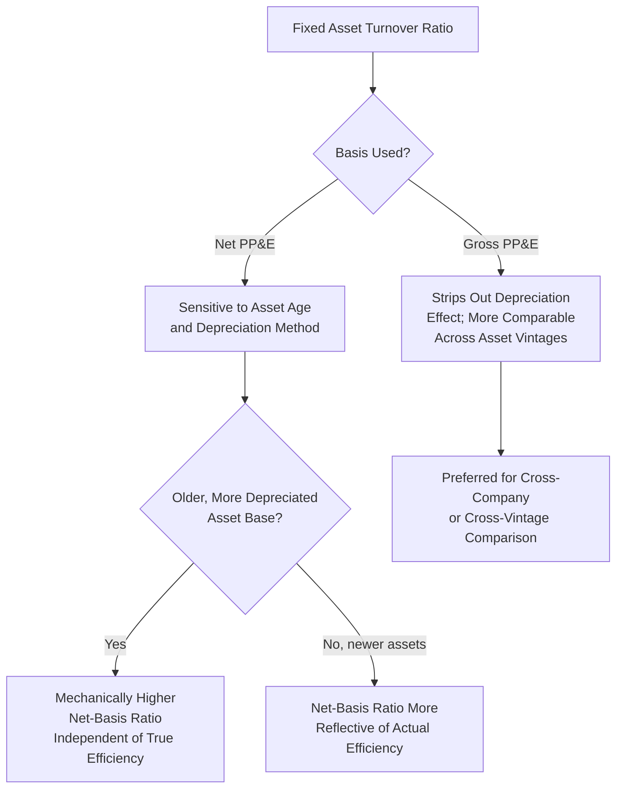
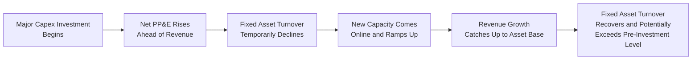

## Fixed Asset Turnover Ratio

### Overview

The fixed asset turnover ratio measures how efficiently a company uses its fixed assets — property, plant, and equipment — to generate revenue. Unlike the capex-to-revenue or capex-to-depreciation ratios, which focus on the *flow* of capital spending during a period, fixed asset turnover is a *stock-to-flow* metric: it relates a balance sheet stock (net or gross fixed assets) to an income statement flow (revenue generated over the period). It is one of the most established efficiency ratios in fundamental analysis, frequently used to assess capital productivity, benchmark against industry peers, and serve as a component of broader DuPont-style return decomposition frameworks.

### Formula and Basic Calculation

$$\text{Fixed Asset Turnover Ratio} = \frac{\text{Net Revenue}}{\text{Net Fixed Assets (Net PP\&E)}}$$

Many practitioners use an **average** of beginning and ending net fixed assets rather than the ending balance alone, to better match the stock measure to the flow of revenue generated throughout the period.

$$\text{Fixed Asset Turnover Ratio (Average Basis)} = \frac{\text{Net Revenue}}{\frac{\text{Beginning Net PP\&E} + \text{Ending Net PP\&E}}{2}}$$

**Example**

A company reports $1,500 million in net revenue for the fiscal year. Net PP&E was $620 million at the beginning of the year and $680 million at the end of the year.

$$\text{Average Net PP\&E} = \frac{620 + 680}{2} = \$650 \text{ million}$$

$$\text{Fixed Asset Turnover Ratio} = \frac{1{,}500}{650} = 2.31x$$

This indicates the company generates $2.31 of revenue for every $1.00 of net fixed assets employed.

### Interpreting the Ratio

**Key Points**

- **Higher ratio**: Indicates the company generates more revenue per dollar of fixed assets, generally interpreted as greater capital efficiency — common in asset-light business models, retail (particularly leased-store formats), and technology/services companies where physical infrastructure plays a smaller role in revenue generation.
- **Lower ratio**: Indicates the company requires a larger fixed asset base relative to revenue generated, common in capital-intensive sectors such as utilities, telecommunications, heavy manufacturing, and oil and gas, where large upfront infrastructure investment is a structural feature of the business model rather than necessarily a sign of inefficiency.
- **Trend over time**: A declining ratio over several periods may indicate the company is investing ahead of revenue generation (e.g., building capacity for future growth not yet reflected in current-period revenue), experiencing declining asset utilization or demand softness, or facing pricing pressure that is compressing revenue relative to a stable or growing asset base. A rising ratio may reflect improving capacity utilization, successful monetization of prior capex investment, or a shift toward a less capital-intensive business mix.

### Net PP&E versus Gross PP&E Basis

**Key Points**

Analysts sometimes calculate the ratio using **gross** PP&E (before accumulated depreciation) rather than net PP&E, and the choice materially affects interpretation:

$$\text{Gross Fixed Asset Turnover Ratio} = \frac{\text{Net Revenue}}{\text{Gross PP\&E}}$$

- **Net PP&E basis**: Reflects the current, depreciated carrying value of assets in use; this basis is more sensitive to the age of the asset base and to depreciation method choices — a company with older, more heavily depreciated assets will show a mechanically higher net-basis turnover ratio than an otherwise identical company with newer assets, purely because the denominator (net PP&E) is smaller, even if underlying operational efficiency is the same.
- **Gross PP&E basis**: Strips out the effect of accumulated depreciation, offering a view less distorted by asset age, useful life assumptions, or depreciation method — often preferred for cross-company or cross-time comparisons where asset vintage differences could otherwise create a misleading turnover signal.

[Inference] Because the net-basis ratio is influenced by asset age (older, more depreciated asset bases mechanically produce higher turnover ratios all else equal), analysts making cross-company comparisons should be cautious about attributing a higher net-basis ratio entirely to superior operating efficiency without checking whether it instead simply reflects an older or more heavily depreciated asset base.

### Diagram: Net versus Gross Basis Effect on Ratio Interpretation

### Typical Ratio Ranges by Industry

**Example** (illustrative; ranges vary by company-specific factors such as ownership versus leasing strategy, business maturity, and asset mix):

| Industry | Typical Fixed Asset Turnover Range (Net PP&E Basis) |
| --- | --- |
| Software / SaaS | 8x – 25x+ (very asset-light) |
| Retail (leased stores) | 5x – 15x |
| Consumer packaged goods | 3x – 6x |
| Industrial manufacturing | 2x – 5x |
| Airlines | 1x – 2x |
| Telecommunications | 0.5x – 1.2x |
| Electric utilities | 0.3x – 0.6x |
| Oil and gas (upstream) | 0.5x – 1.5x |
| Railroads | 0.3x – 0.6x |

[Inference] These are broadly observed patterns rather than fixed benchmarks; the appropriate range for a specific company depends heavily on whether assets are owned versus leased (leased assets under operating lease treatment historically kept significant infrastructure off the fixed asset base, though this has narrowed under ASC 842 / IFRS 16 right-of-use asset recognition), the company's growth stage, and industry-specific capital structures.

### Relationship to DuPont Analysis and Return on Assets

**Key Points**

Fixed asset turnover is conceptually related to, though narrower than, total asset turnover, which is a standard component of DuPont return on equity (ROE) decomposition:

$$\text{ROE} = \text{Net Profit Margin} \times \text{Total Asset Turnover} \times \text{Financial Leverage}$$

While total asset turnover uses total assets in its denominator, fixed asset turnover isolates the productivity of the fixed asset base specifically, offering a more targeted view for capital-intensive industries where PP&E dominates the balance sheet and drives the bulk of asset-related capital allocation decisions. Combined with net profit margin, fixed asset turnover helps decompose return on fixed assets:

$$\text{Return on Fixed Assets} \approx \text{Net Profit Margin} \times \text{Fixed Asset Turnover Ratio}$$

This decomposition helps distinguish whether a company's overall capital productivity is being driven more by pricing/margin strength or by asset utilization efficiency — two different levers with different strategic and operational implications.

### Example: Multi-Year Trend and Decomposition Analysis

**Example**

| Year | Revenue | Average Net PP&E | Fixed Asset Turnover | Net Profit Margin | Implied Return on Fixed Assets |
| --- | --- | --- | --- | --- | --- |
| 2022 | 1,100 | 580 | 1.90x | 8.0% | 15.2% |
| 2023 | 1,180 | 640 | 1.84x | 8.5% | 15.6% |
| 2024 | 1,350 | 780 | 1.73x | 7.2% | 12.5% |
| 2025 | 1,520 | 810 | 1.88x | 9.1% | 17.1% |

**Interpretation**: The dip in fixed asset turnover in 2024 (1.73x, down from 1.84x in 2023) coincides with a large jump in average net PP&E (from $640 million to $780 million), consistent with a capacity expansion where new assets came online ahead of a proportional revenue increase — a common and often expected pattern following major capex investment (sometimes referred to as an "investment lag" or "ramp-up period"). The subsequent recovery to 1.88x in 2025, combined with margin expansion, suggests the newly added capacity began generating proportional revenue, and overall return on fixed assets recovered and exceeded prior levels.

### Impact of Leasing and ASC 842 / IFRS 16 on Comparability

**Key Points**

The adoption of ASC 842 (US GAAP) and IFRS 16 (IFRS), which require most operating leases to be capitalized on the balance sheet as right-of-use (ROU) assets with corresponding lease liabilities, has had a meaningful effect on fixed asset turnover comparability:

- **Pre-adoption (historical operating lease treatment)**: Companies that leased significant infrastructure (retail store networks, aircraft, distribution centers) under operating leases kept those assets off the balance sheet entirely, which mechanically inflated their fixed asset turnover ratios relative to companies that owned similar infrastructure outright.
- **Post-adoption**: Right-of-use assets are now recognized on the balance sheet (though typically presented as a separate line item from owned PP&E rather than blended into it), meaning the comparability gap between "lease-heavy" and "own-heavy" companies has narrowed, though it has not been entirely eliminated, since analysts must decide whether to include ROU assets in the fixed asset turnover denominator depending on the specific analytical purpose.
- [Inference] Analysts comparing fixed asset turnover ratios across companies with meaningfully different leasing philosophies should verify whether ROU assets are included or excluded from the denominator in each case, since inconsistent treatment can materially distort peer comparisons even under the current lease accounting regime.

### Limitations of the Ratio

**Key Points**

- **Revenue mix distortion**: A company with a diversified revenue base spanning both capital-intensive (manufacturing) and asset-light (services, licensing) segments will show a blended ratio that may not clearly represent either segment's true capital efficiency — segment-level analysis is often more informative for diversified companies.
- **Timing mismatch between capex and revenue ramp**: As illustrated in the multi-year example above, newly commissioned assets often take time to reach full revenue-generating capacity, meaning the ratio can temporarily decline following a major capex program even though the investment is expected to be accretive to efficiency once fully utilized — a single-period reading during a ramp-up phase should not be read as a permanent efficiency decline.
- **Depreciation method and useful life sensitivity (net basis)**: As discussed above, the net PP&E basis is sensitive to depreciation method choice and useful life assumptions, meaning cross-company comparisons using the net basis can partly reflect differing accounting policies rather than differing operational efficiency.
- **Currency and inflation effects**: For multinational companies, currency translation can distort the ratio independent of underlying operational changes; similarly, in high-inflation environments, revenue (recognized at current prices) can grow faster than the historical-cost-based fixed asset denominator, inflating the ratio without a genuine efficiency improvement.
- **Does not capture asset quality or technological currency**: A high turnover ratio achieved by extending the use of aging, technologically obsolete assets (deferring replacement capex) is not necessarily a sign of sustainable efficiency — it may instead reflect deferred maintenance capex that will eventually require catch-up investment, an important cross-check against the asset age ratio and capex-to-depreciation ratio discussed elsewhere in this chapter.

### Diagram: Fixed Asset Turnover in a Capital Investment Cycle

### Use in Investment and Credit Analysis

**Key Points**

- **Capital allocation assessment**: A sustained decline in fixed asset turnover without a corresponding revenue ramp can be a warning sign that recent capex investment is not generating the expected return, prompting analysts to scrutinize project-level returns, competitive positioning, or demand assumptions underlying the original investment decision.
- **Peer benchmarking**: Within a given industry, comparing fixed asset turnover across close competitors can help identify companies with structurally superior (or inferior) capital productivity, though as noted above this comparison should control for leasing philosophy, asset vintage, and business mix differences.
- **Complementary use with ROIC**: Fixed asset turnover is often examined alongside return on invested capital (ROIC) trends, since a company generating strong margins but declining asset turnover may still show strong overall returns in the near term while facing longer-term capital efficiency erosion that ROIC alone might not immediately reveal.

### Conclusion

Fixed asset turnover measures how effectively a company converts its fixed asset base into revenue, providing a stock-to-flow efficiency metric that complements the flow-based capital intensity ratios (capex-to-revenue, capex-to-depreciation) discussed elsewhere in this chapter. Its interpretation requires care: the choice between net and gross PP&E basis affects sensitivity to asset age and depreciation policy, recent lease accounting changes (ASC 842 / IFRS 16) have altered historical comparability between owned- and leased-asset business models, and single-period readings can be distorted by the natural lag between major capex investment and the revenue ramp-up that follows. Used with appropriate multi-year context and alongside complementary metrics like ROIC and the asset age ratio, fixed asset turnover remains a valuable lens for assessing how productively a company's capital base is being deployed.

**Related Topics**

- Capex-to-revenue ratio
- Capex-to-depreciation ratio and reinvestment rate analysis
- DuPont analysis and return on equity decomposition
- Return on invested capital (ROIC) and capital efficiency
- Lease accounting under ASC 842 / IFRS 16 and right-of-use asset recognition
- Asset age ratio (accumulated depreciation to gross PP&E)
- Depreciation methods and their effect on net PP&E carrying values
- Segment-level capital efficiency analysis for diversified companies