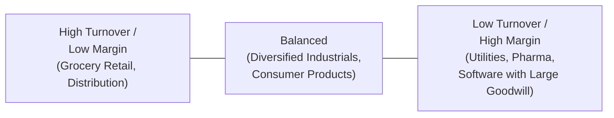
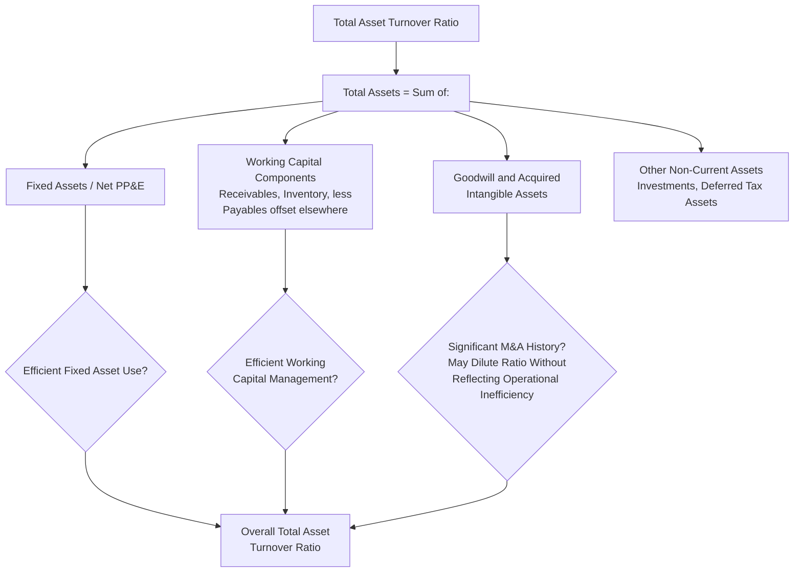

## Total Asset Turnover Ratio

### Overview

The total asset turnover ratio measures how efficiently a company uses its entire asset base — not just fixed assets, but current assets (cash, receivables, inventory) and other non-current assets (intangibles, investments, goodwill) as well — to generate revenue. It is a broader efficiency measure than the fixed asset turnover ratio, capturing capital productivity across the whole balance sheet rather than isolating the fixed asset component. Total asset turnover is a foundational element of DuPont return on equity (ROE) decomposition and is widely used in both cross-industry and within-industry comparative analysis, though its breadth makes it a somewhat blunter instrument than the more targeted capital intensity ratios discussed elsewhere in this chapter.

### Formula and Basic Calculation

$$\text{Total Asset Turnover Ratio} = \frac{\text{Net Revenue}}{\text{Total Assets}}$$

As with fixed asset turnover, many analysts use an **average** of beginning and ending total assets rather than the ending balance alone, to better align the balance sheet stock measure with revenue generated as a flow throughout the period.

$$\text{Total Asset Turnover Ratio (Average Basis)} = \frac{\text{Net Revenue}}{\frac{\text{Beginning Total Assets} + \text{Ending Total Assets}}{2}}$$

**Example**

A company reports $2,400 million in net revenue for the fiscal year. Total assets were $1,850 million at the beginning of the year and $2,050 million at the end of the year.

$$\text{Average Total Assets} = \frac{1{,}850 + 2{,}050}{2} = \$1{,}950 \text{ million}$$

$$\text{Total Asset Turnover Ratio} = \frac{2{,}400}{1{,}950} = 1.23x$$

This indicates the company generates $1.23 of revenue for every $1.00 of total assets employed.

### Interpreting the Ratio

**Key Points**

- **Higher ratio**: Indicates the company generates more revenue per dollar of total assets, generally associated with asset-light business models, high-volume/low-margin businesses (e.g., grocery retail, distribution), and companies with efficient working capital management.
- **Lower ratio**: Indicates the company requires a larger total asset base relative to revenue, common in capital-intensive sectors (utilities, telecommunications, heavy industry) and in businesses carrying significant goodwill or intangible assets from acquisitions, since these non-productive-in-the-traditional-sense assets inflate the denominator without directly driving incremental revenue.
- **Business model signal**: Total asset turnover tends to be inversely related to net profit margin across industries — low-margin, high-volume businesses (retail, distribution) typically show high turnover, while high-margin, capital-intensive or asset-heavy businesses (utilities, pharmaceuticals with large intangible bases) typically show low turnover. This inverse relationship is a recurring pattern in the DuPont framework, where the product of margin and turnover (asset efficiency) tends to move toward a normalized range of returns across mature industries, even though the individual components (margin and turnover) can differ dramatically.

### Diagram: Total Asset Turnover vs. Margin — The DuPont Trade-Off Pattern

### Relationship to Fixed Asset Turnover

**Key Points**

Total asset turnover and fixed asset turnover are related but distinct, and the gap between them is informative:

$$\text{Total Assets} = \text{Net Fixed Assets (PP\&E)} + \text{Current Assets} + \text{Other Non-Current Assets (Goodwill, Intangibles, Investments)}$$

A company with total asset turnover much lower than its fixed asset turnover has a significant portion of its balance sheet tied up in non-fixed-asset items — typically working capital (receivables, inventory) or goodwill/intangibles from acquisitions — that dilute overall asset efficiency even if the fixed asset base itself is being used productively. Conversely, a company where the two ratios are close together has a balance sheet dominated by fixed assets relative to working capital and intangibles, common in heavily capital-intensive, less acquisitive industries (utilities, railroads).

**Example**: Two companies in the same industry both show a fixed asset turnover of 2.5x. Company A has a total asset turnover of 1.8x, while Company B has a total asset turnover of 1.1x. This divergence suggests Company B carries a materially larger non-fixed-asset base relative to revenue — potentially reflecting a large goodwill balance from historical acquisitions, elevated working capital requirements, or significant non-operating investments — that Company A does not carry to the same degree, even though both companies use their physical fixed assets with similar apparent efficiency.

### Role in DuPont Analysis

**Key Points**

Total asset turnover is one of the three multiplicative components of the classic DuPont ROE decomposition:

$$\text{ROE} = \underbrace{\frac{\text{Net Income}}{\text{Revenue}}}_{\text{Net Profit Margin}} \times \underbrace{\frac{\text{Revenue}}{\text{Total Assets}}}_{\text{Total Asset Turnover}} \times \underbrace{\frac{\text{Total Assets}}{\text{Shareholders' Equity}}}_{\text{Financial Leverage}}$$

This decomposition isolates three distinct drivers of return on equity: pricing/cost efficiency (margin), asset utilization efficiency (turnover), and capital structure/leverage. A company can achieve the same ROE through very different combinations of these three levers — for example, a capital-intensive utility might achieve a target ROE primarily through leverage and stable margins with low turnover, while a retailer might achieve a similar ROE primarily through high turnover and thin margins with modest leverage. Total asset turnover, within this framework, specifically isolates how much revenue-generating "work" the balance sheet is doing, independent of pricing power or financing structure.

**Example** DuPont decomposition comparison:

| Company | Net Profit Margin | Total Asset Turnover | Financial Leverage | ROE |
| --- | --- | --- | --- | --- |
| Capital-Intensive Utility | 12.0% | 0.35x | 3.2x | 13.4% |
| High-Volume Retailer | 3.0% | 2.10x | 2.1x | 13.2% |

Both companies arrive at similar ROE through fundamentally different operating and financing profiles — illustrating why total asset turnover should always be read in the context of the full DuPont decomposition rather than in isolation.

### Typical Ratio Ranges by Industry

**Example** (illustrative; ranges vary with company-specific working capital efficiency, M&A history, and business mix):

| Industry | Typical Total Asset Turnover Range |
| --- | --- |
| Grocery / food retail | 2.5x – 4.0x |
| General merchandise retail | 1.5x – 2.5x |
| Consumer packaged goods | 0.8x – 1.3x |
| Industrial manufacturing | 0.6x – 1.2x |
| Software / SaaS (with acquisition-heavy goodwill) | 0.3x – 0.7x |
| Pharmaceuticals | 0.3x – 0.6x |
| Telecommunications | 0.3x – 0.5x |
| Electric utilities | 0.2x – 0.4x |
| Banks / financial institutions | Not typically meaningful under this formula; asset composition differs fundamentally |

[Inference] These ranges reflect general industry patterns and are influenced heavily by company-specific factors including M&A history (goodwill accumulation), working capital management practices, and capital structure choices; they should be treated as broad orientation points rather than precise benchmarks for any individual company.

**Note on financial institutions**: Total asset turnover, as conventionally defined, is generally not a meaningful metric for banks and other financial institutions, since their "total assets" consist predominantly of financial instruments (loans, securities) that generate interest income measured quite differently from the revenue-generation process in non-financial companies; sector-specific efficiency metrics (net interest margin, efficiency ratio) are typically used instead for that industry.

### Impact of Goodwill and Intangible-Heavy Balance Sheets

**Key Points**

A significant analytical consideration for total asset turnover is the effect of **goodwill and acquired intangible assets**, which can substantially inflate the denominator without a directly corresponding increase in revenue-generating capacity in the way that organic fixed asset investment typically does:

- A company that has grown primarily through acquisition often carries a total asset turnover ratio meaningfully lower than an organically grown peer of similar revenue scale, purely because of the goodwill and intangible assets recognized in purchase price allocations (ASC 805 / IFRS 3).
- This effect can make total asset turnover a less reliable indicator of *operational* efficiency for highly acquisitive companies, since a declining ratio might simply reflect recent M&A activity rather than deteriorating underlying asset productivity.
- Some analysts calculate a **tangible asset turnover** variant, excluding goodwill and intangible assets from the denominator, specifically to strip out this M&A-driven distortion and better isolate the efficiency of the tangible, operationally productive asset base.

$$\text{Tangible Asset Turnover Ratio} = \frac{\text{Net Revenue}}{\text{Total Assets} - \text{Goodwill} - \text{Intangible Assets}}$$

### Diagram: Decomposing the Drivers of Total Asset Turnover

### Example: Multi-Year Trend Analysis with M&A Context

**Example**

| Year | Revenue | Total Assets | Total Asset Turnover | Notable Event |
| --- | --- | --- | --- | --- |
| 2022 | 1,800 | 1,400 | 1.29x | Baseline organic operations |
| 2023 | 1,950 | 1,480 | 1.32x | Modest organic growth |
| 2024 | 2,100 | 2,350 | 0.89x | Major acquisition completed (goodwill added) |
| 2025 | 2,450 | 2,420 | 1.01x | Post-acquisition integration and revenue synergies realized |

**Interpretation**: The sharp decline in total asset turnover from 1.32x (2023) to 0.89x (2024) coincides with a major acquisition that added substantial goodwill and intangible assets to the balance sheet without an immediate, proportional increase in revenue. The recovery to 1.01x in 2025 reflects both organic revenue growth and the beginning of acquisition synergy realization. Reading the 2024 decline in isolation, without recognizing the M&A context, could lead an analyst to mistakenly conclude the company's core operating efficiency deteriorated, when the change is substantially attributable to a balance sheet composition shift from the transaction itself.

### Limitations of the Ratio

**Key Points**

- **Blends fundamentally different asset types**: By combining fixed assets, working capital, and intangibles into a single denominator, the ratio obscures which specific asset category is driving efficiency changes — a decline in total asset turnover could stem from deteriorating fixed asset utilization, worsening working capital management (e.g., rising receivables or inventory), or M&A-related goodwill growth, each of which has very different strategic implications and requires separate diagnostic ratios (fixed asset turnover, receivables turnover, inventory turnover) to disentangle.
- **M&A distortion**: As discussed above, acquisitive companies show mechanically lower ratios due to goodwill and intangible recognition, independent of operational efficiency — cross-company comparisons should account for differing M&A histories.
- **Revenue recognition and business model differences**: Companies with different revenue recognition patterns (e.g., a company recognizing revenue net of certain costs versus one recognizing it gross) can show different turnover ratios purely from presentation differences rather than genuine asset efficiency differences.
- **Industry heterogeneity limits cross-industry comparison**: Because typical ratio ranges vary so dramatically across industries (as shown in the table above), the ratio is far more useful for within-industry peer comparison and single-company trend analysis than for comparing companies across fundamentally different business models.
- **Not meaningful for certain sectors**: As noted, financial institutions and certain other specialized business models (real estate investment trusts, insurance companies) require sector-specific efficiency metrics rather than the generic total asset turnover formula.

### Use Alongside Other Metrics

**Key Points**

Total asset turnover is most useful as part of a broader analytical toolkit rather than as a standalone metric:

- **With fixed asset turnover**: Helps isolate whether efficiency changes stem from the fixed asset base specifically or from working capital/intangible asset dynamics.
- **With DuPont ROE decomposition**: Contextualizes turnover alongside margin and leverage to understand the full picture of how a company generates its returns.
- **With tangible asset turnover**: Strips out M&A-related goodwill distortion to isolate organic operational efficiency.
- **With working capital ratios** (receivables turnover, inventory turnover, days payable outstanding): Helps decompose which specific balance sheet component is driving overall total asset efficiency trends.

### Conclusion

Total asset turnover provides a comprehensive, balance-sheet-wide measure of how efficiently a company converts its full asset base into revenue, complementing the narrower fixed asset turnover ratio by capturing working capital and intangible asset dynamics alongside fixed asset productivity. Its breadth is simultaneously its strength — offering a holistic efficiency view suitable for DuPont-style return decomposition — and its principal limitation, since it blends fundamentally different asset categories into a single figure and can be significantly distorted by M&A activity, goodwill accumulation, and cross-industry business model differences. Effective use of this ratio generally requires pairing it with more granular diagnostics (fixed asset turnover, working capital ratios, tangible asset turnover) and careful attention to a company's acquisition history before drawing conclusions about genuine operational efficiency trends.

**Related Topics**

- Fixed asset turnover ratio
- DuPont analysis and return on equity decomposition
- Tangible asset turnover and goodwill-adjusted efficiency metrics
- Return on invested capital (ROIC) as a complementary profitability-efficiency measure
- Working capital efficiency ratios: receivables turnover, inventory turnover
- Goodwill and intangible asset accounting under purchase price allocation (ASC 805 / IFRS 3)
- Capex-to-revenue ratio and capital intensity benchmarking
- Cross-industry versus within-industry ratio benchmarking considerations