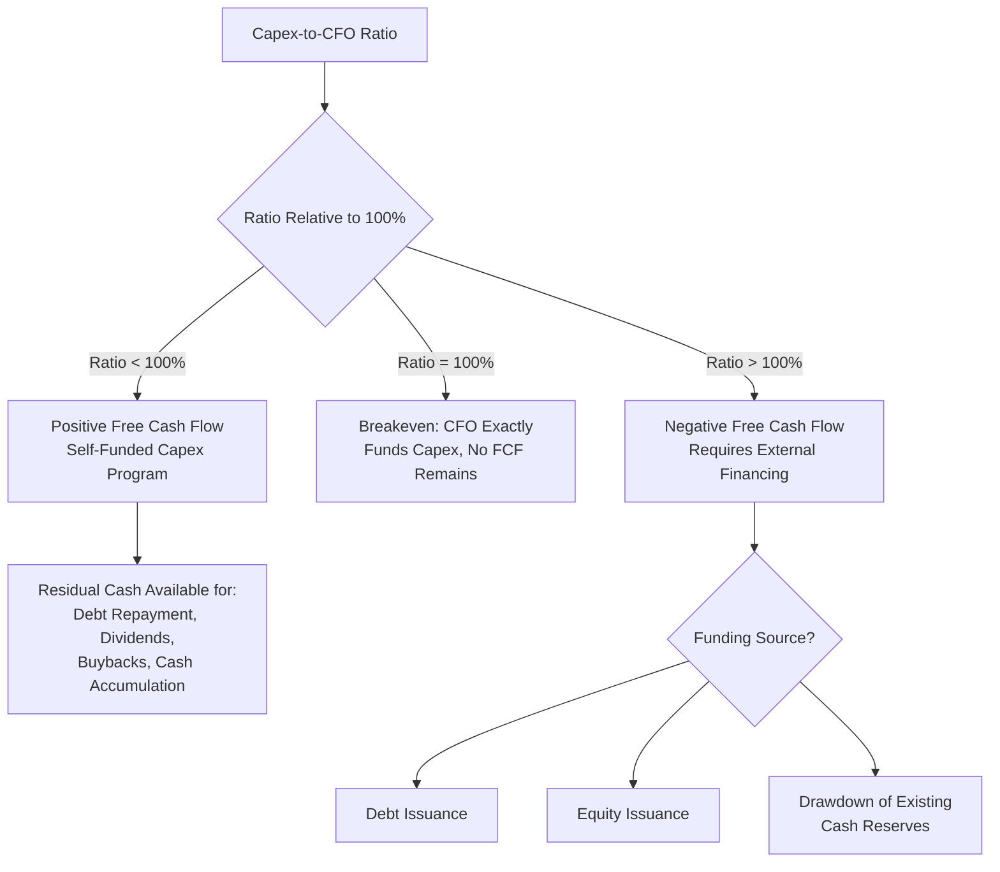
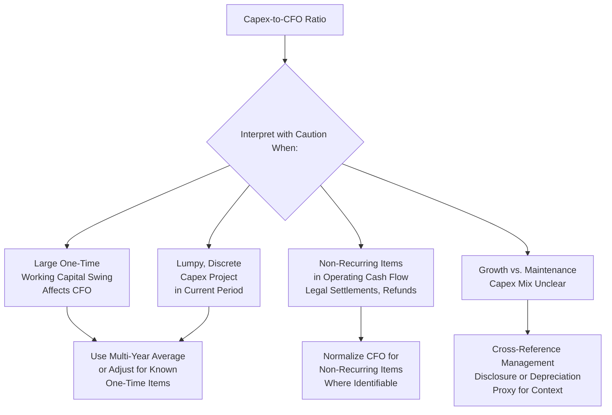

## Capex to Operating Cash Flow Ratio

### Overview

The capex-to-operating-cash-flow ratio measures what proportion of a company's cash generated from core operations is being reinvested into capital expenditure. Unlike the capex-to-revenue ratio, which normalizes capex against the top line, this ratio compares capex directly against the cash actually available from operations — a more direct measure of a company's self-funding capacity for its capital program. It is one of the most important ratios for assessing free cash flow generation, capital allocation flexibility, and the degree to which a company depends on external financing (debt or equity issuance) to fund its investment program.

### Formula and Basic Calculation

$$\text{Capex-to-Operating Cash Flow Ratio} = \frac{\text{Capital Expenditures}}{\text{Cash Flow from Operations (CFO)}} \times 100$$

Both figures are sourced directly from the cash flow statement: capex from investing activities, and CFO from the operating activities section.

**Example**

A company reports $310 million in capital expenditures and $540 million in cash flow from operations for the fiscal year.

$$\text{Capex-to-CFO Ratio} = \frac{310}{540} \times 100 = 57.4\%$$

This means the company reinvested approximately 57% of its operating cash flow into capex, retaining the remaining 43% (before other uses such as debt service, dividends, or buybacks) as free cash flow.

### Direct Relationship to Free Cash Flow

**Key Points**

This ratio is structurally the complement of the standard free cash flow (FCF) calculation, making it one of the most directly interpretable capital intensity metrics in this chapter:

$$\text{Free Cash Flow} = \text{Cash Flow from Operations} - \text{Capital Expenditures}$$

$$\text{FCF} = \text{CFO} \times (1 - \text{Capex-to-CFO Ratio})$$

**Example continued**: Using the figures above,

$$\text{FCF} = 540 - 310 = \$230 \text{ million}$$

$$\text{FCF Margin (of CFO)} = 1 - 0.574 = 42.6\%$$

This direct linkage means the capex-to-CFO ratio is, in effect, a normalized way of expressing how much of operating cash generation is "consumed" by reinvestment before any cash is available for debt repayment, dividends, buybacks, or balance sheet accumulation.

### Interpreting the Ratio

**Key Points**

- **Ratio close to or exceeding 100%**: Indicates the company is reinvesting all, or more than all, of its operating cash flow into capex — common during major expansion phases, early-stage capital-intensive businesses (e.g., early-stage data center operators, semiconductor fabrication buildouts, greenfield infrastructure projects), or companies in significant capacity-building cycles. A ratio persistently above 100% implies the company is generating negative free cash flow and likely needs external financing (debt, equity) to fund both operations and growth simultaneously.
- **Moderate ratio (40-70%)**: Common in mature, moderately capital-intensive businesses that are reinvesting a meaningful portion of cash flow while still generating positive free cash flow for other capital allocation priorities.
- **Low ratio (below 20-30%)**: Indicates a business retaining most of its operating cash flow after capital reinvestment, common in asset-light business models (software, many consumer services, licensing-heavy businesses) or mature, harvest-phase capital-intensive businesses that have completed major investment cycles and are now generating substantial free cash flow.

### Typical Ratio Ranges by Industry and Life Cycle Stage

**Example** (illustrative; ranges vary significantly with company-specific investment cycle stage):

| Business Context | Typical Capex-to-CFO Range |
| --- | --- |
| Asset-light software / services | 5% – 15% |
| Mature consumer products | 15% – 30% |
| Mature industrial manufacturing | 25% – 45% |
| Telecommunications (steady-state) | 40% – 60% |
| Telecommunications (network upgrade cycle, e.g., 5G buildout) | 60% – 90%+ |
| Electric utilities (regulated, steady investment) | 80% – 130%+ |
| Upstream oil and gas (growth phase) | 70% – 120%+ |
| Data center / cloud infrastructure (build-out phase) | 100% – 200%+ |
| Airlines (fleet renewal cycle) | 50% – 100%+ |

[Inference] These ranges reflect general patterns and vary substantially based on where a specific company sits in its investment cycle, industry structure, and capital intensity profile; utilities and other regulated infrastructure businesses frequently run ratios well above 100% for extended periods, funded by a combination of debt issuance and equity, as part of a normal, ongoing regulatory capital investment model rather than a sign of financial distress.

### Diagram: Capex-to-CFO Ratio and Funding Implications

### Use in Assessing Capital Allocation Flexibility and Financial Risk

**Key Points**

- **Self-funding capacity**: A company with a consistently low capex-to-CFO ratio has significant flexibility to pursue shareholder returns (dividends, buybacks), debt reduction, or opportunistic M&A without straining its balance sheet, since a large share of operating cash flow remains available after reinvestment needs are met.
- **Financing dependency signal**: A ratio persistently at or above 100% signals that a company's capital program is not self-funding from operations alone, requiring either debt issuance, equity issuance, or asset sales to bridge the gap — this is not inherently problematic (many regulated utilities and growth-phase infrastructure businesses operate this way as a normal part of their business model), but it does create sensitivity to capital market access and financing cost conditions, and warrants attention to leverage trends and debt covenant capacity.
- **Cyclical stress testing**: In cyclical industries (oil and gas, mining, airlines), CFO can decline sharply during a downturn while capex commitments — particularly on already-committed projects — may be less flexible in the short term, causing the ratio to spike during precisely the periods when external financing capacity may be most constrained. This dynamic is a key focus in credit analysis and stress testing for capital-intensive, cyclical borrowers.
- **Dividend and buyback sustainability**: For income-oriented equity investors, a rising capex-to-CFO ratio (implying declining free cash flow available after reinvestment) can be an early warning sign regarding the sustainability of dividend or buyback programs, particularly if the company is simultaneously increasing leverage to maintain shareholder distributions during a period of elevated capex.

### Example: Multi-Year Analysis Through an Investment Cycle

**Example**

| Year | Cash Flow from Operations | Capex | Capex-to-CFO Ratio | Free Cash Flow | Interpretation |
| --- | --- | --- | --- | --- | --- |
| 2022 | 480 | 220 | 45.8% | 260 | Steady-state, healthy FCF generation |
| 2023 | 510 | 380 | 74.5% | 130 | Investment cycle begins; FCF compresses |
| 2024 | 540 | 620 | 114.8% | (80) | Peak investment year; negative FCF, external funding likely required |
| 2025 | 610 | 340 | 55.7% | 270 | Post-investment normalization; FCF recovers above prior levels |

**Interpretation**: The 2024 negative free cash flow year, driven by the ratio exceeding 100%, would typically coincide with increased debt issuance or drawdown of cash reserves, visible in the financing activities section of the cash flow statement and in balance sheet leverage trends. The recovery to a 55.7% ratio and positive $270 million FCF in 2025 — exceeding the pre-investment 2022 level of $260 million — suggests the completed investment program is now contributing incremental operating cash flow, a favorable outcome that would be corroborated by examining whether CFO growth (from $480 million to $610 million over the period) can reasonably be attributed to the capacity added during the 2023-2024 investment cycle.

### Relationship to Other Capital Intensity and Cash Flow Metrics

**Key Points**

| Metric | Formula | Distinguishing Focus |
| --- | --- | --- |
| Capex-to-CFO | Capex / CFO | Direct funding capacity from operating cash generation |
| Capex-to-revenue | Capex / Revenue | Capital intensity relative to sales scale |
| Capex-to-EBITDA | Capex / EBITDA | Capital intensity relative to accrual-based cash operating profit proxy |
| Free cash flow conversion | FCF / Net Income | Quality of earnings translating into actual cash generation |
| Free cash flow yield | FCF / Market Capitalization (or Enterprise Value) | Valuation-relative cash generation metric |

The capex-to-CFO ratio is generally considered a more direct and less distortable metric than capex-to-EBITDA, because CFO already reflects actual cash movements including working capital changes, whereas EBITDA is an accrual-based proxy that can diverge from actual cash generation, particularly for companies with volatile working capital needs (e.g., rapidly growing companies building inventory or extending customer credit terms).

### Limitations of the Ratio

**Key Points**

- **CFO volatility from working capital swings**: Because CFO includes changes in working capital, a large one-time working capital swing (e.g., a temporary inventory build, a large customer payment delay, or an unusual change in payables timing) can distort the ratio in a given period independent of the underlying capex program or core operating profitability — multi-year averaging or adjusting for known one-time working capital items improves reliability.
- **Lumpy capex creates single-year volatility**: As with other capex-based ratios in this chapter, discrete, large capital projects create spikes in the ratio during investment years that are not representative of the ongoing steady-state relationship between capex and cash generation.
- **Does not distinguish maintenance from growth capex**: A high ratio driven by growth capex (expanding future capacity) carries very different long-term implications than the same ratio driven by maintenance capex (merely sustaining existing capacity) — the ratio alone cannot make this distinction, and analysts should reference disclosed capex splits or the depreciation-based proxy where available for further context.
- **Sensitivity to non-operating or non-recurring CFO items**: CFO can be affected by non-recurring items (large legal settlements, unusual tax refunds, insurance proceeds classified within operating activities) that are unrelated to core operating cash generation capacity, potentially distorting the ratio's denominator in a way unrelated to genuine operating trends.
- **Cross-industry comparison limitations**: As with capex-to-revenue, typical ratio ranges vary dramatically by industry and investment cycle stage, meaning the ratio is most meaningful for within-industry peer comparison or single-company trend analysis rather than broad cross-industry comparison.

### Diagram: Sources of Distortion in the Capex-to-CFO Ratio

### Use in Credit Analysis and Covenant Frameworks

**Key Points**

- **Coverage-style credit metrics**: Lenders and rating agencies often examine the capex-to-CFO relationship as part of a broader assessment of a borrower's post-capex cash flow available for debt service, sometimes formalized in credit agreements through minimum fixed charge coverage ratios or maximum capex covenants that indirectly constrain this relationship.
- **Discretionary versus committed capex distinction in stress scenarios**: Credit analysts often distinguish between capex a company *must* spend (contractually committed, regulatory-mandated, or safety-critical) and capex that is *discretionary* (growth-oriented, deferrable) when assessing how much flexibility a borrower has to reduce the capex-to-CFO ratio during a cash flow downturn — a company with mostly discretionary capex has more downside flexibility than one with predominantly committed or regulatory-mandated capital spending.

### Conclusion

The capex-to-operating-cash-flow ratio provides one of the most direct and analytically useful measures of capital intensity because it compares capex directly against the actual cash a company generates from its core operations, rather than against an accrual-based proxy like revenue or EBITDA. Its structural link to free cash flow makes it a natural bridge between capital intensity analysis and broader capital allocation, credit risk, and shareholder return sustainability assessment. As with related capex ratios, its reliability improves with multi-year averaging, adjustment for known one-time working capital or non-recurring items, and awareness of where a company sits within its capital investment cycle — a ratio above 100% is a normal and often expected feature of certain regulated or growth-phase business models, not automatically a signal of distress, provided the company retains adequate access to external financing to bridge the funding gap.

**Related Topics**

- Free cash flow calculation and quality assessment
- Capex-to-revenue ratio
- Capex-to-EBITDA ratio
- Depreciation as a proxy for maintenance capex
- Credit analysis: fixed charge coverage and capex covenants
- Working capital management and its effect on operating cash flow
- Capital allocation frameworks: reinvestment versus shareholder distributions
- Dividend and buyback sustainability analysis in capital-intensive industries