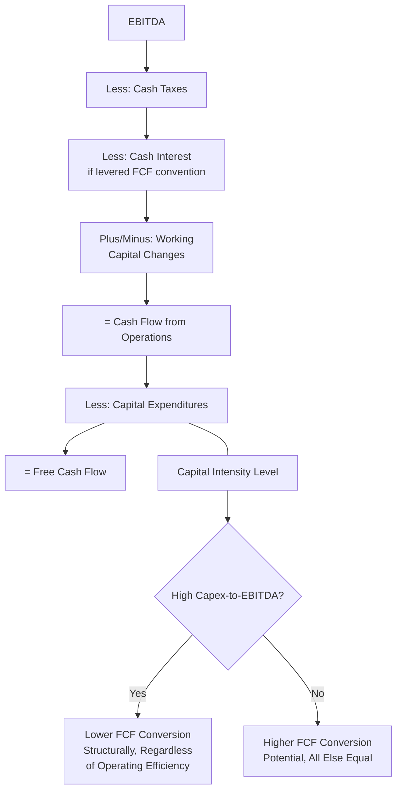
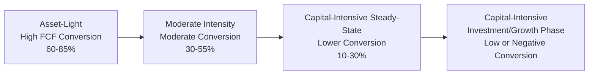
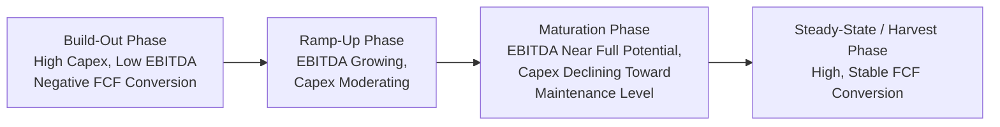

## Free Cash Flow Conversion and Capital Intensity

### Overview

Free cash flow conversion measures how effectively a company translates its accrual-based earnings into actual distributable cash, and capital intensity — the amount of capex required to generate that earnings and cash flow — is one of the most significant structural determinants of that conversion rate. This topic sits at the intersection of profitability analysis and capital intensity analysis: two companies with identical net income or EBITDA can produce dramatically different free cash flow outcomes purely because of how much capex their respective business models demand. Understanding this relationship is central to valuation, capital allocation assessment, and cross-industry comparability.

### Formula and Basic Calculation

Free cash flow conversion is typically expressed as the ratio of free cash flow to some measure of accrual-based earnings, most commonly net income or EBITDA:

$$\text{FCF Conversion (from Net Income)} = \frac{\text{Free Cash Flow}}{\text{Net Income}} \times 100$$

$$\text{FCF Conversion (from EBITDA)} = \frac{\text{Free Cash Flow}}{\text{EBITDA}} \times 100$$

Where free cash flow is most commonly defined as:

$$\text{Free Cash Flow} = \text{Cash Flow from Operations} - \text{Capital Expenditures}$$

**Example**

A company reports $420 million in EBITDA, $610 million in cash flow from operations, and $260 million in capital expenditures.

$$\text{Free Cash Flow} = 610 - 260 = \$350 \text{ million}$$

$$\text{FCF Conversion (from EBITDA)} = \frac{350}{420} \times 100 = 83.3\%$$

This indicates the company converts roughly 83 cents of every EBITDA dollar into free cash flow, after accounting for working capital changes, taxes, interest (if using an unlevered FCF convention that excludes these — conventions vary), and capital reinvestment.

### The Central Role of Capital Intensity in Conversion Rates

**Key Points**

Because capex is subtracted directly in the free cash flow calculation, a company's capital intensity — most directly observable through metrics like the capex-to-revenue ratio, capex-to-EBITDA ratio, and capex-to-operating-cash-flow ratio discussed elsewhere in this chapter — is mechanically one of the two largest drivers of FCF conversion (the other being working capital dynamics captured within CFO).

$$\text{FCF Conversion} \approx 1 - \frac{\text{Capex}}{\text{EBITDA}} - \text{(Working Capital and Other Adjustments as \% of EBITDA)}$$

This relationship means that, holding operating profitability constant, a more capital-intensive business will structurally exhibit lower FCF conversion than a less capital-intensive one — this is not a sign of inferior management or operational execution, but a structural feature of the underlying business model's capital requirements.

### Diagram: How Capital Intensity Drives FCF Conversion

### Comparative Illustration: Capital Intensity's Effect on Conversion

**Example**

Two companies generate identical EBITDA of $500 million, with similar working capital dynamics, but operate in industries with very different capital intensity profiles:

| Metric | Company A (Software, Asset-Light) | Company B (Telecom, Capital-Intensive) |
| --- | --- | --- |
| EBITDA | 500 | 500 |
| Cash Flow from Operations | 430 | 420 |
| Capital Expenditures | 60 | 340 |
| Free Cash Flow | 370 | 80 |
| FCF Conversion (from EBITDA) | 74.0% | 16.0% |

**Interpretation**: Despite identical EBITDA, Company A converts nearly 5x more of its EBITDA into free cash flow than Company B, driven almost entirely by the difference in capital intensity ($60 million versus $340 million of capex). This illustrates why EBITDA-based valuation multiples alone can be misleading when comparing companies across different capital intensity profiles — two companies trading at the same EV/EBITDA multiple may represent very different economic value once capital intensity and resulting free cash flow generation are properly accounted for.

### Why FCF Conversion Matters More Than EBITDA Alone in Capital-Intensive Analysis

**Key Points**

- **EBITDA excludes capex by construction**: EBITDA (earnings before interest, taxes, depreciation, and amortization) deliberately excludes depreciation — the accounting proxy for asset consumption — without any corresponding adjustment for the actual cash capex required to sustain or grow the business. This makes EBITDA, used alone, a systematically incomplete measure of true cash-generating capacity for capital-intensive businesses, and one of the most commonly cited criticisms of EBITDA as a valuation anchor in capital-intensive sectors.
- **FCF conversion corrects for this omission**: By explicitly netting capex against operating cash flow, FCF conversion analysis restores the capital intensity dimension that EBITDA-based analysis alone omits, providing a more complete picture of how much economic value a given level of operating profitability actually translates into distributable cash.
- **Valuation multiple implications**: Analysts and investors frequently apply differentiated valuation multiples to businesses with different capital intensity profiles even at similar EBITDA margins, precisely because FCF conversion — and therefore the cash actually available to equity and debt holders — differs so substantially. [Inference] The degree to which markets fully and consistently price this distinction varies over time and across sectors, and mispricing of capital intensity differences (particularly during periods of EBITDA-multiple-driven valuation frameworks) has historically been identified as a source of investment opportunity or risk by various market participants, though this is a matter of market judgment rather than a settled empirical fact.

### FCF Conversion Across the Capital Intensity Spectrum

**Example** (illustrative; actual conversion rates vary with company-specific factors including growth phase, working capital dynamics, and tax structure):

| Capital Intensity Profile | Typical FCF Conversion (from EBITDA) Range |
| --- | --- |
| Asset-light software / services | 60% – 85% |
| Consumer products / retail | 40% – 65% |
| Industrial manufacturing | 30% – 55% |
| Telecommunications (steady-state) | 25% – 45% |
| Telecommunications (network investment cycle) | 5% – 25% |
| Electric utilities | 10% – 30% |
| Upstream oil and gas (growth phase) | Often negative to 20% |
| Data center / cloud infrastructure (build-out phase) | Often negative |

[Inference] These ranges represent generally observed patterns rather than fixed benchmarks, and actual conversion rates for any specific company depend heavily on where it sits within its investment cycle, its working capital efficiency, and industry-specific tax and regulatory factors.

### Diagram: FCF Conversion Across the Capital Intensity Spectrum

### The Life-Cycle Dimension: Conversion Rates Change Over Time

**Key Points**

A critical nuance in this analysis is that FCF conversion is not a static, purely structural attribute of an industry — it varies significantly across a company's own investment cycle, even within a stable, capital-intensive industry:

- **Build-out / growth phase**: Capex runs high relative to current EBITDA (since new capacity has not yet fully ramped to generate proportional earnings), producing low or negative FCF conversion.
- **Maturation phase**: As invested capacity ramps up and begins generating full earnings potential while capex moderates toward maintenance levels, FCF conversion typically improves substantially.
- **Harvest / mature phase**: With capex needs largely limited to maintenance, and the earnings base fully realized from prior investment, FCF conversion often reaches its highest sustainable level for the business.

This life-cycle pattern is a recurring theme across capital-intensive industries — telecommunications companies investing in 5G infrastructure, data center operators building out capacity ahead of contracted demand, and utilities undertaking major grid modernization programs all typically exhibit temporarily depressed FCF conversion during the investment phase, followed by improvement as the assets mature and begin contributing fully to earnings.

**Example** multi-year life-cycle illustration:

| Phase | EBITDA | Capex | FCF (approx., ignoring working capital/tax) | FCF Conversion |
| --- | --- | --- | --- | --- |
| Year 1 (Build-out) | 300 | 450 | (150) | Negative |
| Year 2 (Build-out continues) | 340 | 400 | (60) | Negative |
| Year 3 (Ramp-up begins) | 420 | 280 | 140 | 33.3% |
| Year 4 (Maturation) | 480 | 180 | 300 | 62.5% |
| Year 5 (Mature, steady-state) | 510 | 150 | 360 | 70.6% |

**Interpretation**: This pattern illustrates why a snapshot FCF conversion metric taken during a build-out phase can be highly misleading about a business's eventual steady-state cash-generating potential — an investor evaluating Year 1 or Year 2 in isolation, without understanding the underlying investment cycle, might significantly undervalue the business relative to its Year 5 mature-state economics.

### Diagram: FCF Conversion Through a Capital Investment Life Cycle

### Implications for Valuation Methodology

**Key Points**

- **DCF modeling**: Because FCF conversion changes systematically across a capital investment life cycle, discounted cash flow models for capital-intensive, growth-phase businesses must carefully model the trajectory of capex relative to EBITDA over the explicit forecast period, rather than applying a static, steady-state conversion assumption prematurely — doing so would understate near-term free cash flow needs and could produce an overly optimistic near-term valuation.
- **Multiple selection**: Analysts sometimes apply an EV/EBITDA multiple that implicitly reflects an assumed steady-state FCF conversion rate; comparing multiples across companies at different points in their investment cycle (one in build-out phase, one in mature harvest phase) without adjusting for this can lead to inconsistent relative valuation conclusions.
- **Alternative to EBITDA multiples**: In highly capital-intensive sectors, some analysts prefer valuation approaches that more directly incorporate free cash flow or unlevered free cash flow (e.g., EV/FCF multiples, or explicit multi-stage DCF models) specifically because EBITDA-based multiples can obscure capital intensity differences that materially affect the cash actually available to capital providers.

### Limitations and Analytical Cautions

**Key Points**

- **Working capital volatility can obscure the capital-intensity signal**: Because FCF conversion also incorporates working capital changes (embedded within CFO), a period with unusual working capital swings can distort the conversion rate independent of the underlying capital intensity trend — analysts should examine the capex and working capital components separately when diagnosing the source of a conversion rate change.
- **Definitional inconsistency across companies and analysts**: "Free cash flow" itself is a non-GAAP measure without a single standardized definition — some practitioners define it as CFO less total capex (as used throughout this material), others as CFO less only maintenance capex, and others incorporate additional adjustments (stock-based compensation add-backs, lease payment treatment). Comparing FCF conversion rates across companies requires verifying that a consistent definition is being applied, particularly given SEC Regulation G's reconciliation requirements for any non-GAAP FCF measure a company discloses.
- **Growth-phase businesses require life-cycle context, not snapshot judgment**: As illustrated above, a single-period low or negative FCF conversion reading for a capital-intensive, growth-phase business should not be interpreted the same way as a similarly low reading for a mature business with no clear path to improved capacity utilization — the underlying trajectory and future capex requirements matter as much as the current-period figure.
- **Tax and interest treatment conventions vary**: Depending on whether an analyst is calculating levered (post-interest) or unlevered (pre-interest) free cash flow, and depending on cash versus book tax treatment, conversion rates calculated by different sources for the same company can differ meaningfully — comparability requires consistent methodology.

### Conclusion

Free cash flow conversion provides a more complete lens than EBITDA alone for understanding how much of a company's operating profitability actually translates into distributable cash, precisely because it explicitly incorporates the capital intensity dimension that EBITDA, by construction, excludes. Capital intensity is one of the two dominant structural drivers of FCF conversion (alongside working capital dynamics), meaning businesses with fundamentally different capex requirements will show structurally different conversion rates even at identical profitability levels — a distinction with direct and significant implications for valuation methodology, cross-company comparability, and capital allocation analysis. Critically, FCF conversion is not static even within a single capital-intensive business, but evolves systematically across the investment life cycle from build-out through maturation to steady-state harvest, meaning single-period conversion readings for growth-phase, capital-intensive businesses require careful life-cycle context rather than snapshot interpretation.

**Related Topics**

- Capex-to-EBITDA ratio
- Capex-to-operating-cash-flow ratio
- Capex-to-revenue ratio and capital intensity benchmarking
- EBITDA limitations as a valuation anchor for capital-intensive businesses
- Discounted cash flow modeling across multi-stage capital investment life cycles
- Free cash flow definitions and Regulation G non-GAAP reconciliation requirements
- Working capital management and its effect on cash flow conversion
- EV/EBITDA versus EV/FCF valuation multiple selection in capital-intensive sectors