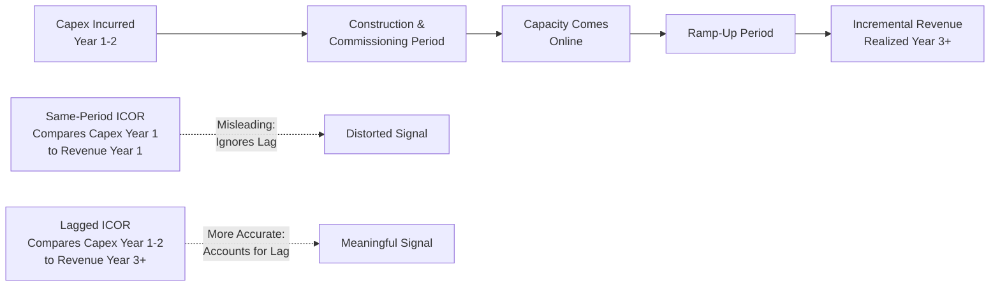
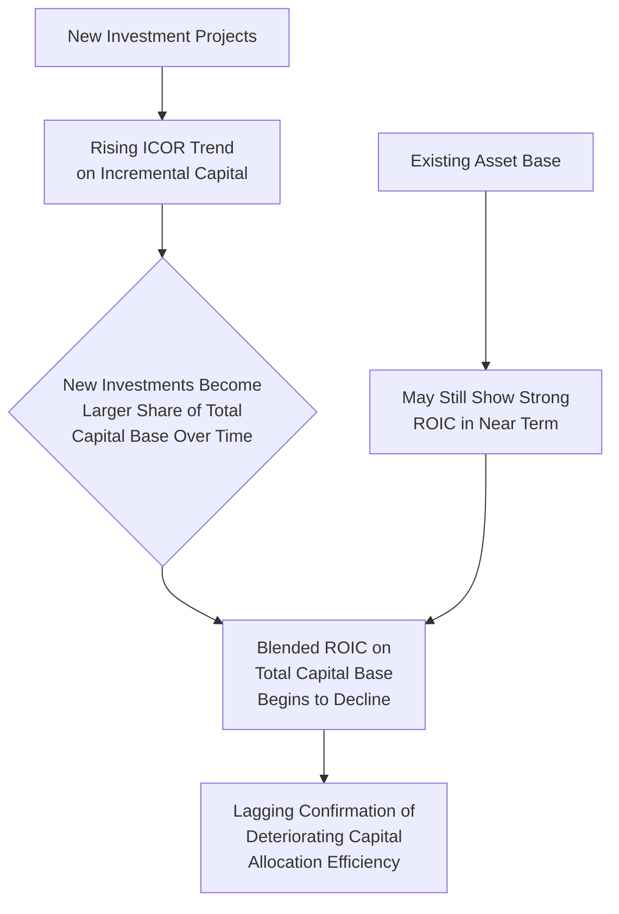

## Incremental Capital Output Ratio

### Overview

The incremental capital output ratio (ICOR) measures how much additional capital investment is required to generate one additional unit of output or revenue growth. Unlike the stock-based turnover ratios (fixed asset turnover, total asset turnover) that assess the productivity of the entire existing asset base, ICOR is specifically a marginal, flow-based measure: it isolates the relationship between *incremental* capital deployed and the *incremental* output or revenue that results. Originally developed in macroeconomic growth theory to assess national or sectoral investment efficiency, the concept has been adapted at the corporate and industry level as a tool for evaluating the marginal efficiency of capital deployment and for benchmarking capital intensity trends over time.

### Formula and Basic Calculation

$$\text{ICOR} = \frac{\Delta \text{Capital Stock (or Investment)}}{\Delta \text{Output (or Revenue)}}$$

At the corporate level, this is most commonly operationalized using capex as the numerator and the resulting change in revenue as the denominator:

$$\text{Corporate ICOR} = \frac{\text{Capital Expenditure}}{\Delta \text{Revenue}}$$

A lower ICOR indicates greater capital efficiency (less investment required per unit of output growth), while a higher ICOR indicates lower capital efficiency (more investment required to generate the same output growth).

**Example**

A company invests $180 million in capex during a fiscal year, and revenue grows by $120 million relative to the prior year.

$$\text{ICOR} = \frac{180}{120} = 1.5x$$

This indicates the company required $1.50 of capital investment for every $1.00 of revenue growth achieved during the period.

### Conceptual Origins and Macroeconomic Context

**Key Points**

ICOR originated in growth economics as a tool to estimate how much investment (as a share of GDP) is required to achieve a target rate of economic growth, based on the historical relationship between capital formation and output growth in an economy or sector.

$$\text{Required Investment Rate} \approx \text{ICOR} \times \text{Target GDP Growth Rate}$$

This macroeconomic framing carries over conceptually to the corporate level: just as a national economy with a lower ICOR can achieve a given growth target with less aggregate investment, a company with a lower ICOR can achieve a given revenue growth target with less capital deployment, freeing up cash for other capital allocation priorities (debt reduction, shareholder returns, M&A) or enabling faster growth for the same level of capital commitment.

[Inference] The macroeconomic version of ICOR has well-documented limitations as a growth-forecasting tool — including its sensitivity to the time lag between investment and output realization, and its assumption of a stable capital-output relationship that does not always hold — and these same limitations carry over, in adapted form, to the corporate-level application discussed here.

### The Lag Problem: Timing Mismatch Between Investment and Output

**Key Points**

One of the most significant analytical challenges with ICOR — at both the macro and corporate level — is that capital investment and the resulting output growth are rarely contemporaneous. A capex program undertaken in one period frequently generates incremental revenue only in subsequent periods, after construction, commissioning, and ramp-up are complete.

This creates two common calculation conventions:

**Same-period ICOR** (simplistic, often misleading):

$$\text{Same-Period ICOR} = \frac{\text{Capex}_t}{\text{Revenue}_t - \text{Revenue}_{t-1}}$$

**Lagged ICOR** (generally more economically meaningful):

$$\text{Lagged ICOR} = \frac{\text{Capex}_{t-n}}{\text{Revenue}_t - \text{Revenue}_{t-n}}$$

where $n$ represents the typical lead time between investment and the realization of incremental output in the relevant industry (which can range from under a year for some retail or technology infrastructure to multiple years for heavy industrial, energy, or telecommunications infrastructure projects).

**Example** illustrating the distortion from ignoring lag:

| Year | Capex | Revenue | Same-Period ICOR |
| --- | --- | --- | --- |
| Year 1 (major plant construction begins) | 400 | 1,000 (flat vs. prior year) | Undefined / very high (near-zero revenue growth) |
| Year 2 (plant construction continues) | 350 | 1,020 | 17.5x (revenue barely grew) |
| Year 3 (plant comes online, ramps up) | 80 | 1,280 | 0.31x (large output jump vs. modest current capex) |

**Interpretation**: Calculated on a same-period basis, Years 1 and 2 appear to show extremely poor capital efficiency (very high ICOR), while Year 3 appears to show extraordinarily strong efficiency (very low ICOR) — but neither figure meaningfully reflects the underlying reality, which is that the $750 million invested across Years 1-2 was the actual driver of the $260 million+ revenue increase realized in Year 3. A properly lagged calculation, comparing the Years 1-2 cumulative capex to the eventual Year 3 revenue increase, would show a more economically meaningful ICOR of approximately 2.9x (750 ÷ 260), still requiring judgment about exactly how much of the Year 3 revenue increase to attribute to this specific investment versus other factors.

### Diagram: The Investment-Output Lag Problem in ICOR Calculation

### Use in Benchmarking Capital Efficiency Trends

**Key Points**

Despite the lag challenge, ICOR (calculated with appropriate lag adjustment, or averaged over a multi-year rolling window to smooth out timing mismatches) remains useful for:

- **Tracking a single company's capital efficiency trend over time**: A rising ICOR trend over multiple investment cycles may indicate declining marginal returns on capital — potentially reflecting market saturation, increasing competition, rising input/construction costs, or declining productivity of successive investment projects (diminishing returns to scale in that particular business or market).
- **Comparing capital efficiency across peers in the same industry**: Companies within the same industry facing similar demand and cost environments can be compared on their relative ICOR to identify differences in capital allocation discipline, project selection quality, or execution efficiency — a company achieving revenue growth with a persistently lower ICOR than peers may reflect superior capital allocation, better project selection, or operational execution advantages.
- **Evaluating specific investment programs (project-level ICOR)**: Applied at the level of an individual expansion project or business line, ICOR can help assess whether a specific capital program is delivering revenue growth in line with its cost, supporting post-investment review and capital allocation accountability processes.

### Rolling Multi-Year ICOR to Smooth Lag and Lumpiness Effects

**Key Points**

Given the lag problem and the general lumpiness of capex (discussed throughout this chapter's related ratios), a common practical refinement is to calculate ICOR using a rolling multi-year window rather than year-over-year figures:

$$\text{Rolling 3-Year ICOR} = \frac{\sum_{t=1}^{3} \text{Capex}_t}{\text{Revenue}_{\text{Year 3}} - \text{Revenue}_{\text{Year 0}}}$$

This approach reduces (though does not entirely eliminate) the distortion from timing mismatches and single-year capex lumpiness, providing a more stable and interpretable trend measure across a full investment-to-output cycle.

**Example**

| Period | Cumulative Capex (3-Year Rolling) | Cumulative Revenue Growth (3-Year Rolling) | Rolling ICOR |
| --- | --- | --- | --- |
| 2020-2022 | 850 | 340 | 2.50x |
| 2021-2023 | 920 | 310 | 2.97x |
| 2022-2024 | 980 | 260 | 3.77x |
| 2023-2025 | 1,010 | 290 | 3.48x |

**Interpretation**: The rising rolling ICOR from 2.50x (2020-2022 window) to 3.77x (2022-2024 window) suggests a deteriorating marginal capital efficiency trend — each incremental dollar of revenue growth is requiring progressively more capital investment to achieve, which could reflect rising competition, market saturation, increasing project costs, or declining returns on the specific investments being made. The modest improvement to 3.48x in the most recent window (2023-2025) would warrant further investigation to determine whether it represents the beginning of a genuine efficiency improvement or merely short-term volatility.

### Relationship to Return on Invested Capital (ROIC)

**Key Points**

ICOR and ROIC are related but distinct concepts, and understanding the relationship between them clarifies what each metric does and does not capture:

- **ROIC** measures the *return generated on the total invested capital base* (a stock-based profitability measure), while **ICOR** measures the *incremental capital required per unit of incremental output* (a flow-based efficiency measure focused specifically on new investment).
- A company can maintain a strong overall ROIC on its existing asset base while simultaneously experiencing a deteriorating ICOR trend on its *new* investment projects — this divergence is an important early warning signal, since it suggests that while the legacy asset base remains productive, the marginal or newest investments are becoming progressively less capital-efficient, which will eventually drag down blended ROIC as the newer, less efficient investments become a larger share of the total capital base over time.
- [Inference] This distinction between blended (stock-based) returns and marginal (flow-based) capital efficiency is a recurring theme in capital allocation analysis, and a rising ICOR trend is sometimes cited by analysts as a leading indicator of future ROIC deterioration, though the strength and reliability of this relationship depends on company-specific factors including the pace of asset base turnover and the relative scale of new versus legacy investment.

### Diagram: ICOR as a Leading Indicator Relative to Blended ROIC

### Limitations of ICOR

**Key Points**

- **Attribution difficulty**: Isolating how much of a given period's revenue growth is genuinely attributable to a specific capex program, versus other factors (pricing changes, market demand shifts, competitive dynamics, macroeconomic conditions), is inherently imprecise at the corporate level — unlike a controlled engineering or project-finance context where a single project's output can be more directly measured.
- **Non-linearity and threshold effects**: Some capital investments (particularly large, discrete infrastructure projects) generate output in step-function jumps rather than smoothly, meaning ICOR calculated over an arbitrary time window can be highly sensitive to exactly where that window's boundaries fall relative to when a major capacity addition comes online.
- **Revenue versus volume/output distinction**: Using revenue as the output denominator embeds pricing effects into the ratio — a company achieving revenue growth primarily through price increases rather than volume/capacity growth will show an artificially favorable ICOR that does not reflect genuine capital efficiency in the sense the concept is intended to capture; using physical output or unit volume as the denominator (where available) generally produces a more economically meaningful ICOR, though this data is not always disclosed.
- **Ignores quality and mix changes**: A company that invests capital to produce a higher-margin or higher-value product mix (even at flat or declining unit volume) may show a poor ICOR on a simple revenue basis despite the investment being economically successful in value-creation terms — margin and mix effects should be considered alongside the raw ratio.
- **Not standardized or commonly disclosed**: Unlike more established ratios such as capex-to-revenue or fixed asset turnover, ICOR is not a standard disclosure item, requires an analyst to construct it from raw capex and revenue data with judgment calls about lag structure and time windows, and has no universally agreed-upon calculation convention — comparability across different analysts' calculations of the "same" company's ICOR should not be assumed without verifying the underlying methodology.

### Practical Application Considerations

**Key Points**

- **Best suited for capital-intensive, expansion-phase analysis**: ICOR is most analytically useful for companies undertaking discrete, identifiable capacity expansion programs (new plants, network buildouts, store expansion programs) where a reasonably clear link between specific investment and subsequent output growth can be established, rather than for companies where capex is diffuse, continuous, and not tied to identifiable discrete capacity additions.
- **Industry and company-specific lag calibration required**: Before applying ICOR meaningfully, analysts should establish a reasonable estimate of the typical lag between capital deployment and revenue realization for the specific industry and project type under review — this lag structure should be informed by industry knowledge (construction timelines, regulatory approval processes, ramp-up curves) rather than assumed to be uniform across different capital-intensive sectors.
- **Complement, not substitute, for other capital intensity metrics**: Given its data and methodological limitations, ICOR is best used as a supplementary diagnostic — particularly for tracking efficiency trends over time or comparing discrete investment programs — rather than as a primary, standalone capital intensity metric in the way capex-to-revenue or fixed asset turnover are more commonly used.

### Conclusion

The incremental capital output ratio provides a marginal, flow-based lens on capital efficiency, measuring how much additional investment is required to generate a unit of incremental output or revenue growth — a distinct and complementary perspective to the stock-based turnover ratios and the broader capex intensity ratios covered elsewhere in this chapter. Its central analytical challenge is the temporal lag between investment and the output it eventually generates, which requires careful lag-adjusted or rolling multi-year calculation to avoid materially misleading same-period comparisons. While not a standardized, commonly disclosed metric and subject to attribution and mix-effect limitations, ICOR remains a valuable supplementary tool for tracking the marginal efficiency of new capital deployment over time, comparing discrete investment programs against peers, and serving as a potential early warning indicator of capital allocation efficiency trends that may eventually be reflected in broader, blended return metrics like ROIC.

**Related Topics**

- Fixed asset turnover ratio
- Total asset turnover ratio
- Return on invested capital (ROIC) and its relationship to marginal capital efficiency
- Capex-to-revenue ratio and capital intensity benchmarking
- Capital allocation review and post-investment project evaluation frameworks
- Diminishing returns to scale in capital-intensive industry investment cycles
- Growth capex versus maintenance capex classification
- Lag structures in capital investment and capacity ramp-up analysis