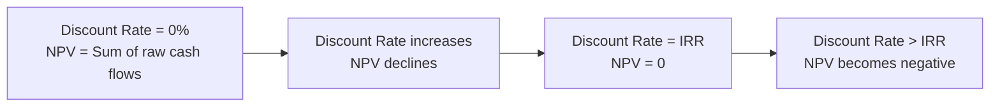

## Internal Rate of Return and Its Limitations

### Definition and Core Concept

The Internal Rate of Return (IRR) is the discount rate at which the net present value (NPV) of a project's cash flows equals zero. It represents the compound annual rate of return a project is expected to generate over its life, expressed as a percentage rather than a dollar amount. IRR is widely used because it produces a single, intuitive figure that can be directly compared against a hurdle rate or cost of capital.

### The IRR Formula

IRR is the value of $r$ that satisfies:

$$0 = \sum_{t=0}^{n} \frac{CF_t}{(1+IRR)^t}$$

Expanded:

$$0 = -CF_0 + \frac{CF_1}{(1+IRR)^1} + \frac{CF_2}{(1+IRR)^2} + \cdots + \frac{CF_n}{(1+IRR)^n}$$

Because this equation is a polynomial of degree $n$, there is generally no closed-form algebraic solution for $IRR$ when $n > 2$. IRR is solved iteratively — either through trial and error, linear interpolation, or numerically using spreadsheet functions and financial calculators.

### Decision Rule

- **IRR > required rate of return (hurdle rate/WACC)**: Accept the project
- **IRR < required rate of return**: Reject the project
- **IRR = required rate of return**: Indifferent; NPV equals zero at that rate

For independent projects with conventional cash flow patterns, the IRR rule and the NPV rule generally lead to the same accept/reject decision, since a positive NPV at the hurdle rate implies the IRR exceeds that hurdle rate.

### Step-by-Step Calculation Process

**Key Points**

- Lay out all expected cash flows by period, including the initial outlay as a negative value
- Select two trial discount rates: one that produces a positive NPV, one that produces a negative NPV
- Use linear interpolation (or a solver/iterative function) to estimate the rate where NPV = 0
- Verify the result by recalculating NPV at the estimated IRR
- Refine iteratively until NPV is acceptably close to zero

### Interpolation Formula (Manual Approximation)

$$IRR \approx r_1 + \frac{NPV_1}{NPV_1 - NPV_2} \times (r_2 - r_1)$$

Where:

- $r_1$ = lower discount rate (produces positive NPV, $NPV_1$)
- $r_2$ = higher discount rate (produces negative NPV, $NPV_2$)

This is an approximation; because the NPV-vs-rate relationship is curved rather than linear, interpolation introduces some error, which iterative numerical methods (e.g., Newton-Raphson, used internally by spreadsheet IRR functions) eliminate.

### Worked Example

A capital project has the following cash flows:

| Year | Cash Flow ($) |
| --- | --- |
| 0 | -400,000 |
| 1 | 120,000 |
| 2 | 140,000 |
| 3 | 150,000 |
| 4 | 130,000 |

**Trial 1: r = 12%**

$$NPV_{12\%} = -400{,}000 + \frac{120{,}000}{1.12} + \frac{140{,}000}{1.12^2} + \frac{150{,}000}{1.12^3} + \frac{130{,}000}{1.12^4}$$

$$= -400{,}000 + 107{,}143 + 111{,}607 + 106{,}767 + 82{,}618 = 8{,}135$$

**Trial 2: r = 14%**

$$NPV_{14\%} = -400{,}000 + \frac{120{,}000}{1.14} + \frac{140{,}000}{1.14^2} + \frac{150{,}000}{1.14^3} + \frac{130{,}000}{1.14^4}$$

$$= -400{,}000 + 105{,}263 + 107{,}756 + 101{,}214 + 76{,}973 = -8{,}794$$

**Interpolation:**

$$IRR \approx 12\% + \frac{8{,}135}{8{,}135 - (-8{,}794)} \times (14\% - 12\%) \approx 12\% + 0.964\% \approx 12.96\%$$

The project's IRR is approximately 12.96%. If the firm's required rate of return is below this figure, the project is accepted.

### Relationship Between NPV and IRR

### Limitations of IRR

**Key Points**

**1. Multiple IRRs with Non-Conventional Cash Flows**

When a project's cash flow stream changes sign more than once (e.g., outflow, inflow, outflow — common in projects with large decommissioning or reclamation costs, such as mining or nuclear facilities), the polynomial underlying the IRR equation can have more than one real root. This produces multiple mathematically valid IRRs, making the metric ambiguous or uninterpretable without further analysis.

**2. Unrealistic Reinvestment Rate Assumption**

IRR implicitly assumes that all interim cash flows are reinvested at the IRR itself, not at the firm's actual cost of capital. For high-IRR projects, this assumption can be unrealistic, since the firm may not have access to comparably high-yielding reinvestment opportunities, causing IRR to overstate the project's true economic return. NPV, by contrast, assumes reinvestment at the discount rate (typically WACC), which is generally regarded as more realistic.

**3. Scale (Size) Problem in Mutually Exclusive Projects**

IRR is a percentage and ignores the absolute scale of investment. A small project with a very high IRR may create less total shareholder value than a large project with a lower but still acceptable IRR. Relying on IRR alone to rank mutually exclusive projects of different sizes can lead to selecting the project that maximizes percentage return rather than the one that maximizes dollar value.

**4. Timing Problem in Mutually Exclusive Projects**

Two projects with the same initial investment can have crossing NPV profiles — one project generates cash flows earlier and has a higher IRR, while the other generates larger cash flows later and has a higher NPV at the firm's actual cost of capital. IRR can favor the project with faster payback even when NPV analysis shows the other project creates more value at the true discount rate.

**5. No IRR Solution in Some Cases**

For certain cash flow patterns (e.g., all cash flows are of the same sign, or specific non-conventional patterns), no real-number IRR exists that satisfies the equation, making the metric inapplicable.

**6. Does Not Directly Measure Value Created**

IRR produces a rate, not a dollar figure. Unlike NPV, IRR values cannot be summed across independent projects to evaluate a portfolio's total value contribution.

### Example: Multiple IRR Problem

Consider a project with the following non-conventional cash flow pattern (common in projects requiring environmental remediation or asset decommissioning):

| Year | Cash Flow ($) |
| --- | --- |
| 0 | -1,000 |
| 1 | 6,000 |
| 2 | -11,000 |
| 3 | 6,000 |

This cash flow stream changes sign three times, which can yield up to three IRRs (depending on the specific values), or in simpler two-sign-change cases, exactly two IRRs. [Inference] The number of sign changes in the cash flow sequence sets the maximum possible number of real IRRs according to Descartes' Rule of Signs, though not every sign change necessarily produces a distinct real root in practice. In such cases, analysts typically rely on NPV or MIRR rather than attempting to interpret multiple IRR values.

### Multiple IRR Cash Flow Sign Pattern (svg_diagram)

<svg xmlns="http://www.w3.org/2000/svg" viewBox="0 0 700 300">
<text x="350" y="26" font-family="Arial, sans-serif" font-size="17" font-weight="bold" text-anchor="middle" fill="#1a1a1a">Multiple IRR Cash Flow Sign Pattern (svg_diagram)</text>
<line x1="60" y1="150" x2="650" y2="150" stroke="#5f6368" stroke-width="1.5" />
<text x="655" y="155" font-family="Arial" font-size="12" fill="#5f6368">Time</text>
<line x1="60" y1="40" x2="60" y2="260" stroke="#5f6368" stroke-width="1.5" />
<text x="30" y="45" font-family="Arial" font-size="12" fill="#5f6368">CF</text>
<rect x="130" y="150" width="40" height="90" fill="#ea4335" />
<text x="150" y="270" font-family="Arial" font-size="12" text-anchor="middle" fill="#1a1a1a">t=0: -1000</text>
<rect x="270" y="30" width="40" height="120" fill="#34a853" />
<text x="290" y="270" font-family="Arial" font-size="12" text-anchor="middle" fill="#1a1a1a">t=1: +6000</text>
<rect x="410" y="150" width="40" height="110" fill="#ea4335" />
<text x="430" y="270" font-family="Arial" font-size="12" text-anchor="middle" fill="#1a1a1a">t=2: -11000</text>
<rect x="550" y="30" width="40" height="120" fill="#34a853" />
<text x="570" y="270" font-family="Arial" font-size="12" text-anchor="middle" fill="#1a1a1a">t=3: +6000</text>

<text x="350" y="290" font-family="Arial" font-size="11" text-anchor="middle" fill="`#5f6368`">Three sign changes: negative → positive → negative → positive</text>

</svg>

### IRR vs. NPV: Comparative Summary

| Factor | NPV | IRR |
| --- | --- | --- |
| Output | Dollar value | Percentage rate |
| Reinvestment assumption | At cost of capital (WACC) | At the IRR itself |
| Handles non-conventional cash flows | Yes, unambiguous | May produce multiple or no solutions |
| Ranking mutually exclusive projects | Reliable | Can be misleading (scale/timing problems) |
| Portfolio aggregation | Additive across projects | Not additive |
| Intuitive communication | Less intuitive (dollar figure) | Highly intuitive (percentage) |

### Modified Internal Rate of Return (MIRR) as a Remedy

MIRR addresses the reinvestment rate flaw and the multiple-IRR problem by explicitly specifying separate rates for financing (discounting outflows) and reinvestment (compounding inflows):

$$MIRR = \left( \frac{FV_{\text{inflows}}}{PV_{\text{outflows}}} \right)^{\frac{1}{n}} - 1$$

Where:

- $FV_{\text{inflows}}$ = future value of all positive cash flows, compounded forward to the project's final period at a specified reinvestment rate
- $PV_{\text{outflows}}$ = present value of all negative cash flows, discounted at a specified financing rate
- $n$ = number of periods

Because MIRR consolidates all negative cash flows into a single present value and all positive cash flows into a single future value, it produces exactly one solution regardless of how many sign changes occur in the original cash flow stream, resolving the multiple-IRR issue.

### Application in Capital-Intensive Industries

In capital-intensive sectors — mining, oil and gas, utilities, heavy manufacturing — IRR limitations are particularly consequential:

- **Decommissioning obligations**: Extractive and nuclear projects often have large negative cash flows at end-of-life (site remediation, asset retirement obligations), creating the non-conventional cash flow patterns that trigger multiple IRRs.
- **Capital rationing across large vs. small projects**: When comparing a large infrastructure buildout against a smaller efficiency upgrade, relying solely on IRR can favor the smaller project's higher percentage return while ignoring that the larger project may create substantially more absolute value.
- **Long asset lives amplify reinvestment rate error**: Since capital-intensive projects run 15–30+ years, the gap between the assumed IRR reinvestment rate and realistically achievable reinvestment returns compounds significantly over time, making the IRR figure less reliable the longer the project horizon.
- **Best practice**: Most capital budgeting frameworks in capital-intensive firms use NPV as the primary decision criterion and present IRR (or MIRR) as a supplementary, more intuitive communication metric for management and boards, rather than relying on IRR in isolation.

### Practical Considerations

[Inference] In practice, many corporate finance teams calculate both NPV and IRR (and increasingly MIRR) for every major capital project, using NPV to drive the accept/reject decision and IRR primarily as a communication tool for stakeholders less familiar with discounted cash flow mechanics, though the specific governance process varies by organization.

Analysts should be alert to the following situations that warrant caution when reading an IRR figure:

- Cash flow streams with more than one sign change
- Comparing projects of substantially different initial investment size
- Comparing projects with different cash flow timing profiles
- Very high computed IRRs, which may signal an unrealistic reinvestment assumption rather than genuinely superior project economics

### Related Topics

- Net Present Value (NPV) analysis
- Modified Internal Rate of Return (MIRR)
- NPV profile and crossover rate between mutually exclusive projects
- Descartes' Rule of Signs and multiple IRR detection
- Profitability Index as a scale-adjusted ranking tool
- Capital rationing and project ranking methodologies
- Weighted Average Cost of Capital (WACC) estimation
- Asset retirement obligations and terminal cash flow modeling