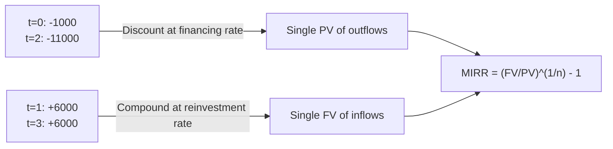

## Modified Internal Rate of Return

### Definition and Core Concept

The Modified Internal Rate of Return (MIRR) is a capital budgeting metric that addresses the two central theoretical flaws of the traditional IRR: the unrealistic assumption that interim cash flows are reinvested at the IRR itself, and the possibility of multiple or undefined IRRs when a project has non-conventional cash flow patterns. MIRR achieves this by explicitly separating the discounting of negative cash flows (outflows) from the compounding of positive cash flows (inflows), using two distinct, analyst-specified rates rather than a single implied rate.

### The MIRR Formula

$$MIRR = \left( \frac{FV_{\text{inflows}}}{PV_{\text{outflows}}} \right)^{\frac{1}{n}} - 1$$

Where:

- $FV_{\text{inflows}}$ = future value, at the end of the project (period $n$), of all positive cash flows compounded forward at the **reinvestment rate**
- $PV_{\text{outflows}}$ = present value, at time 0, of all negative cash flows discounted at the **financing rate**
- $n$ = total number of periods in the project

**Computing the components:**

$$FV_{\text{inflows}} = \sum_{t=0}^{n} CF_t^{+} \times (1 + r_{\text{reinvest}})^{n-t}$$

$$PV_{\text{outflows}} = \sum_{t=0}^{n} \frac{CF_t^{-}}{(1 + r_{\text{finance}})^{t}}$$

Where $CF_t^{+}$ denotes positive cash flows and $CF_t^{-}$ denotes negative cash flows at each period $t$.

### Why Two Separate Rates

**Key Points**

- **Financing rate**: the cost of capital used to fund the project's outflows (typically the firm's WACC or cost of debt), applied to discount negative cash flows back to time 0
- **Reinvestment rate**: the rate at which interim positive cash flows can realistically be reinvested (often a more conservative rate than the project's own IRR, such as WACC or a short-term investment rate)
- Using two distinct, externally specified rates removes the circularity in traditional IRR, where the discount rate being solved for is also assumed to be the reinvestment rate
- In many applications, both rates are set equal to WACC for simplicity, though analysts may differentiate them when financing costs and reinvestment opportunities genuinely diverge

### Step-by-Step Calculation Process

**Key Points**

- Separate the project's cash flows into negative (outflows) and positive (inflows) by period
- Discount all negative cash flows to present value (time 0) using the financing rate
- Compound all positive cash flows to future value (final period $n$) using the reinvestment rate
- Divide the future value of inflows by the present value of outflows
- Take the $n$-th root of that ratio and subtract 1 to obtain MIRR

### Worked Example

Using the same non-conventional cash flow project introduced in IRR analysis:

| Year | Cash Flow ($) |
| --- | --- |
| 0 | -1,000 |
| 1 | 6,000 |
| 2 | -11,000 |
| 3 | 6,000 |

Assume a financing rate of 10% and a reinvestment rate of 10%.

**Step 1: Discount negative cash flows to present value**

Negative cash flows occur at $t=0$ ($1,000) and $t=2$ ($11,000).

$$PV_{\text{outflows}} = 1{,}000 + \frac{11{,}000}{(1.10)^2} = 1{,}000 + 9{,}091 = 10{,}091$$

**Step 2: Compound positive cash flows to future value (at t=3)**

Positive cash flows occur at $t=1$ ($6,000) and $t=3$ ($6,000).

$$FV_{\text{inflows}} = 6{,}000 \times (1.10)^{3-1} + 6{,}000 \times (1.10)^{3-3}$$

$$= 6{,}000 \times 1.21 + 6{,}000 \times 1 = 7{,}260 + 6{,}000 = 13{,}260$$

**Step 3: Compute MIRR**

$$MIRR = \left( \frac{13{,}260}{10{,}091} \right)^{\frac{1}{3}} - 1$$

$$MIRR = (1.3141)^{0.3333} - 1 \approx 1.0954 - 1 = 0.0954 \approx 9.54\%$$

Unlike the traditional IRR calculation for this same cash flow stream — which could yield two or more mathematically valid roots because of the two sign changes — MIRR produces exactly one unambiguous result of approximately 9.54%, since all outflows are consolidated into a single present value and all inflows into a single future value before the root is taken.

### Cash Flow Consolidation Under MIRR

### How MIRR Resolves IRR's Limitations

| IRR Limitation | How MIRR Resolves It |
| --- | --- |
| Multiple IRRs from non-conventional cash flows | Consolidates all outflows into one PV and all inflows into one FV, guaranteeing a single solution |
| Unrealistic reinvestment assumption (at IRR itself) | Uses an explicit, analyst-chosen reinvestment rate, typically closer to WACC or achievable market returns |
| No solution in some cash flow patterns | Always produces a solvable result as long as at least one outflow and one inflow exist |
| Overstates attractiveness of high-IRR projects | Provides a more conservative, realistic rate of return estimate |

### MIRR vs. IRR vs. NPV: Comparative Summary

| Factor | NPV | IRR | MIRR |
| --- | --- | --- | --- |
| Output | Dollar value | Percentage | Percentage |
| Reinvestment assumption | At discount rate (WACC) | At IRR itself | At explicit reinvestment rate |
| Financing rate for outflows | Single discount rate | Same as reinvestment rate (implicit) | Explicit, can differ from reinvestment rate |
| Handles non-conventional cash flows | Yes | May produce multiple/no solution | Always single solution |
| Scale problem in ranking | Not applicable (absolute measure) | Present | Reduced, but still a rate-based metric |
| Ease of stakeholder communication | Moderate | High | High |

### Advantages of MIRR

- Produces a single, unambiguous rate of return regardless of the number of sign changes in the cash flow stream
- Uses a realistic, separately specified reinvestment rate rather than assuming reinvestment at the project's own (potentially unrealistic) IRR
- Retains the intuitive percentage-based communication advantage of IRR, making it easier for non-technical stakeholders to interpret than NPV
- Allows the financing rate and reinvestment rate to differ, reflecting the reality that a firm's cost of borrowing and its available reinvestment opportunities are often not the same

### Limitations of MIRR

- Still does not directly measure the absolute dollar value created, so it is not additive across projects the way NPV is
- Requires the analyst to select two external rates (financing and reinvestment), introducing judgment and potential bias into the calculation
- Can still create ranking inconsistencies with NPV when comparing mutually exclusive projects of substantially different scale, since it remains a percentage-based metric
- [Inference] Some practitioners consider the choice of reinvestment rate somewhat arbitrary if not grounded in a clearly documented, defensible assumption (e.g., short-term investment yields or WACC), which can reduce comparability across analysts or business units if standards are not applied consistently

### Application in Capital-Intensive Industries

MIRR is particularly relevant in capital-intensive sectors where projects commonly exhibit non-conventional cash flow patterns:

- **Extractive industries (mining, oil and gas)**: Large decommissioning, reclamation, or well-abandonment costs at end-of-life create negative cash flows late in the project, producing the sign-change patterns that generate multiple IRRs. MIRR resolves this ambiguity while still delivering a percentage figure boards and management are accustomed to interpreting.
- **Utilities and infrastructure**: Major mid-life refurbishment or overhaul capex (a significant negative cash flow partway through an asset's operating life) also produces non-conventional patterns well-suited to MIRR analysis.
- **Nuclear and heavy industrial facilities**: Substantial decommissioning liabilities make MIRR a standard supplementary metric alongside NPV in project evaluation.
- **Portfolio communication**: [Inference] Many capital-intensive firms present MIRR alongside NPV in capital allocation committee materials, using NPV to drive the formal accept/reject decision while MIRR offers a more digestible percentage-based supporting figure, although the specific combination of metrics used varies by company policy.

### Practical Implementation Notes

- Most spreadsheet applications provide a native MIRR function (e.g., `=MIRR(values, finance_rate, reinvest_rate)`), which automates the discounting and compounding steps described above
- Analysts should document the source and justification for both the financing rate and reinvestment rate, since these assumptions materially affect the final MIRR figure and are more visible points of judgment than the single WACC assumption used in standard NPV or IRR analysis
- MIRR is best used as a complement to NPV rather than a replacement, since NPV remains the more theoretically robust measure of absolute value creation

### Related Topics

- Internal Rate of Return (IRR) and its limitations
- Net Present Value (NPV) analysis
- Multiple IRR problem and Descartes' Rule of Signs
- NPV profile and discount rate sensitivity
- Weighted Average Cost of Capital (WACC) estimation
- Terminal cash flows and asset decommissioning cost modeling
- Profitability Index for scale-adjusted project ranking
- Capital rationing and mutually exclusive project selection