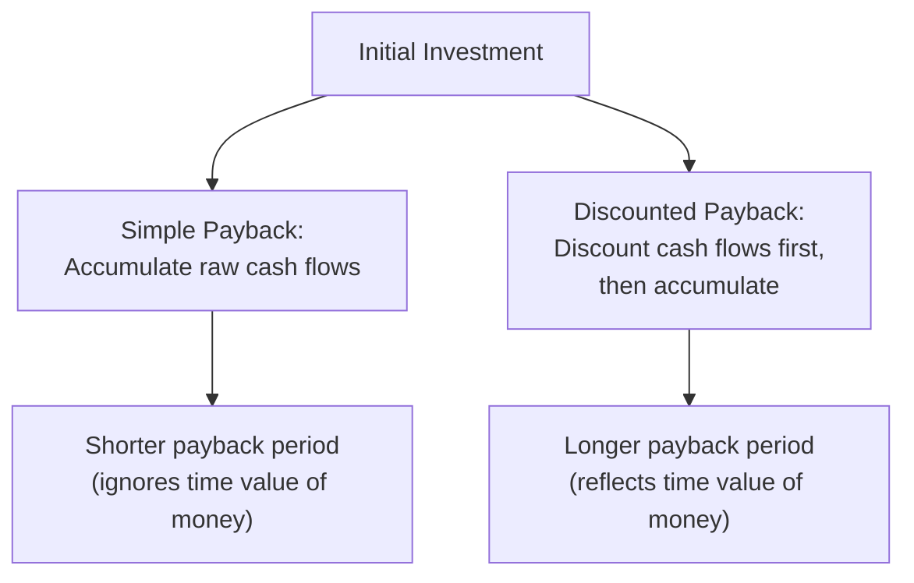

## Payback Period and Discounted Payback Period

### Definition and Core Concept

The payback period is the length of time required for a project's cumulative cash inflows to equal the initial investment outlay. It answers a simple liquidity-oriented question: how quickly does the firm recover the capital it committed? The discounted payback period refines this measure by first discounting each future cash flow to present value before accumulating it, thereby incorporating the time value of money that the simple payback period ignores.

Both metrics are widely used as supplementary screening tools alongside NPV and IRR, particularly in capital-intensive industries where liquidity, risk exposure duration, and capital recovery speed are significant practical concerns.

### Simple Payback Period Formula

For projects with **even (constant) annual cash flows**:

$$Payback\ Period = \frac{Initial\ Investment}{Annual\ Cash\ Inflow}$$

For projects with **uneven cash flows**, the payback period is found by accumulating cash flows period by period until the cumulative sum equals or exceeds the initial investment:

$$Payback\ Period = A + \frac{B}{C}$$

Where:

- $A$ = the last period with a negative cumulative cash flow
- $B$ = the absolute value of the cumulative cash flow at the end of period $A$
- $C$ = the cash flow occurring during the period after $A$ (the period in which payback is achieved)

### Discounted Payback Period Formula

The discounted payback period follows the same accumulation logic, but each cash flow is first discounted to present value:

$$PV_t = \frac{CF_t}{(1+r)^t}$$

$$Discounted\ Payback\ Period = A + \frac{B}{C}$$

Where $A$, $B$, and $C$ are defined identically to the simple payback method, but applied to the **discounted** cash flows and **discounted** cumulative totals rather than the raw (nominal) cash flows.

### Decision Rule

- **Simple/discounted payback period < maximum acceptable payback threshold**: Accept the project
- **Simple/discounted payback period > maximum acceptable payback threshold**: Reject the project
- When ranking mutually exclusive projects, the project with the **shorter** payback period is generally preferred under this criterion
- The "maximum acceptable" threshold is set by management policy and is not derived from the calculation itself; it reflects the firm's risk tolerance, liquidity needs, and industry norms

### Worked Example: Simple Payback Period

A project requires an initial investment of $300,000 with the following projected cash flows:

| Year | Cash Flow ($) | Cumulative Cash Flow ($) |
| --- | --- | --- |
| 0 | -300,000 | -300,000 |
| 1 | 80,000 | -220,000 |
| 2 | 90,000 | -130,000 |
| 3 | 100,000 | -30,000 |
| 4 | 110,000 | 80,000 |
| 5 | 100,000 | 180,000 |

The cumulative cash flow turns positive during Year 4. Applying the formula:

$$Payback\ Period = 3 + \frac{30{,}000}{110{,}000} = 3 + 0.273 = 3.27\ years$$

The project recovers its initial investment in approximately 3.27 years.

### Worked Example: Discounted Payback Period

Using the same cash flows with a discount rate of 10%:

| Year | Cash Flow ($) | Discounted CF ($) | Cumulative Discounted CF ($) |
| --- | --- | --- | --- |
| 0 | -300,000 | -300,000 | -300,000 |
| 1 | 80,000 | 72,727 | -227,273 |
| 2 | 90,000 | 74,380 | -152,893 |
| 3 | 100,000 | 75,131 | -77,762 |
| 4 | 110,000 | 75,131 | -2,631 |
| 5 | 100,000 | 62,092 | 59,461 |

**Discounted cash flow calculations:**

$$PV_1 = \frac{80{,}000}{1.10} = 72{,}727 \qquad PV_2 = \frac{90{,}000}{1.10^2} = 74{,}380$$

$$PV_3 = \frac{100{,}000}{1.10^3} = 75{,}131 \qquad PV_4 = \frac{110{,}000}{1.10^4} = 75{,}131$$

$$PV_5 = \frac{100{,}000}{1.10^5} = 62{,}092$$

The cumulative discounted cash flow turns positive during Year 5. Applying the formula:

$$Discounted\ Payback\ Period = 4 + \frac{2{,}631}{62{,}092} = 4 + 0.042 = 4.04\ years$$

Note that the discounted payback period (4.04 years) is longer than the simple payback period (3.27 years). This is expected: discounting reduces the value of future cash flows, so more nominal time is required for the discounted cumulative total to reach zero.

### Comparison: Simple vs. Discounted Payback

### Advantages

**Key Points**

- **Simplicity**: easy to calculate and communicate, requiring no complex discounting for the simple version
- **Liquidity focus**: highlights how quickly invested capital is recovered, useful for firms with capital constraints or liquidity concerns
- **Risk proxy**: shorter payback periods are often treated as a rough proxy for lower risk exposure, since cash flows further in the future are subject to greater forecasting uncertainty
- **Discounted payback improvement**: incorporates the time value of money, addressing one of the simple payback method's core weaknesses
- **Useful screening tool**: commonly used as an initial filter before more rigorous NPV/IRR analysis, especially in capital rationing environments

### Limitations

**Key Points**

- **Ignores cash flows beyond the payback point**: both methods disregard all cash flows occurring after the initial investment is recovered, which can lead to rejecting projects with strong long-term value in favor of projects that merely recover capital faster
- **Simple payback ignores the time value of money entirely**: treats a dollar received in year 1 the same as a dollar received in year 5
- **Arbitrary cutoff threshold**: the maximum acceptable payback period is a subjective management policy choice rather than a value derived from the firm's cost of capital or shareholder value maximization
- **No direct link to value creation**: neither method measures the dollar value or percentage return generated by the project; a project can have an attractive payback period yet a negative NPV, or vice versa
- **Discounted payback period still ignores post-payback cash flows**: while it corrects for time value of money, it retains the same truncation flaw as the simple method
- **Can bias toward short-lived projects**: capital-intensive, long-lived assets (which often generate the bulk of their value in later years) can appear less attractive under payback-based criteria despite superior NPV

### Payback Period vs. Other Capital Budgeting Techniques

| Technique | Time Value of Money | Considers All Cash Flows | Output Type | Primary Use |
| --- | --- | --- | --- | --- |
| Simple Payback Period | No | No (truncated) | Time (years) | Liquidity/risk screening |
| Discounted Payback Period | Yes | No (truncated) | Time (years) | Liquidity/risk screening with TVM |
| NPV | Yes | Yes | Dollar value | Value-maximizing decision |
| IRR | Yes | Yes | Percentage | Communication/comparison |
| MIRR | Yes | Yes | Percentage | Resolves IRR flaws |

### Application in Capital Intensity and Capex Management

Payback-based metrics play a specific role in capital-intensive project evaluation:

- **Capital rationing environments**: When multiple capex proposals compete for constrained funding, payback period offers a quick liquidity-based filter before committing analytical resources to full NPV/IRR modeling
- **High-risk or high-uncertainty projects**: In sectors prone to technological obsolescence, regulatory change, or commodity price volatility, a shorter payback period reduces exposure to long-horizon forecasting risk
- **Covenant and financing considerations**: Lenders and boards sometimes impose maximum payback thresholds as part of capital expenditure approval policies, particularly for large, debt-financed projects
- **Complementary, not standalone, use**: [Inference] In most capital-intensive organizations, payback period functions as a secondary or preliminary screen rather than the primary investment decision criterion, since it does not capture the full value profile of long-lived assets; NPV and IRR/MIRR typically govern the final accept/reject decision
- **Asset-heavy replacement decisions**: For equipment replacement or maintenance capex, a short payback period is often weighted more heavily than for greenfield growth investments, since the primary objective is capital recovery and risk minimization rather than long-term value maximization

### Payback Period Accumulation Curve (svg_diagram)

<svg xmlns="http://www.w3.org/2000/svg" viewBox="0 0 720 320">
<text x="360" y="26" font-family="Arial, sans-serif" font-size="17" font-weight="bold" text-anchor="middle" fill="#1a1a1a">Payback Period Accumulation Curve (svg_diagram)</text>
<line x1="70" y1="270" x2="670" y2="270" stroke="#5f6368" stroke-width="1.5" />
<text x="670" y="290" font-family="Arial" font-size="12" fill="#5f6368">Years</text>
<line x1="70" y1="40" x2="70" y2="270" stroke="#5f6368" stroke-width="1.5" />
<text x="30" y="45" font-family="Arial" font-size="12" fill="#5f6368">Cum.<tspan x="30" dy="14">CF</tspan></text>
<line x1="70" y1="230" x2="670" y2="230" stroke="#dadce0" stroke-width="1" stroke-dasharray="4,4" />
<text x="45" y="234" font-family="Arial" font-size="10" fill="#5f6368">0</text>
<polyline points="70,270 170,225 270,180 370,145 470,110 570,80 670,55" fill="none" stroke="#34a853" stroke-width="2.5" />
<text x="600" y="50" font-family="Arial" font-size="11" fill="#34a853">Simple Payback</text>
<polyline points="70,270 170,250 270,225 370,195 470,160 570,120 670,90" fill="none" stroke="#1967d2" stroke-width="2.5" />
<text x="600" y="105" font-family="Arial" font-size="11" fill="#1967d2">Discounted Payback</text>
<circle cx="370" cy="145" r="4" fill="#34a853" />
<text x="380" y="140" font-family="Arial" font-size="10" fill="#34a853">Simple payback point</text>
<circle cx="470" cy="160" r="4" fill="#1967d2" />
<text x="480" y="180" font-family="Arial" font-size="10" fill="#1967d2">Discounted payback point</text>
</svg>

### Best Practice Recommendation

Payback period and discounted payback period should be used as complementary screening tools rather than sole decision criteria. A recommended approach:

1. Apply payback period (or discounted payback) as an initial liquidity/risk filter, especially under capital rationing
2. Use NPV as the primary value-maximization decision criterion for projects that pass the initial screen
3. Present IRR or MIRR alongside NPV for stakeholder communication
4. Document the payback threshold policy explicitly, since it is a management judgment rather than a market-derived figure

### Related Topics

- Net Present Value (NPV) analysis
- Internal Rate of Return (IRR) and its limitations
- Modified Internal Rate of Return (MIRR)
- Profitability Index
- Capital rationing and project screening frameworks
- Time value of money fundamentals
- Risk-adjusted discount rates in capital budgeting
- Sensitivity analysis for long-horizon capital projects