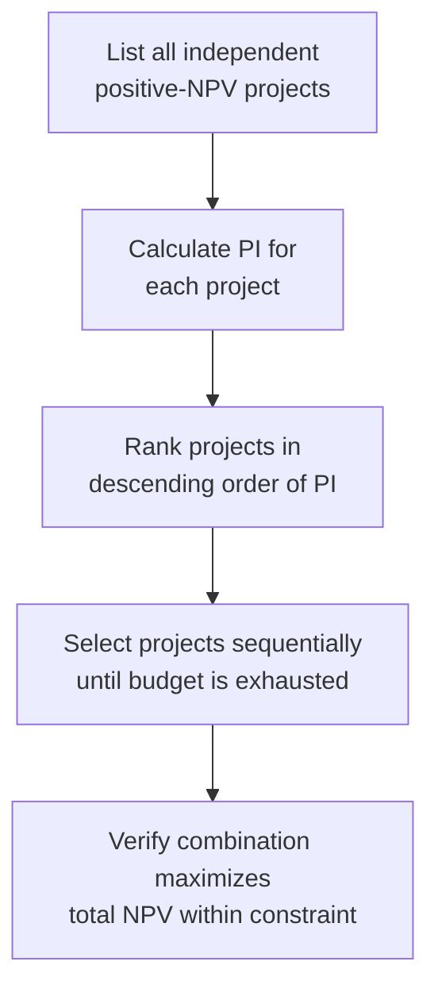

## Profitability Index

### Definition and Core Concept

The Profitability Index (PI), also known as the Value Investment Ratio or Profit Investment Ratio, is a capital budgeting metric that measures the ratio of the present value of a project's future cash inflows to the initial investment required. Unlike NPV, which expresses value creation as an absolute dollar amount, PI expresses value creation as a relative ratio — value generated per dollar invested. This makes PI particularly useful for ranking and selecting among projects when capital is constrained (capital rationing).

### The Profitability Index Formula

$$PI = \frac{PV\ of\ Future\ Cash\ Inflows}{Initial\ Investment}$$

Expressed in terms of NPV:

$$PI = \frac{NPV + Initial\ Investment}{Initial\ Investment} = 1 + \frac{NPV}{Initial\ Investment}$$

Where the present value of future cash inflows is:

$$PV\ of\ Inflows = \sum_{t=1}^{n} \frac{CF_t}{(1+r)^t}$$

### Decision Rule

- **PI > 1.0**: The present value of inflows exceeds the initial investment; the project is expected to create value. Accept the project (equivalent to NPV > 0).
- **PI = 1.0**: The project breaks even in present value terms; equivalent to NPV = 0.
- **PI < 1.0**: The present value of inflows is less than the initial investment; the project destroys value. Reject the project (equivalent to NPV < 0).

For independent projects with unlimited capital, PI and NPV always produce the same accept/reject decision, since both derive from the same underlying discounted cash flow calculation. Their value lies in **capital-constrained ranking**, where PI can outperform NPV as a ranking tool.

### Step-by-Step Calculation Process

**Key Points**

- Forecast all future cash inflows by period
- Discount each inflow to present value using the appropriate discount rate (WACC or risk-adjusted rate)
- Sum the discounted inflows to obtain total present value of inflows
- Divide the total present value of inflows by the initial investment
- Apply the decision rule

### Worked Example

A project requires an initial investment of $250,000 and is expected to generate the following cash inflows:

| Year | Cash Flow ($) |
| --- | --- |
| 1 | 90,000 |
| 2 | 100,000 |
| 3 | 95,000 |
| 4 | 80,000 |

Assume a discount rate of 9%.

**Discounting each inflow:**

$$PV_1 = \frac{90{,}000}{1.09} = 82{,}569$$

$$PV_2 = \frac{100{,}000}{1.09^2} = 84{,}168$$

$$PV_3 = \frac{95{,}000}{1.09^3} = 73{,}358$$

$$PV_4 = \frac{80{,}000}{1.09^4} = 56{,}669$$

**Sum of discounted inflows:**

$$82{,}569 + 84{,}168 + 73{,}358 + 56{,}669 = 296{,}764$$

**Profitability Index:**

$$PI = \frac{296{,}764}{250{,}000} = 1.187$$

Since PI = 1.187 (greater than 1.0), the project is expected to generate approximately $1.187 of present value for every $1.00 invested, and should be accepted under the PI decision rule. This is consistent with the underlying NPV of $46,764 ($296,764 − $250,000), which is also positive.

### Profitability Index and Capital Rationing

The Profitability Index becomes especially valuable when a firm faces a **capital constraint** — a fixed budget insufficient to fund all positive-NPV projects available. In this scenario, ranking projects by PI (rather than by NPV alone) helps identify the combination of projects that maximizes total value creation per dollar of scarce capital.

**Worked Example: Capital Rationing**

A firm has $500,000 available and is considering the following independent projects:

| Project | Initial Investment ($) | NPV ($) | PI |
| --- | --- | --- | --- |
| A | 200,000 | 60,000 | 1.30 |
| B | 300,000 | 75,000 | 1.25 |
| C | 150,000 | 52,500 | 1.35 |
| D | 250,000 | 55,000 | 1.22 |

**Ranking by NPV alone** might suggest prioritizing Project B ($75,000 NPV), but B alone consumes $300,000 of the $500,000 budget, leaving only $200,000 for other projects — enough only for Project A (adding $60,000), for a combined NPV of $135,000.

**Ranking by PI** suggests prioritizing Project C (PI = 1.35) and Project A (PI = 1.30) first:

$$Project\ C + Project\ A = 150{,}000 + 200{,}000 = 350{,}000\ invested$$

$$Combined\ NPV = 52{,}500 + 60{,}000 = 112{,}500$$

Remaining budget: $150,000, insufficient for B or D individually at their full investment amounts, but this illustrates the core principle: selecting projects in descending order of PI, subject to the budget constraint, generally produces a higher total NPV per dollar of available capital than selecting by NPV alone when full project combinations are compared across all feasible sets.

[Inference] In practice, optimal capital rationing across indivisible projects with a fixed budget is a combinatorial optimization problem; PI ranking provides a strong heuristic solution but may not always identify the mathematically optimal combination, particularly when projects have significantly different sizes relative to the budget. Linear programming or integer programming techniques are sometimes used for more precise capital allocation in complex rationing scenarios.

### Capital Rationing Decision Flow

### Advantages of Profitability Index

- **Effective for capital rationing**: ranks projects by value created per dollar invested, which is more useful than absolute NPV when capital is limited
- **Consistent with NPV for independent projects**: under unconstrained capital, PI and NPV yield the same accept/reject decisions
- **Accounts for the time value of money**: like NPV, PI discounts all future cash flows to present value
- **Useful for comparing projects of different scale**: expresses value creation as a ratio, making relative efficiency easier to compare across projects with different investment sizes

### Limitations of Profitability Index

- **Can conflict with NPV when ranking mutually exclusive projects**: a smaller project with a higher PI may have a lower absolute NPV than a larger project with a lower PI; selecting purely by PI in this case can lead to a lower total value outcome
- **Sensitive to how "initial investment" is defined**: inconsistent treatment of cash outflows across multiple periods can distort the ratio, particularly for projects with staged capital outlays
- **Simplified capital rationing heuristic**: sequential PI ranking does not always identify the mathematically optimal project combination under a budget constraint, especially with indivisible projects of varying size relative to the available budget
- **Does not indicate absolute magnitude of value creation**: a very high PI on a small project may still contribute less total shareholder value than a modest PI on a much larger project

### Profitability Index vs. NPV for Mutually Exclusive Projects

Consider two mutually exclusive projects:

| Project | Initial Investment ($) | PV of Inflows ($) | NPV ($) | PI |
| --- | --- | --- | --- | --- |
| X | 100,000 | 150,000 | 50,000 | 1.50 |
| Y | 500,000 | 650,000 | 150,000 | 1.30 |

Project X has the higher PI (1.50 vs. 1.30), but Project Y has the substantially higher NPV ($150,000 vs. $50,000). If capital is not constrained, Project Y should be selected because it creates more absolute shareholder value. This illustrates why PI should generally be treated as a **secondary ranking tool for capital rationing**, with NPV serving as the primary decision criterion when projects are mutually exclusive and capital is not limited.

### Profitability Index vs. Other Capital Budgeting Techniques

| Technique | Time Value of Money | Output Type | Best Use Case |
| --- | --- | --- | --- |
| NPV | Yes | Dollar value | Primary value-maximization decision |
| IRR | Yes | Percentage | Stakeholder communication |
| MIRR | Yes | Percentage | Resolves IRR reinvestment/multiple-root issues |
| Profitability Index | Yes | Ratio | Capital rationing and relative efficiency ranking |
| Payback Period | No (simple) / Yes (discounted) | Time | Liquidity/risk screening |

### Application in Capital Intensity and Capex Management

In capital-intensive industries, PI serves specific strategic functions:

- **Portfolio optimization under fixed capex budgets**: Capital-intensive firms (utilities, manufacturing, extractives) typically operate under annual capital expenditure ceilings set by board policy or credit rating constraints. PI helps prioritize which projects within a large capital program deliver the greatest value per dollar of constrained capex budget.
- **Comparing projects of vastly different scale**: A capital-intensive firm might compare a large plant expansion against several smaller efficiency upgrades; PI provides a normalized basis for comparison despite the significant difference in investment size.
- **Complementary role alongside NPV and IRR**: [Inference] Many capital allocation frameworks present PI alongside NPV and IRR/MIRR in capital budgeting dashboards, using PI specifically to guide prioritization decisions when the aggregate capex program exceeds available funding, though exact weighting of these metrics in final decisions varies by organization.
- **Divisional capital allocation**: When capital is allocated across business units or regions with independent project pipelines, PI offers a common efficiency metric for comparing capital productivity across otherwise dissimilar investment opportunities.

### Profitability Index Ranking Illustration (svg_diagram)

<svg xmlns="http://www.w3.org/2000/svg" viewBox="0 0 700 320">
<text x="350" y="26" font-family="Arial, sans-serif" font-size="17" font-weight="bold" text-anchor="middle" fill="#1a1a1a">Profitability Index Ranking Illustration (svg_diagram)</text>
<line x1="70" y1="270" x2="650" y2="270" stroke="#5f6368" stroke-width="1.5" />
<text x="350" y="295" font-family="Arial" font-size="12" text-anchor="middle" fill="#5f6368">Projects (ranked by PI)</text>
<line x1="70" y1="60" x2="70" y2="270" stroke="#5f6368" stroke-width="1.5" />
<text x="30" y="65" font-family="Arial" font-size="11" fill="#5f6368">PI</text>
<line x1="70" y1="170" x2="650" y2="170" stroke="#ea4335" stroke-width="1.5" stroke-dasharray="6,4" />
<text x="600" y="165" font-family="Arial" font-size="11" fill="#ea4335">PI = 1.0 threshold</text>
<rect x="120" y="80" width="70" height="190" fill="#34a853" />
<text x="155" y="290" font-family="Arial" font-size="12" text-anchor="middle" fill="#1a1a1a">C (1.35)</text>
<rect x="230" y="100" width="70" height="170" fill="#34a853" />
<text x="265" y="290" font-family="Arial" font-size="12" text-anchor="middle" fill="#1a1a1a">A (1.30)</text>
<rect x="340" y="120" width="70" height="150" fill="#34a853" />
<text x="375" y="290" font-family="Arial" font-size="12" text-anchor="middle" fill="#1a1a1a">B (1.25)</text>
<rect x="450" y="135" width="70" height="135" fill="#34a853" />
<text x="485" y="290" font-family="Arial" font-size="12" text-anchor="middle" fill="#1a1a1a">D (1.22)</text>
<rect x="560" y="170" width="70" height="0" fill="#ea4335" />
<text x="595" y="290" font-family="Arial" font-size="12" text-anchor="middle" fill="#5f6368">Cutoff</text>
</svg>

### Best Practice Recommendation

1. Use NPV as the primary decision criterion when capital is unconstrained and projects are mutually exclusive
2. Use Profitability Index specifically for ranking and selecting among independent projects under a fixed capital budget
3. When PI and NPV rankings conflict for mutually exclusive projects, prioritize the project with the higher NPV, since PI can favor smaller, higher-ratio projects over larger, higher-value ones
4. For complex capital rationing across many indivisible projects, consider supplementing PI ranking with formal optimization techniques (e.g., integer linear programming) to identify the truly optimal project combination

### Related Topics

- Net Present Value (NPV) analysis
- Internal Rate of Return (IRR) and its limitations
- Modified Internal Rate of Return (MIRR)
- Capital rationing and project portfolio optimization
- Payback period and discounted payback period
- Weighted Average Cost of Capital (WACC) estimation
- Linear and integer programming in capital budgeting
- Divisional capital allocation frameworks