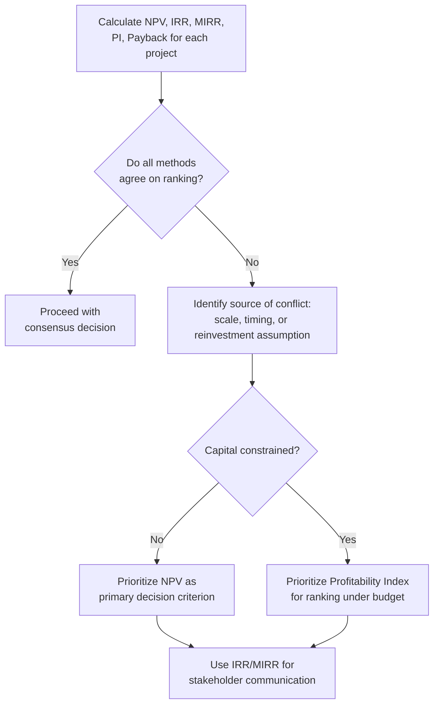

## Comparing and Reconciling Capital Budgeting Methods

### Overview

Capital budgeting decisions are rarely made using a single metric in isolation. NPV, IRR, MIRR, Payback Period, Discounted Payback Period, Profitability Index, and Accounting Rate of Return each capture a different dimension of project evaluation — value creation, rate of return, liquidity, capital efficiency, or accounting profitability. Because these methods can produce conflicting signals for the same project or set of projects, understanding how to compare, reconcile, and appropriately weight them is a critical practical skill in capital budgeting and capex management.

### Summary of All Techniques

| Technique | Basis | Time Value of Money | Output Type | Handles Non-Conventional Cash Flows | Primary Strength |
| --- | --- | --- | --- | --- | --- |
| NPV | Cash flow | Yes | Dollar value | Yes | Direct measure of value creation |
| IRR | Cash flow | Yes | Percentage | No (multiple/no solutions possible) | Intuitive rate for communication |
| MIRR | Cash flow | Yes | Percentage | Yes (single solution) | Resolves IRR's reinvestment/multiple-root flaws |
| Profitability Index | Cash flow | Yes | Ratio | Yes | Ranking under capital rationing |
| Payback Period | Cash flow | No | Time | Yes (though truncated) | Liquidity and risk screening |
| Discounted Payback Period | Cash flow | Yes | Time | Yes (though truncated) | Liquidity screening with TVM |
| ARR | Accounting profit | No | Percentage | Yes | Alignment with accounting performance metrics |

### Why Methods Can Conflict

**Key Points**

- **Scale differences**: IRR and PI are ratio-based and can favor smaller projects with higher percentage returns over larger projects with greater absolute value (NPV)
- **Timing differences**: Projects with different cash flow timing profiles can produce crossing NPV profiles, where IRR favors the project with faster early returns while NPV (at the actual cost of capital) favors the project with larger, later cash flows
- **Reinvestment rate assumptions**: IRR assumes reinvestment at the IRR itself; NPV and MIRR assume reinvestment at the discount rate/specified reinvestment rate — these differing assumptions can lead to different rankings for mutually exclusive projects
- **Truncation in payback-based methods**: Payback and discounted payback ignore all cash flows after the payback point, so a project with strong long-term cash flows (and high NPV) may be ranked unfavorably if its recovery period is comparatively long
- **Accounting vs. cash basis**: ARR uses accounting profit (including non-cash depreciation) rather than actual cash flows, and does not discount for time value, so it can diverge substantially from all cash-flow-based methods

### The NPV-IRR Conflict: Crossover Rate

When two mutually exclusive projects have crossing NPV profiles, there exists a specific discount rate — the **crossover rate** — at which both projects have equal NPV. Below the crossover rate, one project's NPV exceeds the other's; above it, the ranking reverses.

The crossover rate is found by computing the IRR of the **differential cash flow stream** (Project A's cash flows minus Project B's cash flows, period by period):

$$Crossover\ Rate = IRR(CF_{A,t} - CF_{B,t})$$

**Worked Example**

Two mutually exclusive projects, each requiring a $300,000 initial investment:

| Year | Project A ($) | Project B ($) | Differential (A − B) ($) |
| --- | --- | --- | --- |
| 0 | -300,000 | -300,000 | 0 |
| 1 | 60,000 | 180,000 | -120,000 |
| 2 | 100,000 | 140,000 | -40,000 |
| 3 | 150,000 | 90,000 | 60,000 |
| 4 | 220,000 | 60,000 | 160,000 |

Project B generates cash flows earlier (higher IRR likely), while Project A generates larger cash flows later (potentially higher NPV at lower discount rates). Solving for the IRR of the differential cash flow stream yields the crossover rate — the discount rate at which management is indifferent between A and B. Below this rate, Project A has the higher NPV; above it, Project B does. This demonstrates why relying on IRR alone, without examining the crossover rate, can lead to selecting the project that does not maximize value at the firm's actual cost of capital.

### Reconciliation Framework

### Decision Hierarchy: Which Method Should Govern

**Key Points**

- **NPV should generally serve as the primary decision criterion** for independent projects under unconstrained capital, since it directly measures dollar value creation and uses the most defensible reinvestment rate assumption
- **Profitability Index should govern ranking decisions under capital rationing**, since it normalizes value creation per dollar of scarce capital
- **IRR and MIRR serve best as communication and screening tools**, translating dollar-based NPV results into an intuitive percentage that is easier for non-technical stakeholders to interpret; MIRR should be preferred over IRR whenever cash flows are non-conventional
- **Payback and discounted payback period serve as supplementary liquidity and risk screens**, particularly useful for capital rationing pre-filters or for firms with elevated concern about capital recovery speed
- **ARR should be treated as a secondary, accounting-alignment metric**, useful when project outcomes will later be tracked using accounting-based performance measures, but should not override cash-flow-based methods for major investment decisions

### Worked Example: Full Method Comparison

Consider a single project with the following cash flows and a discount rate of 10%:

| Year | Cash Flow ($) |
| --- | --- |
| 0 | -500,000 |
| 1 | 150,000 |
| 2 | 175,000 |
| 3 | 180,000 |
| 4 | 160,000 |
| 5 | 140,000 |

Applying each method (using figures consistent with the earlier NPV worked example):

| Metric | Result | Interpretation |
| --- | --- | --- |
| NPV (at 10%) | $112,440 | Positive; project creates value — Accept |
| IRR | Approximately 16.5% | Exceeds 10% hurdle rate — Accept |
| MIRR (10%/10%) | Approximately 13.8% | Exceeds 10% hurdle rate — Accept |
| Profitability Index | 1.22 | Greater than 1.0 — Accept |
| Payback Period | Approximately 3.1 years | Compare against firm threshold |
| Discounted Payback | Approximately 4.0 years | Compare against firm threshold |
| ARR | Depends on accounting profit basis | Compare against target ARR |

In this example, all cash-flow-based methods (NPV, IRR, MIRR, PI) agree unambiguously: the project should be accepted. This consensus is the typical outcome for **independent projects with conventional cash flow patterns**, and conflicts most often arise specifically when comparing **mutually exclusive** projects or when cash flow patterns are **non-conventional**.

### When Conflicts Are Most Likely to Arise

| Scenario | Methods Most Likely to Conflict | Recommended Resolution |
| --- | --- | --- |
| Mutually exclusive projects, different scale | NPV vs. IRR/PI | Use NPV |
| Mutually exclusive projects, different cash flow timing | NPV vs. IRR (crossover rate) | Use NPV at the firm's actual cost of capital |
| Non-conventional cash flows (multiple sign changes) | IRR undefined or multiple roots | Use MIRR or NPV |
| Capital rationing across many independent projects | NPV ranking vs. PI ranking | Use PI, validated with combinatorial analysis if projects are large relative to budget |
| Long-lived project with back-loaded cash flows | Payback/ARR vs. NPV | Use NPV; treat payback/ARR as secondary screens only |

### Practical Reconciliation Checklist

**Key Points**

- Confirm whether projects under evaluation are independent or mutually exclusive, since this materially affects which method should govern
- Confirm whether capital is constrained (rationed) or unconstrained, since this determines whether PI or NPV should be the primary ranking tool
- Check cash flow patterns for sign changes; if non-conventional, prioritize MIRR or NPV over standard IRR
- If IRR and NPV rankings conflict for mutually exclusive projects, compute the crossover rate to understand where and why the conflict occurs
- Present multiple metrics to decision-makers, but be explicit about which one is driving the final recommendation and why
- Ensure discount rate, reinvestment rate, and financing rate assumptions are consistent and well-documented across all methods used in the comparison

### Application in Capital Intensity and Capex Management

**Key Points**

- **Capital-intensive firms typically use a multi-metric capital budgeting dashboard**: [Inference] most large capital-intensive organizations present NPV, IRR (or MIRR), Payback Period, and sometimes PI together in capital appropriation requests, using NPV as the binding decision criterion while the other metrics provide supplementary context, though the specific combination and governance process varies by company
- **Capital rationing is common in capital-intensive industries**: fixed annual capex budgets, credit rating constraints, and debt covenants frequently create capital-constrained environments where PI-based ranking becomes especially relevant
- **Long asset lives increase the likelihood of NPV/IRR conflicts**: capital-intensive projects with 15–30 year horizons are more prone to crossing NPV profiles and non-conventional cash flow patterns (e.g., decommissioning costs), making MIRR and NPV-based reconciliation particularly important
- **Governance and approval thresholds**: many capital-intensive firms set formal policy thresholds (e.g., "projects must show NPV > 0 and IRR > WACC + risk premium") to standardize how conflicting signals are resolved at the approval stage, reducing subjective inconsistency across capital requests

### Multi-Metric Capital Budgeting Dashboard (svg_diagram)

<svg xmlns="http://www.w3.org/2000/svg" viewBox="0 0 740 340">
<text x="370" y="26" font-family="Arial, sans-serif" font-size="17" font-weight="bold" text-anchor="middle" fill="#1a1a1a">Multi-Metric Capital Budgeting Dashboard (svg_diagram)</text>
<rect x="30" y="60" width="150" height="80" rx="8" fill="#d2e3fc" stroke="#1967d2" stroke-width="2" />
<text x="105" y="90" font-family="Arial" font-size="13" font-weight="bold" text-anchor="middle" fill="#1a1a1a">NPV</text>
<text x="105" y="110" font-family="Arial" font-size="11" text-anchor="middle" fill="#1a1a1a">Primary decision</text>
<text x="105" y="125" font-family="Arial" font-size="11" text-anchor="middle" fill="#1a1a1a">criterion</text>
<rect x="210" y="60" width="150" height="80" rx="8" fill="#e6f4ea" stroke="#34a853" stroke-width="2" />
<text x="285" y="90" font-family="Arial" font-size="13" font-weight="bold" text-anchor="middle" fill="#1a1a1a">IRR / MIRR</text>
<text x="285" y="110" font-family="Arial" font-size="11" text-anchor="middle" fill="#1a1a1a">Stakeholder</text>
<text x="285" y="125" font-family="Arial" font-size="11" text-anchor="middle" fill="#1a1a1a">communication</text>
<rect x="390" y="60" width="150" height="80" rx="8" fill="#fef7e0" stroke="#fbbc04" stroke-width="2" />
<text x="465" y="90" font-family="Arial" font-size="13" font-weight="bold" text-anchor="middle" fill="#1a1a1a">Profitability Index</text>
<text x="465" y="110" font-family="Arial" font-size="11" text-anchor="middle" fill="#1a1a1a">Capital rationing</text>
<text x="465" y="125" font-family="Arial" font-size="11" text-anchor="middle" fill="#1a1a1a">ranking</text>
<rect x="570" y="60" width="150" height="80" rx="8" fill="#fce8e6" stroke="#ea4335" stroke-width="2" />
<text x="645" y="90" font-family="Arial" font-size="13" font-weight="bold" text-anchor="middle" fill="#1a1a1a">Payback / ARR</text>
<text x="645" y="110" font-family="Arial" font-size="11" text-anchor="middle" fill="#1a1a1a">Liquidity &amp; accounting</text>
<text x="645" y="125" font-family="Arial" font-size="11" text-anchor="middle" fill="#1a1a1a">screens</text>
<line x1="105" y1="140" x2="370" y2="230" stroke="#5f6368" stroke-width="1.5" />
<line x1="285" y1="140" x2="370" y2="230" stroke="#5f6368" stroke-width="1.5" />
<line x1="465" y1="140" x2="370" y2="230" stroke="#5f6368" stroke-width="1.5" />
<line x1="645" y1="140" x2="370" y2="230" stroke="#5f6368" stroke-width="1.5" />
<rect x="270" y="230" width="200" height="70" rx="8" fill="#e8eaed" stroke="#5f6368" stroke-width="2" />
<text x="370" y="260" font-family="Arial" font-size="13" font-weight="bold" text-anchor="middle" fill="#1a1a1a">Capital Approval</text>
<text x="370" y="278" font-family="Arial" font-size="13" font-weight="bold" text-anchor="middle" fill="#1a1a1a">Committee Decision</text>
</svg>

### Common Pitfalls in Reconciling Methods

- **Treating IRR as always equivalent to NPV**: assuming a higher IRR automatically means higher value creation, without checking for scale or timing differences
- **Ignoring the crossover rate when comparing mutually exclusive projects**: leads to potentially selecting the project that does not maximize value at the firm's actual cost of capital
- **Applying PI ranking to mutually exclusive projects without capital constraints**: PI is designed for capital rationing scenarios; using it to rank mutually exclusive projects under unconstrained capital can produce a suboptimal (lower-NPV) selection
- **Overweighting payback period or ARR for long-lived capital-intensive assets**: both methods systematically undervalue projects with strong long-term or back-loaded cash flows, which are common in capital-intensive infrastructure
- **Inconsistent discount rate and reinvestment rate assumptions across methods**: using different rates for NPV vs. MIRR calculations without clear justification undermines the comparability of the reconciliation

### Best Practice Recommendation

1. Always calculate NPV as the foundational metric for any capital budgeting decision
2. Supplement NPV with IRR or MIRR for communication purposes, preferring MIRR when cash flows are non-conventional
3. Apply Profitability Index specifically when capital is rationed and multiple independent projects compete for a fixed budget
4. Use payback period and discounted payback period as preliminary screens or supplementary liquidity/risk indicators, not as primary decision drivers
5. Treat ARR as a secondary, accounting-alignment metric, most appropriate for smaller or lower-risk capital requests
6. When methods conflict, identify the specific source of the conflict (scale, timing, reinvestment assumption, or non-conventional cash flows) before making a final recommendation, and default to NPV as the tie-breaking criterion for independent, unconstrained-capital decisions

### Related Topics

- Net Present Value (NPV) analysis
- Internal Rate of Return (IRR) and its limitations
- Modified Internal Rate of Return (MIRR)
- Profitability Index
- Payback period and discounted payback period
- Accounting rate of return
- Crossover rate and NPV profile analysis
- Capital rationing and project portfolio optimization
- Weighted Average Cost of Capital (WACC) estimation
- Sensitivity and scenario analysis in capital budgeting