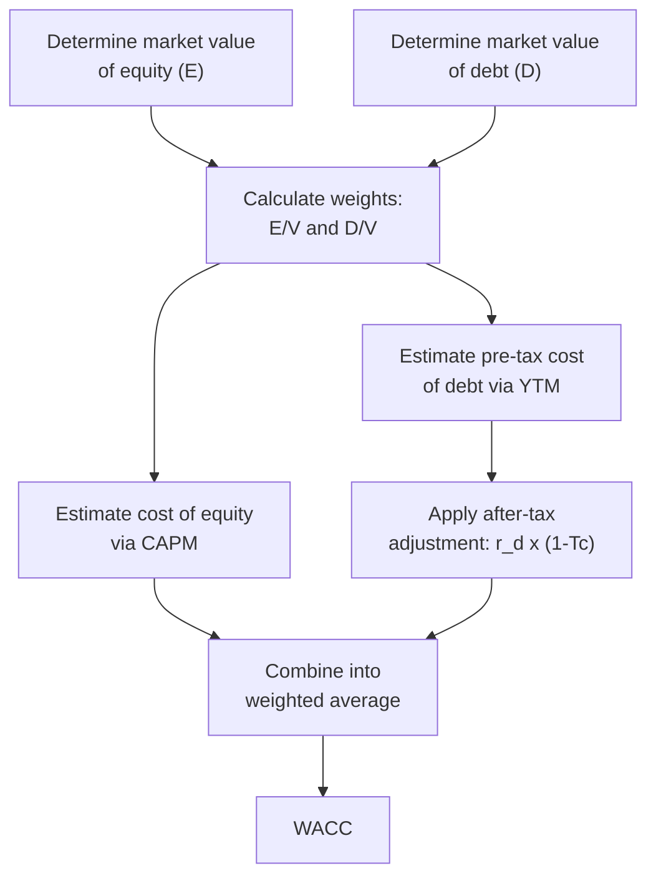

## Weighted Average Cost of Capital Construction

### Definition and Core Concept

The Weighted Average Cost of Capital (WACC) is the blended rate of return a firm must earn on its invested capital to satisfy all of its capital providers — debt holders and equity holders — in proportion to how the firm is actually financed. WACC serves as the standard discount rate for NPV analysis and the standard hurdle rate benchmark for IRR and MIRR, making its correct construction foundational to virtually all capital budgeting techniques.

WACC is "weighted" because it combines the cost of each capital source (debt and equity) according to that source's proportional share of the firm's total capital structure, measured at **market values** rather than book values.

### The WACC Formula

$$WACC = \frac{E}{V} \times r_e + \frac{D}{V} \times r_d \times (1 - T_c)$$

Where:

- $E$ = market value of equity
- $D$ = market value of debt
- $V = E + D$ = total market value of the firm's capital
- $r_e$ = cost of equity
- $r_d$ = cost of debt (pre-tax)
- $T_c$ = marginal corporate tax rate

If preferred stock is part of the capital structure, the formula extends to:

$$WACC = \frac{E}{V} \times r_e + \frac{P}{V} \times r_p + \frac{D}{V} \times r_d \times (1 - T_c)$$

Where $P$ = market value of preferred stock and $r_p$ = cost of preferred stock, with $V = E + P + D$.

### Step-by-Step Construction Process

**Key Points**

- Determine the market value of equity ($E$)
- Determine the market value of debt ($D$)
- Calculate capital structure weights ($E/V$ and $D/V$)
- Estimate the cost of equity ($r_e$), typically using the Capital Asset Pricing Model (CAPM)
- Estimate the cost of debt ($r_d$), typically using the yield to maturity on existing debt or credit-rating-based benchmarks
- Apply the after-tax adjustment to the cost of debt to reflect the tax deductibility of interest
- Combine all components using the weighted average formula

### Step 1: Determining the Market Value of Equity

$$E = Share\ Price \times Number\ of\ Shares\ Outstanding$$

For publicly traded firms, market capitalization is used directly rather than the book value of equity from the balance sheet, since market value reflects the actual opportunity cost investors require and the true economic claim on the firm's capital.

[Inference] For privately held firms without observable market prices, analysts commonly estimate equity value using comparable company multiples, discounted cash flow valuation, or recent transaction data, though the specific methodology varies by valuation context and available information.

### Step 2: Determining the Market Value of Debt

$$D = Market\ Price\ of\ Debt \times Number\ of\ Bonds\ (or\ Face\ Value\ if\ Untraded)$$

For publicly traded bonds, market value is observable directly from bond prices. For privately held debt (bank loans, private placements) without an observable market price, book value (face value) of debt is commonly used as a reasonable approximation, since privately negotiated debt often trades close to par and lacks a liquid secondary market price.

### Step 3: Calculating Capital Structure Weights

$$V = E + D$$

$$Weight\ of\ Equity = \frac{E}{V} \qquad Weight\ of\ Debt = \frac{D}{V}$$

These weights must sum to 1.0 (or 100%) and should reflect the firm's **target** or **current market-based** capital structure, not the historical book-value mix, since WACC is meant to represent the forward-looking cost of raising new capital in the proportions the firm intends to maintain.

### Step 4: Estimating the Cost of Equity via CAPM

$$r_e = r_f + \beta \times (r_m - r_f)$$

Where:

- $r_f$ = risk-free rate (typically the yield on long-term government securities)
- $\beta$ = the equity beta, measuring the stock's systematic risk relative to the overall market
- $r_m$ = expected return on the overall market
- $(r_m - r_f)$ = the equity market risk premium

**Worked Sub-Example**

Assume $r_f = 4.0\%$, $\beta = 1.2$, and the market risk premium $(r_m - r_f) = 6.0\%$.

$$r_e = 4.0\% + 1.2 \times 6.0\% = 4.0\% + 7.2\% = 11.2\%$$

### Step 5: Estimating the Cost of Debt

The pre-tax cost of debt is typically estimated using the **yield to maturity (YTM)** on the firm's existing publicly traded bonds, or, in the absence of traded debt, by referencing the yield on debt with a comparable credit rating and maturity.

$$r_d = Yield\ to\ Maturity\ on\ Existing\ Debt$$

**After-tax cost of debt:**

$$r_d\ (after\text{-}tax) = r_d \times (1 - T_c)$$

This adjustment reflects the fact that interest expense is tax-deductible, reducing the firm's effective cost of borrowing. Dividend payments to equity holders, by contrast, are not tax-deductible, so no equivalent adjustment is applied to the cost of equity.

### Worked Example: Full WACC Construction

A company has the following capital structure and cost estimates:

- Market value of equity: $800 million
- Market value of debt: $400 million
- Cost of equity ($r_e$): 11.2% (calculated above via CAPM)
- Pre-tax cost of debt ($r_d$): 6.0% (based on YTM of outstanding bonds)
- Corporate tax rate ($T_c$): 25%

**Step 1: Total capital value**

$$V = 800 + 400 = 1{,}200\ million$$

**Step 2: Capital structure weights**

$$\frac{E}{V} = \frac{800}{1{,}200} = 0.667 \qquad \frac{D}{V} = \frac{400}{1{,}200} = 0.333$$

**Step 3: After-tax cost of debt**

$$r_d\ (after\text{-}tax) = 6.0\% \times (1 - 0.25) = 6.0\% \times 0.75 = 4.5\%$$

**Step 4: WACC calculation**

$$WACC = (0.667 \times 11.2\%) + (0.333 \times 4.5\%)$$

$$WACC = 7.47\% + 1.50\% = 8.97\%$$

The firm's WACC is approximately 8.97%, which serves as the default discount rate for evaluating average-risk capital projects and the benchmark hurdle rate for IRR/MIRR comparisons.

### WACC Construction Flow

### Beta Estimation Considerations

**Key Points**

- **Raw (historical) beta**: derived from regressing a stock's historical returns against market returns; reflects the company's observed volatility relative to the market
- **Adjusted beta**: often calculated as a weighted average of raw beta and 1.0 (the market average), based on the empirical tendency of betas to revert toward the market mean over time
- **Levered vs. unlevered beta**: raw beta reflects the company's current capital structure (leverage); when applying beta across firms with different debt levels (e.g., in comparable company analysis), beta must be "unlevered" to remove the effect of financial leverage, then "relevered" using the target firm's own capital structure

**Unlevering formula:**

$$\beta_{unlevered} = \frac{\beta_{levered}}{1 + (1 - T_c) \times \frac{D}{E}}$$

**Relevering formula:**

$$\beta_{relevered} = \beta_{unlevered} \times \left[1 + (1 - T_c) \times \frac{D}{E}\right]$$

This technique is commonly used when a company lacks sufficient trading history for a reliable beta estimate, requiring analysts to derive beta from comparable publicly traded firms and adjust for differences in capital structure.

### Cost of Debt Estimation When No Traded Debt Exists

When a firm has no publicly traded bonds, analysts commonly use one of the following approaches:

- **Synthetic credit rating method**: estimate an implied credit rating based on financial ratios (e.g., interest coverage ratio), then apply the yield spread typically associated with that rating category over the risk-free rate
- **Comparable company yields**: reference the YTM of publicly traded debt from firms with similar credit risk, industry, and maturity profile
- **Bank loan pricing**: use the interest rate on the firm's most recent bank borrowing as a proxy, adjusted for any differences in maturity or seniority

### Common Pitfalls in WACC Construction

- **Using book value instead of market value for equity**: book value of equity from the balance sheet does not reflect the market's actual required return and can materially understate or overstate the true weight of equity in the capital structure
- **Using coupon rate instead of yield to maturity for cost of debt**: the coupon rate reflects the rate at issuance, not the current market-required return on the firm's debt
- **Forgetting the after-tax adjustment on cost of debt**: omitting the $(1 - T_c)$ term overstates the effective cost of debt financing
- **Applying a single firm-wide WACC to projects of materially different risk**: a project riskier than the firm's average operations should be discounted at a higher rate than corporate WACC, and a safer project at a lower rate, since a single blended WACC assumes homogeneous project risk across the entire firm
- **Using an unadjusted historical beta without considering mean reversion or peer comparison**: particularly problematic for thinly traded stocks or firms undergoing significant capital structure changes
- **Inconsistent capital structure weights**: mixing target capital structure weights with current market value costs, or vice versa, without a clear and consistent methodological basis

### WACC and Project-Specific Risk Adjustment

**Key Points**

- Corporate WACC reflects the **average risk** of the firm's existing operations, not necessarily the risk of a specific new project
- For projects in a different business line, industry, or geography than the firm's core operations, analysts should adjust the discount rate upward (higher risk) or downward (lower risk) rather than applying corporate WACC uniformly
- The **pure-play method** is commonly used for project-specific risk adjustment: identify publicly traded firms operating solely in the project's business line, estimate their unlevered beta, then relever that beta using the evaluating firm's own capital structure to derive a project-specific cost of equity and, in turn, a project-specific WACC

### Application in Capital Intensity and Capex Management

WACC construction carries particular weight in capital-intensive industries:

- **High leverage sensitivity**: Capital-intensive firms (utilities, telecommunications, infrastructure) often carry substantial debt to finance large fixed-asset investments; small changes in the debt-to-equity weighting or cost of debt estimate can materially shift WACC and, consequently, the accept/reject threshold for major capex decisions
- **Regulatory WACC in regulated utilities**: [Inference] In regulated industries such as utilities, WACC is frequently not purely a market-derived internal estimate but is instead formally reviewed, benchmarked, and approved by a regulatory body as part of the rate-setting process, since it directly determines the allowed return on regulated asset investments; the specific regulatory methodology varies by jurisdiction and regulator.
- **Long-lived asset discounting sensitivity**: Because capital-intensive projects often span decades, even small WACC estimation errors compound significantly in NPV calculations over long horizons, making rigorous, well-documented WACC construction especially important
- **Divisional or project-specific hurdle rates**: Large capital-intensive conglomerates with diversified business segments (e.g., a utility with both regulated and unregulated operations) commonly apply different hurdle rates across divisions, using the pure-play method or segment-specific risk premiums rather than a single blended corporate WACC
- **Capital structure target consistency**: Capital-intensive firms with significant ongoing capex programs typically maintain an explicit target capital structure (debt-to-equity ratio) used consistently across all major project evaluations, providing stability and comparability in WACC estimates over time

### WACC Capital Structure Weighting (svg_diagram)

<svg xmlns="http://www.w3.org/2000/svg" viewBox="0 0 700 300">
<text x="350" y="26" font-family="Arial, sans-serif" font-size="17" font-weight="bold" text-anchor="middle" fill="#1a1a1a">WACC Capital Structure Weighting (svg_diagram)</text>

<text x="180" y="60" font-family="Arial" font-size="13" font-weight="bold" text-anchor="middle" fill="`#1a1a1a`">Capital Structure (by Market Value)</text>

<rect x="80" y="80" width="200" height="50" fill="`#1967d2`" />

<text x="180" y="110" font-family="Arial" font-size="13" text-anchor="middle" fill="`#ffffff`">Equity (66.7%)</text>

<rect x="80" y="130" width="100" height="50" fill="`#34a853`" />

<text x="130" y="160" font-family="Arial" font-size="12" text-anchor="middle" fill="`#ffffff`">Debt (33.3%)</text>

<line x1="330" y1="105" x2="400" y2="105" stroke="#5f6368" stroke-width="2" marker-end="url(#arrow2)" />
<text x="365" y="98" font-family="Arial" font-size="10" text-anchor="middle" fill="#5f6368">x 11.2%</text>
<line x1="280" y1="155" x2="400" y2="155" stroke="#5f6368" stroke-width="2" marker-end="url(#arrow2)" />
<text x="340" y="148" font-family="Arial" font-size="10" text-anchor="middle" fill="#5f6368">x 4.5% (after-tax)</text>
<rect x="420" y="105" width="240" height="90" rx="8" fill="#fef7e0" stroke="#fbbc04" stroke-width="2" />
<text x="540" y="140" font-family="Arial" font-size="14" font-weight="bold" text-anchor="middle" fill="#1a1a1a">WACC</text>
<text x="540" y="160" font-family="Arial" font-size="16" font-weight="bold" text-anchor="middle" fill="#1a1a1a">≈ 8.97%</text>
<text x="540" y="180" font-family="Arial" font-size="10" text-anchor="middle" fill="#5f6368">7.47% + 1.50%</text>
</svg>

### WACC Review and Update Frequency

[Inference] Most firms recalculate or formally review WACC on at least an annual basis, or more frequently following significant changes in capital structure, credit rating, interest rate environment, or market conditions, though the specific review cadence and governance process varies considerably by organization and industry.

### Related Topics

- Capital Asset Pricing Model (CAPM) and equity risk premium estimation
- Cost of debt estimation and credit spread analysis
- Levering and unlevering beta (pure-play method)
- Net Present Value (NPV) analysis
- Project-specific risk-adjusted discount rates
- Target vs. actual capital structure
- Regulatory rate-setting and allowed return methodologies
- Divisional hurdle rates in diversified firms