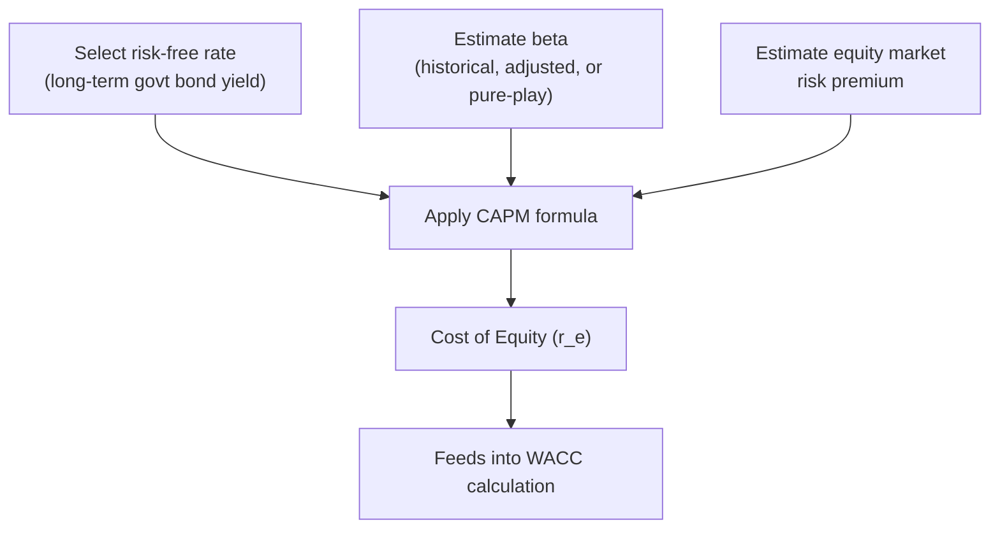

## Cost of Equity Estimation via CAPM

### Definition and Core Concept

The Capital Asset Pricing Model (CAPM) is the most widely used framework for estimating a firm's cost of equity — the return equity investors require to compensate them for the systematic (non-diversifiable) risk of holding the firm's stock. CAPM forms the equity component of WACC and, by extension, directly shapes the discount rate applied in NPV analysis and the hurdle rate benchmark used in IRR/MIRR comparisons.

CAPM rests on the premise that investors are compensated only for **systematic risk** (market-wide risk that cannot be diversified away), not for **unsystematic (firm-specific) risk**, since rational investors are assumed to hold diversified portfolios that eliminate firm-specific risk exposure.

### The CAPM Formula

$$r_e = r_f + \beta \times (r_m - r_f)$$

Where:

- $r_e$ = cost of equity (required return on equity)
- $r_f$ = risk-free rate
- $\beta$ = equity beta, measuring the stock's sensitivity to overall market movements
- $r_m$ = expected return on the overall market
- $(r_m - r_f)$ = the **equity market risk premium (ERP)**, the additional return investors require for bearing market risk over the risk-free rate

### Step-by-Step Estimation Process

**Key Points**

- Select an appropriate risk-free rate, typically a long-term government bond yield matched to the investment horizon
- Estimate or obtain the stock's beta, either from historical regression, published sources, or a comparable-company (pure-play) approach
- Estimate the equity market risk premium, typically drawn from historical market data or forward-looking surveys
- Apply the CAPM formula to derive the cost of equity

### Step 1: Selecting the Risk-Free Rate

**Key Points**

- The risk-free rate should reflect a security with no default risk and minimal reinvestment risk over a horizon comparable to the investment being evaluated
- Long-term government bond yields (e.g., 10-year or 20-year sovereign bond yields) are the most common proxy, since capital budgeting decisions typically involve multi-year investment horizons
- Using a short-term risk-free rate (e.g., a 90-day Treasury bill) for a long-lived capital project introduces a horizon mismatch, since short-term rates do not reflect the term structure risk embedded in a multi-year investment
- The risk-free rate should match the currency of the cash flows being discounted; discounting cash flows denominated in one currency using a risk-free rate from a different currency introduces inconsistency

### Step 2: Estimating Beta

Beta measures the covariance of a stock's returns with the overall market's returns, scaled by the market's variance:

$$\beta = \frac{Cov(r_i, r_m)}{Var(r_m)}$$

**Key Points**

- **Historical (raw) beta**: estimated via linear regression of a stock's historical returns against a broad market index's returns over a defined lookback period (commonly 2–5 years of monthly or weekly data)
- **Adjusted beta**: many data providers apply a statistical adjustment (commonly using a formula such as $\beta_{adjusted} = 0.67 \times \beta_{raw} + 0.33 \times 1.0$) reflecting the empirical tendency for betas to revert toward the market average of 1.0 over time
- **Published/vendor beta**: many analysts use beta figures published by financial data providers rather than calculating raw regression beta themselves, though methodology (lookback period, index used, adjustment formula) varies by provider

### Interpreting Beta Values

| Beta Value | Interpretation |
| --- | --- |
| $\beta = 0$ | No correlation with market movements (theoretically risk-free from a systematic risk standpoint) |
| $0 < \beta < 1$ | Less volatile than the market (defensive stock) |
| $\beta = 1$ | Moves in line with the market |
| $\beta > 1$ | More volatile than the market (aggressive/cyclical stock) |
| $\beta < 0$ | Moves inversely to the market (rare; e.g., certain hedging instruments) |

### Step 3: Estimating the Equity Market Risk Premium

The equity market risk premium (ERP) represents the additional return investors demand for holding a diversified equity portfolio over a risk-free asset.

**Key Points**

- **Historical ERP**: calculated as the average difference between historical market returns and historical risk-free rates over a long observation period (often several decades), based on the assumption that historical relationships persist into the future
- **Forward-looking/implied ERP**: derived from current market valuations (e.g., dividend discount models applied to a broad market index) to estimate the market's currently implied required return, rather than relying solely on historical averages
- **Survey-based ERP**: some practitioners reference periodic surveys of professional forecasters, academics, or CFOs regarding their expected market risk premium
- ERP estimates vary meaningfully depending on the source, time period, and methodology used, and different practitioners may reasonably arrive at different figures for the same market

### Worked Example: Full CAPM Calculation

Assume the following inputs for a company's cost of equity estimation:

- Risk-free rate ($r_f$): 4.2% (based on 10-year government bond yield)
- Equity beta ($\beta$): 1.35 (published adjusted beta)
- Equity market risk premium ($r_m - r_f$): 5.5%

**Applying the CAPM formula:**

$$r_e = 4.2\% + 1.35 \times 5.5\%$$

$$r_e = 4.2\% + 7.425\%$$

$$r_e = 11.625\%$$

The estimated cost of equity is approximately 11.63%. This figure then feeds directly into the WACC calculation as the return required on the equity portion of the firm's capital structure.

### CAPM Estimation Flow

### The Pure-Play Method for Project-Specific Beta

When evaluating a project in a business line different from the firm's core operations, or when a firm is privately held and lacks its own observable beta, analysts commonly use the **pure-play method**:

**Key Points**

- Identify publicly traded companies operating solely (or predominantly) in the project's specific business line
- Obtain each comparable company's levered (raw) beta
- **Unlever** each comparable's beta to remove the distorting effect of that company's own capital structure:

$$\beta_{unlevered} = \frac{\beta_{levered}}{1 + (1 - T_c) \times \frac{D}{E}}$$

- Average the unlevered betas across the comparable set to obtain an industry-representative unlevered (asset) beta
- **Relever** this average beta using the evaluating firm's own target capital structure:

$$\beta_{relevered} = \beta_{unlevered} \times \left[1 + (1 - T_c) \times \frac{D}{E}\right]$$

- Apply this project-specific relevered beta in the CAPM formula to derive a project-specific cost of equity, rather than using the firm's overall corporate beta

### Worked Example: Pure-Play Beta Adjustment

A capital-intensive firm is evaluating a project in a new business segment. Three comparable pure-play companies have the following levered betas and capital structures:

| Comparable | Levered Beta | D/E Ratio | Tax Rate |
| --- | --- | --- | --- |
| Company 1 | 1.10 | 0.40 | 25% |
| Company 2 | 1.25 | 0.60 | 25% |
| Company 3 | 0.95 | 0.30 | 25% |

**Unlevering each beta:**

$$\beta_{u,1} = \frac{1.10}{1 + (1-0.25)(0.40)} = \frac{1.10}{1.30} = 0.846$$

$$\beta_{u,2} = \frac{1.25}{1 + (1-0.25)(0.60)} = \frac{1.25}{1.45} = 0.862$$

$$\beta_{u,3} = \frac{0.95}{1 + (1-0.25)(0.30)} = \frac{0.95}{1.225} = 0.776$$

**Average unlevered beta:**

$$\beta_{u,avg} = \frac{0.846 + 0.862 + 0.776}{3} = \frac{2.484}{3} = 0.828$$

**Relevering using the evaluating firm's target D/E ratio of 0.50:**

$$\beta_{relevered} = 0.828 \times [1 + (1-0.25)(0.50)] = 0.828 \times 1.375 = 1.139$$

This project-specific relevered beta (1.139) would then be used in the CAPM formula in place of the firm's overall corporate beta, producing a cost of equity tailored to the specific risk profile of the new business segment rather than the firm's average operations.

### CAPM's Underlying Assumptions and Their Limitations

**Key Points**

- **Investors hold diversified portfolios**: CAPM assumes unsystematic risk is fully diversified away; in practice, some investors (particularly in closely-held or family-owned firms) may hold concentrated positions, making this assumption imperfect for certain ownership structures
- **Markets are efficient**: CAPM assumes security prices fully reflect available information; persistent market anomalies documented in academic literature (size effect, value effect, momentum) suggest this assumption does not hold perfectly in practice
- **Single-period model**: CAPM is technically a single-period model, while capital budgeting decisions typically involve multi-year or multi-decade horizons, requiring the assumption that the CAPM-derived rate remains a reasonable proxy across the full project life
- **Beta stability assumption**: historical beta is assumed to be a reasonable predictor of future beta, which may not hold during periods of significant business or capital structure change
- **No consideration of unsystematic risk premium**: CAPM assumes investors require compensation only for systematic risk; for closely-held firms or controlling shareholders unable to diversify, some practitioners apply additional size or specific-risk premiums beyond the standard CAPM output, though this practice is a supplementary adjustment rather than part of the core CAPM framework itself

### Alternative and Supplementary Models

| Model | Key Distinction from CAPM |
| --- | --- |
| Fama-French Three-Factor Model | Adds size and value factors alongside market risk |
| Fama-French Five-Factor Model | Further adds profitability and investment factors |
| Arbitrage Pricing Theory (APT) | Allows multiple systematic risk factors rather than a single market factor |
| Build-Up Method | Adds size premium and company-specific risk premium to CAPM output, common in private company valuation |

[Inference] While these alternative and extended models are used in certain valuation and academic contexts, standard CAPM remains the most commonly applied method for estimating cost of equity in mainstream corporate capital budgeting practice, given its relative simplicity and the widespread availability of the inputs it requires.

### CAPM Components Illustration (svg_diagram)

<svg xmlns="http://www.w3.org/2000/svg" viewBox="0 0 700 300">
<text x="350" y="26" font-family="Arial, sans-serif" font-size="17" font-weight="bold" text-anchor="middle" fill="#1a1a1a">CAPM Components Illustration (svg_diagram)</text>
<line x1="70" y1="250" x2="650" y2="250" stroke="#5f6368" stroke-width="1.5" />
<text x="350" y="275" font-family="Arial" font-size="12" text-anchor="middle" fill="#5f6368">Required Return Build-Up</text>
<rect x="120" y="200" width="120" height="50" fill="#1967d2" />
<text x="180" y="230" font-family="Arial" font-size="12" text-anchor="middle" fill="#ffffff">Risk-Free Rate</text>
<text x="180" y="190" font-family="Arial" font-size="11" text-anchor="middle" fill="#1a1a1a">4.2%</text>
<rect x="260" y="130" width="150" height="120" fill="#34a853" />
<text x="335" y="185" font-family="Arial" font-size="12" text-anchor="middle" fill="#ffffff">Beta x Market</text>
<text x="335" y="200" font-family="Arial" font-size="12" text-anchor="middle" fill="#ffffff">Risk Premium</text>
<text x="335" y="120" font-family="Arial" font-size="11" text-anchor="middle" fill="#1a1a1a">1.35 x 5.5% = 7.43%</text>
<line x1="430" y1="190" x2="480" y2="190" stroke="#5f6368" stroke-width="2" marker-end="url(#arrow3)" />
<rect x="490" y="150" width="150" height="100" rx="8" fill="#fef7e0" stroke="#fbbc04" stroke-width="2" />
<text x="565" y="185" font-family="Arial" font-size="13" font-weight="bold" text-anchor="middle" fill="#1a1a1a">Cost of Equity</text>
<text x="565" y="205" font-family="Arial" font-size="15" font-weight="bold" text-anchor="middle" fill="#1a1a1a">≈ 11.63%</text>
</svg>

### Application in Capital Intensity and Capex Management

**Key Points**

- **Capital-intensive firms often exhibit higher betas due to operating leverage**: high fixed-cost structures (heavy depreciation, maintenance obligations) common in capital-intensive industries can amplify earnings volatility relative to revenue volatility, contributing to elevated systematic risk and higher beta estimates
- **Long project horizons increase sensitivity to CAPM input assumptions**: since capital-intensive projects often span 15–30 years, small differences in the assumed equity market risk premium or beta estimate compound significantly when discounting distant cash flows, making input selection and documentation especially important
- **Pure-play method is frequently necessary**: capital-intensive firms diversifying into new asset classes, geographies, or technologies (e.g., a traditional utility investing in renewable generation) often cannot rely on their own corporate beta, since it reflects a different risk profile than the new investment; the pure-play method is commonly applied in these cases
- **Regulatory context in utilities**: [Inference] in regulated capital-intensive sectors, CAPM-derived cost of equity estimates are frequently a central, formally scrutinized input in rate-setting proceedings, since they directly influence the allowed return on regulated capital investments; the acceptable range of CAPM inputs (beta, ERP) is often subject to regulatory review and can vary by jurisdiction

### Common Pitfalls in CAPM Application

- **Mismatching the risk-free rate horizon to the investment horizon**: using a short-term rate for a long-lived capital project
- **Using stale or outdated beta estimates**: beta can shift meaningfully following changes in business mix, leverage, or market conditions, so periodic reestimation is important
- **Applying corporate beta to a project with a substantially different risk profile**: without pure-play adjustment, this misprices the true systematic risk of the specific investment
- **Inconsistent equity market risk premium sourcing**: mixing a historical ERP with a forward-looking risk-free rate, or vice versa, without a coherent methodological basis
- **Ignoring currency and country risk mismatches**: for multinational capital-intensive projects, failing to adjust CAPM inputs for country-specific risk premiums when evaluating investments in different economic and political risk environments

### Related Topics

- Weighted Average Cost of Capital (WACC) construction
- Levering and unlevering beta (pure-play method)
- Equity market risk premium estimation methodologies
- Cost of debt estimation and credit spread analysis
- Project-specific risk-adjusted discount rates
- Fama-French multi-factor models
- Country risk premium in international capital budgeting
- Regulatory rate-setting and allowed return methodologies