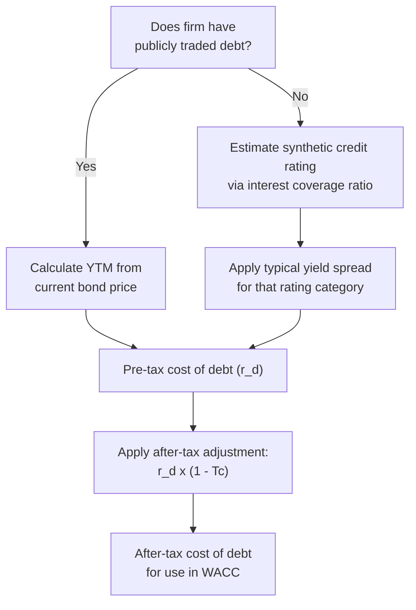

## Cost of Debt and After-Tax Adjustments

### Definition and Core Concept

The cost of debt is the effective rate of return that a firm's debt holders require, and by extension, the rate the firm must pay to raise debt financing. Because interest expense is generally tax-deductible in most jurisdictions, the **after-tax cost of debt** — rather than the pre-tax cost — is the figure that belongs in the WACC calculation, since it reflects the true net economic cost of debt financing to the firm after accounting for the tax shield generated by interest deductibility.

### The Cost of Debt Formula

**Pre-tax cost of debt** is typically estimated using the yield to maturity on the firm's existing debt:

$$r_d = Yield\ to\ Maturity\ (YTM)\ on\ Existing\ Debt$$

**After-tax cost of debt**, which is the figure used in WACC:

$$r_d\ (after\text{-}tax) = r_d \times (1 - T_c)$$

Where:

- $r_d$ = pre-tax cost of debt
- $T_c$ = the firm's marginal corporate tax rate

### Why the After-Tax Adjustment Matters

**Key Points**

- Interest payments on debt are deductible from taxable income in most tax jurisdictions, reducing the firm's overall tax liability
- This creates an **interest tax shield**: the effective cost of debt to the firm is lower than the stated (pre-tax) interest rate, because a portion of that interest cost is offset by tax savings
- Dividend payments to equity holders, by contrast, are generally not tax-deductible, so no equivalent adjustment applies to the cost of equity
- Omitting the after-tax adjustment in WACC construction overstates the true cost of debt financing and produces an inflated discount rate, which can cause value-creating projects to be incorrectly rejected

### Step-by-Step Estimation Process

**Key Points**

- Identify the firm's outstanding debt instruments (bonds, term loans, notes)
- For publicly traded debt, calculate yield to maturity using current market price, coupon rate, and time to maturity
- For privately held or untraded debt, estimate an equivalent market yield using comparable credit ratings, synthetic ratings, or recent borrowing rates
- Determine the applicable marginal corporate tax rate
- Apply the after-tax adjustment formula

### Method 1: Yield to Maturity on Publicly Traded Debt

When a firm has publicly traded bonds, YTM is the preferred method for estimating the pre-tax cost of debt, since it reflects the market's current required return rather than the historical rate at which the debt was originally issued.

**YTM Approximation Formula:**

$$YTM \approx \frac{C + \frac{F - P}{n}}{\frac{F + P}{2}}$$

Where:

- $C$ = annual coupon payment
- $F$ = face (par) value of the bond
- $P$ = current market price of the bond
- $n$ = years to maturity

This is an approximation; precise YTM is typically solved iteratively (via financial calculator or spreadsheet function) as the discount rate that equates the bond's current market price to the present value of its remaining coupon and principal payments.

**Worked Example: YTM Approximation**

A company's outstanding bond has a face value of $1,000, an annual coupon rate of 5% ($50 per year), 8 years remaining to maturity, and currently trades at $960.

$$YTM \approx \frac{50 + \frac{1{,}000 - 960}{8}}{\frac{1{,}000 + 960}{2}} = \frac{50 + 5}{980} = \frac{55}{980} \approx 5.61\%$$

The bond's approximate yield to maturity is 5.61%, which serves as the pre-tax cost of debt estimate.

### Method 2: Synthetic Credit Rating Approach

When a firm has no publicly traded debt, analysts commonly estimate an implied ("synthetic") credit rating based on financial ratios — most commonly the **interest coverage ratio**:

$$Interest\ Coverage\ Ratio = \frac{EBIT}{Interest\ Expense}$$

**Key Points**

- A higher interest coverage ratio suggests a stronger implied credit rating and, correspondingly, a lower required yield spread over the risk-free rate
- Rating agencies and financial data providers publish reference tables linking interest coverage ratio ranges to indicative credit rating categories and associated typical yield spreads
- Once a synthetic rating is determined, the analyst applies the typical yield spread associated with that rating category (based on comparable publicly traded bonds of similar maturity) over the risk-free rate to estimate the firm's pre-tax cost of debt

**Illustrative Synthetic Rating Table**

| Interest Coverage Ratio | Indicative Rating | Typical Spread Over Risk-Free Rate |
| --- | --- | --- |
| > 8.5x | AAA/AA | 0.5% – 0.8% |
| 6.0x – 8.5x | A | 0.9% – 1.3% |
| 3.5x – 6.0x | BBB | 1.4% – 2.2% |
| 2.0x – 3.5x | BB | 2.3% – 4.0% |
| < 2.0x | B or below | 4.0%+ |

[Inference] These spread ranges are illustrative and vary considerably depending on prevailing market conditions, credit cycle, and the specific data source used; actual spreads should be sourced from current market data for the relevant rating category rather than relied upon as fixed benchmarks.

### Worked Example: Full After-Tax Cost of Debt Calculation

A firm's outstanding bond has a YTM of 6.2%, and the firm's marginal corporate tax rate is 25%.

$$r_d\ (after\text{-}tax) = 6.2\% \times (1 - 0.25) = 6.2\% \times 0.75 = 4.65\%$$

The after-tax cost of debt is 4.65%, which is the figure incorporated into the WACC calculation.

### Cost of Debt Estimation Flow

### Selecting the Appropriate Tax Rate

**Key Points**

- **Marginal tax rate** (the tax rate applicable to the next dollar of taxable income) is theoretically preferred over the average or effective tax rate, since it reflects the actual tax savings generated by an additional dollar of interest deduction
- The **statutory marginal corporate tax rate** is commonly used as a starting point, though firms operating across multiple tax jurisdictions may need to apply a blended or jurisdiction-specific rate reflecting where the debt-financed activity and associated interest deductions actually occur
- Some firms use their **effective tax rate** (actual taxes paid divided by pre-tax income) as a practical proxy, particularly when the firm has significant tax credits, loss carryforwards, or other factors causing its effective rate to diverge from the statutory rate; [Inference] this substitution is a simplification and may not always precisely capture the true marginal tax shield value of additional interest deductions, particularly for firms near a tax-loss position where additional deductions may generate limited or no immediate tax benefit

### Special Considerations

**Key Points**

- **Firms with net operating losses or limited taxable income**: the interest tax shield has reduced or no value if the firm does not have sufficient taxable income against which to apply the deduction; in such cases, using the full statutory tax rate in the after-tax adjustment can overstate the actual benefit
- **Multiple debt instruments with different rates**: when a firm has several types of debt (bonds, term loans, revolving credit facilities) with different pre-tax costs, a **weighted average pre-tax cost of debt** should be calculated across all outstanding instruments, weighted by their respective market or book values, before applying the after-tax adjustment
- **Floating-rate debt**: for debt with variable interest rates, analysts typically use the current market rate or a forward-rate-based estimate rather than a historical average, since WACC should reflect current, forward-looking financing costs
- **Leases and lease-equivalent debt**: [Inference] certain long-term operating or finance lease obligations may be treated as debt-equivalent for capital structure purposes in some analytical frameworks, though the specific accounting and financial treatment can vary depending on applicable accounting standards and the analyst's methodology

### Worked Example: Weighted Average Cost of Debt Across Multiple Instruments

A firm has three outstanding debt instruments:

| Instrument | Market Value ($ millions) | Pre-Tax Cost |
| --- | --- | --- |
| Senior Bonds | 250 | 5.5% |
| Term Loan | 100 | 6.8% |
| Subordinated Notes | 50 | 8.2% |

**Total debt value:**

$$D = 250 + 100 + 50 = 400\ million$$

**Weighted average pre-tax cost of debt:**

$$r_d = \frac{(250 \times 5.5\%) + (100 \times 6.8\%) + (50 \times 8.2\%)}{400}$$

$$r_d = \frac{13.75 + 6.80 + 4.10}{400} = \frac{24.65}{400} = 6.16\%$$

Applying a 25% marginal tax rate:

$$r_d\ (after\text{-}tax) = 6.16\% \times (1 - 0.25) = 4.62\%$$

This blended, after-tax figure represents the appropriate cost of debt input for WACC when a firm's debt structure includes multiple instruments with differing costs.

### Cost of Debt vs. Cost of Equity: Key Distinctions

| Factor | Cost of Debt | Cost of Equity |
| --- | --- | --- |
| Tax treatment | Interest is tax-deductible | Dividends are not tax-deductible |
| After-tax adjustment required | Yes, $r_d \times (1-T_c)$ | No adjustment |
| Estimation method | YTM or synthetic rating | CAPM (or alternative models) |
| Typical relative cost | Generally lower (senior claim, lower risk) | Generally higher (residual claim, higher risk) |
| Contractual obligation | Fixed contractual payments | No contractual obligation to pay |

### Common Pitfalls in Cost of Debt Estimation

- **Using the coupon rate instead of yield to maturity**: the coupon rate reflects conditions at the time of original issuance, not current market-required returns
- **Forgetting the after-tax adjustment entirely**: a frequent and consequential error that overstates the true cost of debt financing in the WACC calculation
- **Applying the statutory tax rate without considering the firm's actual tax position**: particularly problematic for firms with limited taxable income, where the theoretical tax shield may not be fully realized
- **Ignoring multiple debt instruments and using only one tranche's rate**: understates or overstates the true blended cost of debt when the firm has a diverse debt structure
- **Using book value weights instead of market value weights**: when combining multiple debt instruments or calculating capital structure weights in WACC, market value (or a reasonable market value proxy) should be used rather than historical book value

### Application in Capital Intensity and Capex Management

**Key Points**

- **Capital-intensive firms typically carry substantial debt loads**: given the scale of fixed-asset investment required, capital-intensive industries (utilities, telecommunications, heavy manufacturing, infrastructure) often maintain higher leverage than less capital-intensive sectors, making accurate cost of debt estimation particularly consequential to overall WACC
- **Project finance and asset-specific debt**: large capital-intensive projects (power plants, pipelines, toll infrastructure) are frequently financed using project-specific debt structures with their own distinct interest rates and terms, separate from the parent firm's general corporate debt; in these cases, the project-specific cost of debt, rather than the firm's blended corporate rate, is often more appropriate for evaluating that specific investment
- **Credit rating sensitivity to leverage**: since capital-intensive firms often operate with substantial debt, changes in leverage from a new capex program can shift the firm's credit rating and, consequently, its cost of debt on both existing and future borrowing; this interdependency is sometimes modeled explicitly in large capital budgeting decisions
- **Regulatory allowed cost of debt**: [Inference] in regulated capital-intensive sectors, the cost of debt used in rate-setting calculations is often subject to formal regulatory review and may be based on a blend of the firm's actual embedded debt costs and current market rates, with the specific methodology varying by regulatory jurisdiction

### After-Tax Cost of Debt Illustration (svg_diagram)

<svg xmlns="http://www.w3.org/2000/svg" viewBox="0 0 700 280">
<text x="350" y="26" font-family="Arial, sans-serif" font-size="17" font-weight="bold" text-anchor="middle" fill="#1a1a1a">After-Tax Cost of Debt Illustration (svg_diagram)</text>
<rect x="100" y="80" width="180" height="100" fill="#ea4335" opacity="0.85" />
<text x="190" y="120" font-family="Arial" font-size="13" font-weight="bold" text-anchor="middle" fill="#ffffff">Pre-Tax Cost</text>
<text x="190" y="140" font-family="Arial" font-size="15" font-weight="bold" text-anchor="middle" fill="#ffffff">6.2%</text>
<line x1="290" y1="130" x2="360" y2="130" stroke="#5f6368" stroke-width="2" marker-end="url(#arrow4)" />
<text x="325" y="120" font-family="Arial" font-size="10" text-anchor="middle" fill="#5f6368">x (1 - 25%)</text>
<rect x="370" y="90" width="140" height="80" fill="#34a853" opacity="0.85" />
<text x="440" y="125" font-family="Arial" font-size="12" font-weight="bold" text-anchor="middle" fill="#ffffff">Tax Shield</text>
<text x="440" y="145" font-family="Arial" font-size="12" text-anchor="middle" fill="#ffffff">Removes 25%</text>
<rect x="530" y="90" width="140" height="80" rx="8" fill="#fef7e0" stroke="#fbbc04" stroke-width="2" />
<text x="600" y="125" font-family="Arial" font-size="12" font-weight="bold" text-anchor="middle" fill="#1a1a1a">After-Tax Cost</text>
<text x="600" y="145" font-family="Arial" font-size="15" font-weight="bold" text-anchor="middle" fill="#1a1a1a">4.65%</text>
</svg>

### Best Practice Recommendation

1. Use yield to maturity on current, publicly traded debt whenever available, rather than historical coupon rates
2. For untraded debt, apply a synthetic credit rating approach grounded in current market spread data
3. Always apply the after-tax adjustment using the firm's appropriate marginal tax rate
4. When multiple debt instruments exist, calculate a value-weighted average pre-tax cost before applying the tax adjustment
5. Reassess the firm's tax position (particularly taxable income sufficiency) when applying the statutory tax rate, especially for firms with volatile earnings or significant tax attributes
6. For large capital-intensive projects with dedicated project financing, consider using the project-specific cost of debt rather than the parent firm's blended corporate rate

### Related Topics

- Weighted Average Cost of Capital (WACC) construction
- Cost of equity estimation via CAPM
- Credit rating methodology and interest coverage ratios
- Yield to maturity and bond valuation
- Project finance and asset-specific debt structures
- Capital structure and leverage decisions
- Interest tax shield and its role in firm valuation
- Regulatory rate-setting and allowed cost of capital