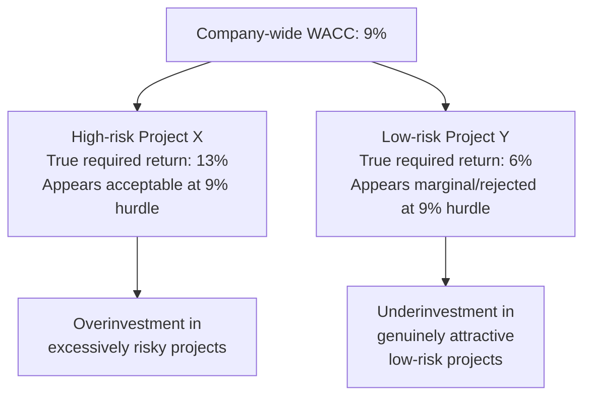

## Project-Specific Versus Company-Wide Hurdle Rates

### Definition and Core Concept

A hurdle rate is the minimum required rate of return a project must exceed to be considered acceptable for investment. The central question this topic addresses is whether a firm should apply a single, company-wide hurdle rate (typically corporate WACC) uniformly across all capital projects, or whether it should adjust the hurdle rate for individual projects to reflect their specific risk characteristics. Using a single company-wide rate is simpler but can lead to systematically poor capital allocation decisions when a firm's projects vary meaningfully in risk.

### The Core Problem with a Single Company-Wide Hurdle Rate

Corporate WACC reflects the **average risk** of a firm's existing mix of operations and assets. When this single rate is applied indiscriminately to every project under consideration, regardless of that project's individual risk profile, it produces two systematic biases:

**Key Points**

- **Overinvestment in high-risk projects**: projects riskier than the firm's average operations are discounted at too low a rate, making them appear more attractive (higher NPV, and an IRR that more easily clears the hurdle) than their true risk-adjusted value justifies
- **Underinvestment in low-risk projects**: projects safer than the firm's average operations are discounted at too high a rate, making them appear less attractive than they actually are, potentially causing the firm to reject value-creating, lower-risk investments

Over time, this dynamic can shift a firm's overall risk profile upward, as capital increasingly flows toward higher-risk projects that clear the single hurdle rate more easily, while safer, genuinely value-accretive projects are systematically passed over.

### Illustrating the Bias

### When a Single Company-Wide Hurdle Rate Is Appropriate

**Key Points**

- The firm operates in a single, relatively homogeneous business line with limited variation in project risk
- All projects under consideration are similar in scale, industry exposure, geographic location, and operational risk to the firm's existing asset base
- The administrative simplicity of a single rate outweighs the precision benefits of project-specific adjustment, particularly for smaller firms or lower-stakes capital decisions
- The firm lacks reliable data or resources to estimate project-specific risk parameters (e.g., no accessible pure-play comparables)

### When Project-Specific Hurdle Rates Are Necessary

**Key Points**

- **Diversified firms with multiple business segments**: a conglomerate or diversified capital-intensive firm (e.g., a utility with both regulated transmission assets and unregulated generation or renewable energy ventures) has segments with materially different risk profiles
- **Geographic expansion into higher or lower risk markets**: projects in jurisdictions with different country risk, political risk, or currency risk than the firm's home market warrant a distinct discount rate
- **New technology or unproven business lines**: capital-intensive firms investing in emerging technologies (e.g., a traditional fossil fuel utility investing in early-stage carbon capture or hydrogen infrastructure) face materially different risk than their core, established operations
- **Projects with different operating leverage or cash flow volatility**: even within the same industry, a project with high fixed costs and volatile revenue differs meaningfully in risk from a stable, contracted-revenue project

### The Pure-Play Method for Project-Specific Hurdle Rates

The most common formal approach to deriving a project-specific discount rate is the **pure-play method**, which uses publicly traded comparable companies operating in the project's specific business line to estimate an appropriate project-specific beta and, in turn, cost of equity.

**Step-by-Step Process:**

1. Identify publicly traded firms operating predominantly in the project's specific business line
2. Obtain each comparable firm's levered (observed) beta
3. Unlever each comparable's beta to remove the distorting effect of that firm's own capital structure:

$$\beta_{unlevered} = \frac{\beta_{levered}}{1 + (1 - T_c) \times \frac{D}{E}}$$

4. Average the unlevered betas across the comparable set
5. Relever the average beta using the evaluating firm's own target capital structure:

$$\beta_{relevered} = \beta_{unlevered} \times \left[1 + (1 - T_c) \times \frac{D}{E}\right]$$

6. Apply this project-specific relevered beta within CAPM to derive a project-specific cost of equity
7. Combine with the project's own capital structure weights (if different from the firm's corporate structure) to derive a project-specific WACC

### Worked Example: Company-Wide vs. Project-Specific Hurdle Rate Comparison

A capital-intensive utility with a corporate WACC of 8.0% (reflecting its stable, regulated core business) is evaluating a new investment in early-stage battery storage technology — a segment with materially higher operating and technology risk.

**Company-wide approach:**

$$Hurdle\ Rate = 8.0\%\ (unadjusted\ corporate\ WACC)$$

**Project-specific approach using pure-play comparables:**

Suppose the pure-play method (using publicly traded battery storage developers) yields a relevered project-specific beta of 1.6, compared to the utility's own corporate beta of 0.65. Using CAPM with $r_f = 4.0\%$ and an equity market risk premium of 5.5%:

$$r_e\ (project\text{-}specific) = 4.0\% + 1.6 \times 5.5\% = 4.0\% + 8.8\% = 12.8\%$$

Combining this with an appropriate project-specific capital structure (assume 70% equity / 30% debt at an after-tax cost of debt of 5.5%):

$$WACC_{project} = (0.70 \times 12.8\%) + (0.30 \times 5.5\%) = 8.96\% + 1.65\% = 10.61\%$$

**Comparison of outcomes:**

| Approach | Hurdle Rate | Effect on Project Evaluation |
| --- | --- | --- |
| Company-wide WACC | 8.0% | Understates the project's true risk; may approve a project that does not adequately compensate for risk taken |
| Project-specific WACC | 10.61% | Reflects the elevated risk of the battery storage segment; provides a more defensible accept/reject threshold |

A project with cash flows generating an IRR of, for example, 9.5% would appear attractive under the company-wide 8.0% hurdle rate, but would fail to clear the more appropriate 10.61% project-specific hurdle rate — illustrating precisely the overinvestment bias that a single company-wide rate can introduce.

### Risk-Adjustment Alternatives to the Full Pure-Play Method

**Key Points**

- **Qualitative risk categories with rate add-ons**: many firms use a simpler practical approach, categorizing projects into risk tiers (e.g., "cost reduction/maintenance," "core expansion," "new market entry," "new technology") and applying a predetermined incremental spread over corporate WACC for each tier, rather than performing a full pure-play beta analysis for every project
- **Scenario and sensitivity analysis**: rather than adjusting the discount rate itself, some firms instead widen the range of cash flow scenarios (optimistic, base case, pessimistic) for higher-risk projects, effectively capturing risk through the numerator (cash flow estimates) rather than the denominator (discount rate)
- **Certainty-equivalent approach**: an alternative theoretical framework that adjusts expected cash flows downward to reflect risk (converting risky cash flows into their risk-free-equivalent certain values) and then discounts at the risk-free rate, rather than adjusting the discount rate upward

**Illustrative Risk-Tier Hurdle Rate Table**

| Project Risk Category | Typical Adjustment vs. Corporate WACC | Example |
| --- | --- | --- |
| Maintenance/replacement capex | WACC − 1% to 2% | Replacing existing equipment with proven technology |
| Core business expansion | WACC (no adjustment) | Capacity expansion within existing operations |
| New market/geography | WACC + 1% to 3% | Entering a new country or region |
| New technology/unproven business | WACC + 3% to 6%+ | Early-stage technology investment |

[Inference] These adjustment ranges are illustrative examples of the tiered approach concept rather than universal industry standards; actual spread magnitudes vary considerably by firm, industry, and the specific risk assessment methodology adopted.

### Divisional Hurdle Rates in Diversified Firms

For large, diversified capital-intensive conglomerates, a common practical compromise between full project-by-project pure-play analysis and a single company-wide rate is the use of **divisional hurdle rates** — a distinct WACC estimated for each major business segment, applied to all projects proposed within that segment.

**Key Points**

- Each division's hurdle rate is typically derived using pure-play comparables representative of that division's specific industry and risk profile
- This approach balances administrative practicality (not every individual project requires a bespoke pure-play analysis) with improved risk sensitivity compared to a single corporate-wide rate
- Divisional hurdle rates are periodically reviewed and updated, particularly following significant shifts in a division's business mix, competitive environment, or capital structure

### Comparison Summary: Company-Wide vs. Project-Specific Hurdle Rates

| Factor | Company-Wide Hurdle Rate | Project-Specific Hurdle Rate |
| --- | --- | --- |
| Simplicity | High | Lower; requires additional analysis |
| Risk sensitivity | Low; ignores project-level risk variation | High; reflects actual project risk |
| Data requirements | Minimal (corporate WACC only) | Requires pure-play comparables or risk-tier framework |
| Risk of overinvestment in risky projects | High | Reduced |
| Risk of underinvestment in safe projects | High | Reduced |
| Best suited for | Homogeneous, single-business firms | Diversified firms, new markets, new technologies |

### Application in Capital Intensity and Capex Management

**Key Formulation and Key Points**

- **Capital-intensive firms are especially prone to risk heterogeneity across their capital programs**: a single capital-intensive firm often simultaneously evaluates low-risk maintenance capex, moderate-risk capacity expansion, and high-risk new technology or new market investments, making a single company-wide hurdle rate particularly ill-suited
- **Regulated vs. unregulated segments**: many capital-intensive firms (especially utilities) operate both regulated businesses (with stable, often government-sanctioned allowed returns) and unregulated or competitive businesses (with market-driven, typically higher risk-adjusted returns); applying a single blended WACC across both segments would materially misprice risk in one direction or the other
- **Long project horizons amplify the cost of hurdle rate mismatches**: because capital-intensive projects often span 15–30 years, applying an incorrect (too low or too high) hurdle rate compounds significantly in the resulting NPV calculation, making the precision of project-specific risk adjustment especially valuable for major capital-intensive commitments
- **Governance and capital allocation discipline**: [Inference] many large capital-intensive organizations formalize project-specific or divisional hurdle rate frameworks as part of their capital allocation governance policy, requiring explicit documentation of the risk category and corresponding rate adjustment applied to each major capex proposal, though the specific governance structure and rate-setting methodology varies considerably by organization

### Divisional Hurdle Rate Structure (svg_diagram)

<svg xmlns="http://www.w3.org/2000/svg" viewBox="0 0 740 320">
<text x="370" y="26" font-family="Arial, sans-serif" font-size="17" font-weight="bold" text-anchor="middle" fill="#1a1a1a">Divisional Hurdle Rate Structure (svg_diagram)</text>
<rect x="290" y="55" width="160" height="55" rx="8" fill="#e8eaed" stroke="#5f6368" stroke-width="2" />
<text x="370" y="88" font-family="Arial" font-size="13" font-weight="bold" text-anchor="middle" fill="#1a1a1a">Corporate WACC</text>
<line x1="330" y1="110" x2="150" y2="160" stroke="#5f6368" stroke-width="1.5" />
<line x1="370" y1="110" x2="370" y2="160" stroke="#5f6368" stroke-width="1.5" />
<line x1="410" y1="110" x2="600" y2="160" stroke="#5f6368" stroke-width="1.5" />
<rect x="60" y="160" width="180" height="80" rx="8" fill="#d2e3fc" stroke="#1967d2" stroke-width="2" />
<text x="150" y="190" font-family="Arial" font-size="12" font-weight="bold" text-anchor="middle" fill="#1a1a1a">Regulated Division</text>
<text x="150" y="210" font-family="Arial" font-size="13" text-anchor="middle" fill="#1a1a1a">Hurdle: 6.5%</text>
<text x="150" y="228" font-family="Arial" font-size="10" text-anchor="middle" fill="#5f6368">(Low risk)</text>
<rect x="280" y="160" width="180" height="80" rx="8" fill="#e6f4ea" stroke="#34a853" stroke-width="2" />
<text x="370" y="190" font-family="Arial" font-size="12" font-weight="bold" text-anchor="middle" fill="#1a1a1a">Core Generation</text>
<text x="370" y="210" font-family="Arial" font-size="13" text-anchor="middle" fill="#1a1a1a">Hurdle: 8.5%</text>
<text x="370" y="228" font-family="Arial" font-size="10" text-anchor="middle" fill="#5f6368">(Average risk)</text>
<rect x="500" y="160" width="180" height="80" rx="8" fill="#fce8e6" stroke="#ea4335" stroke-width="2" />
<text x="590" y="190" font-family="Arial" font-size="12" font-weight="bold" text-anchor="middle" fill="#1a1a1a">New Tech Ventures</text>
<text x="590" y="210" font-family="Arial" font-size="13" text-anchor="middle" fill="#1a1a1a">Hurdle: 12.0%</text>
<text x="590" y="228" font-family="Arial" font-size="10" text-anchor="middle" fill="#5f6368">(High risk)</text>
</svg>

### Common Pitfalls

- **Applying corporate WACC to all projects regardless of risk**: the most common and consequential error, leading to systematic overinvestment in risky projects and underinvestment in safe ones
- **Over-engineering risk adjustment for low-stakes decisions**: performing a full pure-play analysis for minor, routine maintenance capex may not be cost-justified relative to the decision's significance
- **Failing to periodically update divisional or project-specific rates**: risk profiles shift over time as business segments mature, competitive dynamics change, or capital structures evolve
- **Inconsistent application across similar projects**: applying project-specific adjustments unevenly (e.g., adjusting for some new-market projects but not others of similar risk) undermines the comparability and fairness of the capital allocation process
- **Confusing project-specific business risk with financing risk**: the discount rate adjustment should reflect the project's underlying operating/business risk, not simply how that specific project happens to be financed

### Best Practice Recommendation

1. Use company-wide WACC only when the firm's projects are genuinely homogeneous in risk relative to its existing operations
2. For diversified firms or firms with meaningfully varying project risk, implement either a formal pure-play-based project-specific rate or, at minimum, a structured risk-tier adjustment framework
3. Establish divisional hurdle rates for large, diversified capital-intensive organizations with distinct business segments, updated periodically to reflect evolving segment risk
4. Document the rationale for any hurdle rate adjustment applied to a specific project, ensuring consistency and defensibility across the capital allocation process
5. Recognize that hurdle rate precision matters most for large, long-lived, and high-risk capital commitments, where errors compound significantly over the project's extended horizon

### Related Topics

- Weighted Average Cost of Capital (WACC) construction
- Cost of equity estimation via CAPM
- Levering and unlevering beta (pure-play method)
- Cost of debt and after-tax adjustments
- Capital rationing and divisional capital allocation
- Sensitivity and scenario analysis in capital budgeting
- Certainty-equivalent valuation approach
- Regulated vs. unregulated business segment risk assessment