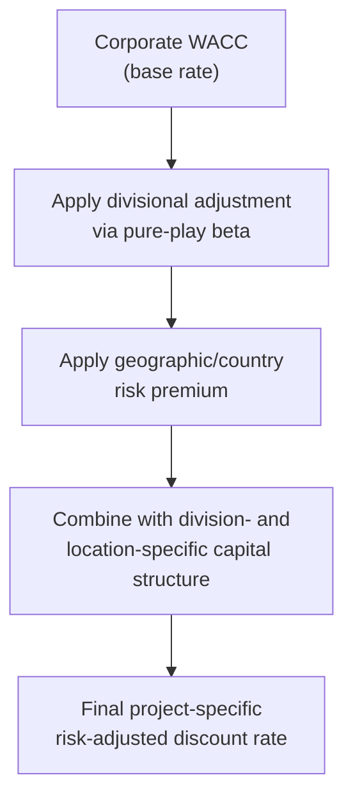

## Risk-Adjusted Discount Rates by Division or Geography

### Definition and Core Concept

Risk-adjusted discount rates by division or geography extend the principle of project-specific hurdle rates into a formal, structured framework applied across a firm's entire organizational and geographic footprint. Rather than evaluating risk adjustment on a purely project-by-project basis, firms with distinct operating divisions and/or multinational operations establish systematic discount rate differentials — grounded in divisional business risk and geographic/country risk — that are applied consistently to all capital projects originating from a given segment or location.

This framework is particularly critical for large, diversified, capital-intensive organizations, where a single corporate WACC would obscure meaningful differences in both operating risk (across business divisions) and macroeconomic/political risk (across countries), leading to systematically distorted capital allocation.

### Two Dimensions of Risk Adjustment

**Key Points**

- **Divisional risk adjustment**: reflects differences in business/operating risk across a firm's segments — driven by industry, regulatory status, technology maturity, competitive dynamics, and operating leverage
- **Geographic/country risk adjustment**: reflects macroeconomic, political, currency, and institutional risk differences across the countries in which a firm operates, independent of the specific business segment
- These two dimensions are often combined multiplicatively or additively for multinational, multi-divisional firms — e.g., a mining division operating in a higher-risk emerging market requires both a divisional risk premium and a country risk premium layered onto the base corporate rate

### Divisional Risk-Adjusted Discount Rate Framework

The divisional approach, building on the pure-play method, derives a distinct WACC for each major business segment:

$$WACC_{division} = \frac{E}{V} \times r_{e,division} + \frac{D}{V} \times r_{d,division} \times (1 - T_c)$$

Where $r_{e,division}$ is estimated using a division-specific (pure-play-derived) beta rather than the firm's overall corporate beta, and capital structure weights may also be adjusted to reflect the division's typical or target financing mix if it differs materially from the corporate average.

### Geographic/Country Risk Adjustment Methods

**Method 1: Country Risk Premium (CRP) Add-On**

The most common approach adds an explicit country risk premium to the CAPM-derived cost of equity:

$$r_e\ (country\text{-}adjusted) = r_f + \beta \times (r_m - r_f) + CRP$$

Where the country risk premium is commonly estimated using the **sovereign yield spread method**:

$$CRP = Yield\ on\ Country's\ Sovereign\ Bond\ (USD\text{-}denominated) - Yield\ on\ Comparable\ Risk\text{-}Free\ Benchmark$$

**Method 2: Sovereign Default Spread Adjusted for Equity Volatility**

A refinement of the sovereign spread method scales the raw sovereign spread by the relative volatility of the local equity market compared to the local government bond market, on the premise that equity markets are typically more volatile than bond markets and the CRP should reflect that relationship:

$$CRP\ (adjusted) = Sovereign\ Spread \times \frac{\sigma_{equity\ market}}{\sigma_{bond\ market}}$$

**Method 3: Country Credit Rating-Based Spread Tables**

Similar to the synthetic credit rating approach used for cost of debt, some analysts reference published spread tables that map sovereign credit ratings to typical equity risk premiums, drawing on data compiled by rating agencies or academic sources.

### Worked Example: Combined Divisional and Geographic Adjustment

A diversified capital-intensive firm has a corporate WACC of 8.0%. It is evaluating a mining project in its extractives division, located in a country with elevated sovereign risk.

**Step 1: Divisional risk-adjusted cost of equity (pure-play method)**

Using pure-play mining sector comparables, the relevered divisional beta is estimated at 1.45 (compared to the firm's overall corporate beta of 0.90). With $r_f = 4.0\%$ and an equity market risk premium of 5.5%:

$$r_e\ (divisional) = 4.0\% + 1.45 \times 5.5\% = 4.0\% + 7.975\% = 11.975\%$$

**Step 2: Add country risk premium**

Assume the sovereign yield spread method produces a country risk premium of 3.2% for the project's location:

$$r_e\ (division + country) = 11.975\% + 3.2\% = 15.175\%$$

**Step 3: Combine with division-appropriate capital structure**

Assuming a divisional capital structure of 65% equity / 35% debt, with an after-tax cost of debt of 6.5% (also adjusted upward for country-specific borrowing conditions):

$$WACC_{project} = (0.65 \times 15.175\%) + (0.35 \times 6.5\%) = 9.86\% + 2.28\% = 12.14\%$$

**Comparison:**

| Approach | Discount Rate |
| --- | --- |
| Unadjusted corporate WACC | 8.0% |
| Divisional adjustment only | ~10.4% (illustrative, using 11.975% equity blended with domestic debt cost) |
| Divisional + country adjustment | 12.14% |

Using the unadjusted corporate rate of 8.0% for this project would substantially understate its true risk-adjusted required return, potentially leading the firm to approve a project that does not adequately compensate for the combined business and country risk being assumed.

### Risk-Adjustment Layering Process

### Currency Considerations in Multinational Discount Rates

**Key Points**

- Discount rates and cash flows must be matched consistently in currency terms: nominal local-currency cash flows should be discounted using a local-currency-denominated discount rate, and cash flows converted to and forecast in the parent firm's currency should be discounted using a rate consistent with that currency
- The **International Fisher Effect** provides a theoretical link between nominal discount rates in different currencies, based on relative inflation expectations:

$$\frac{1 + r_{local}}{1 + r_{foreign}} = \frac{1 + inflation_{local}}{1 + inflation_{foreign}}$$

- Failing to match currency and discount rate consistently is a common source of error in multinational capital budgeting, potentially leading to systematic mispricing of foreign project value
- [Inference] In practice, many multinational firms prefer to forecast project cash flows in local currency, discount using a local-currency-adjusted rate (incorporating the country risk premium), and then convert the resulting NPV to the parent currency at the current spot exchange rate, rather than forecasting exchange rate movements explicitly over a long multi-year horizon, though methodological approaches vary by firm and the specific risk management framework in use

### Divisional and Geographic Rate Matrix Approach

Many diversified, multinational capital-intensive firms formalize risk-adjusted rates into a **matrix structure**, combining divisional categories with geographic risk tiers:

**Illustrative Rate Matrix**

| Division / Geography | Domestic (Low Risk) | Established Foreign Market | Emerging Market (High Risk) |
| --- | --- | --- | --- |
| Regulated/Stable Segment | 6.5% | 7.5% | 9.5% |
| Core Operating Segment | 8.0% | 9.0% | 11.5% |
| New Technology/Venture Segment | 11.0% | 12.5% | 15.0%+ |

[Inference] This matrix structure is a common conceptual framework used by diversified multinational firms to standardize discount rate application across a large capital project portfolio, though the specific rate values, number of tiers, and update frequency vary considerably by organization and are typically calibrated to the firm's own cost of capital analysis and risk assessment methodology rather than following a universal standard.

### Advantages of Divisional and Geographic Risk Adjustment

- **More accurate capital allocation**: aligns the discount rate with the true risk of each specific investment, reducing the systematic overinvestment/underinvestment bias inherent in a single company-wide rate
- **Improved comparability across diverse project portfolios**: allows a diversified, multinational firm to meaningfully compare projects across very different business lines and geographies on a risk-adjusted basis
- **Supports more disciplined capital rationing**: when ranking projects by NPV or Profitability Index under a constrained capital budget, using appropriately risk-adjusted rates ensures the ranking reflects genuine risk-adjusted value rather than being distorted by a uniform, mismatched discount rate
- **Facilitates clearer governance and accountability**: divisional and geographic rate frameworks provide a transparent, pre-established basis for evaluating capital requests, reducing ad hoc or inconsistent rate-setting on a project-by-project basis

### Limitations and Challenges

- **Increased complexity and data requirements**: requires ongoing maintenance of divisional betas, country risk premiums, and capital structure assumptions across multiple segments and geographies
- **Subjectivity in country risk premium estimation**: different methodologies (sovereign spread, credit rating-based, volatility-adjusted) can produce materially different country risk premium estimates for the same location
- **Risk of double-counting risk**: if country-specific risk is already reflected in more conservative cash flow forecasts (e.g., discounting for expropriation risk or political instability directly in the cash flow projections), adding a further country risk premium to the discount rate may overstate the required return by counting the same risk twice
- **Potential for gaming or inconsistent application**: without clear governance, business units may have an incentive to argue for a lower risk classification (and thus lower hurdle rate) for their proposed projects, undermining the framework's integrity if not independently validated

### Common Pitfalls

- **Double-counting risk between cash flows and discount rate**: adjusting both the cash flow forecast (for political/country risk) and the discount rate (via country risk premium) for the same underlying risk factor
- **Applying a single country risk premium uniformly regardless of project type**: political and macroeconomic risk exposure can vary significantly even within the same country depending on the specific industry, asset type, or project structure (e.g., an export-oriented project with offshore revenue may face different currency risk than a purely domestic-revenue project)
- **Failing to periodically update country risk premiums**: sovereign risk can shift meaningfully and relatively quickly with changes in political conditions, credit ratings, or macroeconomic circumstances, requiring more frequent review than corporate-level WACC inputs
- **Currency-rate mismatches**: discounting local-currency cash flows with a parent-currency discount rate (or vice versa) without proper adjustment for relative inflation and currency risk differentials

### Application in Capital Intensity and Capex Management

**Key Points**

- **Extractive and infrastructure industries are especially exposed to geographic risk variation**: mining, oil and gas, and large infrastructure projects are frequently located in emerging or higher-risk markets where the underlying resources or strategic opportunities exist, making country risk adjustment a standard and necessary component of capital budgeting in these sectors
- **Long asset lives amplify the importance of accurate risk-adjusted rates**: since capital-intensive projects often span 15–30+ years, particularly in extractives and infrastructure, even modest miscalibration of the country or divisional risk premium compounds substantially in the resulting NPV over the project's extended horizon
- **Capital-intensive multinational conglomerates commonly maintain formal rate-setting governance**: [Inference] large capital-intensive multinational organizations often have a dedicated corporate finance or treasury function responsible for maintaining and periodically updating the divisional and geographic discount rate matrix used across the capital budgeting process, ensuring consistency and defensibility in capital allocation decisions across a complex, diversified project portfolio, though the specific organizational structure and update cadence varies by company
- **Political risk insurance and hedging as an alternative or complement**: some capital-intensive multinational firms use political risk insurance, currency hedging instruments, or contractual protections (e.g., stabilization clauses in resource extraction agreements) to mitigate certain geographic risks directly, which may reduce (but rarely eliminates) the need for a large discount rate premium, since insured or hedged risks are partially transferred rather than borne entirely by the discount rate adjustment

### Risk-Adjusted Rate Matrix Illustration (svg_diagram)

<svg xmlns="http://www.w3.org/2000/svg" viewBox="0 0 740 340">
<text x="370" y="26" font-family="Arial, sans-serif" font-size="17" font-weight="bold" text-anchor="middle" fill="#1a1a1a">Risk-Adjusted Rate Matrix Illustration (svg_diagram)</text>
<rect x="40" y="60" width="180" height="40" fill="#e8eaed" stroke="#5f6368" stroke-width="1" />
<text x="130" y="85" font-family="Arial" font-size="11" text-anchor="middle" fill="#1a1a1a">Division / Geography</text>
<rect x="220" y="60" width="160" height="40" fill="#e8eaed" stroke="#5f6368" stroke-width="1" />
<text x="300" y="85" font-family="Arial" font-size="11" text-anchor="middle" fill="#1a1a1a">Domestic</text>
<rect x="380" y="60" width="160" height="40" fill="#e8eaed" stroke="#5f6368" stroke-width="1" />
<text x="460" y="85" font-family="Arial" font-size="11" text-anchor="middle" fill="#1a1a1a">Foreign Market</text>
<rect x="540" y="60" width="160" height="40" fill="#e8eaed" stroke="#5f6368" stroke-width="1" />
<text x="620" y="85" font-family="Arial" font-size="11" text-anchor="middle" fill="#1a1a1a">Emerging Market</text>
<rect x="40" y="100" width="180" height="50" fill="#d2e3fc" stroke="#5f6368" stroke-width="1" />
<text x="130" y="130" font-family="Arial" font-size="11" text-anchor="middle" fill="#1a1a1a">Regulated Segment</text>
<rect x="220" y="100" width="160" height="50" fill="#ffffff" stroke="#5f6368" stroke-width="1" />
<text x="300" y="130" font-family="Arial" font-size="13" text-anchor="middle" fill="#1a1a1a">6.5%</text>
<rect x="380" y="100" width="160" height="50" fill="#ffffff" stroke="#5f6368" stroke-width="1" />
<text x="460" y="130" font-family="Arial" font-size="13" text-anchor="middle" fill="#1a1a1a">7.5%</text>
<rect x="540" y="100" width="160" height="50" fill="#ffffff" stroke="#5f6368" stroke-width="1" />
<text x="620" y="130" font-family="Arial" font-size="13" text-anchor="middle" fill="#1a1a1a">9.5%</text>
<rect x="40" y="150" width="180" height="50" fill="#e6f4ea" stroke="#5f6368" stroke-width="1" />
<text x="130" y="180" font-family="Arial" font-size="11" text-anchor="middle" fill="#1a1a1a">Core Operating Segment</text>
<rect x="220" y="150" width="160" height="50" fill="#ffffff" stroke="#5f6368" stroke-width="1" />
<text x="300" y="180" font-family="Arial" font-size="13" text-anchor="middle" fill="#1a1a1a">8.0%</text>
<rect x="380" y="150" width="160" height="50" fill="#ffffff" stroke="#5f6368" stroke-width="1" />
<text x="460" y="180" font-family="Arial" font-size="13" text-anchor="middle" fill="#1a1a1a">9.0%</text>
<rect x="540" y="150" width="160" height="50" fill="#ffffff" stroke="#5f6368" stroke-width="1" />
<text x="620" y="180" font-family="Arial" font-size="13" text-anchor="middle" fill="#1a1a1a">11.5%</text>
<rect x="40" y="200" width="180" height="50" fill="#fce8e6" stroke="#5f6368" stroke-width="1" />
<text x="130" y="222" font-family="Arial" font-size="11" text-anchor="middle" fill="#1a1a1a">New Technology /</text>
<text x="130" y="238" font-family="Arial" font-size="11" text-anchor="middle" fill="#1a1a1a">Venture Segment</text>
<rect x="220" y="200" width="160" height="50" fill="#ffffff" stroke="#5f6368" stroke-width="1" />
<text x="300" y="230" font-family="Arial" font-size="13" text-anchor="middle" fill="#1a1a1a">11.0%</text>
<rect x="380" y="200" width="160" height="50" fill="#ffffff" stroke="#5f6368" stroke-width="1" />
<text x="460" y="230" font-family="Arial" font-size="13" text-anchor="middle" fill="#1a1a1a">12.5%</text>
<rect x="540" y="200" width="160" height="50" fill="#ffffff" stroke="#5f6368" stroke-width="1" />
<text x="620" y="230" font-family="Arial" font-size="13" text-anchor="middle" fill="#1a1a1a">15.0%+</text>
</svg>

### Best Practice Recommendation

1. Establish distinct divisional discount rates using the pure-play method whenever a firm's segments have materially different business/operating risk
2. Layer geographic/country risk premiums on top of divisional rates for projects located outside the firm's primary domestic market, using a consistent, documented methodology (e.g., sovereign yield spread)
3. Ensure currency consistency between cash flow forecasts and the discount rate applied, using the International Fisher Effect or equivalent framework to reconcile local- and parent-currency discount rates
4. Avoid double-counting risk between cash flow forecasts and discount rate adjustments; document clearly which risks are captured in the numerator (cash flows) versus the denominator (discount rate)
5. Maintain a centralized, periodically updated divisional and geographic rate matrix or governance framework to ensure consistent, defensible application across the firm's capital budgeting process
6. Consider complementary risk mitigation tools (political risk insurance, currency hedging, contractual protections) alongside, not as a full substitute for, appropriate discount rate adjustment

### Related Topics

- Weighted Average Cost of Capital (WACC) construction
- Cost of equity estimation via CAPM
- Project-specific versus company-wide hurdle rates
- Country risk premium and sovereign yield spread methodology
- Currency risk and the International Fisher Effect
- Levering and unlevering beta (pure-play method)
- Political risk insurance and hedging strategies
- Capital rationing and divisional capital allocation