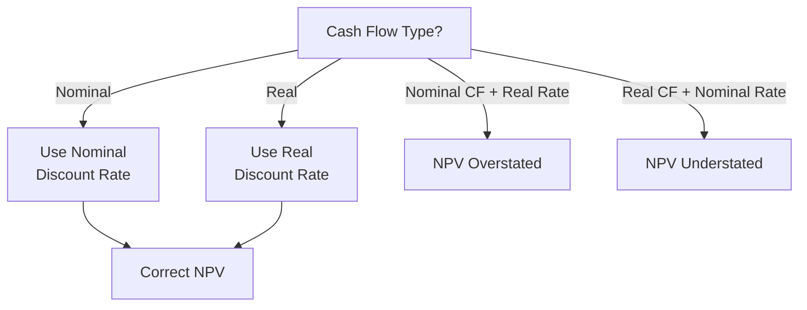

## Real Versus Nominal Discount Rates in Capital Budgeting

### Definition and Core Concept

In capital budgeting, cash flows and discount rates can each be expressed in either **nominal** terms (including the effects of expected inflation) or **real** terms (excluding inflation, expressed in constant purchasing power). The central principle governing correct discounted cash flow analysis is that nominal cash flows must be discounted using a nominal discount rate, and real cash flows must be discounted using a real discount rate. Mixing the two — discounting nominal cash flows with a real rate, or vice versa — introduces a systematic and often substantial valuation error.

### Nominal vs. Real Cash Flows and Rates

**Key Points**

- **Nominal cash flows**: cash flow forecasts that include the expected effect of future inflation (e.g., a revenue projection that assumes prices will rise 3% per year)
- **Real cash flows**: cash flow forecasts expressed in constant (today's) purchasing power, with the effect of inflation stripped out
- **Nominal discount rate**: a discount rate that includes compensation for expected inflation (e.g., market-observed interest rates, which embed inflation expectations); this is the rate typically produced by standard WACC or CAPM calculations using current market data
- **Real discount rate**: a discount rate that excludes inflation, reflecting only the pure time value of money and risk premium

### The Fisher Equation

The relationship between nominal and real rates is formalized by the **Fisher equation**:

$$(1 + r_{nominal}) = (1 + r_{real}) \times (1 + inflation)$$

Rearranged to solve for the real rate:

$$r_{real} = \frac{1 + r_{nominal}}{1 + inflation} - 1$$

A commonly used **approximation** (reasonably accurate for low inflation rates) simplifies this to:

$$r_{real} \approx r_{nominal} - inflation$$

[Inference] This additive approximation is widely used in practice for its simplicity, but it becomes progressively less accurate as inflation rates rise; the precise multiplicative Fisher equation should be used when inflation is high or when precision is particularly important, such as in long-horizon capital-intensive project evaluation.

### The Consistency Principle

**Key Points**

- **Nominal cash flows + nominal discount rate** → correct, internally consistent valuation
- **Real cash flows + real discount rate** → correct, internally consistent valuation
- **Nominal cash flows + real discount rate** → systematically overstates NPV (discount rate too low relative to inflated cash flows)
- **Real cash flows + nominal discount rate** → systematically understates NPV (discount rate too high relative to non-inflated cash flows)

Both correct combinations (nominal/nominal or real/real) will, if applied consistently and using internally consistent inflation assumptions, produce the **same NPV result**, since the inflation adjustment is mathematically equivalent whether it appears in the cash flows or is stripped from the discount rate.

### Consistency Framework

### Worked Example: Demonstrating Consistency

A project requires an initial investment of $200,000 and generates real (constant-dollar) cash inflows of $60,000 per year for 4 years. Expected inflation is 3% annually, and the nominal discount rate is 9%.

**Step 1: Calculate the real discount rate using the Fisher equation**

$$r_{real} = \frac{1 + 0.09}{1 + 0.03} - 1 = \frac{1.09}{1.03} - 1 = 1.0583 - 1 = 5.83\%$$

**Step 2: Approach A — Discount real cash flows using the real discount rate**

$$NPV = -200{,}000 + \frac{60{,}000}{1.0583} + \frac{60{,}000}{1.0583^2} + \frac{60{,}000}{1.0583^3} + \frac{60{,}000}{1.0583^4}$$

$$NPV = -200{,}000 + 56{,}695 + 53{,}577 + 50{,}634 + 47{,}857 = 8{,}763$$

**Step 3: Approach B — Convert cash flows to nominal terms and discount using the nominal discount rate**

$$CF_1\ (nominal) = 60{,}000 \times 1.03 = 61{,}800$$

$$CF_2\ (nominal) = 60{,}000 \times 1.03^2 = 63{,}654$$

$$CF_3\ (nominal) = 60{,}000 \times 1.03^3 = 65{,}564$$

$$CF_4\ (nominal) = 60{,}000 \times 1.03^4 = 67{,}530$$

$$NPV = -200{,}000 + \frac{61{,}800}{1.09} + \frac{63{,}654}{1.09^2} + \frac{65{,}564}{1.09^3} + \frac{67{,}530}{1.09^4}$$

$$NPV = -200{,}000 + 56{,}697 + 53{,}577 + 50{,}632 + 47{,}856 = 8{,}762$$

Both approaches produce the same NPV (approximately $8,762–$8,763, with the small difference attributable to rounding), confirming that consistent application of either real/real or nominal/nominal discounting yields equivalent results.

### Worked Example: Illustrating the Error from Mismatched Rates

Using the same project, if an analyst mistakenly discounts the **real** cash flows ($60,000 constant) using the **nominal** discount rate (9%) — a mismatched combination:

$$NPV\ (mismatched) = -200{,}000 + \frac{60{,}000}{1.09} + \frac{60{,}000}{1.09^2} + \frac{60{,}000}{1.09^3} + \frac{60{,}000}{1.09^4}$$

$$NPV\ (mismatched) = -200{,}000 + 55{,}046 + 50{,}500 + 46{,}330 + 42{,}505 = -5{,}619$$

This mismatched calculation produces a **negative** NPV (approximately -$5,619), in direct contrast to the correct, consistent calculations above, which both show a positive NPV of approximately $8,762. This demonstrates how a real/nominal mismatch can reverse an accept/reject decision entirely, causing a value-creating project to be incorrectly rejected.

### Practical Considerations for Choosing Real vs. Nominal Approach

**Key Points**

- **Nominal approach is more common in practice**: since market-observed interest rates, WACC estimates (via CAPM and YTM), and most corporate financial forecasts are naturally expressed in nominal terms, the nominal/nominal combination is generally the more straightforward and widely used approach
- **Real approach can be useful for long-horizon comparability**: expressing cash flows and discount rates in real terms can make it easier to compare project economics across different time periods or inflationary environments without the distortion of varying inflation assumptions embedded in nominal figures
- **Differential inflation across cost and revenue lines**: a significant complication arises when different components of a project's cash flows are expected to inflate at different rates (e.g., input costs rising faster than output prices, or labor costs rising faster than general inflation); in these cases, a single blended inflation assumption is insufficient, and each cash flow component should be forecast with its own appropriate inflation assumption before discounting with a consistent nominal rate
- **Tax and depreciation complications**: depreciation tax shields are typically based on the historical (nominal, original) cost of an asset and do not adjust for inflation in most tax jurisdictions; this creates an important asymmetry that must be handled carefully in nominal cash flow forecasting, since the tax shield's real value erodes over time even as other nominal cash flows grow with inflation

### Handling Differential Inflation Rates by Cash Flow Component

**Key Points**

- Rather than applying a single blended inflation rate to all cash flows, more precise analysis forecasts each cash flow component using its own specific expected inflation or escalation rate:
  - Revenue: often tied to output price inflation or specific market pricing dynamics
  - Direct materials/input costs: may inflate at a different rate than general (headline) inflation, particularly for commodity-linked inputs
  - Labor costs: often tied to wage inflation, which can diverge from general price inflation
  - Depreciation: generally fixed in nominal terms (based on historical asset cost) and does not inflate at all in most tax regimes
- This component-level approach is particularly important in capital-intensive industries where input cost inflation (e.g., steel, energy, specialized labor) can diverge meaningfully from general consumer price inflation, materially affecting the accuracy of project cash flow forecasts

### Common Pitfalls

- **Mixing real cash flows with a nominal discount rate, or vice versa**: the single most consequential and common error in this area, capable of reversing an investment decision entirely
- **Using a single blended inflation rate when cash flow components have meaningfully different inflation exposures**: oversimplifies the cash flow forecast and can materially misstate project economics, particularly for capital-intensive projects with significant input cost volatility
- **Forgetting that depreciation tax shields do not inflate**: applying a blanket inflation adjustment to all cash flow line items, including the depreciation tax shield, when tax depreciation is typically fixed in nominal historical-cost terms
- **Using the additive Fisher approximation when inflation is high**: the simplified $r_{real} \approx r_{nominal} - inflation$ approximation becomes progressively less accurate at higher inflation levels, and the precise multiplicative Fisher equation should be used in such environments
- **Inconsistent inflation assumptions across different parts of the same analysis**: using one inflation rate to convert the discount rate to real terms and a different, inconsistent inflation assumption embedded in the cash flow forecasts

### Real vs. Nominal Approach: Comparative Summary

| Factor | Nominal Approach | Real Approach |
| --- | --- | --- |
| Cash flows | Include expected inflation | Exclude inflation (constant dollars) |
| Discount rate | Market-based (includes inflation) | Fisher-adjusted (excludes inflation) |
| Common usage | More prevalent in practice | Used for long-horizon comparability |
| Depreciation tax shield handling | Requires special care (fixed nominal amount) | Requires special care (declining real value) |
| Sensitivity to inflation forecast accuracy | High | High (inflation still embedded in real-to-nominal conversions) |

### Application in Capital Intensity and Capex Management

**Key Points**

- **Long asset lives amplify the consequences of real/nominal errors**: capital-intensive projects spanning 15–30+ years compound even small inflation-related discounting errors substantially over the project horizon, making the real/nominal consistency principle especially critical in this domain
- **Input cost inflation often diverges significantly from general inflation in capital-intensive sectors**: construction materials, specialized equipment, energy costs, and skilled labor — all major cost drivers in capital-intensive capex programs — frequently experience inflation rates that differ materially from headline consumer price inflation, making component-level (rather than blanket) inflation forecasting particularly important
- **Long-term supply and offtake contracts often embed explicit escalation clauses**: many capital-intensive projects (infrastructure, utilities, extractives) have contracted revenue streams with built-in price escalation mechanisms tied to specific indices (e.g., producer price index, consumer price index, or commodity-linked formulas); these contractual escalation terms should be reflected directly in the nominal cash flow forecast rather than relying on a generic inflation assumption
- **Depreciation tax shield erosion over long asset lives**: [Inference] because tax depreciation is generally based on fixed historical cost and does not adjust for inflation, the real value of the depreciation tax shield erodes progressively over a capital-intensive asset's long operating life; this effect can be material for very long-lived assets and is a documented consideration in capital budgeting practice, though its precise financial impact depends on the applicable tax depreciation schedule and inflation environment
- **Regulatory rate-setting and inflation indexing**: in regulated capital-intensive industries, allowed returns and permitted revenue are sometimes explicitly indexed to inflation (e.g., inflation-linked regulatory asset base adjustments), which can reduce (but not eliminate) the real/nominal consistency challenge for the regulated portion of a firm's capital program

### Fisher Equation Relationship (svg_diagram)

<svg xmlns="http://www.w3.org/2000/svg" viewBox="0 0 700 280">
<text x="350" y="26" font-family="Arial, sans-serif" font-size="17" font-weight="bold" text-anchor="middle" fill="#1a1a1a">Fisher Equation Relationship (svg_diagram)</text>
<rect x="60" y="80" width="180" height="70" rx="8" fill="#1967d2" />
<text x="150" y="110" font-family="Arial" font-size="13" font-weight="bold" text-anchor="middle" fill="#ffffff">Nominal Rate</text>
<text x="150" y="130" font-family="Arial" font-size="14" font-weight="bold" text-anchor="middle" fill="#ffffff">9.0%</text>

<text x="290" y="120" font-family="Arial" font-size="20" text-anchor="middle" fill="`#5f6368`">=</text>

<rect x="320" y="80" width="150" height="70" rx="8" fill="#34a853" />
<text x="395" y="110" font-family="Arial" font-size="13" font-weight="bold" text-anchor="middle" fill="#ffffff">Real Rate</text>
<text x="395" y="130" font-family="Arial" font-size="14" font-weight="bold" text-anchor="middle" fill="#ffffff">5.83%</text>

<text x="490" y="120" font-family="Arial" font-size="20" text-anchor="middle" fill="`#5f6368`">x</text>

<rect x="520" y="80" width="150" height="70" rx="8" fill="#fbbc04" />
<text x="595" y="110" font-family="Arial" font-size="13" font-weight="bold" text-anchor="middle" fill="#1a1a1a">Inflation</text>
<text x="595" y="130" font-family="Arial" font-size="14" font-weight="bold" text-anchor="middle" fill="#1a1a1a">3.0%</text>

<text x="350" y="200" font-family="Arial" font-size="12" text-anchor="middle" fill="`#5f6368`">(1 + 0.09) = (1 + 0.0583) x (1 + 0.03)</text>

<text x="350" y="225" font-family="Arial" font-size="11" text-anchor="middle" fill="`#5f6368`">Both approaches yield identical NPV when applied consistently</text>

</svg>

### Best Practice Recommendation

1. Determine at the outset of the analysis whether cash flows will be forecast in nominal or real terms, and maintain strict consistency with the matching discount rate throughout
2. Prefer the nominal/nominal approach for most corporate capital budgeting applications, since market-based discount rate inputs (CAPM, YTM) are naturally nominal
3. Use component-level inflation or escalation assumptions rather than a single blended inflation rate whenever cash flow line items have materially different expected inflation exposures
4. Pay particular attention to the treatment of depreciation tax shields, which typically remain fixed in nominal terms regardless of the inflation assumption applied to other cash flow components
5. Use the precise multiplicative Fisher equation rather than the additive approximation in high-inflation environments or when precision is particularly important
6. For capital-intensive, long-lived projects, incorporate contractual escalation clauses and industry-specific input cost inflation forecasts directly into the nominal cash flow projection rather than relying on generic economy-wide inflation assumptions

### Related Topics

- Net Present Value (NPV) analysis
- Weighted Average Cost of Capital (WACC) construction
- Fisher equation and inflation-adjusted rate conversion
- Depreciation methods and tax shield valuation
- Contractual escalation clauses in long-term capital projects
- Country risk premium and international capital budgeting
- Sensitivity analysis for inflation and input cost assumptions
- Regulatory rate-setting and inflation indexing mechanisms