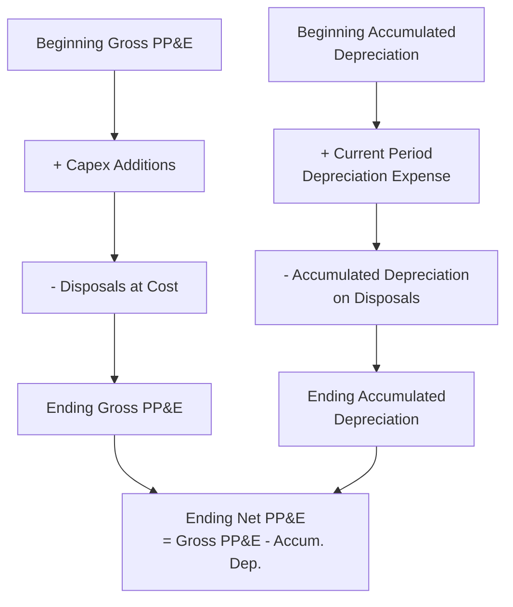

## Building a Capex Schedule and Roll-Forward

### Definition and Core Concept

A capex schedule is a structured financial model component that forecasts a firm's capital expenditures over a projection period and tracks the resulting evolution of fixed assets on the balance sheet. The **roll-forward** mechanism is the specific modeling technique used to carry beginning fixed asset balances forward through additions (new capex), less depreciation, to arrive at ending balances each period — creating a continuous, internally consistent link between the balance sheet, income statement, and cash flow statement across the entire projection horizon.

Building a robust capex schedule and roll-forward is foundational to financial modeling in capital-intensive industries, since fixed assets and their associated depreciation typically represent the largest and most consequential line items in both the balance sheet and income statement projections.

### The Core Roll-Forward Formula

$$Ending\ Net\ PP\&E = Beginning\ Net\ PP\&E + Capital\ Expenditures - Depreciation\ Expense - Disposals/Write\text{-}offs$$

Where:

- **Beginning Net PP&E** = the prior period's ending net property, plant, and equipment balance
- **Capital Expenditures (Capex)** = new asset additions during the period
- **Depreciation Expense** = the period's non-cash charge reducing the book value of existing assets
- **Disposals/Write-offs** = the net book value of any assets sold, retired, or impaired during the period

### Components of a Complete Capex Schedule

**Key Points**

- **Gross PP&E roll-forward**: tracks the accumulated historical cost of assets, increased by capex additions and decreased by disposals at original cost
- **Accumulated depreciation roll-forward**: tracks cumulative depreciation charged against assets, increased by the current period's depreciation expense and decreased by accumulated depreciation removed upon asset disposal
- **Net PP&E**: gross PP&E minus accumulated depreciation, representing the asset's current book value
- **Capex by category**: often segmented into maintenance capex (sustaining existing operations) and growth capex (expanding capacity or capabilities), since these have different strategic implications and forecasting drivers
- **Depreciation schedule by asset vintage/cohort**: tracks depreciation separately for each year's capex additions, since newly added assets begin depreciating from their addition date and follow their own useful life schedule

### Step-by-Step Construction Process

**Key Points**

- Establish the beginning gross PP&E and accumulated depreciation balances from the most recent historical financial statements
- Forecast capex for each projection period, typically driven by a percentage of revenue, a fixed dollar schedule, or a bottom-up project-level build
- Determine the appropriate depreciation method and useful life assumptions for new capex additions
- Calculate depreciation expense for each period, incorporating both existing assets and newly added capex (often using mid-year or half-year conventions)
- Roll forward gross PP&E, accumulated depreciation, and net PP&E period by period
- Link the resulting depreciation expense to the income statement and capex to the cash flow statement (investing activities)
- Incorporate any planned disposals, retirements, or impairments

### Depreciation Vintage/Cohort Schedule Structure

For firms with multiple years of ongoing capex, it is standard practice to depreciate each year's capex additions as a separate "vintage" or "cohort," since different vintages may have different useful lives, depreciation methods, or remaining depreciation periods.

**Illustrative Vintage Depreciation Table (Straight-Line, 10-Year Useful Life)**

| Capex Vintage | Amount ($000s) | Year 1 Dep. | Year 2 Dep. | Year 3 Dep. | Year 4 Dep. |
| --- | --- | --- | --- | --- | --- |
| Prior-year assets (existing) | — | 8,500 | 7,200 | 6,100 | 5,300 |
| Year 1 capex | 12,000 | 600 | 1,200 | 1,200 | 1,200 |
| Year 2 capex | 14,000 | — | 700 | 1,400 | 1,400 |
| Year 3 capex | 15,500 | — | — | 775 | 1,550 |
| Year 4 capex | 16,800 | — | — | — | 840 |
| **Total Depreciation** |  | **9,100** | **9,100** | **9,475** | **10,290** |

Note that new capex additions in this illustration use a **half-year convention** (only half a year's depreciation is recognized in the year of addition, e.g., $12,000 / 10 years / 2 = $600), a common modeling simplification that assumes capex additions occur, on average, mid-year rather than precisely at year-start.

### Capex Schedule Roll-Forward Flow

### Worked Example: Full Capex Schedule and Roll-Forward

A capital-intensive manufacturing company has the following opening balances and projection assumptions:

- Beginning Gross PP&E (Year 1): $500,000
- Beginning Accumulated Depreciation (Year 1): $180,000
- Beginning Net PP&E (Year 1): $320,000
- Forecast capex: $40,000 per year (Years 1–3)
- Existing asset depreciation (pre-projection assets): $35,000/year, declining by $2,000/year as older assets fully depreciate
- New capex depreciated straight-line over 10 years, half-year convention in year of addition
- No disposals assumed during the projection period

**Year 1:**

$$Gross\ PP\&E_{end} = 500{,}000 + 40{,}000 = 540{,}000$$

$$Depreciation_{Y1} = 35{,}000\ (existing) + \frac{40{,}000}{10} \times 0.5\ (new,\ half\text{-}year) = 35{,}000 + 2{,}000 = 37{,}000$$

$$Accumulated\ Depreciation_{end} = 180{,}000 + 37{,}000 = 217{,}000$$

$$Net\ PP\&E_{end} = 540{,}000 - 217{,}000 = 323{,}000$$

**Year 2:**

$$Gross\ PP\&E_{end} = 540{,}000 + 40{,}000 = 580{,}000$$

$$Depreciation_{Y2} = 33{,}000\ (existing) + 4{,}000\ (Year\ 1\ capex,\ full\ year) + 2{,}000\ (Year\ 2\ capex,\ half\text{-}year) = 39{,}000$$

$$Accumulated\ Depreciation_{end} = 217{,}000 + 39{,}000 = 256{,}000$$

$$Net\ PP\&E_{end} = 580{,}000 - 256{,}000 = 324{,}000$$

**Year 3:**

$$Gross\ PP\&E_{end} = 580{,}000 + 40{,}000 = 620{,}000$$

$$Depreciation_{Y3} = 31{,}000\ (existing) + 4{,}000\ (Yr1) + 4{,}000\ (Yr2) + 2{,}000\ (Yr3,\ half\text{-}year) = 41{,}000$$

$$Accumulated\ Depreciation_{end} = 256{,}000 + 41{,}000 = 297{,}000$$

$$Net\ PP\&E_{end} = 620{,}000 - 297{,}000 = 323{,}000$$

**Summary Roll-Forward Table**

| Item | Year 0 (Actual) | Year 1 | Year 2 | Year 3 |
| --- | --- | --- | --- | --- |
| Beginning Gross PP&E | — | 500,000 | 540,000 | 580,000 |
| Capex Additions | — | 40,000 | 40,000 | 40,000 |
| Ending Gross PP&E | 500,000 | 540,000 | 580,000 | 620,000 |
| Beginning Accum. Depreciation | — | 180,000 | 217,000 | 256,000 |
| Depreciation Expense | — | 37,000 | 39,000 | 41,000 |
| Ending Accum. Depreciation | 180,000 | 217,000 | 256,000 | 297,000 |
| Ending Net PP&E | 320,000 | 323,000 | 324,000 | 323,000 |

### Forecasting Capex: Common Approaches

**Key Points**

- **Percentage of revenue method**: capex forecast as a fixed or variable percentage of projected revenue, based on historical capex intensity ratios; simple to implement but may not reflect lumpy, project-specific investment patterns
- **Maintenance vs. growth capex split**: maintenance capex often modeled as approximately equal to depreciation expense (reflecting the capital needed simply to sustain the existing asset base), with growth capex layered on top based on specific expansion plans
- **Bottom-up project-level build**: for firms with a defined pipeline of specific capital projects, capex is forecast by aggregating individual project budgets and their expected spending timelines, providing greater precision than top-down ratio-based methods
- **Capacity-driven forecasting**: capex tied explicitly to a capacity utilization model, where new capital spending is triggered once utilization approaches a defined threshold, common in manufacturing and infrastructure modeling
- **Fixed asset turnover benchmarking**: capex forecast to maintain a target fixed asset turnover ratio (Revenue / Net PP&E) consistent with historical performance or industry benchmarks

### Handling Disposals and Write-offs in the Roll-Forward

When assets are sold, retired, or impaired during the projection period, both the gross PP&E and accumulated depreciation roll-forwards must be adjusted to remove the disposed asset's original cost and its associated accumulated depreciation:

$$Gross\ PP\&E_{end} = Gross\ PP\&E_{beg} + Capex - Gross\ Cost\ of\ Disposals$$

$$Accumulated\ Depreciation_{end} = Accum.\ Dep._{beg} + Depreciation\ Expense - Accum.\ Dep.\ on\ Disposals$$

Any gain or loss on disposal (sale proceeds compared to the disposed asset's net book value) flows through the income statement as a non-operating item and should be excluded from operating depreciation expense.

### Linking the Capex Schedule to the Three Financial Statements

**Key Points**

- **Income statement**: depreciation expense calculated in the roll-forward flows into the income statement, reducing operating income (and, for tax purposes, taxable income)
- **Cash flow statement**: capex additions appear as a cash outflow under investing activities; depreciation expense is added back as a non-cash item in the operating activities section (since it reduced net income but did not consume cash)
- **Balance sheet**: ending net PP&E from the roll-forward directly populates the balance sheet's fixed asset line item for each projection period, maintaining the fundamental accounting identity across all three statements

### Common Pitfalls in Capex Schedule Construction

- **Failing to segment depreciation by vintage**: applying a single blended depreciation rate to the entire PP&E balance, rather than tracking each capex vintage's specific depreciation schedule, can materially misstate depreciation expense, particularly for firms with rapidly growing or declining capex levels
- **Ignoring the half-year (or mid-period) convention**: assuming new capex depreciates for a full year in its year of addition, when in practice assets are typically placed in service throughout the year, requiring a partial-year depreciation adjustment
- **Circular reference errors**: capex, depreciation, and cash flow are often interdependent (e.g., capex forecast as a function of revenue, which is itself affected by capacity constraints tied to PP&E); careful model structuring is needed to avoid unintended circularity or to manage it explicitly with iterative calculation settings
- **Mismatched useful life assumptions between book and tax depreciation**: book depreciation (used for financial reporting and the roll-forward) often differs from tax depreciation (used for cash tax calculations), requiring separate schedules for each purpose in a complete model
- **Neglecting disposals and impairments**: omitting planned or historical disposal activity can overstate the ending PP&E balance and understate depreciation-related cash tax benefits

### Application in Capital Intensity and Capex Management

**Key Points**

- **Capex schedules are the central modeling backbone for capital-intensive firms**: given the scale and persistence of capital spending in industries such as utilities, telecommunications, manufacturing, and extractives, the capex schedule and roll-forward often represents one of the most detailed and closely scrutinized components of the full financial model
- **Maintenance capex tracking is critical for capital intensity analysis**: distinguishing maintenance capex (required simply to sustain existing operations) from growth capex is essential for calculating free cash flow available for discretionary use, dividends, or debt reduction, and is a standard focus area in capital-intensive industry analysis
- **Multi-year vintage tracking supports long-range planning**: because capital-intensive assets often have very long useful lives (10–40+ years), a well-constructed vintage-based depreciation schedule allows analysts to project depreciation expense and net PP&E accurately many years into the future, supporting long-range capital planning and debt capacity analysis
- **Capacity-linked capex modeling**: [Inference] many capital-intensive firms explicitly link their capex schedule to a capacity utilization or asset productivity model, triggering major growth capex investments once utilization approaches defined thresholds, though the specific triggers, thresholds, and modeling granularity vary considerably by industry and company
- **Roll-forward supports covenant and credit analysis**: lenders and credit rating agencies evaluating capital-intensive firms frequently focus on the capex schedule and resulting net PP&E trajectory as a key input to assessing asset coverage, leverage capacity, and long-term debt service ability

### Capex Schedule Roll-Forward Illustration (svg_diagram)

<svg xmlns="http://www.w3.org/2000/svg" viewBox="0 0 740 320">
<text x="370" y="26" font-family="Arial, sans-serif" font-size="17" font-weight="bold" text-anchor="middle" fill="#1a1a1a">Capex Schedule Roll-Forward Illustration (svg_diagram)</text>
<rect x="40" y="60" width="150" height="60" rx="8" fill="#1967d2" />
<text x="115" y="88" font-family="Arial" font-size="12" font-weight="bold" text-anchor="middle" fill="#ffffff">Beginning</text>
<text x="115" y="105" font-family="Arial" font-size="12" font-weight="bold" text-anchor="middle" fill="#ffffff">Net PP&amp;E</text>
<line x1="190" y1="90" x2="230" y2="90" stroke="#5f6368" stroke-width="2" marker-end="url(#arrow5)" />
<text x="210" y="80" font-family="Arial" font-size="10" text-anchor="middle" fill="#34a853">+</text>
<rect x="230" y="60" width="140" height="60" rx="8" fill="#34a853" />
<text x="300" y="95" font-family="Arial" font-size="12" font-weight="bold" text-anchor="middle" fill="#ffffff">Capex Additions</text>
<line x1="370" y1="90" x2="410" y2="90" stroke="#5f6368" stroke-width="2" marker-end="url(#arrow5)" />
<text x="390" y="80" font-family="Arial" font-size="10" text-anchor="middle" fill="#ea4335">−</text>
<rect x="410" y="60" width="150" height="60" rx="8" fill="#ea4335" />
<text x="485" y="88" font-family="Arial" font-size="12" font-weight="bold" text-anchor="middle" fill="#ffffff">Depreciation</text>
<text x="485" y="105" font-family="Arial" font-size="12" font-weight="bold" text-anchor="middle" fill="#ffffff">Expense</text>
<line x1="560" y1="90" x2="600" y2="90" stroke="#5f6368" stroke-width="2" marker-end="url(#arrow5)" />
<text x="580" y="80" font-family="Arial" font-size="10" text-anchor="middle" fill="#ea4335">−</text>
<rect x="600" y="60" width="120" height="60" rx="8" fill="#fbbc04" />
<text x="660" y="95" font-family="Arial" font-size="12" font-weight="bold" text-anchor="middle" fill="#1a1a1a">Disposals</text>
<line x1="660" y1="120" x2="660" y2="160" stroke="#5f6368" stroke-width="2" />
<line x1="660" y1="160" x2="150" y2="160" stroke="#5f6368" stroke-width="2" />
<line x1="150" y1="160" x2="150" y2="190" stroke="#5f6368" stroke-width="2" marker-end="url(#arrow5)" />
<rect x="60" y="190" width="180" height="60" rx="8" fill="#fef7e0" stroke="#fbbc04" stroke-width="2" />
<text x="150" y="215" font-family="Arial" font-size="12" font-weight="bold" text-anchor="middle" fill="#1a1a1a">Ending Net PP&amp;E</text>
<text x="150" y="235" font-family="Arial" font-size="11" text-anchor="middle" fill="#5f6368">(Balance Sheet)</text>
</svg>

### Best Practice Recommendation

1. Build separate roll-forwards for gross PP&E and accumulated depreciation, rather than modeling net PP&E as a single undifferentiated line
2. Track depreciation by capex vintage/cohort to ensure accurate period-by-period depreciation expense, particularly for firms with growing or volatile capex levels
3. Apply an appropriate mid-period (e.g., half-year) convention for depreciation in the year of asset addition, unless a more precise in-service date schedule is available
4. Explicitly model disposals, retirements, and impairments rather than assuming a static, ever-growing asset base
5. Maintain clear linkage between the capex schedule and all three financial statements (income statement, cash flow statement, balance sheet) to preserve model integrity
6. For capital-intensive firms, distinguish maintenance capex from growth capex explicitly, since this distinction is critical for free cash flow analysis and long-term capital planning

### Related Topics

- Depreciation methods (straight-line, declining balance, units of production)
- Maintenance capex versus growth capex
- Free cash flow calculation and capital intensity ratios
- Three-statement financial modeling integration
- Fixed asset turnover and capital productivity metrics
- Capacity utilization modeling and capex triggers
- Debt capacity and covenant analysis in capital-intensive firms
- Net Present Value (NPV) analysis for individual capex projects