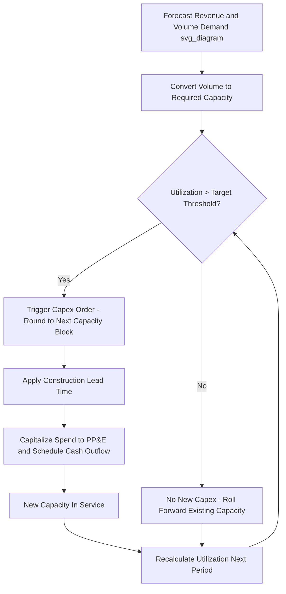

## Linking Capex to Revenue Growth and Capacity Utilization

### Conceptual Overview

Capital expenditure does not scale linearly or automatically with revenue. Instead, capex is driven by the relationship between **current capacity utilization** and **expected demand growth**. A firm operating below its capacity ceiling can absorb revenue growth without new capex; a firm operating near or above practical capacity must invest ahead of or alongside demand to avoid bottlenecks, lost sales, or service degradation.

The core modeling challenge is translating a revenue forecast into a capacity requirement, comparing that requirement against existing capacity, and triggering capex only when a utilization threshold is breached. This produces a "lumpy" or step-function capex profile rather than a smooth percentage-of-revenue projection, which better reflects how real capital assets (plants, data centers, fleets, retail stores) are actually added.

### Key Definitions

- **Capacity**: The maximum output (units, transactions, square footage, throughput) an asset base can sustain over a given period, often distinguished between *theoretical capacity* (nameplate) and *practical/effective capacity* (nameplate adjusted for planned downtime, changeover, maintenance).
- **Capacity utilization rate**:

$$\text{Utilization} = \frac{\text{Actual Output}}{\text{Practical Capacity}}$$

- **Revenue-to-capacity linkage**: Revenue is a function of volume and price; volume is capped by capacity. So:

$$\text{Revenue} = \text{Price} \times \min(\text{Demand}, \text{Capacity})$$

- **Capex intensity ratio**: A backward-looking or normalized metric, $\text{Capex} / \text{Revenue}$, used for sanity-checking but not a substitute for the utilization-driven approach in forward modeling.

### Why Simple Percent-of-Revenue Capex Models Fail

A common shortcut is to project capex as a fixed percentage of revenue (e.g., "capex = 8% of sales"). This works reasonably for steady-state, asset-light businesses but breaks down for capital-intensive businesses because:

1. It assumes capacity additions happen continuously and in infinitely small increments, when in reality capacity is added in discrete, often large, chunks (a new plant, a new data center hall, a new vessel).
2. It ignores existing slack — a company with 60% utilization should spend far less on growth capex than one at 95% utilization, even at identical revenue growth rates.
3. It can understate capex right before a capacity wall is hit and overstate it immediately after a large capacity addition, when utilization is deliberately low to allow for growth headroom.

**[Inference]** In practice, analysts often reconcile both methods: use percent-of-revenue for long-run terminal assumptions, but use the utilization-driven build for the explicit forecast period (typically 3–10 years), especially around known capacity thresholds.

### The Utilization-Driven Capex Framework

**Step 1: Forecast demand/revenue growth**

Build a revenue forecast independent of capacity constraints first (top-down or bottom-up), representing "unconstrained demand."

**Step 2: Convert revenue to required capacity**

Divide the volume component of revenue by a price or throughput assumption to get required physical/operating capacity:

$$\text{Required Capacity}_t = \frac{\text{Forecast Volume}_t}{\text{Target Utilization Rate}}$$

Note the denominator is a *target* utilization, not 100% — companies plan buffer capacity for demand volatility, maintenance, and seasonality.

**Step 3: Compare to existing capacity**

$$\text{Capacity Gap}_t = \text{Required Capacity}_t - \text{Existing Capacity}_{t-1}$$

**Step 4: Trigger capex when gap is positive**

If $\text{Capacity Gap}_t > 0$, capex is required. Because capacity is added in discrete units (a new plant adds, say, 500,000 units of annual capacity), the model should round up to the next available capacity block, not assume perfectly continuous fractional capacity.

**Step 5: Apply lead time and construction schedules**

Capacity additions are not instantaneous. A capex trigger in year $t$ may not translate to available capacity until $t+n$, where $n$ is the construction/installation lead time. This requires modeling capex spend (cash outflow) and capacity availability (asset in service) on separate timelines.

**Step 6: Depreciate and roll forward the capacity/asset base**

Once capacity is added, it becomes part of the asset base for subsequent periods, and the cycle repeats.

### Worked Example

Assume a manufacturing company:

- Current practical capacity: 1,000,000 units/year
- Current utilization: 82%
- Target utilization ceiling: 85% (above this, lead times and quality risk increase)
- Forecast unit demand growth: 6% per year
- New plant module adds capacity in blocks of 150,000 units
- Construction lead time: 18 months (i.e., a decision in Year 1 becomes available capacity in Year 2, mid-year)

| Year | Demand (units) | Utilization if no capex | Action |
| --- | --- | --- | --- |
| 0 | 820,000 | 82.0% | Baseline |
| 1 | 869,200 | 86.9% | Exceeds 85% ceiling → trigger capex order |
| 2 | 921,352 | New capacity (1,150,000 total) → 80.1% | Capex delivered mid-year; utilization resets down |
| 3 | 976,633 | 84.9% | Approaching ceiling again |
| 4 | 1,035,231 | Exceeds ceiling → trigger next 150,000 block | New capex cycle begins |

**Key Points**

- Capex is triggered by *utilization crossing a threshold*, not by revenue growth alone.
- Capacity is added in discrete blocks, producing a sawtooth utilization pattern over time rather than a smooth line.
- Lead time creates a lag between the capex decision, the cash outflow, and the capacity benefit — this lag must be modeled explicitly in the cash flow statement and in any capex-to-revenue ratio analysis.

### Modeling in a Three-Statement / DCF Context

**Revenue build**: Keep the revenue driver (volume × price) separate from the capacity constraint so utilization can be back-calculated each period.

**Capex schedule**: Build a supporting schedule with:

- Beginning capacity
- Utilization (actual and forecast)
- Trigger logic (often an `IF` statement or flag: utilization > threshold → 1, else 0)
- Capex block size and unit cost per unit of new capacity (`$/unit of capacity`, e.g., $/ton, $/seat, $/rack)
- Cash outflow timing (may span multiple periods for a single project, e.g., 40% Year 1, 60% Year 2)
- In-service date and resulting new capacity

**PP&E roll-forward**:

$$\text{Ending Gross PP\&E}_t = \text{Beginning Gross PP\&E}_t + \text{Capex}_t - \text{Disposals}_t$$

$$\text{Ending Net PP\&E}_t = \text{Beginning Net PP\&E}_t + \text{Capex}_t - \text{Depreciation}_t - \text{Disposals}_t$$

**Free cash flow impact**: Capex is a direct cash outflow in the investing section; because it is triggered discretely, FCF in "capex years" will be materially lower than in "harvest years" where the company is running down excess capacity built in a prior cycle. **[Inference]** This is a primary reason capital-intensive companies show lumpy, cyclical free cash flow even with smooth revenue growth.

### Capacity Utilization as a Leading Indicator

Analysts and management teams typically monitor utilization trend lines to anticipate capex needs before they appear in guidance:

- **Utilization rising toward historical peak levels**: Signals capex likely within 1–3 forecast periods, depending on lead time.
- **Utilization declining post-expansion**: Normal and expected; indicates the company built ahead of demand, which is common when capacity blocks are large relative to annual demand growth (lumpy, large-unit industries like semiconductors or refining) versus small relative to growth (smaller, more continuous capex, like retail store rollouts or server rack additions).
- **Utilization persistently below management's stated target range**: May signal overbuilt capacity, asset impairment risk, or the possibility of announced plant closures/idling rather than new capex.

### Industry-Specific Nuances

**[Inference/Unverified]** The exact modeling approach and typical lead times vary meaningfully by sector, and the figures below are illustrative ranges rather than precise universal constants:

- **Semiconductors/fabs**: Extremely lumpy, multi-billion-dollar, multi-year lead time capex; utilization is closely watched quarter-to-quarter (fab utilization rates are commonly disclosed).
- **Data centers/cloud infrastructure**: Capacity added in "halls" or "pods"; utilization often tracked as compute/power draw vs. rated capacity; lead times shortened by modular construction but still multi-quarter.
- **Airlines**: Capacity = available seat miles (ASM); utilization = load factor; capex = aircraft orders with multi-year delivery lead times fixed years in advance, making near-term capacity nearly inelastic to short-term demand shifts.
- **Retail**: Capacity = store count/square footage; utilization proxied by sales per square foot; capex is smaller-ticket and more continuous, allowing closer approximation by percent-of-revenue models.
- **Utilities**: Capacity = generation/transmission capacity; utilization = reserve margin; capex driven by regulatory planning cycles as much as by pure demand forecasts.

### Sensitivity and Scenario Considerations

Because the capex trigger is a threshold function, small changes in the demand growth assumption can produce disproportionately large changes in the capex schedule — a 1-point change in the growth rate can shift a capacity trigger from Year 3 to Year 2, materially changing near-term FCF. Best practice is to:

- Run sensitivity tables on the *utilization threshold* and *demand growth rate* jointly, not just revenue growth in isolation.
- Model at least two demand scenarios (base/upside) that flank the actual threshold-crossing point, since this is where capex timing risk concentrates.
- Stress-test the assumption that management will preemptively build capacity ahead of the threshold vs. reactively build after it is breached (the latter risks lost sales/market share, which should also be reflected in the revenue forecast, not just the capex forecast).

### Common Pitfalls

- Treating capex as smooth and continuous when the underlying asset is inherently lumpy (a plant cannot be built "10% at a time" in a way that adds 10% of its capacity each year).
- Ignoring construction/lead-time lags, which overstates near-term capacity and understates near-term capex cash need.
- Using total capacity instead of *practical* capacity, which overstates available headroom before a capex trigger is needed.
- Failing to distinguish maintenance capex (sustains current capacity, roughly tracks depreciation) from growth capex (adds new capacity, tied to the utilization/demand linkage described above) — blending the two obscures the true growth-capex-to-revenue relationship.

### Diagram: Capex Trigger Logic (svg_diagram)

### Related Topics

- Maintenance capex vs. growth capex decomposition
- Depreciation methodology and its feedback into net PP&E forecasting
- Capacity block sizing and economies of scale in capital projects
- Lead time and construction-in-progress (CIP) accounting treatment
- Return on invested capital (ROIC) impact of capex timing decisions
- Scenario and sensitivity analysis around demand growth thresholds
- Sector-specific capacity metrics (load factor, fab utilization, occupancy rate)
- Capital rationing and prioritization frameworks when multiple capacity triggers compete for funding